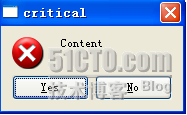
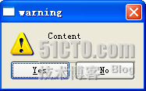
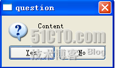
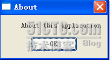
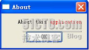
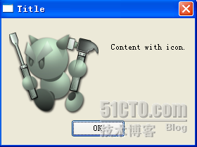

&emsp;&emsp;先来看一下最熟悉的`QMessageBox::information`：<!--more-->

``` cpp
QMessageBox::information ( NULL, "Title", "Content", QMessageBox::Yes | QMessageBox::No, QMessageBox::Yes );
```


&emsp;&emsp;函数原型如下：

``` cpp
static StandardButton QMessageBox::information (
    QWidget *parent, const QString &title, const QString &text,
    StandardButtons buttons = Ok, StandardButton defaultButton = NoButton );
```

参数`parent`是说明它的父组件；参数`title`是对话框的标题；参数`text`是对话框显示的内容；参数`buttons`用于声明对话框放置的按钮，默认只放置一个`OK`按钮，这个参数可以使用或运算，例如我们希望有一个`Yes`和一个`No`的按钮，可以使用`QMessageBox::Yes | QMessageBox::No`。所有的按钮类型可以在`QMessageBox`的`StandarButton`枚举中找到；参数`defaultButton`就是默认选中的按钮，默认值是`NoButton`，也就是哪个按钮都不选中。
&emsp;&emsp;`Qt`提供了五个类似的接口，用于显示类似的窗口。

``` cpp
QMessageBox::critical ( NULL, "critical", "Content", QMessageBox::Yes | QMessageBox::No, QMessageBox::Yes );
```



``` cpp
QMessageBox::warning ( NULL, "warning", "Content", QMessageBox::Yes | QMessageBox::No, QMessageBox::Yes );
```



``` cpp
QMessageBox::question ( NULL, "question", "Content", QMessageBox::Yes | QMessageBox::No, QMessageBox::Yes );
```



``` cpp
QMessageBox::about ( NULL, "About", "About this application" );
```



&emsp;&emsp;`QMessageBox`对话框的文本信息可以支持`HTML`标签：

``` cpp
QMessageBox::about ( NULL, "About", "About this <font color='red'>application</font>" );
```



&emsp;&emsp;如果想自定义图片的话，需要我们自定义一个`QMessagebox`：

``` cpp
QMessageBox message ( QMessageBox::NoIcon, "Title", "Content with icon." );
message.setIconPixmap ( QPixmap ( "icon.png" ) );
message.exec();
```

这里使用的是`exec`函数，而不是`show`，因为这是一个模态对话框，需要有它自己的事件循环，否则对话框会一闪而过。



&emsp;&emsp;还有一点要注意，我们使用的是`png`格式的图片，因为`Qt`内置的处理图片格式是`png`，所以这不会引起很大的麻烦。如果你要使用`jpeg`格式的图片，`Qt`是以插件的形式支持的。在开发时没有什么问题，不过如果要部署的话，需要注意这一点。
&emsp;&emsp;最后来说一下怎么处理对话框的交互。我们使用`QMessageBox`类的时候有两种方式，一是使用`static`函数，另外是使用构造函数。首先来说一下`static`函数的方式。注意，`static`函数都是要返回一个`StandardButton`，我们可以通过判断这个返回值来对用户的操作做出响应：

``` cpp
QMessageBox::StandardButton rb = QMessageBox::question (   \
    NULL, "Show Qt", "Do you want to show Qt dialog?",     \
    QMessageBox::Yes | QMessageBox::No, QMessageBox::Yes );

if ( rb == QMessageBox::Yes ) {
    QMessageBox::aboutQt ( NULL, "About Qt" );
}
```

如果要使用构造函数的方式，那么就要自己判断：

``` cpp
QMessageBox message (                                                 \
    QMessageBox::NoIcon, "Show Qt", "Do you want to show Qt dialog?", \
    QMessageBox::Yes | QMessageBox::No, NULL );

if ( message.exec() == QMessageBox::Yes ) {
    QMessageBox::aboutQt ( NULL, "About Qt" );
}
```

实际用法如下：

``` cpp
/* 问题对话框(参数：父窗口、标题栏、显示信息、拥有的按钮) */
int ret1 = QMessageBox::question (
    this, tr ( "问题对话框" ), tr ( "你了解Qt吗？" ),
    QMessageBox::Yes, QMessageBox::No );

if ( ret1 == QMessageBox::Yes ) {
    qDebug() << tr ( "问题！" );
}

int ret2 = QMessageBox::information ( /* 提示对话框 */
    this, tr ( "提示对话框" ), tr ( "这是Qt书籍！" ), QMessageBox::Ok );

if ( ret2 == QMessageBox::Ok ) {
    qDebug() << tr ( "提示！" );
}

int ret3 = QMessageBox::warning ( /* 警告对话框 */
    this, tr ( "警告对话框" ), tr ( "不能提前结束！" ), QMessageBox::Abort );

if ( ret3 == QMessageBox::Abort ) {
    qDebug() << tr ( "警告！" );
}

int ret4 = QMessageBox::critical ( /* 错误对话框 */
    this, tr ( "严重错误对话框" ),
    tr ( "发现一个严重错误！现在要关闭所有文件！" ), QMessageBox::YesAll );

if ( ret4 == QMessageBox::YesAll ) {
    qDebug() << tr ( "错误" );
}

QMessageBox::about ( /* 关于对话框 */
    this, tr ( "关于对话框" ),
    tr ( "yafeilinux.com致力于Qt及Qt Creator的普及工作！" ) );
```

---

### QMessageBox典型用法

&emsp;&emsp;弹出消息对话框在许多应用中是必需的。它可以提示用户，防止用户因为不小心而犯下错误。

``` cpp
QMessageBox msgBox;
msgBox.setText ( "The document has been modified." );
msgBox.setInformativeText ( "Do you want to save your changes?" );
msgBox.setStandardButtons ( QMessageBox::Save | QMessageBox::Discard | QMessageBox::Cancel );
msgBox.setDefaultButton ( QMessageBox::Save );
int ret = msgBox.exec();

switch ( ret ) {
    case QMessageBox::Save: /* Save was clicked */
        break;
    case QMessageBox::Discard: /* Don't Save was clicked */
        break;
    case QMessageBox::Cancel: /* Cancel was clicked */
        break;
    default: /* should never be reached */
        break;
}
```

&emsp;&emsp;在`QMessageBox`中添加按钮，判断哪一个按钮被按下：

``` cpp
QMessageBox msgBox;
QPushButton *connectButton = msgBox.addButton ( tr ( "Connect" ), QMessageBox::ActionRole );
QPushButton *abortButton = msgBox.addButton ( QMessageBox::Abort );

msgBox.exec();

if ( msgBox.clickedButton() == connectButton ) {
    /* connect */
} else if ( msgBox.clickedButton() == abortButton ) {
    /* abort */
}
```