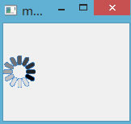

&emsp;&emsp;`QMovie`类用于播放动画，在刷新页面的时候，可以使用`QMovie`来实现等待界面。`QMovie`类用于显示简单的动画，没有声音。<!--more-->
&emsp;&emsp;首先将一个文件的名称或者一个指针传递给`QMovie`的构造函数，构建出一个`QMovie`对象，传递的文件需要包含文件的格式。可以调用函数`isValid`在动画开始播放前检测该动画是否有效。调用函数`start`函数开始播放动画，`QMovie`将进入运行状态，并发射`started`和`stateChanged`信号。调用函数`state`可获取当前动画的播放状态。用`QLabel`显示动画如下：

``` cpp
QLabel label;
QMovie *movie = new QMovie ( "animations/fire.gif" );
label.setMovie ( movie );
movie->start();
```

每当一个动画用于新的框架中，`QMovie`将会发出`update`信号；若动画的帧发生变化，`QMovie`将会发出`resized`信号。调用函数`currentImage`或者`currentPixmap`可获取当前帧副本。每当动画播放完毕，`QMovie`将会发出`finished`信号。若在播放动画的过程中出现任何的错误，`QMovie`将发出信号`error`。



&emsp;&emsp;`QMovie`相当强大，它可以调用函数`setSpeed`来设置动画的播放速率，`setPaused(true)`将暂停播放动画，然后发出`stateChanged`信号。再次向函数`setPaused`传递参数`false`，动画将重新播放。停止播放动画可调用函数`stop`。`QMovie`可以通过调用`setCacheMode`指示缓存帧的动画。使用`frameCount`来获取动画的帧数。
&emsp;&emsp;部分`QMovie`函数详解：

- `setSpeed`：动画的播放速率是用原始的动画速率百分比衡量，默认的速度是`100%`：

``` cpp
Movie movie ( "racecar.gif" );
movie.setSpeed ( 200 ); /* 2 * speed */
```

这里动画的播放速率将会是原始速率的`2`倍。

- `backgroundColor`：该函数将返回动画的背景色，如果没有指定背景色，那么函数将返回一个无效的`QColor`。

``` cpp
QColor QMovie::backgroundColor() const;
```

可以调用下面的函数设置动画的背景色：

``` cpp
void QMovie::setBackgroundColor ( const QColor &color );
```

- `isValid`：如果动画有效，将返回`true`，否则返回`false`。

``` cpp
bool QMovie::isValid() const;
```