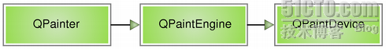
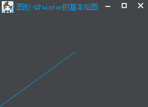
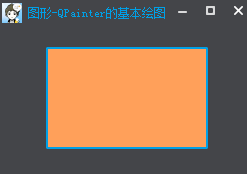
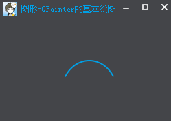
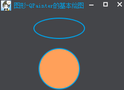
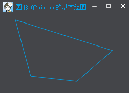
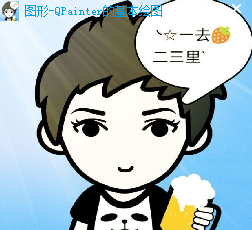
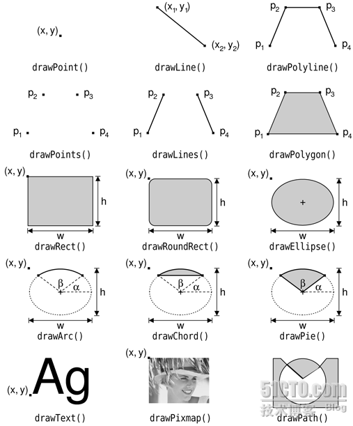

### 简述

&emsp;&emsp;`Qt`中提供了强大的`2D`绘图系统，可以使用相同的`API`在屏幕和绘图设备上进行绘制，它主要基于`QPainter`、`QPaintDevice`和`QPaintEngine`这三个类。<!--more-->
&emsp;&emsp;`QPainter`用来执行绘图操作，其提供的`API`在`GUI`或`QImage`、`QOpenGLPaintDevice`、`QWidget`和`QPaintDevice`显示图形(线、形状、渐变等)、文本和图像。`QPaintDevice`不直接绘制物理显示画面，而利用逻辑界面的中间媒介。例如绘制矩形图形时，为了将对象绘制到`QWidget`、`QGLPixelBuffer`、`QImage`、`QPixmap`、`QPicture`等多种界面中间，必须使用`QPaintDevice`。`QPaintEngine`提供了一些接口，可以用于`QPainter`在不同的设备上进行绘制。下图给出了这三个类之间的层次结构：



&emsp;&emsp;这种实现的主要好处是，所有的绘制都遵循着同一种绘制流程，这样可以很方便地添加新的特性，也可以为不支持的功能添加一个默认的实现方式。另外需要说明一点，`Qt`提供了一个独立的`QtOpenGL`模块，可以让你在`Qt`的应用程序中使用`OpenGL`功能。该模块提供了一个`OpenGL`的模块，可以像其他的`Qt`组件一样的使用。它的不同之处在于，它是使用`OpenGL`作为显示技术，使用`OpenGL`函数进行绘制。
&emsp;&emsp;绘图系统由`QPainter`完成具体的绘制操作，`QPainter`类提供了大量高度优化的函数来完成`GUI`编程所需要的大部分绘制工作。它可以绘制一切想要的图形，从最简单的一条直线到其他任何复杂的图形，例如饼图、弧形等，还可以用来绘制文本和图片。`QPainter`可以在继承自`QPaintDevice`类的任何对象上进行绘制操作。
&emsp;&emsp;`QPainter`一般在部件的绘图事件`paintEvent`中进行绘制，首先创建`QPainter`对象，然后进行图形的绘制，最后记得销毁`QPainter`对象。当窗口程序需要升级或者重新绘制时，调用此成员函数。使用`repaint`和`update`后，调用函数`paintEvent`。

### 绘制文本

&emsp;&emsp;效果如下：



``` cpp
void MainWindow::paintEvent ( QPaintEvent *event ) {
    Q_UNUSED ( event );
    QPainter painter ( this );
    painter.setRenderHint ( QPainter::Antialiasing, true ); /* 反走样 */
    painter.setPen ( QColor ( 0, 160, 230 ) ); /* 设置画笔颜色 */
    /* 绘制直线 */
    painter.drawLine ( QPointF ( 0, height() ), QPointF ( width() / 2, height() / 2 ) );
}
```

首先通过`setRenderHint`来设置反走样，否则绘制出来的线条会出现锯齿；调用`setPen`来设置画笔颜色(淡蓝色)。最后调用`drawLine`来实现直线的绘制，其中`QPointF(0, height())`是指直线的起点坐标，`QPointF(width() / 2, height() / 2)`是指直线的终点坐标。

### 绘制矩形

&emsp;&emsp;效果如下：



``` cpp
void MainWindow::paintEvent ( QPaintEvent *event ) {
    Q_UNUSED ( event );
    QPainter painter ( this );
    painter.setRenderHint ( QPainter::Antialiasing, true ); /* 反走样 */
    painter.setPen ( QPen ( QColor ( 0, 160, 230 ), 2 ) ); /* 设置画笔颜色、宽度 */
    painter.setBrush ( QColor ( 255, 160, 90 ) ); /* 设置画刷颜色 */
    painter.drawRect ( 50, 50, 160, 100 );
}
```

首先使用`setPen`来设置画笔颜色(淡蓝色)、宽度(`2`像素)，用来设置矩形区域的边框。然后使用`setBrush`来设置画刷颜色(这里为橙色)，用来填充矩形区域，最后调用`drawRect`来实现矩形的绘制，其中参数依次顺序为`x`、`y`、`w`、`h`，是指区域从`x`为`50`、`y`为`50`的坐标点起，宽度为`160`，高度为`100`的矩形。

### 绘制弧线

&emsp;&emsp;效果如下：



``` cpp
void MainWindow::paintEvent ( QPaintEvent *event ) {
    Q_UNUSED ( event );
    QRectF rect ( 90.0, 90.0, 80.0, 90.0 ); /* 矩形 */
    int startAngle = 30 * 16; /* 起始角度 */
    int spanAngle = 120 * 16; /* 跨越度数 */
    QPainter painter ( this );
    painter.setRenderHint ( QPainter::Antialiasing, true ); /* 反走样 */
    painter.setPen ( QPen ( QColor ( 0, 160, 230 ), 2 ) ); /* 设置画笔颜色、宽度 */
    painter.drawArc ( rect, startAngle, spanAngle ); /* 绘制弧线 */
}
```

画弧线时，角度被分成了十六分之一，就是说如果需要画出要`30`度，就是`30 * 16`。它有起始角度和跨度，还有位置矩形，所以要想画出自己想要的弧线，就需要大概估算出各个参数的预估值。

### 绘制椭圆

&emsp;&emsp;效果如下：



``` cpp
void MainWindow::paintEvent ( QPaintEvent *event ) {
    Q_UNUSED ( event );
    QPainter painter ( this );
    painter.setRenderHint ( QPainter::Antialiasing, true ); /* 反走样 */
    painter.setPen ( QPen ( QColor ( 0, 160, 230 ), 2 ) ); /* 设置画笔颜色、宽度 */
    painter.drawEllipse ( QPointF ( 120, 60 ), 50, 20 ); /* 绘制椭圆 */
    painter.setBrush ( QColor ( 255, 160, 90 ) ); /* 设置画刷颜色 */
    painter.drawEllipse ( QPointF ( 120, 140 ), 40, 40 ); /* 绘制椭圆 */
}
```

这里绘制了一个椭圆和一个圆形，都是调用`drawEllipse`接口。我们可以很轻易地发现，如果为椭圆的时候，后面两个参数不一样，圆形则相同。第一个参数`QPointF`是指椭圆的中心点相对当前窗体`QPoint(0, 0)`点的位置，后面的参数指椭圆的`x`轴及`y`轴的半径。

### 绘制多边形

&emsp;&emsp;效果如下：



``` cpp
void MainWindow::paintEvent ( QPaintEvent *event ) {
    Q_UNUSED ( event );
    QPainter painter ( this );
    painter.setRenderHint ( QPainter::Antialiasing, true ); /* 反走样 */
    painter.setPen ( QColor ( 0, 160, 230 ) ); /* 设置画笔颜色 */
    static const QPointF points[4] = { /* 各个点的坐标 */
        QPointF ( 30, 40 ), QPointF ( 60, 150 ),
        QPointF ( 150, 160 ), QPointF ( 220, 100 ) };
    painter.drawPolygon ( points, 4 ); /* 绘制多边形 */
}
```

首先指定坐标点的位置，这里有四个点，分别为`QPointF(30, 40)`、`QPointF(60, 150)`、`QPointF(150, 160)`、`QPointF(220, 100)`，然后调用`drawPolygon`将各个点连接起来，绘制为多边形。

### 绘制图片

&emsp;&emsp;效果如下：



``` cpp
void MainWindow::paintEvent ( QPaintEvent *event ) {
    Q_UNUSED ( event );
    QPainter painter ( this );
    painter.setRenderHint ( QPainter::Antialiasing, true ); /* 反走样 */
    painter.drawPixmap ( rect(), QPixmap ( ":/Images/logo" ) ); /* 绘制图标 */
}
```

通过`drawPixmap`来绘制图片，我们可以指定图片绘制的区域`QRect`，这里为整个界面的区域。当界面伸缩的时候，图片也会跟着伸缩。
&emsp;&emsp;`QPainter`有很多以`draw`开头的函数，它们用于各种图形的绘制，比如`drawLine`、`drawRect`和和`drawEllipse`等。下图给出了`QPainter`的`draw`函数的实例：

