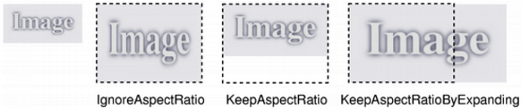

&emsp;&emsp;The `QPixmap` class is an `off-screen` image representation that can be used as a paint device.<!--more-->

Header    | Inherits       | Inherited By
----------|----------------|----------------
`QPixmap` | `QPaintDevice` | `Q3CanvasPixmap` and `QBitmap`

### Public Functions

Retrun             | Function
-------------------|------
                   | `QPixmap()`
                   | `QPixmap(int width, int height)`
                   | `QPixmap(const QString & fileName, const char * format = 0, Qt::ImageConversionFlags flags = Qt::AutoColor)`
                   | `QPixmap(const char * const[] xpm)`
                   | `QPixmap(const QPixmap & pixmap)`
                   | `QPixmap(const QSize & size)`
                   | `~QPixmap()`
`qint64`           | `cacheKey() const`
`bool`             | `convertFromImage(const QImage & image, Qt::ImageConversionFlags flags = Qt::AutoColor)`
`QPixmap`          | `copy(const QRect & rectangle = QRect()) const`
`QPixmap`          | `copy(int x, int y, int width, int height) const`
`QBitmap`          | `createHeuristicMask(bool clipTight = true) const`
`QBitmap`          | `createMaskFromColor(const QColor & maskColor, Qt::MaskMode mode) const`
`QBitmap`          | `createMaskFromColor(const QColor & maskColor) const`
`int`              | `depth() const`
`void`             | `detach()`
`void`             | `fill(const QColor & color = Qt::white)`
`void`             | `fill(const QWidget * widget, const QPoint & offset)`
`void`             | `fill(const QWidget * widget, int x, int y)`
`Qt::HANDLE`       | `handle() const`
`bool`             | `hasAlpha() const`
`bool`             | `hasAlphaChannel() const`
`int`              | `height() const`
`bool`             | `isNull() const`
`bool`             | `isQBitmap() const`
`bool`             | `load(const QString & fileName, const char * format = 0, Qt::ImageConversionFlags flags = Qt::AutoColor)`
`bool`             | `loadFromData(const uchar * data, uint len, const char * format = 0, Qt::ImageConversionFlags flags = Qt::AutoColor)`
`bool`             | `loadFromData(const QByteArray & data, const char * format = 0, Qt::ImageConversionFlags flags = Qt::AutoColor)`
`QBitmap`          | `mask() const`
`QRect`            | `rect() const`
`bool`             | `save(const QString & fileName, const char * format = 0, int quality = -1) const`
`bool`             | `save(QIODevice * device, const char * format = 0, int quality = -1) const`
`QPixmap`          | `scaled(const QSize & size, Qt::AspectRatioMode aspectRatioMode = Qt::IgnoreAspectRatio, Qt::TransformationMode transformMode = Qt::FastTransformation) const`
`QPixmap`          | `scaled(int width, int height, Qt::AspectRatioMode aspectRatioMode = Qt::IgnoreAspectRatio, Qt::TransformationMode transformMode = Qt::FastTransformation) const`
`QPixmap`          | `scaledToHeight(int height, Qt::TransformationMode mode = Qt::FastTransformation) const`
`QPixmap`          | `scaledToWidth(int width, Qt::TransformationMode mode = Qt::FastTransformation) const`
`void`             | `scroll(int dx, int dy, int x, int y, int width, int height, QRegion * exposed = 0)`
`void`             | `scroll(int dx, int dy, const QRect & rect, QRegion * exposed = 0)`
`void`             | `setMask(const QBitmap & mask)`
`QSize`            | `size() const`
`void`             | `swap(QPixmap & other)`
`QImage`           | `toImage() const`
`CGImageRef`       | `toMacCGImageRef() const`
`HBITMAP`          | `toWinHBITMAP(HBitmapFormat format = NoAlpha) const`
`HICON`            | `toWinHICON() const`
`QPixmap`          | `transformed(const QTransform & transform, Qt::TransformationMode mode = Qt::FastTransformation) const`
`QPixmap`          | `transformed(const QMatrix & matrix, Qt::TransformationMode mode = Qt::FastTransformation) const`
`int`              | `width() const`
`const QX11Info &` | `x11Info() const`
`Qt::HANDLE`       | `x11PictureHandle() const`
                   | `operator QVariant() const`
`bool`             | `operator!() const`
`QPixmap &`        | `operator=(const QPixmap & pixmap)`
`QPixmap &`        | `operator=(QPixmap && other)`

### Static Public Members

Return       | Function
-------------|------
`int`        | `defaultDepth()`
`QPixmap`    | `fromImage(const QImage & image, Qt::ImageConversionFlags flags = Qt::AutoColor)`
`QPixmap`    | `fromImageReader(QImageReader * imageReader, Qt::ImageConversionFlags flags = Qt::AutoColor)`
`QPixmap`    | `fromMacCGImageRef(CGImageRef image)`
`QPixmap`    | `fromWinHBITMAP(HBITMAP bitmap, HBitmapFormat format = NoAlpha)`
`QPixmap`    | `fromWinHICON(HICON icon)`
`QPixmap`    | `fromX11Pixmap(Qt::HANDLE pixmap, ShareMode mode = ImplicitlyShared)`
`QPixmap`    | `grabWidget(QWidget * widget, const QRect & rectangle)`
`QPixmap`    | `grabWidget(QWidget * widget, int x = 0, int y = 0, int width = -1, int height = -1)`
`QPixmap`    | `grabWindow(WId window, int x = 0, int y = 0, int width = -1, int height = -1)`
`QTransform` | `trueMatrix(const QTransform & matrix, int width, int height)`
`QMatrix`    | `trueMatrix(const QMatrix & m, int w, int h)`

### Related Non-Members

Return          | Function
----------------|--------
`QDataStream &` | `operator<<(QDataStream & stream, const QPixmap & pixmap)`
`QDataStream &` | `operator>>(QDataStream & stream, QPixmap & pixmap)`

### Detailed Description

&emsp;&emsp;The `QPixmap` class is an `off-screen` image representation that can be used as a paint device.
&emsp;&emsp;`Qt` provides four classes for handling image data: `QImage`, `QPixmap`, `QBitmap` and `QPicture`. `QImage` is designed and optimized for `I/O`, and for direct pixel access and manipulation, while `QPixmap` is designed and optimized for showing images on screen. `QBitmap` is only a convenience class that inherits `QPixmap`, ensuring a depth of `1`. The `isQBitmap()` function returns `true` if a `QPixmap` object is really a bitmap, otherwise returns `false`. Finally, the `QPicture` class is a paint device that records and replays `QPainter` commands.
&emsp;&emsp;A `QPixmap` can easily be displayed on the screen using `QLabel` or one of `QAbstractButton's` subclasses (such as `QPushButton` and `QToolButton`). `QLabel` has a pixmap property, whereas `QAbstractButton` has an icon property.
&emsp;&emsp;In addition to the ordinary constructors, a `QPixmap` can be constructed using the static `grabWidget()` and `grabWindow()` functions which creates a `QPixmap` and paints the given widget, or window, into it.
&emsp;&emsp;`QPixmap` objects can be passed around by value since the `QPixmap` class uses implicit data sharing. `QPixmap` objects can also be streamed.
&emsp;&emsp;Note that the pixel data in a pixmap is internal and is managed by the underlying window system. Because `QPixmap` is a `QPaintDevice` subclass, `QPainter` can be used to draw directly onto pixmaps. Pixels can only be accessed through `QPainter` functions or by converting the `QPixmap` to a `QImage`. However, the `fill()` function is available for initializing the entire pixmap with a given color.
&emsp;&emsp;There are functions to convert between `QImage` and `QPixmap`. Typically, the `QImage` class is used to load an image file, optionally manipulating the image data, before the `QImage` object is converted into a `QPixmap` to be shown on screen. Alternatively, if no manipulation is desired, the image file can be loaded directly into a `QPixmap`. On `Windows`, the `QPixmap` class also supports conversion between `HBITMAP` and `QPixmap`. On `Symbian`, the `QPixmap` class also supports conversion between `CFbsBitmap` and `QPixmap`.
&emsp;&emsp;`QPixmap` provides a collection of functions that can be used to obtain a variety of information about the pixmap. In addition, there are several functions that enables transformation of the pixmap.

### Reading and Writing Image Files

&emsp;&emsp;`QPixmap` provides several ways of reading an image file: The file can be loaded when constructing the `QPixmap` object, or by using the `load()` or `loadFromData()` functions later on. When loading an image, the file name can either refer to an actual file on disk or to one of the application's embedded resources.
&emsp;&emsp;Simply call the `save()` function to save a `QPixmap` object.
&emsp;&emsp;The complete list of supported file formats are available through the `QImageReader::supportedImageFormats()` and `QImageWriter::supportedImageFormats()` functions. New file formats can be added as plugins. By default, `Qt` supports the following formats:

Format | Description                        | Qt's support
-------|------------------------------------|-------------
`BMP`  | `Windows Bitmap`                   | `Read/write`
`GIF`  | `Graphic Interchange Format`       | `Read`
`JPG`  | `Joint Photographic Experts Group` | `Read/write`
`JPEG` | `Joint Photographic Experts Group` | `Read/write`
`PNG`  | `Portable Network Graphics`        | `Read/write`
`PBM`  | `Portable Bitmap`                  | `Read`
`PGM`  | `Portable Graymap`                 | `Read`
`PPM`  | `Portable Pixmap`                  | `Read/write`
`XBM`  | `X11 Bitmap`                       | `Read/write`
`XPM`  | `X11 Pixmap`                       | `Read/write`

### Pixmap Information

&emsp;&emsp;`QPixmap` provides a collection of functions that can be used to obtain a variety of information about the pixmap:

&emsp;&emsp;1. `Geometry`: The `size()`, `width()` and `height()` functions provide information about the pixmap's size. The `rect()` function returns the image's enclosing rectangle.
&emsp;&emsp;2. `Alpha component`: The `hasAlphaChannel()` returns `true` if the pixmap has a format that respects the alpha channel, otherwise returns `false`. The `hasAlpha()`, `setMask()` and `mask()` functions are legacy and should not be used. They are potentially very slow.
&emsp;&emsp;The `createHeuristicMask()` function creates and returns a `1-bpp` heuristic mask (i.e. a `QBitmap`) for this pixmap. It works by selecting a color from one of the corners and then chipping away pixels of that color, starting at all the edges. The `createMaskFromColor()` function creates and returns a mask (i.e. a `QBitmap`) for the pixmap based on a given color.
&emsp;&emsp;3. `Low-level information`: The `depth()` function returns the depth of the pixmap. The `defaultDepth()` function returns the default depth, i.e. the depth used by the application on the given screen.
&emsp;&emsp;The `cacheKey()` function returns a number that uniquely identifies the contents of the `QPixmap` object.
&emsp;&emsp;The `x11Info()` function returns information about the configuration of the `X` display used by the screen to which the pixmap currently belongs. The `x11PictureHandle()` function returns the `X11` Picture handle of the pixmap for `XRender` support. Note that the two latter functions are only available on `x11`.

### Pixmap Conversion

&emsp;&emsp;A `QPixmap` object can be converted into a `QImage` using the `toImage()` function. Likewise, a `QImage` can be converted into a `QPixmap` using the `fromImage()`. If this is too expensive an operation, you can use `QBitmap::fromImage()` instead.
&emsp;&emsp;In addition, on `Windows`, the `QPixmap` class supports conversion to and from `HBITMAP`: the `toWinHBITMAP()` function creates a `HBITMAP` equivalent to the `QPixmap`, based on the given `HBitmapFormat`, and returns the `HBITMAP` handle. The `fromWinHBITMAP()` function returns a `QPixmap` that is equivalent to the given bitmap which has the specified format. The `QPixmap` class also supports conversion to and from `HICON`: the `toWinHICON()` function creates a `HICON` equivalent to the `QPixmap`, and returns the `HICON` handle. The `fromWinHICON()` function returns a `QPixmap` that is equivalent to the given icon.

### Pixmap Transformations

&emsp;&emsp;`QPixmap` supports a number of functions for creating a new pixmap that is a transformed version of the original:
&emsp;&emsp;The `scaled()`, `scaledToWidth()` and `scaledToHeight()` functions return scaled copies of the pixmap, while the `copy()` function creates a `QPixmap` that is a plain copy of the original one.
&emsp;&emsp;The `transformed()` function returns a copy of the pixmap that is transformed with the given transformation matrix and transformation mode: Internally, the transformation matrix is adjusted to compensate for unwanted translation, i.e. `transformed()` returns the smallest pixmap containing all transformed points of the original pixmap. The static `trueMatrix()` function returns the actual matrix used for transforming the pixmap.
&emsp;&emsp;**Note**: When using the native `X11` graphics system, the pixmap becomes invalid when the `QApplication` instance is destroyed.

### Member Type Documentation

- enum `QPixmap::HBitmapFormat`: `Win32` only: This enum defines how the conversion between `HBITMAP` and `QPixmap` is performed. **Warning**: This enum is only available on `Windows`.

Constant                      | Value | Description
------------------------------|-------|------
`QPixmap::NoAlpha`            | `0`   | The alpha channel is ignored and always treated as being set to fully opaque. This is preferred if the `HBITMAP` is used with standard `GDI` calls, such as `BitBlt()`.
`QPixmap::PremultipliedAlpha` | `1`   | The `HBITMAP` is treated as having an alpha channel and premultiplied colors. This is preferred if the `HBITMAP` is accessed through the `AlphaBlend()` `GDI` function.
`QPixmap::Alpha`              | `2`   | The `HBITMAP` is treated as having a plain alpha channel. This is the preferred format if the `HBITMAP` is going to be used as an application icon or systray icon.

- enum `QPixmap::ShareMode`: This enum type defines the share modes that are available when creating a `QPixmap` object from a raw `X11` `Pixmap` handle.

Constant                    | Value | Description
----------------------------|-------|----
`QPixmap::ImplicitlyShared` | `0`   | This mode will cause the `QPixmap` object to create a copy of the internal data before it is modified, thus keeping the original `X11` pixmap intact.
`QPixmap::ExplicitlyShared` | `1`   | In this mode, the pixmap data will not be copied before it is modified, which in effect will change the original `X11` pixmap.

**Warning**: This enum is only used for `X11` specific functions; using it is `non-portable`.

### Member Function Documentation

- `QPixmap::QPixmap()`: Constructs a null pixmap.
- `QPixmap::QPixmap(int width, int height)`: Constructs a pixmap with the given `width` and `height`. If either `width` or `height` is zero, a null pixmap is constructed. **Warning**: This will create a `QPixmap` with uninitialized data. Call `fill()` to fill the pixmap with an appropriate color before drawing onto it with `QPainter`.
- `QPixmap::QPixmap(const QString & fileName, const char * format = 0, Qt::ImageConversionFlags flags = Qt::AutoColor)`: Constructs a pixmap from the file with the given `fileName`. If the file does not exist or is of an unknown format, the pixmap becomes a null pixmap. The loader attempts to read the pixmap using the specified `format`. If the `format` is not specified (which is the default), the loader probes the file for a header to guess the file format. The file name can either refer to an actual file on disk or to one of the application's embedded resources. If the image needs to be modified to fit in a `lower-resolution` result (e.g. converting from `32-bit` to `8-bit`), use the `flags` to control the conversion. The `fileName`, `format` and `flags` parameters are passed on to `load()`. This means that the data in `fileName` is not compiled into the binary. If `fileName` contains a relative path (e.g. the filename only) the relevant file must be found relative to the runtime working directory.
- `QPixmap::QPixmap(const char * const[] xpm)`: Constructs a pixmap from the given `xpm` data, which must be a valid `XPM` image. Errors are silently ignored. Note that it's possible to squeeze the `XPM` variable a little bit by using an unusual declaration:

``` cpp
static const char * const start_xpm[]={
    "16 15 8 1",
    "a c #cec6bd",
    ....
}
```

The extra const makes the entire definition `read-only`, which is slightly more efficient (for example, when the code is in a shared library) and `ROMable` when the application is to be stored in `ROM`.

- `QPixmap::QPixmap(const QPixmap & pixmap)`: Constructs a pixmap that is a copy of the given `pixmap`.
- `QPixmap::QPixmap(const QSize & size)`: This is an overloaded function. Constructs a pixmap of the given `size`. **Warning**: This will create a `QPixmap` with uninitialized data. Call `fill()` to fill the pixmap with an appropriate color before drawing onto it with `QPainter`.
- `QPixmap::~QPixmap()`: Destroys the pixmap.
- `qint64 QPixmap::cacheKey() const`: Returns a number that identifies this `QPixmap`. Distinct `QPixmap` objects can only have the same cache key if they refer to the same contents. The `cacheKey()` will change when the pixmap is altered.
- `bool QPixmap::convertFromImage(const QImage & image, Qt::ImageConversionFlags flags = Qt::AutoColor)`: Replaces this pixmap's data with the given `image` using the specified `flags` to control the conversion. The `flags` argument is a `bitwise-OR` of the `Qt::ImageConversionFlags`. Passing `0` for `flags` sets all the default options. Returns `true` if the result is that this pixmap is not null. **Note**: this function was part of `Qt 3` support in `Qt 4.6` and earlier. It has been promoted to official `API` status in `4.7` to support updating the pixmap's image without creating a new `QPixmap` as `fromImage()` would.
- `QPixmap QPixmap::copy(const QRect & rectangle = QRect()) const`: Returns a deep copy of the subset of the pixmap that is specified by the given `rectangle`. If the given `rectangle` is empty, the whole image is copied.
- `QPixmap QPixmap::copy(int x, int y, int width, int height) const`: This is an overloaded function. Returns a deep copy of the subset of the pixmap that is specified by the rectangle `QRect(x, y, width, height)`.
- `QBitmap QPixmap::createHeuristicMask(bool clipTight = true) const`: Creates and returns a heuristic mask for this pixmap. The function works by selecting a color from one of the corners and then chipping away pixels of that color, starting at all the edges. If `clipTight` is `true` (the default), the mask is just large enough to cover the pixels; otherwise, the mask is larger than the data pixels. The mask may not be perfect but it should be reasonable, so you can do things such as the following:

``` cpp
QPixmap myPixmap;
myPixmap->setMask ( myPixmap->createHeuristicMask() );
```

This function is slow because it involves converting `to/from` a `QImage`, and `non-trivial` computations.

- `QBitmap QPixmap::createMaskFromColor(const QColor & maskColor, Qt::MaskMode mode) const`: Creates and returns a mask for this pixmap based on the given `maskColor`. If the `mode` is `Qt::MaskInColor`, all pixels matching the `maskColor` will be transparent. If `mode` is `Qt::MaskOutColor`, all pixels matching the `maskColor` will be opaque. This function is slow because it involves converting `to/from` a `QImage`.
- `QBitmap QPixmap::createMaskFromColor(const QColor & maskColor) const`: This is an overloaded function. Creates and returns a mask for this pixmap based on the given `maskColor`. Same as calling `createMaskFromColor(maskColor, Qt::MaskInColor)`.
- `int QPixmap::defaultDepth() [static]`: Returns the default pixmap depth used by the application. On `Windows` and `Mac`, the default depth is always `32`. On `X11` and embedded, the depth of the screen will be returned by this function.
- `int QPixmap::depth() const`: Returns the depth of the pixmap. The pixmap depth is also called `bits per pixel` (`bpp`) or bit planes of a pixmap. A null pixmap has depth `0`.
- `void QPixmap::detach()`: Detaches the pixmap from shared pixmap data. A pixmap is automatically detached by `Qt` whenever its contents are about to change. This is done in almost all `QPixmap` member functions that modify the pixmap (`fill()`, `fromImage()`, `load()`, etc.), and in `QPainter::begin()` on a pixmap. There are two exceptions in which `detach()` must be called explicitly, that is when calling the `handle()` or the `x11PictureHandle()` function (only available on `X11`). Otherwise, any modifications done using system calls, will be performed on the shared data. The `detach()` function returns immediately if there is just a single reference or if the pixmap has not been initialized yet.
- `void QPixmap::fill(const QColor & color = Qt::white)`: Fills the pixmap with the given `color`. The effect of this function is undefined when the pixmap is being painted on.
- `void QPixmap::fill(const QWidget * widget, const QPoint & offset)`: Fills the pixmap with the `widget's` background color or pixmap according to the given `offset`. The `QPoint` `offset` defines a point in `widget` coordinates to which the pixmap's `top-left` pixel will be mapped to. This is only significant if the `widget` has a background pixmap; otherwise the pixmap will simply be filled with the background color of the `widget`.
- `void QPixmap::fill(const QWidget * widget, int x, int y)`: This is an overloaded function. Fills the pixmap with the `widget's` background color or pixmap. The given point, `(x, y)`, defines an offset in `widget` coordinates to which the pixmap's `top-left` pixel will be mapped to.
- `QPixmap QPixmap::fromImage(const QImage & image, Qt::ImageConversionFlags flags = Qt::AutoColor) [static]`: Converts the given `image` to a pixmap using the specified `flags` to control the conversion. The `flags` argument is a `bitwise-OR` of the `Qt::ImageConversionFlags`. Passing `0` for `flags` sets all the default options. In case of monochrome and `8-bit` images, the `image` is first converted to a `32-bit` pixmap and then filled with the colors in the color table. If this is too expensive an operation, you can use `QBitmap::fromImage()` instead.
- `QPixmap QPixmap::fromImageReader(QImageReader * imageReader, Qt::ImageConversionFlags flags = Qt::AutoColor) [static]`: Create a `QPixmap` from an image read directly from an `imageReader`. The `flags` argument is a `bitwise-OR` of the `Qt::ImageConversionFlags`. Passing `0` for `flags` sets all the default options. On some systems, reading an image directly to `QPixmap` can use less memory than reading a `QImage` to convert it to `QPixmap`.
- `QPixmap QPixmap::fromMacCGImageRef(CGImageRef image) [static]`: Returns a `QPixmap` that is equivalent to the given `image`. **Warning**: This function is only available on `Mac OS X`.
- `QPixmap QPixmap::fromWinHBITMAP(HBITMAP bitmap, HBitmapFormat format = NoAlpha) [static]`: `Win32` only: Returns a `QPixmap` that is equivalent to the given `bitmap`. The conversion is based on the specified `format`. **Warning**: This function is only available on Windows.
- `QPixmap QPixmap::fromWinHICON(HICON icon) [static]`: `Win32` only: Returns a `QPixmap` that is equivalent to the given `icon`. **Warning**: This function is only available on `Windows`.
- `QPixmap QPixmap::fromX11Pixmap(Qt::HANDLE pixmap, ShareMode mode = ImplicitlyShared) [static]`: Creates a `QPixmap` from the native `X11` `Pixmap` handle `pixmap`, using mode as the share `mode`. The default share mode is `QPixmap::ImplicitlyShared`, which means that a copy of the pixmap is made if someone tries to modify it by e.g. drawing onto it. `QPixmap` does not take ownership of the pixmap handle, and have to be deleted by the user. **Warning**: This function is `X11` specific; using it is `non-portable`.
- `QPixmap QPixmap::grabWidget(QWidget * widget, const QRect & rectangle) [static]`: Creates a pixmap and paints the given `widget`, restricted by the given `rectangle`, in it. If the `widget` has any children, then they are also painted in the appropriate positions. If no `rectangle` is specified (the default) the entire widget is painted. If `widget` is `0`, the specified `rectangle` doesn't overlap the widget's rectangle, or an error occurs, the function will return a null `QPixmap`. If the `rectangle` is a superset of the given `widget`, the areas outside the `widget` are covered with the widget's background. This function actually asks `widget` to paint itself (and its children to paint themselves) by calling `paintEvent()` with painter redirection turned on. But `QPixmap` also provides the `grabWindow()` function which is a bit faster by grabbing pixels directly off the screen. In addition, if there are overlaying windows, `grabWindow()`, unlike `grabWidget()`, will see them. **Warning**: Do not grab a widget from its `QWidget::paintEvent()`. However, it is safe to grab a widget from another widget's `paintEvent()`.
- `QPixmap QPixmap::grabWidget(QWidget * widget, int x = 0, int y = 0, int width = -1, int height = -1) [static]`: This is an overloaded function. Creates a pixmap and paints the given `widget`, restricted by `QRect(x, y, width, height)`, in it. **Warning**: Do not grab a widget from its `QWidget::paintEvent()`. However, it is safe to grab a widget from another widget's `paintEvent()`.
- `QPixmap QPixmap::grabWindow(WId window, int x = 0, int y = 0, int width = -1, int height = -1) [static]`: Creates and returns a pixmap constructed by grabbing the contents of the given `window` restricted by `QRect(x, y, width, height)`. The arguments `(x, y)` specify the offset in the window, whereas `(width, height)` specify the area to be copied. If `width` is negative, the function copies everything to the right border of the window. If `height` is negative, the function copies everything to the bottom of the window. The `window system identifier` (`WId`) can be retrieved using the `QWidget::winId()` function. The rationale for using a window identifier and not a `QWidget`, is to enable grabbing of windows that are not part of the application, window system frames, and so on. The `grabWindow()` function grabs pixels from the screen, not from the window, i.e. if there is another window partially or entirely over the one you grab, you get pixels from the overlying window, too. The mouse cursor is generally not grabbed. Note on `X11` that if the given `window` doesn't have the same depth as the root window, and another window partially or entirely obscures the one you grab, you will not get pixels from the overlying window. The contents of the obscured areas in the pixmap will be undefined and uninitialized. On `Windows Vista` and above grabbing a layered window, which is created by setting the `Qt::WA_TranslucentBackground` attribute, will not work. Instead grabbing the desktop widget should work. **Warning**: In general, grabbing an area outside the screen is not safe. This depends on the underlying window system.
- `Qt::HANDLE QPixmap::handle() const`: Returns the pixmap's handle to the device context. Note that, since `QPixmap` make use of implicit data sharing, the `detach()` function must be called explicitly to ensure that only this pixmap's data is modified if the pixmap data is shared. **Warning**: This function is `X11` specific; using it is `non-portable`. **Warning**: Since `4.8`, pixmaps do not have an `X11` handle unless created with `fromX11Pixmap()`, or if the native graphics system is explicitly enabled.
- `bool QPixmap::hasAlpha() const`: Returns `true` if this pixmap has an alpha channel, or has a mask, otherwise returns `false`.
- `bool QPixmap::hasAlphaChannel() const`: Returns `true` if the pixmap has a format that respects the alpha channel, otherwise returns `false`.
- `int QPixmap::height() const`: Returns the height of the pixmap.
- `bool QPixmap::isNull() const`: Returns `true` if this is a null pixmap; otherwise returns `false`. A null pixmap has zero width, zero height and no contents. You cannot draw in a null pixmap.
- `bool QPixmap::isQBitmap() const`: Returns `true` if this is a `QBitmap`; otherwise returns `false`.
- `bool QPixmap::load(const QString & fileName, const char * format = 0, Qt::ImageConversionFlags flags = Qt::AutoColor)`: Loads a pixmap from the file with the given `fileName`. Returns `true` if the pixmap was successfully loaded; otherwise returns `false`. The loader attempts to read the pixmap using the specified `format`. If the `format` is not specified (which is the default), the loader probes the file for a header to guess the file format. The file name can either refer to an actual file on disk or to one of the application's embedded resources. If the data needs to be modified to fit in a `lower-resolution` result (e.g. converting from `32-bit` to `8-bit`), use the `flags` to control the conversion. Note that `QPixmaps` are automatically added to the `QPixmapCache` when loaded from a file; the key used is internal and can not be acquired.
- `bool QPixmap::loadFromData(const uchar * data, uint len, const char * format = 0, Qt::ImageConversionFlags flags = Qt::AutoColor)`: Loads a pixmap from the `len` first bytes of the given binary `data`. Returns `true` if the pixmap was loaded successfully; otherwise returns `false`. The loader attempts to read the pixmap using the specified `format`. If the `format` is not specified (which is the default), the loader probes the file for a header to guess the file format. If the `data` needs to be modified to fit in a `lower-resolution` result (e.g. converting from `32-bit` to `8-bit`), use the `flags` to control the conversion.
- `bool QPixmap::loadFromData(const QByteArray & data, const char * format = 0, Qt::ImageConversionFlags flags = Qt::AutoColor)`: This is an overloaded function. Loads a pixmap from the binary `data` using the specified `format` and conversion `flags`.
- `QBitmap QPixmap::mask() const`: Extracts a bitmap mask from the pixmap's alpha channel. **Warning**: This is potentially an expensive operation. The mask of the pixmap is extracted dynamically from the pixeldata.
- `QRect QPixmap::rect() const`: Returns the pixmap's enclosing rectangle.
- `bool QPixmap::save(const QString & fileName, const char * format = 0, int quality = -1) const`: Saves the pixmap to the file with the given `fileName` using the specified image file `format` and `quality` factor. Returns `true` if successful; otherwise returns `false`. The `quality` factor must be in the range `[0, 100]` or `-1`. Specify `0` to obtain small compressed files, `100` for large uncompressed files, and `-1` to use the default settings. If `format` is `0`, an image format will be chosen from `fileName's` suffix.
- `bool QPixmap::save(QIODevice * device, const char * format = 0, int quality = -1) const`: This is an overloaded function. This function writes a `QPixmap` to the given `device` using the specified image file `format` and `quality` factor. This can be used, for example, to save a pixmap directly into a `QByteArray`:

``` cpp
QPixmap pixmap;
QByteArray bytes;
QBuffer buffer ( &bytes );
buffer.open ( QIODevice::WriteOnly );
/* writes pixmap into bytes in PNG format */
pixmap.save ( &buffer, "PNG" );
```

- `QPixmap QPixmap::scaled(const QSize & size, Qt::AspectRatioMode aspectRatioMode = Qt::IgnoreAspectRatio, Qt::TransformationMode transformMode = Qt::FastTransformation) const`: Scales the pixmap to the given `size`, using the aspect ratio and transformation modes specified by `aspectRatioMode` and `transformMode`.



1. If `aspectRatioMode` is `Qt::IgnoreAspectRatio`, the pixmap is scaled to `size`.
2. If `aspectRatioMode` is `Qt::KeepAspectRatio`, the pixmap is scaled to a rectangle as large as possible inside `size`, preserving the aspect ratio.
3. If `aspectRatioMode` is `Qt::KeepAspectRatioByExpanding`, the pixmap is scaled to a rectangle as small as possible outside `size`, preserving the aspect ratio.

If the given `size` is empty, this function returns a null pixmap. In some cases it can be more beneficial to draw the pixmap to a painter with a scale set rather than scaling the pixmap. This is the case when the painter is for instance based on `OpenGL` or when the scale factor changes rapidly.

- `QPixmap QPixmap::scaled(int width, int height, Qt::AspectRatioMode aspectRatioMode = Qt::IgnoreAspectRatio, Qt::TransformationMode transformMode = Qt::FastTransformation) const`: This is an overloaded function. Returns a copy of the pixmap scaled to a rectangle with the given `width` and `height` according to the given `aspectRatioMode` and `transformMode`. If either the `width` or the `height` is zero or negative, this function returns a null pixmap.
- `QPixmap QPixmap::scaledToHeight(int height, Qt::TransformationMode mode = Qt::FastTransformation) const`: Returns a scaled copy of the image. The returned image is scaled to the given `height` using the specified transformation `mode`. The width of the pixmap is automatically calculated so that the aspect ratio of the pixmap is preserved. If `height` is `0` or negative, a null pixmap is returned.
- `QPixmap QPixmap::scaledToWidth(int width, Qt::TransformationMode mode = Qt::FastTransformation) const`: Returns a scaled copy of the image. The returned image is scaled to the given `width` using the specified transformation `mode`. The height of the pixmap is automatically calculated so that the aspect ratio of the pixmap is preserved. If `width` is `0` or `negative`, a null pixmap is returned.
- `void QPixmap::scroll(int dx, int dy, int x, int y, int width, int height, QRegion * exposed = 0)`: This convenience function is equivalent to calling `QPixmap::scroll(dx, dy, QRect(x, y, width, height), exposed)`.
- `void QPixmap::scroll(int dx, int dy, const QRect & rect, QRegion * exposed = 0)`: Scrolls the area `rect` of this pixmap by `(dx, dy)`. The `exposed` region is left unchanged. You can optionally pass a pointer to an empty `QRegion` to get the region that is `exposed` by the scroll operation.

``` cpp
QPixmap pixmap ( "background.png" );
QRegion exposed;
pixmap.scroll ( 10, 10, pixmap.rect(), &exposed );
```

You cannot scroll while there is an active painter on the pixmap.

- `void QPixmap::setMask(const QBitmap & mask)`: Sets a `mask` bitmap. This function merges the `mask` with the pixmap's alpha channel. A pixel value of `1` on the `mask` means the pixmap's pixel is unchanged; a value of `0` means the pixel is transparent. The `mask` must have the same size as this pixmap. Setting a null mask resets the `mask`, leaving the previously transparent pixels black. The effect of this function is undefined when the pixmap is being painted on. **Warning**: This is potentially an expensive operation.
- `QSize QPixmap::size() const`: Returns the size of the pixmap.
- `void QPixmap::swap(QPixmap & other)`: Swaps pixmap `other` with this pixmap. This operation is very fast and never fails.
- `QImage QPixmap::toImage() const`: Converts the pixmap to a `QImage`. Returns a null image if the conversion fails. If the pixmap has `1-bit` depth, the returned image will also be `1` bit deep. Images with more bits will be returned in a format closely represents the underlying system. Usually this will be `QImage::Format_ARGB32_Premultiplied` for pixmaps with an alpha and `QImage::Format_RGB32` or `QImage::Format_RGB16` for pixmaps without alpha. Note that for the moment, alpha masks on monochrome images are ignored.
- `CGImageRef QPixmap::toMacCGImageRef() const`: Creates a `CGImageRef` equivalent to the `QPixmap`. Returns the `CGImageRef` handle. It is the caller's responsibility to release the `CGImageRef` data after use. **Warning**: This function is only available on `Mac OS X`.
- `HBITMAP QPixmap::toWinHBITMAP(HBitmapFormat format = NoAlpha) const`:  `Win32` only: Creates a `HBITMAP` equivalent to the `QPixmap`, based on the given `format`. Returns the `HBITMAP` handle. It is the caller's responsibility to free the `HBITMAP` data after use. **Warning**: This function is only available on `Windows`.
- `HICON QPixmap::toWinHICON() const`: `Win32` only: Creates a `HICON` equivalent to the `QPixmap`. Returns the `HICON` handle. It is the caller's responsibility to free the `HICON` data after use. **Warning**: This function is only available on `Windows`.
- `QPixmap QPixmap::transformed(const QTransform & transform, Qt::TransformationMode mode = Qt::FastTransformation) const`: Returns a copy of the pixmap that is transformed using the given transformation `transform` and transformation `mode`. The original pixmap is not changed. The transformation `transform` is internally adjusted to compensate for unwanted translation; i.e. the pixmap produced is the smallest pixmap that contains all the transformed points of the original pixmap. Use the `trueMatrix()` function to retrieve the actual matrix used for transforming the pixmap. This function is slow because it involves transformation to a `QImage`, `non-trivial` computations and a transformation back to a `QPixmap`.
- `QPixmap QPixmap::transformed(const QMatrix & matrix, Qt::TransformationMode mode = Qt::FastTransformation) const`: This is an overloaded function. This convenience function loads the `matrix` into a `QTransform` and calls the overloaded function.
- `QTransform QPixmap::trueMatrix(const QTransform & matrix, int width, int height) [static]`: Returns the actual `matrix` used for transforming a pixmap with the given `width`, `height` and `matrix`. When transforming a pixmap using the `transformed()` function, the transformation `matrix` is internally adjusted to compensate for unwanted translation, i.e. `transformed()` returns the smallest pixmap containing all transformed points of the original pixmap. This function returns the modified `matrix`, which maps points correctly from the original pixmap into the new pixmap.
- `QMatrix QPixmap::trueMatrix(const QMatrix & m, int w, int h) [static]`: This is an overloaded function. This convenience function loads the matrix `m` into a `QTransform` and calls the overloaded function with the `QTransform` and the width `w` and the height `h`.
- `int QPixmap::width() const`: Returns the width of the pixmap.
- `const QX11Info & QPixmap::x11Info() const`: `X11` only: Returns information about the configuration of the `X` display used by the screen to which the pixmap currently belongs. **Warning**: This function is only available on `X11`.
- `Qt::HANDLE QPixmap::x11PictureHandle() const`: `X11` only: Returns the `X11` `Picture` handle of the pixmap for `XRender` support. This function will return `0` if `XRender` support is not compiled into `Qt`, if the `XRender` extension is not supported on the `X11` display, or if the handle could not be created. Use of this function is not portable. **Warning**: This function is only available on `X11`.
- `QPixmap::operator QVariant() const`: Returns the pixmap as a `QVariant`.
- `bool QPixmap::operator!() const`: Returns `true` if this is a null pixmap; otherwise returns `false`.
- `QPixmap & QPixmap::operator=(const QPixmap & pixmap)`: Assigns the given `pixmap` to this pixmap and returns a reference to this pixmap.

### Related Non-Members

- `QDataStream & operator<<(QDataStream & stream, const QPixmap & pixmap)`: Writes the given `pixmap` to the given `stream` as a `PNG` image. Note that writing the stream to a file will not produce a valid image file.
- `QDataStream & operator>>(QDataStream & stream, QPixmap & pixmap)`: Reads an image from the given `stream` into the given `pixmap`.