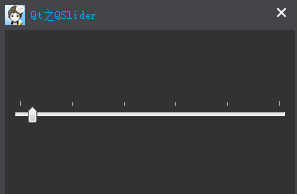

&emsp;&emsp;`QSlider`部件提供了一个垂直或水平滑动条。它允许用户沿水平或垂直方向移动滑块，并将滑块所在的位置转换成一个合法范围内的值。<!--more-->

### 详细描述

&emsp;&emsp;`QSlider`很少有自己的函数，大部分功能在`QAbstractSlider`中。最有用的函数是`setValue`，用来设置滑块的当前值；`triggerAction`来模拟点击的效果(对快捷键有用)，`setSingleStep`和`setPageStep`用来设置步长，`setMinimum`和`setMaximum`用于定义滚动条的范围。
&emsp;&emsp;`QSlider`提供了一些方法来控制刻度标记，可以使用`setTickPosition`来表示刻度标记的位置，使用`setTickInterval`来指定刻度的间隔；当前设置的刻度位置和间隔可以分别使用`tickPosition`和`tickInterval`函数来查询。
&emsp;&emsp;`QSlider`继承了一组全面的信号：

信号             | 描述
-----------------|----------------
`valueChanged`   | 当滑块的值发生了改变，发射此信号。`tracking`确定在用户交互时，是否发出此信号
`sliderPressed`  | 当用户按下滑块，发射此信号
`sliderMoved`    | 当用户拖动滑块，发射此信号
`sliderReleased` | 当用户释放滑块，发射此信号

&emsp;&emsp;`QSlider`只提供整数范围。滑块接受`Tab`键的焦点，并同时提供了一个鼠标滚轮和键盘接口。键盘接口如下：

- `Left/Right`：移动水平滑块一个步长。
- `Up/Down`：移动垂直滑块一个步长。
- `PageUp`：上移一页。
- `PageDown`：下移一页。
- `Home`：移动至起始位置(最小值)。
- `End`：移动至结束位置(最大值)。

### 刻度位置

&emsp;&emsp;枚举量为`QSlider::TickPosition`，这个枚举指定刻度线相对于滑块和用户操作的位置。

常量                      | 描述
--------------------------|-----
`QSlider::NoTicks`        | 不绘制任何刻度线
`QSlider::TicksBothSides` | 在滑块的两侧绘制刻度线
`QSlider::TicksAbove`     | 在(水平)滑块上方绘制刻度线
`QSlider::TicksBelow`     | 在(水平)滑块下方绘制刻度线
`QSlider::TicksLeft`      | 在(垂直)滑块左侧绘制刻度线
`QSlider::TicksRight`     | 在(垂直)滑块右侧绘制刻度线

### 基本使用

&emsp;&emsp;下面来看一个示例，结合`QSlider`与`QSpinBox`，让它们彼此之间相互更新：


``` cpp
int nMin = 0;
int nMax = 200;
int nSingleStep = 10;

/* 微调框 */
QSpinBox *pSpinBox = new QSpinBox ( this );
pSpinBox->setMinimum ( nMin ); /* 最小值 */
pSpinBox->setMaximum ( nMax ); /* 最大值 */
pSpinBox->setSingleStep ( nSingleStep ); /* 步长 */

/* 滑动条 */
QSlider *pSlider = new QSlider ( this );
pSlider->setOrientation ( Qt::Horizontal ); /* 水平方向 */
pSlider->setMinimum ( nMin ); /* 最小值 */
pSlider->setMaximum ( nMax ); /* 最大值 */
pSlider->setSingleStep ( nSingleStep ); /* 步长 */

/* 连接信号槽(相互改变) */
connect ( pSpinBox, SIGNAL ( valueChanged ( int ) ), pSlider, SLOT ( setValue ( int ) ) );
connect ( pSlider, SIGNAL ( valueChanged ( int ) ), pSpinBox, SLOT ( setValue ( int ) ) );

pSpinBox->setValue ( 10 );
```

通过`setMinimum`与`setMaximum`函数，将进度条固定到一个合适的范围(`0`至`200`)。连接信号槽后，当`QSpinBox`的值发生改变时，`QSlider`的值也会发生相应变化；反之亦然。最后使用`setValue`将`QSpinBox`的值设置为`10`，由于信号槽已经连接，所以这时`QSlider`的值也会发生改变。

### 刻度位置及间隔

&emsp;&emsp;源码如下：

``` cpp
QSlider *pSlider = new QSlider ( this );
pSlider->setOrientation ( Qt::Horizontal ); /* 水平方向 */
pSlider->setMinimum ( nMin ); /* 最小值 */
pSlider->setMaximum ( nMax ); /* 最大值 */
pSlider->setSingleStep ( nSingleStep ); /* 步长 */
// pSlider->setTickInterval(40); /* 设置刻度间隔 */
pSlider->setTickPosition ( QSlider::TicksAbove ); /* 刻度在上方 */
```

当使用`setTickInterval(40)`设置刻度间隔后，在绘制刻度时，就会有`6`个刻度点(从`0`开始，每隔步长`40`绘制一个点，到`200`处结束)。也就是说，刻度点的个数等于`最大值 / 刻度间隔 + 1`。

