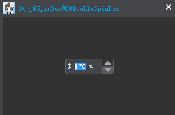
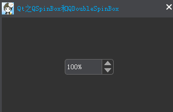
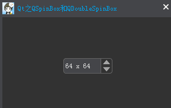
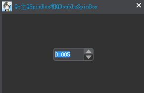

### 简述

&emsp;&emsp;`QSpinBox`和`QDoubleSpinBox`均派生自`QAbstractSpinBox`。`QSpinBox`旨在处理整数和离散值(例如月份名称)，`QDoubleSpinBox`则用于处理浮点值。它们之间的区别就是处理数据的类型不同，其他功能都基本相同。`QDoubleSpinBox`的默认的精度是`2`位小数，但可以通过`setDecimals`来改变。<!--more-->

### 详细描述

&emsp;&emsp;`QSpinBox`类提供了一个微调框部件。`QSpinBox`允许用户选择一个值，通过单击`向上/向下`按钮或按下键盘的`上/下`箭头来增加或减少当前显示的值，用户也可以输入值。微调框支持整数值，但可以被扩展为不同的字符串，使用`validate`、`textFromValue`和`valueFromText`。
&emsp;&emsp;当`QSpinBox`的值发生改变时，会发射两个`valueChanged`信号，其中一个提供`int`类型，另一个则是`QString`类型，该`QString`提供了`prefix`和`suffix`。当前值可以用`value`来读取，`setValue`来设置。
&emsp;&emsp;单击`向上/向下`按钮或按下键盘的`上/下`箭头时，将以`singleStep`为步长增加或减少当前值。如果想改变这种行为，可以重载虚函数`stepBy`。最小值、最大值和步长可以使用其中的一个构造函数来设置，以后可以用`setMinimum`、`setMaximum`和`setSingleStep`来修改。
&emsp;&emsp;大多数微调框是定向的，但也可以设置为循环的。例如如果取值范围是`0`至`99`，当前值是`99`时，如果`wrapping`被设置为`true`，点击`向上`按钮值会变为`0`。如果你想要一个循环微调框，可以使用`setWrapping`函数。显示的值可以和任意的字符串进行附加，使用`setPrefix`和`setSuffix`分别可以设置前缀和后缀，例如货币或计量单位。微调框中的文本可以用`text`函数(包括任何前缀和后缀)或者通过`cleanText`函数(没有前缀、没有后缀、无前导或结尾空白)来获取。
&emsp;&emsp;除了数值的范围，通常需要使用`setSpecialValueText`给用户一个特殊(默认)的选择。

### 基本使用

&emsp;&emsp;构建一个`QSpinBox`，范围是`20`至`200`，步长为`10`，开启循环。



&emsp;&emsp;设置步长为`10`以后，当值发生改变时，就会在当前值的基础上`±10`(相当于一个等差数列，公差为`10`)。开启循环后，当前值达到最大或者最小时，就会循环(类似于听歌的列表循环)。

``` cpp
#include <QSpinBox>

class MainWindow : public CustomWindow {
    Q_OBJECT
public:
    explicit MainWindow ( QWidget *parent = 0 ) : CustomWindow ( parent ) {
        QSpinBox *pSpinBox = new QSpinBox ( this );
        pSpinBox->setRange ( 20, 200 ); /* 范围 */
        pSpinBox->setSingleStep ( 10 ); /* 步长 */
        pSpinBox->setValue ( 150 ); /* 当前值 */
        pSpinBox->setPrefix ( "$ " ); /* 前缀 */
        pSpinBox->setSuffix ( " %" ); /* 后缀 */
        pSpinBox->setWrapping ( true ); /* 开启循环 */
        connect ( pSpinBox, static_cast<void ( QSpinBox::* ) ( int ) > \
            ( &QSpinBox::valueChanged ), [ = ] ( int value ) {
            qDebug() << "Value : " << value;
            qDebug() << "Text : " << pSpinBox->text();
        } );
        connect ( pSpinBox, static_cast<void ( QSpinBox::* ) ( const QString & ) > \
            ( &QSpinBox::valueChanged ), [ = ] ( const QString & text ) {
            qDebug() << "Text Value : " << text;
            qDebug() << "Clean Text : " << pSpinBox->cleanText();
        } );
    }
};
```

这里使用了`Qt5`的信号与槽语法，由于`valueChanged`是一个重载信号，所以需要进行参数类别区分。

``` cpp
Text Value : "$ 170 %"
Clean Text : "170"
Value : 170
Text : "$ 170 %"
```

### 特殊文本值

&emsp;&emsp;如果设置了`specialValueText`，只要当前值等于微调框的最小值时，将显示该文本，而不是一个数值。典型的用途是表明此选择具有特殊(默认)的意思。



``` cpp
QSpinBox *zoomSpinBox = new QSpinBox ( this );
zoomSpinBox->setRange ( 0, 1000 ); /* 范围 */
zoomSpinBox->setSingleStep ( 10 ); /* 步长 */
zoomSpinBox->setSuffix ( "%" ); /* 前缀 */
zoomSpinBox->setSpecialValueText ( tr ( "Automatic" ) ); /* 特殊文本值 */
zoomSpinBox->setValue ( 100 ); /* 当前值 */
```

一旦当前值变为最小值时，显示的就是`Automatic`。

### 自定义

&emsp;&emsp;如果使用`prefix`、`suffix`和`specialValueText`没有提供足够的控制，可以子类化`QSpinBox`，重写`valueFromText`和`textFromValue`。例如自定义一个微调框，允许用户输入图标大小(例如`32 * 32`)：



``` cpp
#include <QSpinBox>

class IconSizeSpinBox : public QSpinBox {
    Q_OBJECT
public:
    explicit IconSizeSpinBox ( QWidget *parent = 0 ) {}
protected:
    /* 将输入的文本解读为适当的值 */
    virtual int valueFromText ( const QString &text ) const Q_DECL_OVERRIDE {
        QRegExp regExp ( tr ( "(\\d+)(\\s*[xx]\\s*\\d+)?" ) );

        if ( regExp.exactMatch ( text ) ) {
            return regExp.cap ( 1 ).toInt();
        } else {
            return 0;
        }
    }

    /* 根据输入的值返回文本 */
    virtual QString textFromValue ( int value ) const Q_DECL_OVERRIDE {
        return tr ( "%1 x %1" ).arg ( value );
    }
};
```

### QDoubleSpinBox

&emsp;&emsp;上面的所有功能对于`QDoubleSpinBox`同样适用。一般使用`setDecimals`设置精度，然后利用`setSingleStep`来设置步长。



``` cpp
QDoubleSpinBox *pSpinBox = new QDoubleSpinBox ( this );
pSpinBox->setRange ( 0, 20 ); /* 范围 */
pSpinBox->setDecimals ( 3 ); /* 精度 */
pSpinBox->setSingleStep ( 0.005 ); /* 步长 */

connect ( pSpinBox, static_cast<void ( QDoubleSpinBox::* ) ( const QString & ) > \
    ( &QDoubleSpinBox::valueChanged ), [ = ] ( const QString &text ) {
    qDebug() << text;
} );
```