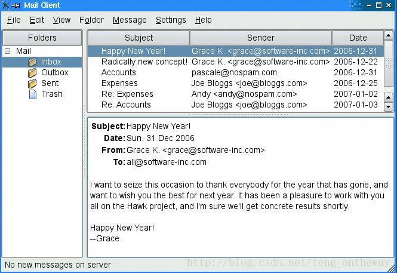

&emsp;&emsp;分割窗口在应用程序中经常用到，它可以灵活分布窗口布局，经常用于类似文件资源管理器的窗口设计中。<!--more-->


``` cpp
#include <QApplication>
#include <QSplitter>
#include <QTextEdit>
#include <QTextCodec>

int main ( int argc, char *argv[] ) {
    QTextCodec::setCodecForTr ( QTextCodec::codecForLocale() );
    QApplication app ( argc, argv );
    /* 创建主分割窗口，设置方向为水平分割窗口 */
    QSplitter *mainSplitter = new QSplitter ( Qt::Horizontal, 0 );
    /* 创建一个QTextEdit控件，设置其父控件为mainSplitter */
    QTextEdit *leftEdit = new QTextEdit ( QObject::tr ( "左窗口" ), mainSplitter );
    /* 设置QTextEdit控件中的文字的对齐方式居中显示 */
    leftEdit->setAlignment ( Qt::AlignCenter );
    /* 创建右分割窗口，设置其父控件为mainSplitter，设置方向为垂直分割窗口，最后其分割成上下两个窗口 */
    QSplitter *rightSplitter = new QSplitter ( Qt::Vertical, mainSplitter );
    /* 设定分割窗口的分割条在拖动时是否为实时更新，true为实时更新，false则在拖动时
       只显示一条灰色的线条，在拖动到位并弹起鼠标后再显示分隔条 */
    rightSplitter->setOpaqueResize ( false );
    /* 开始将其分割成上下两个窗口 */
    QTextEdit *upEdit = new QTextEdit ( QObject::tr ( "上窗口" ), rightSplitter );
    upEdit->setAlignment ( Qt::AlignCenter );
    QTextEdit *bottomEdit = new QTextEdit ( QObject::tr ( "下窗口" ), rightSplitter );
    bottomEdit->setAlignment ( Qt::AlignCenter );
    /* 设定可伸缩控件，第一个参数指定控件设置的控件序号，该控件序号按插入的先后次序依次
       从0开始编号。第二个参数大于0表示此控件为伸缩控件，此例中设置右部分割窗口为可伸缩控件 */
    mainSplitter->setStretchFactor ( 1, 1 );
    mainSplitter->setWindowTitle ( QObject::tr ( "分割窗口" ) );
    mainSplitter->show();
    return app.exec();
}
```

---

### Qt之Splitter分割窗口

&emsp;&emsp;一个`QSplitter`控件中可以包含其他控件，这些控件被一个分隔条隔开。托拽这个分隔条，里面的控件的大小可以改变。`QSplitter`控件经常做为布局管理器使用，给用户提供更多的界面控制。`QSplitter`控件中的子控件总是按顺序自动并肩排列(或者上下排列)，相邻的控件之间有一个分隔条。下面是创建下图中窗体的代码：

``` cpp
int main ( int argc, char *argv[] ) {
    QApplication app ( argc, argv );
    QTextEdit *editor1 = new QTextEdit;
    QTextEdit *editor2 = new QTextEdit;
    QTextEdit *editor3 = new QTextEdit;
    QSplitter splitter ( Qt::Horizontal );
    splitter.addWidget ( editor1 );
    splitter.addWidget ( editor2 );
    splitter.addWidget ( editor3 );
    ...
    splitter.show();
    return app.exec();
}
```


&emsp;&emsp;这个例子中的窗体有一个`QSplitter`控件，其中有三个水平排列的`QTextEdit`控件。和布局管理器不同，`QSplitter`不但可以排列子控件，还有一个可视的外观，`QSplitter`控件从`QWidget`继承，拥有`QWidget`所有的功能。


&emsp;&emsp;当应用程序启动时，`QSplitter`根据子控件的初始尺寸或者`sizeHint`合理分配每一个子控件的大小。在程序中，我们可以调用`QSplitter::setSizes`改变分隔条的位置。`QSplitter`还可以保存当前的状态，在程序下一次运行时恢复以前的状态。下面是`writeSettings`函数，保存当前分隔条的状态：

``` cpp
void MailClient::writeSettings() {
    QSettings settings ( "Software Inc.", "Mail Client" );
    settings.beginGroup ( "mainWindow" );
    settings.setValue ( "size", size() );
    settings.setValue ( "mainSplitter", mainSplitter->saveState() );
    settings.setValue ( "rightSplitter", rightSplitter->saveState() );
    settings.endGroup();
}
```

&emsp;&emsp;下面是相应的`readSettings`函数：

``` cpp
void MailClient::readSettings() {
    QSettings settings ( "Software Inc.", "Mail Client" );
    settings.beginGroup ( "mainWindow" );
    resize ( settings.value ( "size", QSize ( 480, 360 ) ).toSize() );
    mainSplitter->restoreState ( settings.value ( "mainSplitter" ).toByteArray() );
    rightSplitter->restoreState ( settings.value ( "rightSplitter" ).toByteArray() );
    settings.endGroup();
}
```

`Qt Designer`也支持`QSplitter`，把子控件放到合适的位置，将他们选中，选择菜单`Form|Lay out Horizontally in Splitter`或者`Form|Lay out Verticallly in Splitter`，所选择的子控件就被加入到`QSplitter`控件中。
&emsp;&emsp;对`QSplitter`进行水平或者垂直嵌套可以实现更加复杂的布局。例如下图所示的`MailClient`程序中，就是一个垂直方向的`QSplitter`控件中嵌套了一个水平方向的`QSplitter`控件。



&emsp;&emsp;下面的代码是`MailClient`程序的主窗口类构造函数代码：

``` cpp
MailClient::MailClient() {
    ...
    rightSplitter = new QSplitter ( Qt::Vertical );
    rightSplitter->addWidget ( messagesTreeWidget ); /* 索引0 */
    rightSplitter->addWidget ( textEdit ); /* 索引1 */
    rightSplitter->setStretchFactor ( 1, 1 ); /* 指定索引为1的textEdit拉伸 */
    mainSplitter = new QSplitter ( Qt::Horizontal );
    mainSplitter->addWidget ( foldersTreeWidget );
    mainSplitter->addWidget ( rightSplitter );
    mainSplitter->setStretchFactor ( 1, 1 );
    setCentralWidget ( mainSplitter );
    setWindowTitle ( tr ( "Mail Client" ) );
    readSettings();
}
```

&emsp;&emsp;创建完我们所需要显示三个控件(`messageTreeWidget`、`textEdit`和`foldersTreeWidget`)后，再创建一个垂直的`rightSplitter`控件，把`messageTreeWidget`和`textEdit`控件加到`rightSplitter`中。然后创建一个水平的`mainSplitter`控件，把`rightSplitter`和`foldersTreeWidget`加入到`mainSplitter`中，把`mainSplitter`做为`QMainWindow`的中央控件。
&emsp;&emsp;当用户改变窗口的大小时，`QSplitter`通常给所有的子控件一样的空间。在`MailClient`程序中，我们希望左边的文件树控件(`foldersTreeWidget`)和消息树控件(`messageTreeWidget`)保持它们的大小，把其他的空间都分配给`QTextEdit`，这是由两个`setStretchFactor`调用实现。第一个参数是`0`开始的子控件的索引值，第二个参数是设置的拉伸系数，缺省值为`0`。

