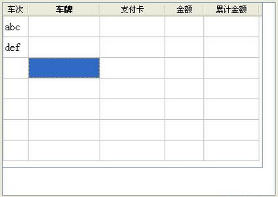
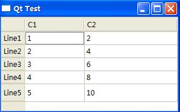
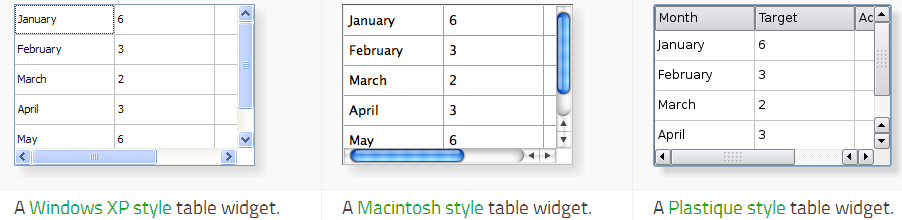

&emsp;&emsp;代码如下：<!--more-->

``` cpp
#include <QTableWidget>
/* 构造一个QTableWidget类的实体对象tableWidget */
tableWidget = new QTableWidget ( ui->textBrowser );
tableWidget->setRowCount ( 7 ); /* 设置行数为7 */
tableWidget->setColumnCount ( 5 ); /* 设置列数为5 */
tableWidget->setGeometry ( QRect ( 0, 0, 401, 241 ) ); /* 设置tableWidget的大小 */
tableWidget->setItem ( 0, 0, new QTableWidgetItem ( "abc" ) ); /* 第一行第一列的内容设置为“abc” */
tableWidget->setItem ( 1, 0, new QTableWidgetItem ( "def" ) ); /* 第二行第一列的内容设置为“abc” */
/* 40, 110, 100, 60, 85 */
tableWidget->setColumnWidth ( 0, 40 ); /* 设置第一列的列宽 */
tableWidget->setColumnWidth ( 1, 110 ); /* 设置第二列的列宽 */
tableWidget->setColumnWidth ( 2, 100 ); /* 设置第三列的列宽 */
tableWidget->setColumnWidth ( 3, 60 ); /* 设置第四列的列宽 */
tableWidget->setColumnWidth ( 4, 85 ); /* 设置第五列的列宽 */

/* 列表的标题为：车次、车牌、支付卡、金额、累计金额 */
tableWidget->setHorizontalHeaderLabels (
    QStringList() << tr ( "车次" ) << tr ( "车牌" ) \
                  << tr ( "支付卡" ) << tr ( "金额" ) << tr ( "累计金额" ) );
tableWidget->setFont ( QFont ( "wenquanyi", 12, 3 ) ); /* 设置字体 */
QHeaderView *headerView = tableWidget->verticalHeader();
headerView->setHidden ( true ); /* 行名隐藏 */
```



---

&emsp;&emsp;表格是`GUI`中常用的控件，`Qt`中常用的表格类是`QTableWidget`：

``` cpp
QTableWidget *table = new QTableWidget ( 4, 2 ); /* 新建一4行2列的表格 */

/* 设置表格行标题 */
QStringList headerLabels;
headerLabels << "C1" << "C2";
table->setHorizontalHeaderLabels ( headerLabels );

/* 设置表格行标题的对齐方式 */
table->horizontalHeader()->setDefaultAlignment ( Qt::AlignLeft );

/* 设置行表题 */
QStringList rowLabels;
rowLabels << "Line1" << "Line2" << "Line3" << "Line4";
table->setVerticalHeaderLabels ( rowLabels );

for ( int i = 0; i < 4; i++ ) { /* 设置每一行的高度 */
    table->setRowHeight ( i, 22 );
}

/* 自动调整最后一列的宽度使它和表格的右边界对齐 */
table->horizontalHeader()->setStretchLastSection ( true );
/* 设置表格的选择方式 */
table->setSelectionBehavior ( QAbstractItemView::SelectItems );
/* 设置编辑方式 */
table->setEditTriggers ( QAbstractItemView::DoubleClicked );

for ( int row = 0; row < 4; ++row ) { /* 设置表格的内容 */
    QTableWidgetItem *item0, *item1;
    item0 = new QTableWidgetItem;
    item1 = new QTableWidgetItem;
    QString txt = QString ( "%1" ).arg ( row + 1 );
    item0->setText ( txt );
    table->setItem ( row, 0, item0 );
    txt = QString ( "%1" ).arg ( ( row + 1 ) * 2 );
    item1->setText ( txt );
    table->setItem ( row, 1, item1 );
}

/* 增加一行 */
table->setRowCount ( 5 );
QTableWidgetItem *vHeader5 = new QTableWidgetItem ( "Line5" );
table->setVerticalHeaderItem ( 4, vHeader5 );
QTableWidgetItem *item5_0, *item5_1;
item5_0 = new QTableWidgetItem;
item5_1 = new QTableWidgetItem;
item5_0->setText ( QString ( "%1" ).arg ( 5 ) );
item5_1->setText ( QString ( "%1" ).arg ( 5 * 2 ) );
table->setItem ( 4, 0, item5_0 );
table->setItem ( 4, 1, item5_1 );
```



---

&emsp;&emsp;The `QTableWidget` class provides an `item-based` table view with a default model.

Header         | Inherits
---------------|-------------
`QTableWidget` | `QTableView`

### Public Functions

Return                              | Function
------------------------------------|---------
                                    | `QTableWidget(QWidget * parent = 0)`
                                    | `QTableWidget(int rows, int columns, QWidget * parent = 0)`
                                    | `~QTableWidget()`
`QWidget *`                         | `cellWidget(int row, int column) const`
`void`                              | `closePersistentEditor(QTableWidgetItem * item)`
`int`                               | `column(const QTableWidgetItem * item) const`
`int`                               | `columnCount() const`
`int`                               | `currentColumn() const`
`QTableWidgetItem *`                | `currentItem() const`
`int`                               | `currentRow() const`
`void`                              | `editItem(QTableWidgetItem * item)`
`QList<QTableWidgetItem *>`         | `findItems(const QString & text, Qt::MatchFlags flags) const`
`QTableWidgetItem *`                | `horizontalHeaderItem(int column) const`
`QTableWidgetItem *`                | `item(int row, int column) const`
`QTableWidgetItem *`                | `itemAt(const QPoint & point) const`
`QTableWidgetItem *`                | `itemAt(int ax, int ay) const`
`const QTableWidgetItem *`          | `itemPrototype() const`
`void`                              | `openPersistentEditor(QTableWidgetItem * item)`
`void`                              | `removeCellWidget(int row, int column)`
`int`                               | `row(const QTableWidgetItem * item) const`
`int`                               | `rowCount() const`
`QList<QTableWidgetItem *>`         | `selectedItems()`
`QList<QTableWidgetSelectionRange>` | `selectedRanges() const`
`void`                              | `setCellWidget(int row, int column, QWidget * widget)`
`void`                              | `setColumnCount(int columns)`
`void`                              | `setCurrentCell(int row, int column)`
`void`                              | `setCurrentCell(int row, int column, QItemSelectionModel::SelectionFlags command)`
`void`                              | `setCurrentItem(QTableWidgetItem * item)`
`void`                              | `setCurrentItem(QTableWidgetItem * item, QItemSelectionModel::SelectionFlags command)`
`void`                              | `setHorizontalHeaderItem(int column, QTableWidgetItem * item)`
`void`                              | `setHorizontalHeaderLabels(const QStringList & labels)`
`void`                              | `setItem(int row, int column, QTableWidgetItem * item)`
`void`                              | `setItemPrototype(const QTableWidgetItem * item)`
`void`                              | `setRangeSelected(const QTableWidgetSelectionRange & range, bool select)`
`void`                              | `setRowCount(int rows)`
`void`                              | `setVerticalHeaderItem(int row, QTableWidgetItem * item)`
`void`                              | `setVerticalHeaderLabels(const QStringList & labels)`
`void`                              | `sortItems(int column, Qt::SortOrder order = Qt::AscendingOrder)`
`QTableWidgetItem *`                | `takeHorizontalHeaderItem(int column)`
`QTableWidgetItem *`                | `takeItem(int row, int column)`
`QTableWidgetItem *`                | `stakeVerticalHeaderItem(int row)`
`QTableWidgetItem *`                | `verticalHeaderItem(int row) const`
`int`                               | `visualColumn(int logicalColumn) const`
`QRect`                             | `visualItemRect(const QTableWidgetItem * item) const`
`int`                               | `visualRow(int logicalRow) const`

### Public Slots

Return | Function
-------|---------
`void` | `clear()`
`void` | `clearContents()`
`void` | `insertColumn(int column)`
`void` | `insertRow(int row)`
`void` | `removeColumn(int column)`
`void` | `removeRow(int row)`
`void` | `scrollToItem(const QTableWidgetItem * item, QAbstractItemView::ScrollHint hint = EnsureVisible)`

### Signals

Return | Function
-------|---------
`void` | `cellActivated(int row, int column)`
`void` | `cellChanged(int row, int column)`
`void` | `cellClicked(int row, int column)`
`void` | `cellDoubleClicked(int row, int column)`
`void` | `cellEntered(int row, int column)`
`void` | `cellPressed(int row, int column)`
`void` | `currentCellChanged(int currentRow, int currentColumn, int previousRow, int previousColumn)`
`void` | `currentItemChanged(QTableWidgetItem * current, QTableWidgetItem * previous)`
`void` | `itemActivated(QTableWidgetItem * item)`
`void` | `itemChanged(QTableWidgetItem * item)`
`void` | `itemClicked(QTableWidgetItem * item)`
`void` | `itemDoubleClicked(QTableWidgetItem * item)`
`void` | `itemEntered(QTableWidgetItem * item)`
`void` | `itemPressed(QTableWidgetItem * item)`
`void` | `itemSelectionChanged()`

### Protected Functions

Return                      | Function
----------------------------|---------
`virtual bool`              | `dropMimeData(int row, int column, const QMimeData * data, Qt::DropAction action)`
`QModelIndex`               | `indexFromItem(QTableWidgetItem * item) const`
`QTableWidgetItem *`        | `itemFromIndex(const QModelIndex & index) const`
`QList<QTableWidgetItem *>` | `items(const QMimeData * data) const`
`virtual QMimeData *`       | `mimeData(const QList<QTableWidgetItem *> items) const`
`virtual QStringList`       | `mimeTypes() const`
`virtual Qt::DropActions`   | `supportedDropActions() const`

### Reimplemented Protected Functions

Return         | Function
---------------|---------
`virtual void` | `dropEvent(QDropEvent * event)`
`virtual bool` | `event(QEvent * e)`

### Detailed Description

&emsp;&emsp;The `QTableWidget` class provides an `item-based` table view with a default model.
&emsp;&emsp;Table widgets provide standard table display facilities for applications. The items in a `QTableWidget` are provided by `QTableWidgetItem`.
&emsp;&emsp;If you want a table that uses your own data model you should use `QTableView` rather than this class.
&emsp;&emsp;Table widgets can be constructed with the required numbers of rows and columns:

``` cpp
tableWidget = new QTableWidget ( 12, 3, this );
```

Alternatively, tables can be constructed without a given size and resized later:

``` cpp
tableWidget = new QTableWidget ( this );
tableWidget->setRowCount ( 10 );
tableWidget->setColumnCount ( 5 );
```

Items are created ouside the table (with no parent widget) and inserted into the table with `setItem()`:

``` cpp
QTableWidgetItem *newItem = new QTableWidgetItem ( tr ( "%1" ).arg ( ( row + 1 ) * ( column + 1 ) ) );
tableWidget->setItem ( row, column, newItem );
```

&emsp;&emsp;If you want to enable sorting in your table widget, do so after you have populated it with items, otherwise sorting may interfere with the insertion order.
&emsp;&emsp;Tables can be given both horizontal and vertical headers. The simplest way to create the headers is to supply a list of strings to the `setHorizontalHeaderLabels()` and `setVerticalHeaderLabels()` functions. These will provide simple textual headers for the table's columns and rows. More sophisticated headers can be created from existing table items that are usually constructed outside the table. For example, we can construct a table item with an icon and aligned text, and use it as the header for a particular column:

``` cpp
QTableWidgetItem *cubesHeaderItem = new QTableWidgetItem ( tr ( "Cubes" ) );
cubesHeaderItem->setIcon ( QIcon ( QPixmap ( ":/Images/cubed.png" ) ) );
cubesHeaderItem->setTextAlignment ( Qt::AlignVCenter );
```

&emsp;&emsp;The number of rows in the table can be found with `rowCount()`, and the number of columns with `columnCount()`. The table can be cleared with the `clear()` function.



### Property Documentation

- `columnCount : int`: This property holds the number of columns in the table. By default, for a table constructed without row and column counts, this property contains a value of `0`. Access functions:

``` cpp
int columnCount() const
void setColumnCount ( int columns )
```

- `rowCount : int`: This property holds the number of rows in the table. By default, for a table constructed without row and column counts, this property contains a value of `0`. Access functions:

``` cpp
int rowCount() const
void setRowCount ( int rows )
```

### Member Function Documentation

- `QTableWidget::QTableWidget(QWidget * parent = 0)`: Creates a new table view with the given `parent`.
- `QTableWidget::QTableWidget(int rows, int columns, QWidget * parent = 0)`: Creates a new table view with the given `rows` and `columns`, and with the given `parent`.
- `QTableWidget::~QTableWidget()`: Destroys this QTableWidget.
- `void QTableWidget::cellActivated(int row, int column) [signal]`: This signal is emitted when the cell specified by `row` and `column` has been activated.
- `void QTableWidget::cellChanged(int row, int column) [signal]`: This signal is emitted whenever the data of the item in the cell specified by `row` and `column` has changed.
- `void QTableWidget::cellClicked(int row, int column) [signal]`: This signal is emitted whenever a cell in the table is clicked. The `row` and `column` specified is the cell that was clicked.
- `void QTableWidget::cellDoubleClicked(int row, int column) [signal]`: This signal is emitted whenever a cell in the table is double clicked. The `row` and `column` specified is the cell that was double clicked.
- `void QTableWidget::cellEntered(int row, int column) [signal]`: This signal is emitted when the mouse cursor enters a cell. The cell is specified by `row` and `column`. This signal is only emitted when mouseTracking is turned on, or when a mouse button is pressed while moving into an item.
- `void QTableWidget::cellPressed(int row, int column) [signal]`: This signal is emitted whenever a cell in the table is pressed. The `row` and `column` specified is the cell that was pressed.
- `QWidget * QTableWidget::cellWidget(int row, int column) const`: Returns the widget displayed in the cell in the given `row` and `column`. **Note**: The table takes ownership of the widget.
- `void QTableWidget::clear() [slot]`: Removes all items in the view. This will also remove all selections. The table dimensions stay the same.
- `void QTableWidget::clearContents() [slot]`: Removes all items not in the headers from the view. This will also remove all selections. The table dimensions stay the same.
- `void QTableWidget::closePersistentEditor(QTableWidgetItem * item)`: Closes the persistent editor for `item`.
- `int QTableWidget::column(const QTableWidgetItem * item) const`: Returns the column for the `item`.
- `void QTableWidget::currentCellChanged(int currentRow, int currentColumn, int previousRow, int previousColumn) [signal]`: This signal is emitted whenever the current cell changes. The cell specified by `previousRow` and `previousColumn` is the cell that previously had the focus, the cell specified by `currentRow` and `currentColumn` is the new current cell.
- `int QTableWidget::currentColumn() const`: Returns the column of the current item.
- `QTableWidgetItem * QTableWidget::currentItem() const`: Returns the current item.
- `void QTableWidget::currentItemChanged(QTableWidgetItem * current, QTableWidgetItem * previous) [signal]`: This signal is emitted whenever the `current` item changes. The `previous` item is the item that previously had the focus, `current` is the new current item.
- `int QTableWidget::currentRow() const`: Returns the row of the current item.
- `void QTableWidget::dropEvent(QDropEvent * event) [virtual protected]`: Reimplemented from `QWidget::dropEvent()`.
- `bool QTableWidget::dropMimeData(int row, int column, const QMimeData * data, Qt::DropAction action) [virtual protected]`: Handles the `data` supplied by a drag and drop operation that ended with the given `action` in the given `row` and `column`. Returns `true` if the `data` and `action` can be handled by the model; otherwise returns `false`.
- `void QTableWidget::editItem(QTableWidgetItem * item)`: Starts editing the `item` if it is editable.
- `bool QTableWidget::event(QEvent * e) [virtual protected]`: Reimplemented from `QObject::event()`.
- `QList<QTableWidgetItem *> QTableWidget::findItems(const QString & text, Qt::MatchFlags flags) const`: Finds items that matches the `text` using the given `flags`.
- `QTableWidgetItem * QTableWidget::horizontalHeaderItem(int column) const`: Returns the horizontal header item for `column`, if one has been set; otherwise returns `0`.
- `QModelIndex QTableWidget::indexFromItem(QTableWidgetItem * item) const [protected]`: Returns the `QModelIndex` assocated with the given `item`.
- `void QTableWidget::insertColumn(int column) [slot]`: Inserts an empty column into the table at `column`.
- `void QTableWidget::insertRow(int row) [slot]`: Inserts an empty row into the table at `row`.
- `QTableWidgetItem * QTableWidget::item(int row, int column) const`: Returns the item for the given `row` and `column` if one has been set; otherwise returns `0`.
- `void QTableWidget::itemActivated(QTableWidgetItem * item) [signal]`: This signal is emitted when the specified `item` has been activated.
- `QTableWidgetItem * QTableWidget::itemAt(const QPoint & point) const`: Returns a pointer to the item at the given `point`, or returns `0` if `point` is not covered by an item in the table widget.
- `QTableWidgetItem * QTableWidget::itemAt(int ax, int ay) const`: Returns the item at the position equivalent to `QPoint(ax, ay)` in the table widget's coordinate system, or returns `0` if the specified point is not covered by an item in the table widget.
- `void QTableWidget::itemChanged(QTableWidgetItem * item) [signal]`: This signal is emitted whenever the data of `item` has changed.
- `void QTableWidget::itemClicked(QTableWidgetItem * item) [signal]`: This signal is emitted whenever an item in the table is clicked. The item specified is the `item` that was clicked.
- `void QTableWidget::itemDoubleClicked(QTableWidgetItem * item) [signal]`: This signal is emitted whenever an item in the table is double clicked. The item specified is the `item` that was double clicked.
- `void QTableWidget::itemEntered(QTableWidgetItem * item) [signal]`: This signal is emitted when the mouse cursor enters an item. The item is the `item` entered. This signal is only emitted when `mouseTracking` is turned on, or when a mouse button is pressed while moving into an item.
- `QTableWidgetItem * QTableWidget::itemFromIndex(const QModelIndex & index) const [protected]`: Returns a pointer to the QTableWidgetItem assocated with the given `index`.
- `void QTableWidget::itemPressed(QTableWidgetItem * item) [signal]`: This signal is emitted whenever an item in the table is pressed. The item specified is the `item` that was pressed.
- `const QTableWidgetItem * QTableWidget::itemPrototype() const`: Returns the item prototype used by the table.
- `void QTableWidget::itemSelectionChanged() [signal]`: This signal is emitted whenever the selection changes.
- `QList<QTableWidgetItem *> QTableWidget::items(const QMimeData * data) const [protected]`: Returns a list of pointers to the items contained in the `data` object. If the object was not created by a `QTreeWidget` in the same process, the list is empty.
- `QMimeData * QTableWidget::mimeData(const QList<QTableWidgetItem *> items) const [virtual protected]`: Returns an object that contains a serialized description of the specified `items`. The format used to describe the `items` is obtained from the `mimeTypes()` function. If the list of `items` is empty, `0` is returned rather than a serialized empty list.
- `QStringList QTableWidget::mimeTypes() const [virtual protected]`: Returns a list of `MIME` types that can be used to describe a list of tablewidget items.
- `void QTableWidget::openPersistentEditor(QTableWidgetItem * item)`: Opens an editor for the give `item`. The editor remains open after editing.
- `void QTableWidget::removeCellWidget(int row, int column)`: Removes the widget set on the cell indicated by `row` and `column`.
- `void QTableWidget::removeColumn(int column) [slot]`: Removes the `column` and all its items from the table.
- `void QTableWidget::removeRow(int row) [slot]`: Removes the `row` and all its items from the table.
- `int QTableWidget::row(const QTableWidgetItem * item) const`: Returns the row for the `item`.
- `void QTableWidget::scrollToItem(const QTableWidgetItem * item, QAbstractItemView::ScrollHint hint = EnsureVisible) [slot]`: Scrolls the view if necessary to ensure that the `item` is visible. The `hint` parameter specifies more precisely where the `item` should be located after the operation.
- `QList<QTableWidgetItem *> QTableWidget::selectedItems()`: Returns a list of all selected items. This function returns a list of pointers to the contents of the selected cells. Use the `selectedIndexes()` function to retrieve the complete selection including empty cells.
- `QList<QTableWidgetSelectionRange> QTableWidget::selectedRanges() const`: Returns a list of all selected ranges.
- `void QTableWidget::setCellWidget(int row, int column, QWidget * widget)`: Sets the given `widget` to be displayed in the cell in the given `row` and `column`, passing the ownership of the widget to the table. If `cell widget A` is replaced with `cell widget B`, `cell widget A` will be deleted. For example, in the code snippet below, the `QLineEdit` object will be deleted.

``` cpp
setCellWidget ( index, new QLineEdit );
...
setCellWidget ( index, new QTextEdit );
```

- `void QTableWidget::setCurrentCell(int row, int column)`: Sets the current cell to be the cell at position `(row, column)`. Depending on the current selection mode, the cell may also be selected.
- `void QTableWidget::setCurrentCell(int row, int column, QItemSelectionModel::SelectionFlags command)`: Sets the current cell to be the cell at position `(row, column)`, using the given `command`.
- `void QTableWidget::setCurrentItem(QTableWidgetItem * item)`: Sets the current item to `item`. Unless the selection mode is `NoSelection`, the `item` is also be selected.
- `void QTableWidget::setCurrentItem(QTableWidgetItem * item, QItemSelectionModel::SelectionFlags command)`: Sets the current item to be `item`, using the given `command`.
- `void QTableWidget::setHorizontalHeaderItem(int column, QTableWidgetItem * item)`: Sets the horizontal header item for `column` to `item`.
- `void QTableWidget::setHorizontalHeaderLabels(const QStringList & labels)`: Sets the horizontal header labels using `labels`.
- `void QTableWidget::setItem(int row, int column, QTableWidgetItem * item)`: Sets the item for the given `row` and `column` to `item`. The table takes ownership of the item. Note that if sorting is enabled and `column` is the current sort column, the `row` will be moved to the sorted position determined by `item`. If you want to set several items of a particular `row` (say, by calling `setItem()` in a loop), you may want to turn off sorting before doing so, and turn it back on afterwards; this will allow you to use the same `row` argument for all items in the same `row` (i.e. `setItem()` will not move the `row`).
- `void QTableWidget::setItemPrototype(const QTableWidgetItem * item)`: Sets the item prototype for the table to the specified `item`. The table widget will use the item prototype clone function when it needs to create a new table item. For example when the user is editing in an empty cell. This is useful when you have a `QTableWidgetItem` subclass and want to make sure that `QTableWidget` creates instances of your subclass. The table takes ownership of the prototype.
- `void QTableWidget::setRangeSelected(const QTableWidgetSelectionRange & range, bool select)`: Selects or deselects the `range` depending on `select`.
- `void QTableWidget::setVerticalHeaderItem(int row, QTableWidgetItem * item)`: Sets the vertical header item for `row` to `item`.
- `void QTableWidget::setVerticalHeaderLabels(const QStringList & labels)`: Sets the vertical header labels using `labels`.
- `void QTableWidget::sortItems(int column, Qt::SortOrder order = Qt::AscendingOrder)`: Sorts all the rows in the table widget based on `column` and `order`.
- `Qt::DropActions QTableWidget::supportedDropActions() const [virtual protected]`: Returns the drop actions supported by this view.
- `QTableWidgetItem * QTableWidget::takeHorizontalHeaderItem(int column)`: Removes the horizontal header item at `column` from the header without deleting it.
- `QTableWidgetItem * QTableWidget::takeItem(int row, int column)`: Removes the item at `row` and `column` from the table without deleting it.
- `QTableWidgetItem * QTableWidget::takeVerticalHeaderItem(int row)`: Removes the vertical header item at `row` from the header without deleting it.
- `QTableWidgetItem * QTableWidget::verticalHeaderItem(int row) const`: Returns the vertical header item for `row`.
- `int QTableWidget::visualColumn(int logicalColumn) const`: Returns the visual column of the given `logicalColumn`.
- `QRect QTableWidget::visualItemRect(const QTableWidgetItem * item) const`: Returns the rectangle on the viewport occupied by the item at `item`.
- `int QTableWidget::visualRow(int logicalRow) const`: Returns the visual row of the given `logicalRow`.