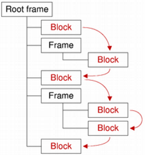

&emsp;&emsp;The `QTextBlock` class provides a container for text fragments in a `QTextDocument`. The header file is `QTextBlock`. **Note**: All functions in this class are reentrant.<!--more-->

### Public Functions

Return                  | Function
------------------------|---------
                        | `QTextBlock(const QTextBlock & other)`
`iterator`              | `begin() const`
`QTextBlockFormat`      | `blockFormat() const`
`int`                   | `blockFormatIndex() const`
`int`                   | `blockNumber() const`
`QTextCharFormat`       | `charFormat() const`
`int`                   | `charFormatIndex() const`
`void`                  | `clearLayout()`
`bool`                  | `contains(int position) const`
`const QTextDocument *` | `document() const`
`iterator`              | `end() const`
`int`                   | `firstLineNumber() const`
`bool`                  | `isValid() const`
`bool`                  | `isVisible() const`
`QTextLayout *`         | `layout() const`
`int`                   | `length() const`
`int`                   | `lineCount() const`
`QTextBlock`            | `next() const`
`int`                   | `position() const`
`QTextBlock`            | `previous() const`
`int`                   | `revision() const`
`void`                  | `setLineCount(int count)`
`void`                  | `setRevision(int rev)`
`void`                  | `setUserData(QTextBlockUserData * data)`
`void`                  | `setUserState(int state)`
`void`                  | `setVisible(bool visible)`
`QString`               | `text() const`
`Qt::LayoutDirection`   | `textDirection() const`
`QTextList *`           | `textList() const`
`QTextBlockUserData *`  | `userData() const`
`int`                   | `userState() const`
`bool`                  | `operator!=(const QTextBlock & other) const`
`bool`                  | `operator<(const QTextBlock & other) const`
`QTextBlock &`          | `operator=(const QTextBlock & other)`
`bool`                  | `operator==(const QTextBlock & other) const`

### Detailed Description

&emsp;&emsp;The `QTextBlock` class provides a container for text fragments in a `QTextDocument`.
&emsp;&emsp;A text block encapsulates a block or paragraph of text in a `QTextDocument`. `QTextBlock` provides `read-only` access to the `block/paragraph` structure of `QTextDocuments`. It is mainly of use if you want to implement your own layouts for the visual representation of a `QTextDocument`, or if you want to iterate over a document and write out the contents in your own custom format.
&emsp;&emsp;Text blocks are created by their parent documents. If you need to create a new text block, or modify the contents of a document while examining its contents, use the `cursor-based` interface provided by `QTextCursor` instead.
&emsp;&emsp;Each text block is located at a specific `position()` in a `document()`. The contents of the block can be obtained by using the `text()` function. The `length()` function determines the block's size within the document (including formatting characters). The visual properties of the block are determined by its text `layout()`, its `charFormat()`, and its `blockFormat()`.
&emsp;&emsp;The `next()` and `previous()` functions enable iteration over consecutive valid blocks in a document under the condition that the document is not modified by other means during the iteration process. Note that, although blocks are returned in sequence, adjacent blocks may come from different places in the document structure. The validity of a block can be determined by calling `isValid()`.
&emsp;&emsp;`QTextBlock` provides comparison operators to make it easier to work with blocks: `operator==()` compares two block for equality, `operator!=()` compares two blocks for inequality, and `operator<()` determines whether a block precedes another in the same document.

### Member Type Documentation

- `typedef QTextBlock::Iterator`: `Qt-style` synonym for `QTextBlock::iterator`.

### Member Function Documentation

- `QTextBlock::QTextBlock(const QTextBlock & other)`: Copies the `other` text block's attributes to this text block.
- `iterator QTextBlock::begin() const`: Returns a text block iterator pointing to the beginning of the text block.
- `QTextBlockFormat QTextBlock::blockFormat() const`: Returns the QTextBlockFormat that describes `block-specific` properties.
- `int QTextBlock::blockFormatIndex() const`: Returns an index into the document's internal list of block formats for the text block's format.
- `int QTextBlock::blockNumber() const`: Returns the number of this block, or `-1` if the block is invalid.
- `QTextCharFormat QTextBlock::charFormat() const`: Returns the `QTextCharFormat` that describes the block's character format. The block's character format is used when inserting text into an empty block.
- `int QTextBlock::charFormatIndex() const`: Returns an index into the document's internal list of character formats for the text block's character format.
- `void QTextBlock::clearLayout()`: Clears the `QTextLayout` that is used to lay out and display the block's contents.
- `bool QTextBlock::contains(int position) const`: Returns `true` if the given `position` is located within the text block; otherwise returns `false`.
- `const QTextDocument * QTextBlock::document() const`: Returns the text document this text block belongs to, or `0` if the text block does not belong to any document.
- `iterator QTextBlock::end() const`: Returns a text block iterator pointing to the end of the text block.
- `int QTextBlock::firstLineNumber() const`: Returns the first line number of this block, or `-1` if the block is invalid. Unless the layout supports it, the line number is identical to the block number.
- `bool QTextBlock::isValid() const`: Returns `true` if this text block is valid; otherwise returns `false`.
- `bool QTextBlock::isVisible() const`: Returns `true` if the block is visible; otherwise returns `false`.
- `QTextLayout * QTextBlock::layout() const`: Returns the `QTextLayout` that is used to lay out and display the block's contents. Note that the returned `QTextLayout` object can only be modified from the `documentChanged` implementation of a `QAbstractTextDocumentLayout` subclass. Any changes applied from the outside cause undefined behavior.
- `int QTextBlock::length() const`: Returns the length of the block in characters. **Note**: The length returned includes all formatting characters, for example, newline.
- `int QTextBlock::lineCount() const`: Returns the line count. Not all document layouts support this feature.
- `QTextBlock QTextBlock::next() const`: Returns the text block in the document after this block, or an empty text block if this is the last one. Note that the next block may be in a different frame or table to this block.
- `int QTextBlock::position() const`: Returns the index of the block's first character within the document.
- `QTextBlock QTextBlock::previous() const`: Returns the text block in the document before this block, or an empty text block if this is the first one. Note that the next block may be in a different frame or table to this block.
- `int QTextBlock::revision() const`: Returns the blocks revision.
- `void QTextBlock::setLineCount(int count)`: Sets the line count to `count`.
- `void QTextBlock::setRevision(int rev)`: Sets a blocks revision to `rev`.
- `void QTextBlock::setUserData(QTextBlockUserData * data)`: Attaches the given `data` object to the text block. `QTextBlockUserData` can be used to store custom settings. The ownership is passed to the underlying text document, i.e. the provided `QTextBlockUserData` object will be deleted if the corresponding text block gets deleted. The user data object is not stored in the undo history, so it will not be available after undoing the deletion of a text block. For example, if you write a programming editor in an `IDE`, you may want to let your user set breakpoints visually in your code for an integrated debugger. In a programming editor a line of text usually corresponds to one `QTextBlock`. The `QTextBlockUserData` interface allows the developer to store data for each `QTextBlock`, like for example in which lines of the source code the user has a breakpoint set. Of course this could also be stored externally, but by storing it inside the `QTextDocument`, it will for example be automatically deleted when the user deletes the associated line. It's really just a way to store custom information in the `QTextDocument` without using custom properties in `QTextFormat` which would affect the undo/redo stack.
- `void QTextBlock::setUserState(int state)`: Stores the specified `state` integer value in the text block. This may be useful for example in a syntax highlighter to store a text parsing state.
- `void QTextBlock::setVisible(bool visible)`: Sets the block's visibility to `visible`.
- `QString QTextBlock::text() const`: Returns the block's contents as plain text.
- `Qt::LayoutDirection QTextBlock::textDirection() const`: Returns the resolved text direction. If the block has no explicit direction set, it will resolve the direction from the blocks content. Returns either `Qt::LeftToRight` or `Qt::RightToLeft`.
- `QTextList * QTextBlock::textList() const`: If the block represents a list item, returns the list that the item belongs to; otherwise returns `0`.
- `QTextBlockUserData * QTextBlock::userData() const`: Returns a pointer to a `QTextBlockUserData` object if previously set with `setUserData()` or a null pointer.
- `int QTextBlock::userState() const`: Returns the integer value previously set with `setUserState()` or `-1`.
- `bool QTextBlock::operator!=(const QTextBlock & other) const`: Returns `true` if this text block is different from the `other` text block.
- `bool QTextBlock::operator<(const QTextBlock & other) const`: Returns `true` if this text block occurs before the `other` text block in the document.
- `QTextBlock & QTextBlock::operator=(const QTextBlock & other)`: Assigns the `other` text block to this text block.
- `bool QTextBlock::operator==(const QTextBlock & other) const`: Returns true if this text block is the same as the `other` text block.