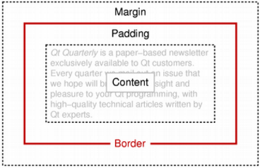

&emsp;&emsp;The `QTextFrameFormat` class provides formatting information for frames in a `QTextDocument`.<!--more-->

Header             | Inherits      | Inherited By
-------------------|---------------|-------------
`QTextFrameFormat` | `QTextFormat` | `QTextTableFormat`

**Note**: All functions in this class are reentrant.

### Public Functions

Return           | Function
-----------------|----------
                 | `QTextFrameFormat()`
`qreal`          | `border() const`
`QBrush`         | `borderBrush() const`
`BorderStyle`    | `borderStyle() const`
`qreal`          | `bottomMargin() const`
`QTextLength`    | `height() const`
`bool`           | `isValid() const`
`qreal`          | `leftMargin() const`
`qreal`          | `margin() const`
`qreal`          | `padding() const`
`PageBreakFlags` | `pageBreakPolicy() const`
`Position`       | `position() const`
`qreal`          | `rightMargin() const`
`void`           | `setBorder(qreal width)`
`void`           | `setBorderBrush(const QBrush & brush)`
`void`           | `setBorderStyle(BorderStyle style)`
`void`           | `setBottomMargin(qreal margin)`
`void`           | `setHeight(const QTextLength & height)`
`void`           | `setHeight(qreal height)`
`void`           | `setLeftMargin(qreal margin)`
`void`           | `setMargin(qreal margin)`
`void`           | `setPadding(qreal width)`
`void`           | `setPageBreakPolicy(PageBreakFlags policy)`
`void`           | `setPosition(Position policy)`
`void`           | `setRightMargin(qreal margin)`
`void`           | `setTopMargin(qreal margin)`
`void`           | `setWidth(const QTextLength & width)`
`void`           | `setWidth(qreal width)`
`qreal`          | `topMargin() const`
`QTextLength`    | `width() const`

### Detailed Description

&emsp;&emsp;The `QTextFrameFormat` class provides formatting information for frames in a `QTextDocument`.
&emsp;&emsp;A text frame groups together one or more blocks of text, providing a layer of structure larger than the paragraph. The format of a frame specifies how it is rendered and positioned on the screen. It does not directly specify the behavior of the text formatting within, but provides constraints on the layout of its children.
&emsp;&emsp;The frame format defines the `width()` and `height()` of the frame on the screen. Each frame can have a `border()` that surrounds its contents with a rectangular box. The border is surrounded by a `margin()` around the frame, and the contents of the frame are kept separate from the border by the frame's `padding()`. This scheme is similar to the box model used by `Cascading Style Sheets` for `HTML` pages.

&emsp;&emsp;The `position()` of a frame is set using `setPosition()` and determines how it is located relative to the surrounding text.
&emsp;&emsp;The validity of a `QTextFrameFormat` object can be determined with the `isValid()` function.

### Member Type Documentation

- `enum QTextFrameFormat::BorderStyle`: This enum describes different border styles for the text frame.

Constant                                   | Value
-------------------------------------------|------
`QTextFrameFormat::BorderStyle_None`       | `0`
`QTextFrameFormat::BorderStyle_Dotted`     | `1`
`QTextFrameFormat::BorderStyle_Dashed`     | `2`
`QTextFrameFormat::BorderStyle_Solid`      | `3`
`QTextFrameFormat::BorderStyle_Double`     | `4`
`QTextFrameFormat::BorderStyle_DotDash`    | `5`
`QTextFrameFormat::BorderStyle_DotDotDash` | `6`
`QTextFrameFormat::BorderStyle_Groove`     | `7`
`QTextFrameFormat::BorderStyle_Ridge`      | `8`
`QTextFrameFormat::BorderStyle_Inset`      | `9`
`QTextFrameFormat::BorderStyle_Outset`     | `10`

- `enum QTextFrameFormat::Position`: This enum describes how a frame is located relative to the surrounding text.

Constant                       | Value
-------------------------------|-------
`QTextFrameFormat::InFlow`     | `0`
`QTextFrameFormat::FloatLeft`  | `1`
`QTextFrameFormat::FloatRight` | `2`

### Member Function Documentation

- `QTextFrameFormat::QTextFrameFormat()`: Constructs a text frame format object with the default properties.
- `qreal QTextFrameFormat::border() const`: Returns the width of the border in pixels.
- `QBrush QTextFrameFormat::borderBrush() const`: Returns the brush used for the frame's border.
- `BorderStyle QTextFrameFormat::borderStyle() const`: Returns the style of the frame's border.
- `qreal QTextFrameFormat::bottomMargin() const`: Returns the width of the frame's bottom margin in pixels.
- `QTextLength QTextFrameFormat::height() const`: Returns the height of the frame's border rectangle.
- `bool QTextFrameFormat::isValid() const`: Returns `true` if the format description is valid; otherwise returns `false`.
- `qreal QTextFrameFormat::leftMargin() const`: Returns the width of the frame's left margin in pixels.
- `qreal QTextFrameFormat::margin() const`: Returns the width of the frame's external margin in pixels.
- `qreal QTextFrameFormat::padding() const`: Returns the width of the frame's internal padding in pixels.
- `PageBreakFlags QTextFrameFormat::pageBreakPolicy() const`: Returns the currently set page break policy for the `frame/table`. The default is `QTextFormat::PageBreak_Auto`.
- `Position QTextFrameFormat::position() const`: Returns the positioning policy for frames with this frame format.
- `qreal QTextFrameFormat::rightMargin() const`: Returns the width of the frame's right margin in pixels.
- `void QTextFrameFormat::setBorder(qreal width)`: Sets the `width` (in pixels) of the frame's border.
- `void QTextFrameFormat::setBorderBrush(const QBrush & brush)`: Sets the `brush` used for the frame's border.
- `void QTextFrameFormat::setBorderStyle(BorderStyle style)`: Sets the `style` of the frame's border.
- `void QTextFrameFormat::setBottomMargin(qreal margin)`: Sets the frame's bottom `margin` in pixels.
- `void QTextFrameFormat::setHeight(const QTextLength & height)`: Sets the frame's `height`.
- `void QTextFrameFormat::setHeight(qreal height)`: This is an overloaded function. Sets the frame's `height`.
- `void QTextFrameFormat::setLeftMargin(qreal margin)`: Sets the frame's left `margin` in pixels.
- `void QTextFrameFormat::setMargin(qreal margin)`: Sets the frame's `margin` in pixels. This method also sets the left, right, top and bottom margins of the frame to the same value. The individual margins override the general margin.
- `void QTextFrameFormat::setPadding(qreal width)`: Sets the `width` of the frame's internal padding in pixels.
- `void QTextFrameFormat::setPageBreakPolicy(PageBreakFlags policy)`: Sets the page break policy for the `frame/table` to `policy`.
- `void QTextFrameFormat::setPosition(Position policy)`: Sets the `policy` for positioning frames with this frame format.
- `void QTextFrameFormat::setRightMargin(qreal margin)`: Sets the frame's right `margin` in pixels.
- `void QTextFrameFormat::setTopMargin(qreal margin)`: Sets the frame's top `margin` in pixels.
- `void QTextFrameFormat::setWidth(const QTextLength & width)`: Sets the frame's border rectangle's `width`.
- `void QTextFrameFormat::setWidth(qreal width)`: This is an overloaded function. Convenience method that sets the `width` of the frame's border rectangle's width to the specified fixed width.
- `qreal QTextFrameFormat::topMargin() const`: Returns the width of the frame's top margin in pixels.
- `QTextLength QTextFrameFormat::width() const`: Returns the width of the frame's border rectangle.