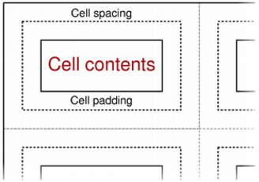

&emsp;&emsp;The `QTextTableFormat` class provides formatting information for tables in a `QTextDocument`.<!--more-->

Header             | Inherits
-------------------|----------
`QTextTableFormat` | `QTextFrameFormat`

**Note**: All functions in this class are reentrant.

### Public Functions

Return                 | Function
-----------------------|---------
                       | `QTextTableFormat()`
`Qt::Alignment`        | `alignment() const`
`qreal`                | `cellPadding() const`
`qreal`                | `cellSpacing() const`
`void`                 | `clearColumnWidthConstraints()`
`QVector<QTextLength>` | `columnWidthConstraints() const`
`int`                  | `columns() const`
`int`                  | `headerRowCount() const`
`bool`                 | `isValid() const`
`void`                 | `setAlignment(Qt::Alignment alignment)`
`void`                 | `setCellPadding(qreal padding)`
`void`                 | `setCellSpacing(qreal spacing)`
`void`                 | `setColumnWidthConstraints(const QVector<QTextLength> & constraints)`
`void`                 | `setHeaderRowCount(int count)`

### Detailed Description

&emsp;&emsp;The `QTextTableFormat` class provides formatting information for tables in a `QTextDocument`.
&emsp;&emsp;A table is a group of cells ordered into rows and columns. Each table contains at least one row and one column. Each cell contains a block. Tables in rich text documents are formatted using the properties defined in this class.
&emsp;&emsp;Tables are horizontally justified within their parent frame according to the table's alignment. This can be read with the `alignment()` function and set with `setAlignment()`.
&emsp;&emsp;Cells within the table are separated by cell spacing. The number of pixels between cells is set with `setCellSpacing()` and read with `cellSpacing()`. The contents of each cell is surrounded by cell padding. The number of pixels between each cell edge and its contents is set with `setCellPadding()` and read with `cellPadding()`.

&emsp;&emsp;The table's background color can be read with the `background()` function, and can be specified with `setBackground()`. The background color of each cell can be set independently, and will control the color of the cell within the padded area.
&emsp;&emsp;The table format also provides a way to constrain the widths of the columns in the table. Columns can be assigned a fixed width, a variable width, or a percentage of the available width. The `columns()` function returns the number of columns with constraints, and the `columnWidthConstraints()` function returns the constraints defined for the table. These quantities can also be set by calling `setColumnWidthConstraints()` with a vector containing new constraints. If no constraints are required, `clearColumnWidthConstraints()` can be used to remove them.

### Member Function Documentation

- `QTextTableFormat::QTextTableFormat()`: Constructs a new table format object.
- `Qt::Alignment QTextTableFormat::alignment() const`: Returns the table's alignment.
- `qreal QTextTableFormat::cellPadding() const`: Returns the table's cell padding. This describes the distance between the border of a cell and its contents.
- `qreal QTextTableFormat::cellSpacing() const`: Returns the table's cell spacing. This describes the distance between adjacent cells.
- `void QTextTableFormat::clearColumnWidthConstraints()`: Clears the column width constraints for the table.
- `QVector<QTextLength> QTextTableFormat::columnWidthConstraints() const`: Returns a list of constraints used by this table format to control the appearance of columns in a table.
- `int QTextTableFormat::columns() const`: Returns the number of columns specified by the table format.
- `int QTextTableFormat::headerRowCount() const`: Returns the number of rows in the table that define the header.
- `bool QTextTableFormat::isValid() const`: Returns true if this table format is valid; otherwise returns false.
- `void QTextTableFormat::setAlignment(Qt::Alignment alignment)`: Sets the table's `alignment`.
- `void QTextTableFormat::setCellPadding(qreal padding)`: Sets the cell `padding` for the table. This determines the distance between the border of a cell and its contents.
- `void QTextTableFormat::setCellSpacing(qreal spacing)`: Sets the cell `spacing` for the table. This determines the distance between adjacent cells.
- `void QTextTableFormat::setColumnWidthConstraints(const QVector<QTextLength> & constraints)`: Sets the column width `constraints` for the table.
- `void QTextTableFormat::setHeaderRowCount(int count)`: Declares the first `count` rows of the table as table header. The table header rows get repeated when a table is broken across a page boundary.