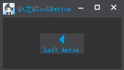
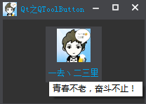

&emsp;&emsp;`QToolButton`类提供了用于命令或选项可以快速访问的按钮，通常可以用在`QToolBar`里面。工具按钮和普通的命令按钮不同，通常不显示文本，而显示图标。<!--more-->

### 详细描述

&emsp;&emsp;当使用`QToolBar::addAction`添加一个新的(或已存在的)`QAction`至工具栏时，工具按钮通常被创建。也可以用同样的方式构建工具按钮和其它部件，并设置它们的布局。
&emsp;&emsp;`QToolButton`支持自动浮起，在自动浮起模式中，只有在鼠标指向它的时候才绘制三维框架。当按钮被用在`QToolBar`里时，这个特征会被自动启用，可以使用`setAutoRaise`来改变。
&emsp;&emsp;按钮的外观和尺寸可通过`setToolButtonStyle`和`setIconSize`来调节。当在`QMainWindow`的`QToolBar`里使用时，按钮会自动地调节来适合`QMainWindow`的设置(参考`QMainWindow::setToolButtonStyle`和`QMainWindow::setIconSize`)。
&emsp;&emsp;工具按钮可以提供一个弹出菜单，使用`setMenu`来进行设置。通过`setPopupMode`来设置菜单的弹出模式，缺省模式是`DelayedPopupMode`，这个特征有时对于网页浏览器中的`后退`按钮有用，在按下按钮一段时间后，会弹出一个显示所有可以后退浏览的可能页面的菜单列表，默认延迟`600`毫秒，可以用`setPopupDelay`进行调整。

### 常用接口

- `void setMenu(QMenu * menu)`：设置按钮的弹出菜单，和`QPushButton`用法类似。
- `void setPopupMode(ToolButtonPopupMode mode)`：设置弹出菜单的方式，默认情况下，设置为`DelayedPopup`(延迟弹出)。枚举`QToolButton::ToolButtonPopupMode`如下：

常量                           | 值  | 描述
-------------------------------|-----|--------
`QToolButton::DelayedPopup`    | `0` | 按下按钮一定时间后(超时风格依赖，参考`QStyle::SH_ToolButton_PopupDelay`)，显示菜单
`QToolButton::MenuButtonPopup` | `1` | 这种模式下，工具按钮显示一个特殊的箭头以指示菜单是否存在，按下按钮的箭头部分时显示菜单
`QToolButton::InstantPopup`    | `2` | 按下工具按钮时菜单显示，无延迟。这种模式下，按钮自身的动作不触发

- `void setToolButtonStyle(Qt::ToolButtonStyle style)`：设置按钮风格，只显示一个图标，文本或文本位于图标旁边、下方。默认值是`Qt::ToolButtonIconOnly`。枚举`Qt::ToolButtonStyle`如下：

常量                           | 值  | 描述
-------------------------------|-----|----
`Qt::ToolButtonIconOnly`       | `0` | 只显示图标
`Qt::ToolButtonTextOnly`       | `1` | 只显示文本
`Qt::ToolButtonTextBesideIcon` | `2` | 文本显示在图标旁边
`Qt::ToolButtonTextUnderIcon`  | `3` | 文本显示在图标下边
`Qt::ToolButtonFollowStyle`    | `4` | 遵循`QStyle::StyleHint`

- `void setArrowType(Qt::ArrowType type)`：设置按钮是否显示一个箭头，而不是一个正常的图标。这将显示一个箭头作为`QToolButton`的图标。默认情况下，这个属性被设置为`Qt::NoArrow`。枚举`Qt::ArrowType`如下：

常量             | 值
-----------------|------
`Qt::NoArrow`    | `0`
`Qt::UpArrow`    | `1`
`Qt::DownArrow`  | `2`
`Qt::LeftArrow`  | `3`
`Qt::RightArrow` | `4`

&emsp;&emsp;效果如下：



``` cpp
QToolButton *pButton = new QToolButton ( this );
pButton->setArrowType ( Qt::LeftArrow );
pButton->setText ( "Left Arrow" );
/* 文本位于图标之下 */
pButton->setToolButtonStyle ( Qt::ToolButtonTextUnderIcon );
pButton->setStyleSheet ( "QToolButton{border: none; background: rgb(68, 69, 73); color: rgb(0, 160, 230);}" );
```

这里可以通过样式表`color`来设置图标的颜色及文本色。

- `void setDefaultAction(QAction * action)`：设置`QAction`，该`action`则会定义`QToolButton`的文本、图标、`TooTip`等按钮的属性。

&emsp;&emsp;效果如下：



``` cpp
QAction *pAction = new QAction ( this );
pAction->setText ( QString::fromLocal8Bit ( "一去丶二三里" ) );
pAction->setIcon ( QIcon ( ":/Images/logo" ) );
pButton->setIconSize ( QSize ( 48, 48 ) );
pAction->setToolTip ( QString::fromLocal8Bit ( "青春不老，奋斗不止！" ) );
pButton->setDefaultAction ( pAction );
pButton->setToolButtonStyle ( Qt::ToolButtonTextUnderIcon );
```