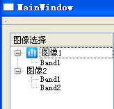
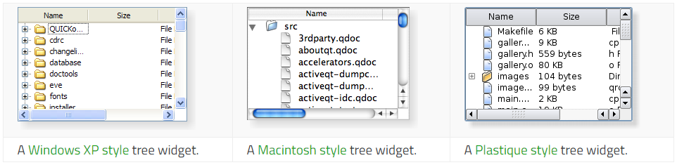

&emsp;&emsp;`Qt`中实现树形结构可以使用`QTreeWidget`类，也可以使用`QTreeView`类，`QTreeWidget`继承自`QTreeView`类，其效果如下：<!--more-->



### 树形结构实现

&emsp;&emsp;`QT`的`GUI`中有`treeWidget`部件，将该控件在`GUI`中布局好，假设其对象名为`treeWidget`。树形结构通过`QTreeWidget`类和`QTreeWidgetItem`类实现，`QTreeWidgetItem`类实现结点的添加。上图代码实现如下：

``` cpp
ui->treeWidget->setColumnCount ( 1 ); /* 设置列数 */
ui->treeWidget->setHeaderLabel ( tr ( "图像选择" ) ); /* 设置头的标题 */

QTreeWidgetItem *imageItem1 = new QTreeWidgetItem ( ui->treeWidget, QStringList ( QString ( "图像1" ) ) );
imageItem1->setIcon ( 0, QIcon ( "xxx.png" ) );
QTreeWidgetItem *imageItem1_1 = new QTreeWidgetItem ( imageItem1, QStringList ( QString ( "Band1" ) ) ); /* 子节点1 */
imageItem1->addChild ( imageItem1_1 ); /* 添加子节点 */

QTreeWidgetItem *imageItem2 = new QTreeWidgetItem ( ui->treeWidget, QStringList ( QString ( "图像2" ) ) );
QTreeWidgetItem *imageItem2_1 = new QTreeWidgetItem ( imageItem2, QStringList ( QString ( "Band1" ) ) ); /* 子节点1 */
QTreeWidgetItem *imageItem2_2 = new QTreeWidgetItem ( imageItem2, QStringList ( QString ( "Band2" ) ) ); /* 子节点2 */
imageItem2->addChild ( imageItem2_1 ); /* 添加子节点 */
imageItem2->addChild ( imageItem2_2 );

ui->treeWidget->expandAll(); /* 结点全部展开 */
```

&emsp;&emsp;除了使用上面这种方法之外，还可以使用`QList<QTreeWidgetItem *> & items`实现结点的添加：

``` cpp
QList<QTreeWidgetItem *> rootList;

QTreeWidgetItem *imageItem1 = new QTreeWidgetItem; /* 添加第一个父节点 */
imageItem1->setText ( 0, tr ( "图像1" ) );
rootList.append ( imageItem1 );

QTreeWidgetItem *imageItem1_1 = new QTreeWidgetItem ( imageItem1, QStringList ( QString ( "Band1" ) ) ); /* 添加子节点 */
imageItem1->addChild ( imageItem1_1 );

QTreeWidgetItem *imageItem2 = new QTreeWidgetItem; /* 添加第二个父节点 */
imageItem2->setText ( 0, tr ( "图像2" ) );
rootList.append ( imageItem2 );

QTreeWidgetItem *imageItem2_1 = new QTreeWidgetItem ( imageItem2, QStringList ( QString ( "Band1" ) ) ); /* 添加子节点 */
QTreeWidgetItem *imageItem2_2 = new QTreeWidgetItem ( imageItem2, QStringList ( QString ( "Band2" ) ) );
imageItem2->addChild ( imageItem2_1 );
imageItem2->addChild ( imageItem2_2 );

ui->treeWidget->insertTopLevelItems ( 0, rootList ); /* 将结点插入部件中 */

ui->treeWidget->expandAll(); /* 全部展开 */
```

### 点击节点的事件响应

&emsp;&emsp;首先想到有没有点击某个节点的信号，查看文档后发现有一个`void itemClicked ( QTreeWidgetItem * item, int column )`信号，它是双击某个节点的信号。将该信号与某个自定义槽相连，当双击节点时触发槽函数。第一个参数为点击的`QTreeWidgetItem`类对象，第二个参数为节点所在列号。

``` cpp
private slots:
    void showSelectedImage ( QTreeWidgetItem *item, int column ); /* 点击树节点事件 */

connect ( ui->treeWidget, SIGNAL ( itemDoubleClicked ( QTreeWidgetItem *, int ) ), \
          this, SLOT ( showSelectedImage ( QTreeWidgetItem *, int ) ) );

void MainWindow::showSelectedImage ( QTreeWidgetItem *item, int column ) {
}
```

---

&emsp;&emsp;The `QTreeWidget` class provides a tree view that uses a predefined tree model.

Header        | Inherits
--------------|----------
`QTreeWidget` | `QTreeView`

### Public Functions

Return                     | Function
---------------------------|---------
                           | `QTreeWidget(QWidget * parent = 0)`
                           | `~QTreeWidget()`
`void`                     | `addTopLevelItem(QTreeWidgetItem * item)`
`void`                     | `addTopLevelItems(const QList<QTreeWidgetItem *> & items)`
`void`                     | `closePersistentEditor(QTreeWidgetItem * item, int column = 0)`
`int`                      | `columnCount() const`
`int`                      | `currentColumn() const`
`QTreeWidgetItem *`        | `currentItem() const`
`void`                     | `editItem(QTreeWidgetItem * item, int column = 0)`
`QList<QTreeWidgetItem *>` | `findItems(const QString & text, Qt::MatchFlags flags, int column = 0) const`
`QTreeWidgetItem *`        | `headerItem() const`
`int`                      | `indexOfTopLevelItem(QTreeWidgetItem * item) const`
`void`                     | `insertTopLevelItem(int index, QTreeWidgetItem * item)`
`void`                     | `insertTopLevelItems(int index, const QList<QTreeWidgetItem *> & items)`
`QTreeWidgetItem *`        | `invisibleRootItem() const`
`bool`                     | `isFirstItemColumnSpanned(const QTreeWidgetItem * item) const`
`QTreeWidgetItem *`        | `itemAbove(const QTreeWidgetItem * item) const`
`QTreeWidgetItem *`        | `itemAt(const QPoint & p) const`
`QTreeWidgetItem *`        | `itemAt(int x, int y) const`
`QTreeWidgetItem *`        | `itemBelow(const QTreeWidgetItem * item) const`
`QWidget *`                | `itemWidget(QTreeWidgetItem * item, int column) const`
`void`                     | `openPersistentEditor(QTreeWidgetItem * item, int column = 0)`
`void`                     | `removeItemWidget(QTreeWidgetItem * item, int column)`
`QList<QTreeWidgetItem *>` | `selectedItems() const`
`void`                     | `setColumnCount(int columns)`
`void`                     | `setCurrentItem(QTreeWidgetItem * item)`
`void`                     | `setCurrentItem(QTreeWidgetItem * item, int column)`
`void`                     | `setCurrentItem(QTreeWidgetItem * item, int column, QItemSelectionModel::SelectionFlags command)`
`void`                     | `setFirstItemColumnSpanned(const QTreeWidgetItem * item, bool span)`
`void`                     | `setHeaderItem(QTreeWidgetItem * item)`
`void`                     | `setHeaderLabel(const QString & label)`
`void`                     | `setHeaderLabels(const QStringList & labels)`
`void`                     | `setItemWidget(QTreeWidgetItem * item, int column, QWidget * widget)`
`int`                      | `sortColumn() const`
`void`                     | `sortItems(int column, Qt::SortOrder order)`
`QTreeWidgetItem *`        | `takeTopLevelItem(int index)`
`QTreeWidgetItem *`        | `topLevelItem(int index) const`
`int`                      | `topLevelItemCount() const`
`QRect`                    | `visualItemRect(const QTreeWidgetItem * item) const`

### Reimplemented Public Functions

- `virtual void setSelectionModel(QItemSelectionModel * selectionModel)`

### Public Slots

Return | Function
-------|---------
`void` | `clear()`
`void` | `collapseItem(const QTreeWidgetItem * item)`
`void` | `expandItem(const QTreeWidgetItem * item)`
`void` | `scrollToItem(const QTreeWidgetItem * item, QAbstractItemView::ScrollHint hint = EnsureVisible)`

### Signals

Return | Function
-------|---------
`void` | `currentItemChanged(QTreeWidgetItem * current, QTreeWidgetItem * previous)`
`void` | `itemActivated(QTreeWidgetItem * item, int column)`
`void` | `itemChanged(QTreeWidgetItem * item, int column)`
`void` | `itemClicked(QTreeWidgetItem * item, int column)`
`void` | `itemCollapsed(QTreeWidgetItem * item)`
`void` | `itemDoubleClicked(QTreeWidgetItem * item, int column)`
`void` | `itemEntered(QTreeWidgetItem * item, int column)`
`void` | `itemExpanded(QTreeWidgetItem * item)`
`void` | `itemPressed(QTreeWidgetItem * item, int column)`
`void` | `itemSelectionChanged()`

### Protected Functions

Return                    | Function
--------------------------|----------
`virtual bool`            | `dropMimeData(QTreeWidgetItem * parent, int index, const QMimeData * data, Qt::DropAction action)`
`QModelIndex`             | `indexFromItem(QTreeWidgetItem * item, int column = 0) const`
`QTreeWidgetItem *`       | `itemFromIndex(const QModelIndex & index) const`
`virtual QMimeData *`     | `mimeData(const QList<QTreeWidgetItem *> items) const`
`virtual QStringList`     | `mimeTypes() const`
`virtual Qt::DropActions` | `supportedDropActions() const`

### Reimplemented Protected Functions

Return         | Function
---------------|----------
`virtual void` | `dropEvent(QDropEvent * event)`
`virtual bool` | `event(QEvent * e)`

### Detailed Description

&emsp;&emsp;The `QTreeWidget` class provides a tree view that uses a predefined tree model.
&emsp;&emsp;The `QTreeWidget` class is a convenience class that provides a standard tree widget with a classic `item-based` interface similar to that used by the `QListView` class in `Qt 3`. This class is based on `Qt's` `Model/View` architecture and uses a default model to hold items, each of which is a `QTreeWidgetItem`.
&emsp;&emsp;Developers who do not need the flexibility of the `Model/View` framework can use this class to create simple hierarchical lists very easily. A more flexible approach involves combining a `QTreeView` with a standard item model. This allows the storage of data to be separated from its representation.
&emsp;&emsp;In its simplest form, a tree widget can be constructed in the following way:

``` cpp
QTreeWidget *treeWidget = new QTreeWidget();
treeWidget->setColumnCount ( 1 );
QList<QTreeWidgetItem *> items;

for ( int i = 0; i < 10; ++i ) {
    items.append ( new QTreeWidgetItem ( ( QTreeWidget * ) 0, QStringList ( QString ( "item: %1" ).arg ( i ) ) ) );
}

treeWidget->insertTopLevelItems ( 0, items );
```

&emsp;&emsp;Before items can be added to the tree widget, the number of columns must be set with `setColumnCount()`. This allows each item to have one or more labels or other decorations. The number of columns in use can be found with the `columnCount()` function.
&emsp;&emsp;The tree can have a header that contains a section for each column in the widget. It is easiest to set up the labels for each section by supplying a list of strings with `setHeaderLabels()`, but a custom header can be constructed with a `QTreeWidgetItem` and inserted into the tree with the `setHeaderItem()` function.
&emsp;&emsp;The items in the tree can be sorted by column according to a predefined sort order. If sorting is enabled, the user can sort the items by clicking on a column header. Sorting can be enabled or disabled by calling `setSortingEnabled()`. The `isSortingEnabled()` function indicates whether sorting is enabled.



### Property Documentation

- `columnCount : int`: This property holds the number of columns displayed in the tree widget. By default, this property has a value of `1`. Access functions:

``` cpp
int columnCount() const
void setColumnCount(int columns)
```

- `topLevelItemCount : const int`: This property holds the number of `top-level` items. By default, this property has a value of `0`. Access functions:

``` cpp
int topLevelItemCount() const
```

### Member Function Documentation

- `QTreeWidget::QTreeWidget(QWidget * parent = 0)`: Constructs a tree widget with the given `parent`.
- `QTreeWidget::~QTreeWidget()`: Destroys the tree widget and all its items.
- `void QTreeWidget::addTopLevelItem(QTreeWidgetItem * item)`: Appends the `item` as a `top-level` item in the widget.
- `void QTreeWidget::addTopLevelItems(const QList<QTreeWidgetItem *> & items)`: Appends the list of `items` as a `top-level` items in the widget.
- `void QTreeWidget::clear() [slot]`: Clears the tree widget by removing all of its items and selections. **Note**: Since each item is removed from the tree widget before being deleted, the return value of `QTreeWidgetItem::treeWidget()` will be invalid when called from an item's destructor.
- `void QTreeWidget::closePersistentEditor(QTreeWidgetItem * item, int column = 0)`: Closes the persistent editor for the `item` in the given `column`. This function has no effect if no persistent editor is open for this combination of `item` and `column`.
- `void QTreeWidget::collapseItem(const QTreeWidgetItem * item) [slot]`: Closes the `item`. This causes the tree containing the item's children to be collapsed.
- `int QTreeWidget::currentColumn() const`: Returns the current column in the tree widget.
- `QTreeWidgetItem * QTreeWidget::currentItem() const`: Returns the current item in the tree widget.
- `void QTreeWidget::currentItemChanged(QTreeWidgetItem * current, QTreeWidgetItem * previous) [signal]`: This signal is emitted when the current item changes. The current item is specified by `current`, and this replaces the `previous` current item.
- `void QTreeWidget::dropEvent(QDropEvent * event) [virtual protected]`: Reimplemented from `QWidget::dropEvent()`.
- `bool QTreeWidget::dropMimeData(QTreeWidgetItem * parent, int index, const QMimeData * data, Qt::DropAction action) [virtual protected]`: Handles the `data` supplied by a drag and drop operation that ended with the given `action` in the `index` in the given `parent` item. The default implementation returns `true` if the drop was successfully handled by decoding the mime data and inserting it into the model; otherwise it returns `false`.
- `void QTreeWidget::editItem(QTreeWidgetItem * item, int column = 0)`: Starts editing the `item` in the given `column` if it is editable.
- `bool QTreeWidget::event(QEvent * e) [virtual protected]`: Reimplemented from `QObject::event()`.
- `void QTreeWidget::expandItem(const QTreeWidgetItem * item) [slot]`: Expands the `item`. This causes the tree containing the item's children to be expanded.
- `QList<QTreeWidgetItem *> QTreeWidget::findItems(const QString & text, Qt::MatchFlags flags, int column = 0) const`: Returns a list of items that match the given `text`, using the given `flags`, in the given `column`.
- `QTreeWidgetItem * QTreeWidget::headerItem() const`: Returns the item used for the tree widget's header.
- `QModelIndex QTreeWidget::indexFromItem(QTreeWidgetItem * item, int column = 0) const [protected]`: Returns the QModelIndex assocated with the given `item` in the given `column`.
- `int QTreeWidget::indexOfTopLevelItem(QTreeWidgetItem * item) const`: Returns the index of the given `top-level` `item`, or `-1` if the `item` cannot be found.
- `void QTreeWidget::insertTopLevelItem(int index, QTreeWidgetItem * item)`: Inserts the `item` at index in the top level in the view. If the `item` has already been inserted somewhere else it wont be inserted.
- `void QTreeWidget::insertTopLevelItems(int index, const QList<QTreeWidgetItem *> & items)`: Inserts the list of `items` at index in the top level in the view. Items that have already been inserted somewhere else wont be inserted.
- `QTreeWidgetItem * QTreeWidget::invisibleRootItem() const`: Returns the tree widget's invisible root item. The invisible root item provides access to the tree widget's `top-level` items through the `QTreeWidgetItem` `API`, making it possible to write functions that can treat `top-level` items and their children in a uniform way; for example, recursive functions.
- `bool QTreeWidget::isFirstItemColumnSpanned(const QTreeWidgetItem * item) const`: Returns true if the given `item` is set to show only one section over all columns; otherwise returns false.
- `QTreeWidgetItem * QTreeWidget::itemAbove(const QTreeWidgetItem * item) const`: Returns the item above the given `item`.
- `void QTreeWidget::itemActivated(QTreeWidgetItem * item, int column) [signal]`: This signal is emitted when the user activates an `item` by `single-` or `double-clicking` (depending on the platform, i.e. on the `QStyle::SH_ItemView_ActivateItemOnSingleClick` style hint) or pressing a special key (e.g., Enter). The specified `item` is the item that was clicked, or `0` if no item was clicked. The `column` is the item's column that was clicked, or `-1` if no item was clicked.
- `QTreeWidgetItem * QTreeWidget::itemAt(const QPoint & p) const`: Returns a pointer to the item at the coordinates `p`. The coordinates are relative to the tree widget's `viewport()`.
- `QTreeWidgetItem * QTreeWidget::itemAt(int x, int y) const`: This is an overloaded function. Returns a pointer to the item at the coordinates `(x, y)`. The coordinates are relative to the tree widget's `viewport()`.
- `QTreeWidgetItem * QTreeWidget::itemBelow(const QTreeWidgetItem * item) const`: Returns the item visually below the given `item`.
- `void QTreeWidget::itemChanged(QTreeWidgetItem * item, int column) [signal]`: This signal is emitted when the contents of the `column` in the specified `item` changes.
- `void QTreeWidget::itemClicked(QTreeWidgetItem * item, int column) [signal]`: This signal is emitted when the user clicks inside the widget. The specified `item` is the item that was clicked. The `column` is the item's column that was clicked. If no item was clicked, no signal will be emitted.
- `void QTreeWidget::itemCollapsed(QTreeWidgetItem * item) [signal]`: This signal is emitted when the specified `item` is collapsed so that none of its children are displayed. **Note**: This signal will not be emitted if an item changes its state when `collapseAll()` is invoked.
- `void QTreeWidget::itemDoubleClicked(QTreeWidgetItem * item, int column) [signal]`: This signal is emitted when the user double clicks inside the widget. The specified `item` is the item that was clicked, or 0 if no item was clicked. The `column` is the item's column that was clicked. If no item was double clicked, no signal will be emitted.
- `void QTreeWidget::itemEntered(QTreeWidgetItem * item, int column) [signal]`: This signal is emitted when the mouse cursor enters an `item` over the specified `column`. `QTreeWidget` mouse tracking needs to be enabled for this feature to work.
- `void QTreeWidget::itemExpanded(QTreeWidgetItem * item) [signal]`: This signal is emitted when the specified `item` is expanded so that all of its children are displayed. **Note**: This signal will not be emitted if an item changes its state when `expandAll()` is invoked.
- `QTreeWidgetItem * QTreeWidget::itemFromIndex(const QModelIndex & index) const [protected]`: Returns a pointer to the `QTreeWidgetItem` assocated with the given `index`.
- `void QTreeWidget::itemPressed(QTreeWidgetItem * item, int column) [signal]`: This signal is emitted when the user presses a mouse button inside the widget. The specified `item` is the item that was clicked, or `0` if no item was clicked. The `column` is the item's column that was clicked, or `-1` if no item was clicked.
- `void QTreeWidget::itemSelectionChanged() [signal]`: This signal is emitted when the selection changes in the tree widget. The current selection can be found with `selectedItems()`.
- `QWidget * QTreeWidget::itemWidget(QTreeWidgetItem * item, int column) const`: Returns the widget displayed in the cell specified by `item` and the given `column`. **Note**: The tree takes ownership of the widget.
- `QMimeData * QTreeWidget::mimeData(const QList<QTreeWidgetItem *> items) const [virtual protected]`: Returns an object that contains a serialized description of the specified `items`. The format used to describe the items is obtained from the `mimeTypes()` function. If the list of `items` is empty, `0` is returned rather than a serialized empty list.
- `QStringList QTreeWidget::mimeTypes() const [virtual protected]`: Returns a list of `MIME` types that can be used to describe a list of treewidget items.
- `void QTreeWidget::openPersistentEditor(QTreeWidgetItem * item, int column = 0)`: Opens a persistent editor for the `item` in the given `column`.
- `void QTreeWidget::removeItemWidget(QTreeWidgetItem * item, int column)`: Removes the widget set in the given `item` in the given `column`.
- `void QTreeWidget::scrollToItem(const QTreeWidgetItem * item, QAbstractItemView::ScrollHint hint = EnsureVisible) [slot]`: Ensures that the `item` is visible, scrolling the view if necessary using the specified `hint`.
- `QList<QTreeWidgetItem *> QTreeWidget::selectedItems() const`: Returns a list of all selected `non-hidden` items.
- `void QTreeWidget::setCurrentItem(QTreeWidgetItem * item)`: Sets the current `item` in the tree widget. Unless the selection mode is `NoSelection`, the item is also be selected.
- `void QTreeWidget::setCurrentItem(QTreeWidgetItem * item, int column)`: Sets the current `item` in the tree widget and the current column to `column`.
- `void QTreeWidget::setCurrentItem(QTreeWidgetItem * item, int column, QItemSelectionModel::SelectionFlags command)`: Sets the current `item` in the tree widget and the current column to `column`, using the given `command`.
- `void QTreeWidget::setFirstItemColumnSpanned(const QTreeWidgetItem * item, bool span)`: Sets the given `item` to only show one section for all columns if `span` is `true`; otherwise the item will show one section per column.
- `void QTreeWidget::setHeaderItem(QTreeWidgetItem * item)`: Sets the header `item` for the tree widget. The label for each column in the header is supplied by the corresponding label in the item. The tree widget takes ownership of the item.
- `void QTreeWidget::setHeaderLabel(const QString & label)`: Same as `setHeaderLabels(QStringList(label))`.
- `void QTreeWidget::setHeaderLabels(const QStringList & labels)`: Adds a column in the header for each item in the `labels` list, and sets the label for each column. Note that `setHeaderLabels()` won't remove existing columns.
- `void QTreeWidget::setItemWidget(QTreeWidgetItem * item, int column, QWidget * widget)`: Sets the given `widget` to be displayed in the cell specified by the given `item` and `column`. The given widget's `autoFillBackground` property must be set to `true`, otherwise the widget's background will be transparent, showing both the model data and the tree widget item. This function should only be used to display static content in the place of a tree widget item. If you want to display custom dynamic content or implement a custom editor widget, use `QTreeView` and subclass `QItemDelegate` instead. This function cannot be called before the item hierarchy has been set up, i.e., the `QTreeWidgetItem` that will hold widget must have been added to the view before widget is set. **Note**: The tree takes ownership of the widget.
- `void QTreeWidget::setSelectionModel(QItemSelectionModel * selectionModel) [virtual]`: Reimplemented from `QAbstractItemView::setSelectionModel()`.
- `int QTreeWidget::sortColumn() const`: Returns the column used to sort the contents of the widget.
- `void QTreeWidget::sortItems(int column, Qt::SortOrder order)`: Sorts the items in the widget in the specified `order` by the values in the given `column`.
- `Qt::DropActions QTreeWidget::supportedDropActions() const [virtual protected]`: Returns the drop actions supported by this view.
- `QTreeWidgetItem * QTreeWidget::takeTopLevelItem(int index)`: Removes the `top-level` item at the given `index` in the tree and returns it, otherwise returns `0`.
- `QTreeWidgetItem * QTreeWidget::topLevelItem(int index) const`: Returns the top level item at the given `index`, or `0` if the item does not exist.
- `QRect QTreeWidget::visualItemRect(const QTreeWidgetItem * item) const`: Returns the rectangle on the viewport occupied by the item at `item`.