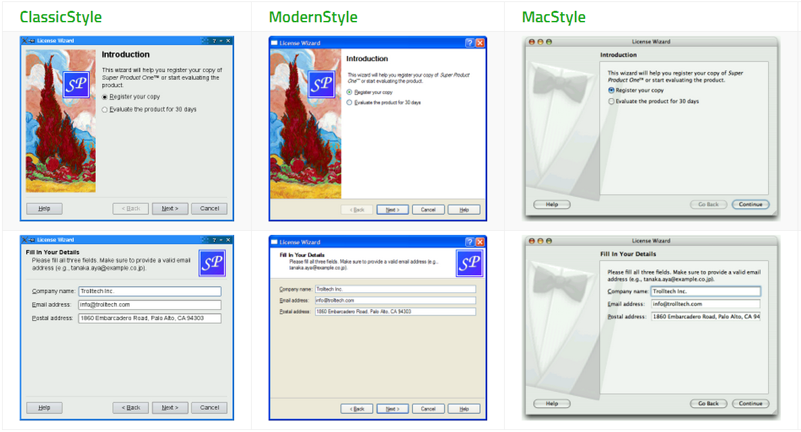
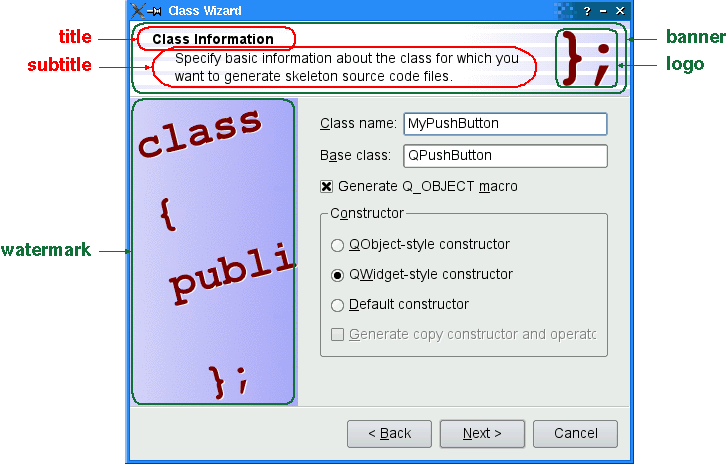
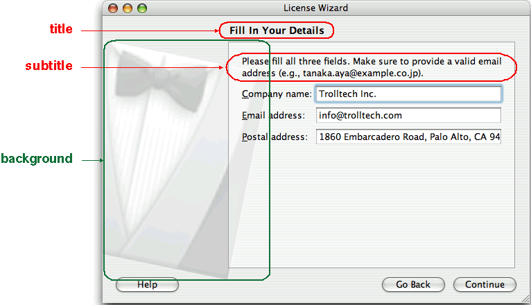
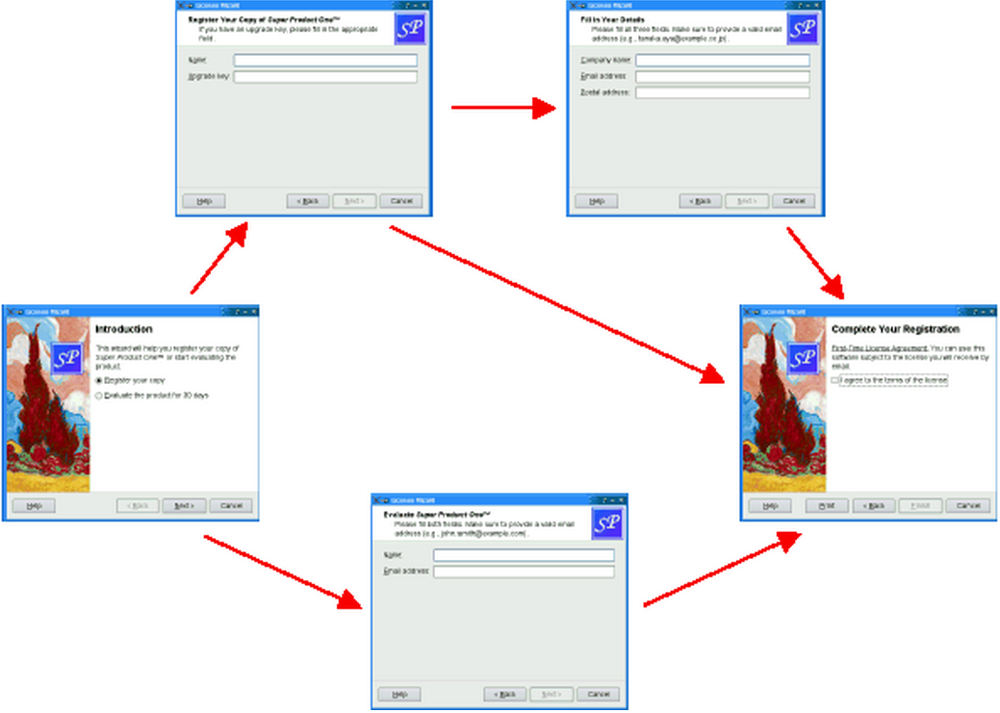

&emsp;&emsp;The `QWizard` class provides a framework for wizards.<!--more-->

Header    | Inherits
----------|---------
`QWizard` | `QDialog`

### Public Functions

Return              | Function
--------------------|---------
                    | `QWizard(QWidget * parent = 0, Qt::WindowFlags flags = 0)`
                    | `~QWizard()`
`int`               | `addPage(QWizardPage * page)`
`QAbstractButton *` | `button(WizardButton which) const`
`QString`           | `buttonText(WizardButton which) const`
`int`               | `currentId() const`
`QWizardPage *`     | `currentPage() const`
`QVariant`          | `field(const QString & name) const`
`bool`              | `hasVisitedPage(int id) const`
`virtual int`       | `nextId() const`
`WizardOptions`     | `options() const`
`QWizardPage *`     | `page(int id) const`
`QList<int>`        | `pageIds() const`
`QPixmap`           | `pixmap(WizardPixmap which) const`
`void`              | `removePage(int id)`
`void`              | `setButton(WizardButton which, QAbstractButton * button)`
`void`              | `setButtonLayout(const QList<WizardButton> & layout)`
`void`              | `setButtonText(WizardButton which, const QString & text)`
`void`              | `setDefaultProperty(const char * className, const char * property, const char * changedSignal)`
`void`              | `setField(const QString & name, const QVariant & value)`
`void`              | `setOption(WizardOption option, bool on = true)`
`void`              | `setOptions(WizardOptions options)`
`void`              | `setPage(int id, QWizardPage * page)`
`void`              | `setPixmap(WizardPixmap which, const QPixmap & pixmap)`
`void`              | `setSideWidget(QWidget * widget)`
`void`              | `setStartId(int id)`
`void`              | `setSubTitleFormat(Qt::TextFormat format)`
`void`              | `setTitleFormat(Qt::TextFormat format)`
`void`              | `setWizardStyle(WizardStyle style)`
`QWidget *`         | `sideWidget() const`
`int`               | `startId() const`
`Qt::TextFormat`    | `subTitleFormat() const`
`bool`              | `testOption(WizardOption option) const`
`Qt::TextFormat`    | `titleFormat() const`
`virtual bool`      | `validateCurrentPage()`
`QList<int>`        | `visitedPages() const`
`WizardStyle`       | `wizardStyle() const`

### Reimplemented Public Functions

Return          | Function
----------------|---------
`virtual void`  | `setVisible(bool visible)`
`virtual QSize` | `sizeHint() const`

### Public Slots

Return | Function
-------|---------
`void` | `back()`
`void` | `next()`
`void` | `restart()`

### Signals

Return | Function
-------|---------
`void` | `currentIdChanged(int id)`
`void` | `customButtonClicked(int which)`
`void` | `helpRequested()`
`void` | `pageAdded(int id)`
`void` | `pageRemoved(int id)`

### Protected Functions

Return         | Function
---------------|---------
`virtual void` | `cleanupPage(int id)`
`virtual void` | `initializePage(int id)`

### Reimplemented Protected Functions

Return         | Function
---------------|---------
`virtual void` | `done(int result)`
`virtual bool` | `event(QEvent * event)`
`virtual void` | `paintEvent(QPaintEvent * event)`
`virtual void` | `resizeEvent(QResizeEvent * event)`
`virtual bool` | `winEvent(MSG * message, long * result)`

### Detailed Description

&emsp;&emsp;The `QWizard` class provides a framework for wizards.
&emsp;&emsp;A wizard (also called an assistant on `Mac OS X`) is a special type of input dialog that consists of a sequence of pages. A wizard's purpose is to guide the user through a process step by step. Wizards are useful for complex or infrequent tasks that users may find difficult to learn.
&emsp;&emsp;`QWizard` inherits `QDialog` and represents a wizard. Each page is a `QWizardPage` (a `QWidget` subclass). To create your own wizards, you can use these classes directly, or you can subclass them for more control.
&emsp;&emsp;Topics: A Trivial Example. The following example illustrates how to create wizard pages and add them to a wizard.

``` cpp
QWizardPage *createIntroPage() {
    QWizardPage *page = new QWizardPage;
    page->setTitle ( "Introduction" );
    QLabel *label = new QLabel ( "This wizard will help you register your copy "
                                 "of Super Product Two." );
    label->setWordWrap ( true );
    QVBoxLayout *layout = new QVBoxLayout;
    layout->addWidget ( label );
    page->setLayout ( layout );
    return page;
}

QWizardPage *createRegistrationPage() {
    ...
}

QWizardPage *createConclusionPage() {
    ...
}

int main ( int argc, char *argv[] ) {
    QApplication app ( argc, argv );
    QString translatorFileName = QLatin1String ( "qt_" );
    translatorFileName += QLocale::system().name();
    QTranslator *translator = new QTranslator ( &app );

    if ( translator->load ( translatorFileName, QLibraryInfo::location ( QLibraryInfo::TranslationsPath ) ) ) {
        app.installTranslator ( translator );
    }

    QWizard wizard;
    wizard.addPage ( createIntroPage() );
    wizard.addPage ( createRegistrationPage() );
    wizard.addPage ( createConclusionPage() );
    wizard.setWindowTitle ( "Trivial Wizard" );
#ifdef Q_OS_SYMBIAN
    wizard.showMaximized();
#else
    wizard.show();
#endif
    return app.exec();
}
```

### Wizard Look and Feel

&emsp;&emsp;`QWizard` supports four wizard looks:

- `ClassicStyle`
- `ModernStyle`
- `MacStyle`
- `AeroStyle`

&emsp;&emsp;You can explicitly set the look to use using `setWizardStyle()` (e.g., if you want the same look on all platforms).



&emsp;&emsp;**Note**: `AeroStyle` has effect only on a `Windows Vista system` with alpha compositing enabled. `ModernStyle` is used as a fallback when this condition is not met.
&emsp;&emsp;In addition to the wizard style, there are several options that control the look and feel of the wizard. These can be set using `setOption()` or `setOptions()`. For example, `HaveHelpButton` makes `QWizard` show a Help button along with the other wizard buttons.
&emsp;&emsp;You can even change the order of the wizard buttons to any arbitrary order using `setButtonLayout()`, and you can add up to three custom buttons (e.g., a `Print` button) to the button row. This is achieved by calling `setButton()` or `setButtonText()` with `CustomButton1`, `CustomButton2` or `CustomButton3` to set up the button, and by enabling the `HaveCustomButton1`, `HaveCustomButton2` or `HaveCustomButton3` options. Whenever the user clicks a custom button, `customButtonClicked()` is emitted.

``` cpp
wizard()->setButtonText ( QWizard::CustomButton1, tr ( "&Print" ) );
wizard()->setOption ( QWizard::HaveCustomButton1, true );
connect ( wizard(), SIGNAL ( customButtonClicked ( int ) ), this, SLOT ( printButtonClicked() ) );
```

### Elements of a Wizard Page

&emsp;&emsp;Wizards consist of a sequence of `QWizardPages`. At any time, only one page is shown. A page has the following attributes:

- A title.
- A subTitle.
- A set of pixmaps, which may or may not be honored, depending on the wizard's style:

1. `WatermarkPixmap` (used by `ClassicStyle` and `ModernStyle`)
2. `BannerPixmap` (used by `ModernStyle`)
3. `LogoPixmap` (used by `ClassicStyle` and `ModernStyle`)
4. `BackgroundPixmap` (used by `MacStyle`)

&emsp;&emsp;The diagram belows shows how `QWizard` renders these attributes, assuming they are all present and `ModernStyle` is used:



&emsp;&emsp;When a `subTitle` is set, `QWizard` displays it in a header, in which case it also uses the `BannerPixmap` and the `LogoPixmap` to decorate the header. The `WatermarkPixmap` is displayed on the left side, below the header. At the bottom, there is a row of buttons allowing the user to navigate through the pages.
&emsp;&emsp;The page itself (the `QWizardPage` widget) occupies the area between the header, the watermark, and the button row. Typically, the page is a `QWizardPage` on which a `QGridLayout` is installed, with standard child widgets (`QLabels`, `QLineEdits`, etc.).
&emsp;&emsp;If the wizard's style is `MacStyle`, the page looks radically different:



&emsp;&emsp;The watermark, banner, and logo pixmaps are ignored by the `MacStyle`. If the `BackgroundPixmap` is set, it is used as the background for the wizard; otherwise, a default `assistant` image is used.
&emsp;&emsp;The title and subtitle are set by calling `QWizardPage::setTitle()` and `QWizardPage::setSubTitle()` on the individual pages. They may be plain text or `HTML`. The pixmaps can be set globally for the entire wizard using `setPixmap()`, or on a `per-page` basis using `QWizardPage::setPixmap()`.

### Registering and Using Fields

&emsp;&emsp;In many wizards, the contents of a page may affect the default values of the fields of a later page. To make it easy to communicate between pages, `QWizard` supports a `field` mechanism that allows you to register a field (e.g., a `QLineEdit`) on a page and to access its value from any page. It is also possible to specify mandatory fields (i.e., fields that must be filled before the user can advance to the next page).
&emsp;&emsp;To register a field, call `QWizardPage::registerField()` field.

``` cpp
ClassInfoPage::ClassInfoPage ( QWidget *parent ) : QWizardPage ( parent ) {
    ...
    classNameLabel = new QLabel ( tr ( "&Class name:" ) );
    classNameLineEdit = new QLineEdit;
    classNameLabel->setBuddy ( classNameLineEdit );
    baseClassLabel = new QLabel ( tr ( "B&ase class:" ) );
    baseClassLineEdit = new QLineEdit;
    baseClassLabel->setBuddy ( baseClassLineEdit );
    qobjectMacroCheckBox = new QCheckBox ( tr ( "Generate Q_OBJECT &macro" ) );
    registerField ( "className*", classNameLineEdit );
    registerField ( "baseClass", baseClassLineEdit );
    registerField ( "qobjectMacro", qobjectMacroCheckBox );
    ...
}
```

&emsp;&emsp;The above code registers three fields, `className`, `baseClass`, and `qobjectMacro`, which are associated with three child widgets. The asterisk (`*`) next to `className` denotes a mandatory field.
&emsp;&emsp;The fields of any page are accessible from any other page.

``` cpp
void OutputFilesPage::initializePage() {
    QString className = field ( "className" ).toString();
    headerLineEdit->setText ( className.toLower() + ".h" );
    implementationLineEdit->setText ( className.toLower() + ".cpp" );
    outputDirLineEdit->setText ( QDir::convertSeparators ( QDir::tempPath() ) );
}
```

&emsp;&emsp;Here, we call `QWizardPage::field()` to access the contents of the `className` field (which was defined in the `ClassInfoPage`) and use it to initialize the `OuputFilePage`. The field's contents is returned as a `QVariant`.
&emsp;&emsp;When we create a field using `QWizardPage::registerField()`, we pass a unique field name and a widget. We can also provide a `Qt` property name and a `changed` signal (a signal that is emitted when the property changes) as third and fourth arguments; however, this is not necessary for the most common `Qt` widgets, such as `QLineEdit`, `QCheckBox` and `QComboBox`, because `QWizard` knows which properties to look for.
&emsp;&emsp;If an asterisk (`*`) is appended to the name when the property is registered, the field is a mandatory field. When a page has mandatory fields, the `Next` and/or `Finish` buttons are enabled only when all mandatory fields are filled.
&emsp;&emsp;To consider a field `filled`, `QWizard` simply checks that the field's current value doesn't equal the original value (the value it had when `initializePage()` was called). For `QLineEdit` and `QAbstractSpinBox` subclasses, `QWizard` also checks that `hasAcceptableInput()` returns `true`, to honor any validator or mask.
&emsp;&emsp;`QWizard's` mandatory field mechanism is provided for convenience. A more powerful (but also more cumbersome) alternative is to reimplement `QWizardPage::isComplete()` and to emit the `QWizardPage::completeChanged()` signal whenever the page becomes complete or incomplete.
&emsp;&emsp;The `enabled/disabled` state of the `Next` and/or `Finish` buttons is one way to perform validation on the user input. Another way is to reimplement `validateCurrentPage()` (or `QWizardPage::validatePage()`) to perform some `last-minute` validation (and show an error message if the user has entered incomplete or invalid information). If the function returns `true`, the next page is shown (or the wizard finishes); otherwise, the current page stays up.

### Creating Linear Wizards

&emsp;&emsp;Most wizards have a linear structure, with `page 1` followed by `page 2` and so on until the last page. The `Class Wizard` example is such a wizard. With `QWizard`, linear wizards are created by instantiating the `QWizardPages` and inserting them using `addPage()`. By default, the pages are shown in the order in which they were added.

``` cpp
ClassWizard::ClassWizard ( QWidget *parent ) : QWizard ( parent ) {
    addPage ( new IntroPage );
    addPage ( new ClassInfoPage );
    addPage ( new CodeStylePage );
    addPage ( new OutputFilesPage );
    addPage ( new ConclusionPage );
    ...
}
```

&emsp;&emsp;When a page is about to be shown, `QWizard` calls `initializePage()` (which in turn calls `QWizardPage::initializePage()`) to fill the page with default values. By default, this function does nothing, but it can be reimplemented to initialize the page's contents based on other pages' fields.
&emsp;&emsp;If the user presses `Back`, `cleanupPage()` is called (which in turn calls `QWizardPage::cleanupPage()`). The default implementation resets the page's fields to their original values (the values they had before `initializePage()` was called). If you want the `Back` button to be `non-destructive` and keep the values entered by the user, simply enable the `IndependentPages` option.

### Creating Non-Linear Wizards

&emsp;&emsp;Some wizards are more complex in that they allow different traversal paths based on the information provided by the user. The `License Wizard` example illustrates this. It provides five wizard pages; depending on which options are selected, the user can reach different pages.



&emsp;&emsp;In complex wizards, pages are identified by `IDs`. These `IDs` are typically defined using an enum.

``` cpp
class LicenseWizard : public QWizard {
    ...
    enum { Page_Intro, Page_Evaluate, Page_Register, Page_Details, Page_Conclusion };
    ...
};
```

&emsp;&emsp;The pages are inserted using `setPage()`, which takes an `ID` and an instance of `QWizardPage` (or of a subclass):

``` cpp
LicenseWizard::LicenseWizard ( QWidget *parent ) : QWizard ( parent ) {
    setPage ( Page_Intro, new IntroPage );
    setPage ( Page_Evaluate, new EvaluatePage );
    setPage ( Page_Register, new RegisterPage );
    setPage ( Page_Details, new DetailsPage );
    setPage ( Page_Conclusion, new ConclusionPage );
    ...
}
```

&emsp;&emsp;By default, the pages are shown in increasing `ID` order. To provide a dynamic order that depends on the options chosen by the user, we must reimplement `QWizardPage::nextId()`.

``` cpp
int IntroPage::nextId() const {
    if ( evaluateRadioButton->isChecked() ) {
        return LicenseWizard::Page_Evaluate;
    } else {
        return LicenseWizard::Page_Register;
    }
}

int EvaluatePage::nextId() const {
    return LicenseWizard::Page_Conclusion;
}

int RegisterPage::nextId() const {
    if ( upgradeKeyLineEdit->text().isEmpty() ) {
        return LicenseWizard::Page_Details;
    } else {
        return LicenseWizard::Page_Conclusion;
    }
}

int DetailsPage::nextId() const {
    return LicenseWizard::Page_Conclusion;
}

int ConclusionPage::nextId() const {
    return -1;
}
```

&emsp;&emsp;It would also be possible to put all the logic in one place, in a `QWizard::nextId()` reimplementation.

``` cpp
int LicenseWizard::nextId() const {
    switch ( currentId() ) {
        case Page_Intro:
            if ( field ( "intro.evaluate" ).toBool() ) {
                return Page_Evaluate;
            } else {
                return Page_Register;
            }
        case Page_Evaluate: return Page_Conclusion;
        case Page_Register:
            if ( field ( "register.upgradeKey" ).toString().isEmpty() ) {
                return Page_Details;
            } else {
                return Page_Conclusion;
            }
        case Page_Details: return Page_Conclusion;
        case Page_Conclusion:
        default: return -1;
    }
}
```

&emsp;&emsp;To start at another page than the page with the lowest `ID`, call `setStartId()`.
&emsp;&emsp;To test whether a page has been visited or not, call `hasVisitedPage()`.

``` cpp
void ConclusionPage::initializePage() {
    QString licenseText;

    if ( wizard()->hasVisitedPage ( LicenseWizard::Page_Evaluate ) ) {
        licenseText = tr ( "<u>Evaluation License Agreement:</u> "
                           "You can use this software for 30 days and make one "
                           "backup, but you are not allowed to distribute it." );
    } else if ( wizard()->hasVisitedPage ( LicenseWizard::Page_Details ) ) {
        licenseText = tr ( "<u>First-Time License Agreement:</u> "
                           "You can use this software subject to the license "
                           "you will receive by email." );
    } else {
        licenseText = tr ( "<u>Upgrade License Agreement:</u> "
                           "This software is licensed under the terms of your "
                           "current license." );
    }

    bottomLabel->setText ( licenseText );
}
```

### Member Type Documentation

- enum `QWizard::WizardButton`: This enum specifies the buttons in a wizard.

Constant                 | Value | Description
-------------------------|-------|------------
`QWizard::BackButton`    | `0`   | The `Back` button (Go `Back` on `Mac OS X`)
`QWizard::NextButton`    | `1`   | The `Next` button (`Continue` on `Mac OS X`)
`QWizard::CommitButton`  | `2`   | The `Commit` button
`QWizard::FinishButton`  | `3`   | The `Finish` button (`Done` on `Mac OS X`)
`QWizard::CancelButton`  | `4`   | The `Cancel` button
`QWizard::HelpButton`    | `5`   | The `Help` button
`QWizard::CustomButton1` | `6`   | The first `user-defined` button
`QWizard::CustomButton2` | `7`   | The second `user-defined` button
`QWizard::CustomButton3` | `8`   | The third `user-defined` button

The following value is only useful when calling `setButtonLayout()`:

Constant           | Value | Description
-------------------|-------|-------------
`QWizard::Stretch` | `9`   | A horizontal stretch in the button layout

- enum `QWizard::WizardOption`, flags `QWizard::WizardOptions`: This enum specifies various options that affect the look and feel of a wizard.

Constant                                | Value        | Description
----------------------------------------|--------------|--------------
`QWizard::IndependentPages`             | `0x00000001` | The pages are independent of each other (i.e., they don't derive values from each other).
`QWizard::IgnoreSubTitles`              | `0x00000002` | Don't show any subtitles, even if they are set.
`QWizard::ExtendedWatermarkPixmap`      | `0x00000004` | Extend any `WatermarkPixmap` all the way down to the window's edge.
`QWizard::NoDefaultButton`              | `0x00000008` | Don't make the `Next` or `Finish` button the dialog's default button.
`QWizard::NoBackButtonOnStartPage`      | `0x00000010` | Don't show the `Back` button on the start page.
`QWizard::NoBackButtonOnLastPage`       | `0x00000020` | Don't show the `Back` button on the last page.
`QWizard::DisabledBackButtonOnLastPage` | `0x00000040` | Disable the `Back` button on the last page.
`QWizard::HaveNextButtonOnLastPage`     | `0x00000080` | Show the (disabled) `Next` button on the last page.
`QWizard::HaveFinishButtonOnEarlyPages` | `0x00000100` | Show the (disabled) `Finish` button on `non-final` pages.
`QWizard::NoCancelButton`               | `0x00000200` | Don't show the `Cancel` button.
`QWizard::CancelButtonOnLeft`           | `0x00000400` | Put the `Cancel` button on the left of `Back` (rather than on the right of `Finish` or `Next`).
`QWizard::HaveHelpButton`               | `0x00000800` | Show the `Help` button.
`QWizard::HelpButtonOnRight`            | `0x00001000` | Put the `Help` button on the far right of the button layout (rather than on the far left).
`QWizard::HaveCustomButton1`            | `0x00002000` | Show the first `user-defined` button (`CustomButton1`).
`QWizard::HaveCustomButton2`            | `0x00004000` | Show the second `user-defined` button (`CustomButton2`).
`QWizard::HaveCustomButton3`            | `0x00008000` | Show the third `user-defined` button (`CustomButton3`).

The `WizardOptions` type is a typedef for `QFlags<WizardOption>`. It stores an `OR` combination of `WizardOption` values.

- enum `QWizard::WizardPixmap`: This enum specifies the pixmaps that can be associated with a page.

Constant                    | Value | Description
----------------------------|-------|------------
`QWizard::WatermarkPixmap`  | `0`   | The tall pixmap on the left side of a `ClassicStyle` or `ModernStyle` page
`QWizard::LogoPixmap`       | `1`   | The small pixmap on the right side of a `ClassicStyle` or `ModernStyle` page header
`QWizard::BannerPixmap`     | `2`   | The pixmap that occupies the background of a `ModernStyle` page header
`QWizard::BackgroundPixmap` | `3`   | The pixmap that occupies the background of a `MacStyle` wizard

- enum `QWizard::WizardStyle`: This enum specifies the different looks supported by `QWizard`.

Constant                | Value | Description
------------------------|-------|-------------
`QWizard::ClassicStyle` | `0`   | `Classic Windows` look
`QWizard::ModernStyle`  | `1`   | `Modern Windows` look
`QWizard::MacStyle`     | `2`   | `Mac OS X` look
`QWizard::AeroStyle`    | `3`   | `Windows Aero` look

### Property Documentation

- `currentId : const int`: This property holds the `ID` of the current page. This property cannot be set directly. To change the current page, call `next()`, `back()` or `restart()`. By default, this property has a value of `-1`, indicating that no page is currently shown. Access functions:

``` cpp
int currentId() const
Notifier signal:
void currentIdChanged ( int id )
```

- `options : WizardOptions`: This property holds the various options that affect the look and feel of the wizard. By default, the following options are set (depending on the platform):

1. `Windows`: `HelpButtonOnRight`
2. `Mac OS X`: `NoDefaultButton` and `NoCancelButton`
3. `X11` and `QWS` (`Qt` for `Embedded Linux`): `none`

Access functions:

``` cpp
WizardOptions options() const
void setOptions ( WizardOptions options )
```

- `startId : int`: This property holds the `ID` of the first page. If this property isn't explicitly set, this property defaults to the lowest page `ID` in this wizard, or `-1` if no page has been inserted yet. Access functions:

``` cpp
int startId() const
void setStartId ( int id )
```

- `subTitleFormat : Qt::TextFormat`: This property holds the text format used by page subtitles. The default format is `Qt::AutoText`. Access functions:

``` cpp
Qt::TextFormat subTitleFormat() const
void setSubTitleFormat ( Qt::TextFormat format )
```

- `titleFormat : Qt::TextFormat`: This property holds the text format used by page titles. The default format is `Qt::AutoText`. Access functions:

``` cpp
Qt::TextFormat titleFormat() const
void setTitleFormat ( Qt::TextFormat format )
```

- `wizardStyle : WizardStyle`: This property holds the look and feel of the wizard. By default, `QWizard` uses the `AeroStyle` on a `Windows Vista system` with alpha compositing enabled, regardless of the current widget style. If this is not the case, the default wizard style depends on the current widget style as follows: `MacStyle` is the default if the current widget style is `QMacStyle`, `ModernStyle` is the default if the current widget style is `QWindowsStyle`, and `ClassicStyle` is the default in all other cases. Access functions:

``` cpp
WizardStyle wizardStyle() const
void setWizardStyle ( WizardStyle style )
```

### Member Function Documentation

- `QWizard::QWizard(QWidget * parent = 0, Qt::WindowFlags flags = 0)`: Constructs a wizard with the given `parent` and window `flags`.
- `QWizard::~QWizard()`: Destroys the wizard and its pages, releasing any allocated resources.
- `int QWizard::addPage(QWizardPage * page)`: Adds the given `page` to the wizard, and returns the page's `ID`. The `ID` is guaranteed to be larger than any other `ID` in the `QWizard` so far.
- `void QWizard::back() [slot]`: Goes back to the previous page. This is equivalent to pressing the Back button.
- `QAbstractButton * QWizard::button(WizardButton which) const`: Returns the button corresponding to role `which`.
- `QString QWizard::buttonText(WizardButton which) const`: Returns the text on button `which`. If a text has ben set using `setButtonText()`, this text is returned. By default, the text on buttons depends on the `wizardStyle`. For example, on `Mac OS X`, the `Next` button is called `Continue`.
- `void QWizard::cleanupPage(int id) [virtual protected]`: This virtual function is called by `QWizard` to clean up page id just before the user leaves it by clicking `Back` (unless the `QWizard::IndependentPages` option is set). The default implementation calls `QWizardPage::cleanupPage()` on `page(id)`.
- `QWizardPage * QWizard::currentPage() const`: Returns a pointer to the current page, or `0` if there is no current page (e.g., before the wizard is shown). This is equivalent to calling `page(currentId())`.
- `void QWizard::customButtonClicked(int which) [signal]`: This signal is emitted when the user clicks a custom button. `which` can be `CustomButton1`, `CustomButton2` or `CustomButton3`. By default, no custom button is shown. Call `setOption()` with `HaveCustomButton1`, `HaveCustomButton2` or `HaveCustomButton3` to have one, and use `setButtonText()` or `setButton()` to configure it.
- `void QWizard::done(int result) [virtual protected]`: Reimplemented from `QDialog::done()`.
- `bool QWizard::event(QEvent * event) [virtual protected]`: Reimplemented from `QObject::event()`.
- `QVariant QWizard::field(const QString & name) const`: Returns the value of the field called `name`. This function can be used to access fields on any page of the wizard.
- `bool QWizard::hasVisitedPage(int id) const`: Returns `true` if the page history contains page `id`; otherwise, returns `false`. Pressing `Back` marks the current page as `unvisited` again.
- `void QWizard::helpRequested() [signal]`: This signal is emitted when the user clicks the `Help` button. By default, no `Help` button is shown. Call `setOption(HaveHelpButton, true)` to have one.

``` cpp
LicenseWizard::LicenseWizard ( QWidget *parent ) : QWizard ( parent ) {
    ...
    setOption ( HaveHelpButton, true );
    connect ( this, SIGNAL ( helpRequested() ), this, SLOT ( showHelp() ) );
    ...
}

void LicenseWizard::showHelp() {
    static QString lastHelpMessage;
    QString message;

    switch ( currentId() ) {
        case Page_Intro:
            message = tr ( "The decision you make here will affect which page you "
                           "get to see next." );
            break;
            ...
        default:
            message = tr ( "This help is likely not to be of any help." );
    }

    QMessageBox::information ( this, tr ( "License Wizard Help" ), message );
}
```

- `void QWizard::initializePage(int id) [virtual protected]`: This virtual function is called by `QWizard` to prepare page `id` just before it is shown either as a result of `QWizard::restart()` being called, or as a result of the user clicking `Next`. (However, if the `QWizard::IndependentPages` option is set, this function is only called the first time the page is shown) By reimplementing this function, you can ensure that the page's fields are properly initialized based on fields from previous pages. The default implementation calls `QWizardPage::initializePage()` on `page(id)`.
- `void QWizard::next() [slot]`: Advances to the next page. This is equivalent to pressing the Next or `Commit` button.
- `int QWizard::nextId() const [virtual]`: This virtual function is called by `QWizard` to find out which page to show when the user clicks the `Next` button. The return value is the `ID` of the next page, or `-1` if no page follows. The default implementation calls `QWizardPage::nextId()` on the `currentPage()`. By reimplementing this function, you can specify a dynamic page order.
- `QWizardPage * QWizard::page(int id) const`: Returns the page with the given `id`, or `0` if there is no such page.
- `void QWizard::pageAdded(int id) [signal]`: This signal is emitted whenever a page is added to the wizard. The page's `id` is passed as parameter.
- `QList<int> QWizard::pageIds() const`: Returns the list of page `IDs`.
- `void QWizard::pageRemoved(int id) [signal]`: This signal is emitted whenever a page is removed from the wizard. The page's `id` is passed as parameter.
- `void QWizard::paintEvent(QPaintEvent * event) [virtual protected]`: Reimplemented from `QWidget::paintEvent()`.
- `QPixmap QWizard::pixmap(WizardPixmap which) const`: Returns the pixmap set for role `which`. By default, the only pixmap that is set is the `BackgroundPixmap` on `Mac OS X`.
- `void QWizard::removePage(int id)`: Removes the page with the given `id`. `cleanupPage()` will be called if necessary. **Note**: Removing a page may influence the value of the `startId` property.
- `void QWizard::resizeEvent(QResizeEvent * event) [virtual protected]`: Reimplemented from `QWidget::resizeEvent()`.
- `void QWizard::restart() [slot]`: Restarts the wizard at the start page. This function is called automatically when the wizard is shown.
- `void QWizard::setButton(WizardButton which, QAbstractButton * button)`: Sets the button corresponding to role `which` to `button`. To add extra buttons to the wizard (e.g., a `Print` button), one way is to call `setButton()` with `CustomButton1` to `CustomButton3`, and make the buttons visible using the `HaveCustomButton1` to `HaveCustomButton3` options.
- `void QWizard::setButtonLayout(const QList<WizardButton> & layout)`: Sets the order in which buttons are displayed to `layout`, where `layout` is a list of `WizardButtons`. The default layout depends on the options (e.g., whether `HelpButtonOnRight`) that are set. You can call this function if you need more control over the buttons' layout than what options already provides. You can specify horizontal stretches in the layout using Stretch.

``` cpp
MyWizard::MyWizard ( QWidget *parent ) : QWizard ( parent ) {
    ...
    QList<QWizard::WizardButton> layout;
    layout << QWizard::Stretch << QWizard::BackButton << QWizard::CancelButton
           << QWizard::NextButton << QWizard::FinishButton;
    setButtonLayout ( layout );
    ...
}
```

- `void QWizard::setButtonText(WizardButton which, const QString & text)`: Sets the text on button `which` to be `text`. By default, the text on buttons depends on the `wizardStyle`. For example, on `Mac OS X`, the `Next` button is called `Continue`. To add extra buttons to the wizard (e.g., a `Print` button), one way is to call `setButtonText()` with `CustomButton1`, `CustomButton2` or `CustomButton3` to set their text, and make the buttons visible using the `HaveCustomButton1`, `HaveCustomButton2` and/or `HaveCustomButton3` options. Button texts may also be set on a `per-page` basis using `QWizardPage::setButtonText()`.
- `void QWizard::setDefaultProperty(const char * className, const char * property, const char * changedSignal)`: Sets the default property for `className` to be `property`, and the associated change signal to be `changedSignal`. The default property is used when an instance of `className` (or of one of its subclasses) is passed to `QWizardPage::registerField()` and no property is specified. `QWizard` knows the most common `Qt` widgets. For these (or their subclasses), you don't need to specify a property or a `changedSignal`. The table below lists these widgets:

Widget            | Property             | Change Notification Signal
------------------|----------------------|---------------------------
`QAbstractButton` | `bool checked`       | `toggled()`
`QAbstractSlider` | `int value`          | `valueChanged()`
`QComboBox`       | `int currentIndex`   | `currentIndexChanged()`
`QDateTimeEdit`   | `QDateTime dateTime` | `dateTimeChanged()`
`QLineEdit`       | `QString text`       | `textChanged()`
`QListWidget`     | `int currentRow`     | `currentRowChanged()`
`QSpinBox`        | `int value`          | `valueChanged()`

- `void QWizard::setField(const QString & name, const QVariant & value)`: Sets the value of the field called `name` to `value`. This function can be used to set fields on any page of the wizard.
- `void QWizard::setOption(WizardOption option, bool on = true)`: Sets the given `option` to be enabled if `on` is `true`; otherwise, clears the given `option`.
- `void QWizard::setPage(int id, QWizardPage * page)`: Adds the given `page` to the wizard with the given `id`. **Note**: Adding a page may influence the value of the `startId` property in case it was not set explicitly.
- `void QWizard::setPixmap(WizardPixmap which, const QPixmap & pixmap)`: Sets the pixmap for role `which` to `pixmap`. The pixmaps are used by `QWizard` when displaying a page. Which pixmaps are actually used depend on the wizard style. Pixmaps can also be set for a specific page using `QWizardPage::setPixmap()`.
- `void QWizard::setSideWidget(QWidget * widget)`: Sets the given `widget` to be shown on the left side of the wizard. For styles which use the `WatermarkPixmap` (`ClassicStyle` and `ModernStyle`) the side widget is displayed on top of the watermark, for other styles or when the watermark is not provided the side widget is displayed on the left side of the wizard. Passing `0` shows no side widget. When the widget is not `0` the wizard reparents it. Any previous side widget is hidden. You may call `setSideWidget()` with the same widget at different times. All widgets set here will be deleted by the wizard when it is destroyed unless you separately reparent the widget after setting some other side widget (or `0`). By default, no side widget is present.
- `void QWizard::setVisible(bool visible) [virtual]`: Reimplemented from `QWidget::setVisible()`.
- `QWidget * QWizard::sideWidget() const`: Returns the widget on the left side of the wizard or `0`. By default, no side widget is present.
- `QSize QWizard::sizeHint() const [virtual]`: Reimplemented from `QWidget::sizeHint()`.
- `bool QWizard::testOption(WizardOption option) const`: Returns `true` if the given option is enabled; otherwise, returns `false`.
- `bool QWizard::validateCurrentPage() [virtual]`: This virtual function is called by `QWizard` when the user clicks `Next` or `Finish` to perform some `last-minute` validation. If it returns true, the next page is shown (or the wizard finishes); otherwise, the current page stays up. The default implementation calls `QWizardPage::validatePage()` on the `currentPage()`. When possible, it is usually better style to disable the `Next` or `Finish` button (by specifying mandatory fields or by reimplementing `QWizardPage::isComplete()`) than to reimplement `validateCurrentPage()`.
- `QList<int> QWizard::visitedPages() const`: Returns the list of `IDs` of visited pages, in the order in which the pages were visited. Pressing `Back` marks the current page as `unvisited` again.
- `bool QWizard::winEvent(MSG * message, long * result) [virtual protected]`: Reimplemented from `QWidget::winEvent()`.