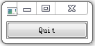
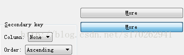

&emsp;&emsp;`pushButton`的`API`如下：<!--more-->

- `setEnabled(true/false)`：设置按键使能与否的函数(即可不可以被按下)。
- `boolisEnabled() const`：判断按键是否使能，使能返回`true`，否则为`false`。
- `setText(string)`：设置按钮显示的内容。
- `setIcon(QIcon(图片路径))`：使按钮显示为一个图片。
- `setFont(font)`：设置按钮上的字体。

---

### 单击导致信号与槽连接

&emsp;&emsp;代码如下：

``` cpp
#include <QApplication>
#include <QPushButton>

int main ( int argc, char *argv[] ) {
    QApplication app ( argc, argv );
    QPushButton *button = new QPushButton ( "Quit" );
    QObject::connect ( button, SIGNAL ( clicked() ), &app, SLOT ( quit() ) );
    button->show();
    return app.exec();
}
```



---

### QPushButton设置响应按钮为回车键

&emsp;&emsp;代码如下：

``` cpp
ui->pushButton->setFocus(); /* 设置默认焦点 */
/* 设置快捷键为键盘的“回车”键 */
ui->pushButton->setShortcut ( QKeySequence::InsertParagraphSeparator );
ui->pushButton->setShortcut ( Qt::Key_Enter ); /* 设置快捷键为enter键 */
ui->pushButton->setShortcut ( Qt::Key_Return ); /* 设置快捷键为小键盘上的enter键 */
```

或者如下：

``` cpp
ui->pushButton->setFocus(); /* 设置默认焦点 */
ui->pushButton->setDefault ( true ); /* 设置默认按钮，设置了这个属性，当用户按下回车的时候，就会按下该按钮 */
```

---

### QPushbutton用于发送toggled(bool)的checkable属性

&emsp;&emsp;默认情况下`checkable`是不选中的，`Button`默认为触发按钮(`trigger button`)，按下去马上弹起来。选中`checkable`后，`Button`变成切换按钮(`toggle button`)，可以有两种状态，即按下和弹起。此时该按钮可以发射`toggled(bool)`信号，与槽函数`setVisible(bool)`结合，即可用于控件交替显示。
&emsp;&emsp;下图中两个`more`按钮，上边是弹起状态，下边是按下状态：



&emsp;&emsp;问题：I have the follwing code where moreButton is a `QPushButton`. When I toggle the button, nothing happens. Shouldn't it show or hide `secondaryGroupBox` and `tertiaryGroupBox`?

``` cpp
QObject::connect ( moreButton, SIGNAL ( toggled ( bool ) ), secondaryGroupBox, SLOT ( setVisible ( bool ) ) );
QObject::connect ( moreButton, SIGNAL ( toggled ( bool ) ), tertiaryGroupBox, SLOT ( setVisible ( bool ) ) );
```

&emsp;&emsp;回答：Most likely, your pushbutton is not checkable. Try `moreButton->setCheckable(true)`, a `non-checkable` button never emits the `toggled(bool)` signal.