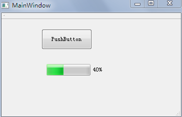
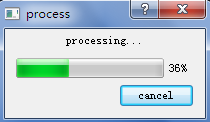

&emsp;&emsp;`Qt`可以用`QProgressBar`或着`QProgressDialog`来实现进度条。<!--more-->

### QProgressBar

&emsp;&emsp;首先在`Qt Designer`中拖一个按钮和进度条部件，按照下面的方法进行初始化：

``` cpp
ui->progressBar->setRange ( 0, 50000 - 1 );
ui->progressBar->setValue ( 0 );
```

按钮的事件处理：

``` cpp
void MainWindow::on_pushButton_clicked() {
    for ( int i = 0; i < 50000; i++ ) {
        for ( int j = 0; j < 20000; j++ ); /* 延时作用 */

        ui->progressBar->setValue ( i );
    }
}
```

这样就可以显示进度条了，并自动计算和显示百分比：



### QProgressDialog

&emsp;&emsp;`QProcessDialog`也是类似的，只不过这是以对话框形式显示；并且它还提供了一个取消按钮，用来取消操作。`QProcessDialog`会自动计算并显示百分比：

``` cpp
void MainWindow::on_pushButton_clicked() {
    QProgressDialog process ( this );
    process.setLabelText ( tr ( "processing..." ) );
    process.setRange ( 0, 50000 );
    process.setModal ( true );
    process.setCancelButtonText ( tr ( "cancel" ) );

    for ( int i = 0; i < 50000; i++ ) {
        for ( int j = 0; j < 20000; j++ );

        process.setValue ( i );

        if ( process.wasCanceled() ) {
            break;
        }
    }
}
```



或者如下：

``` cpp
/* 对话框标签内容、取消按钮的显示文本、最小值、最大值、父窗口 */
QProgressDialog dialog ( tr ( "文件复制进度" ), tr ( "取消" ), 0, 50000, this );
dialog.setWindowTitle ( tr ( "进度对话框" ) ); /* 设置窗口标题 */
dialog.setWindowModality ( Qt::WindowModal ); /* 将对话框设置为模态 */
dialog.show();

for ( int i = 0; i < 50000; i++ ) { /* 演示复制进度 */
    dialog.setValue ( i ); /* 设置进度条的当前值 */
    QCoreApplication::processEvents(); /* 避免界面冻结 */

    if ( dialog.wasCanceled() ) {
        break; /* 按下取消按钮则中断 */
    }
}

/* 这样才能显示100%，因为for循环中少加了一个数 */
dialog.setValue ( 50000 );
qDebug() << tr ( "复制结束！" );
```

可以使用`setMinimum(int)`和`setMaximum(int)`函数来设置进度条范围的最小值与最大值。
&emsp;&emsp;当进行数据或者文件传输时，进度条的设置类似于下面的方式：

``` cpp
connect ( ftp, SIGNAL ( dataTransferProgress ( qint64, qint64 ) ), \
          this, SLOT ( updateDataTransferProgress ( qint64, qint64 ) ) );

void MainWindow::updateDataTransferProgress ( qint64 readBytes, qint64 totalBytes ) {
    ui->progressBar->setMaximum ( totalBytes );
    ui->progressBar->setValue ( readBytes );
}
```

---

- `hide`：实现`QProgressBar`进度条的隐藏。