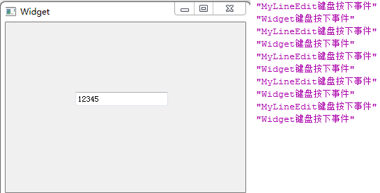
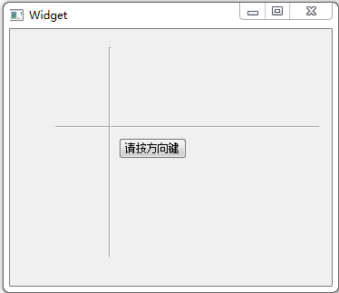

&emsp;&emsp;在`Qt`中，可以使用`void QWidget::keyPressEvent ( QKeyEvent * event )`来进行键盘响应：<!--more-->

``` cpp
void Widget::keyPressEvent ( QKeyEvent *event ) {
    if ( event->key() == Qt::Key_A ) {
        /* 当按下按键“A”时，do something */
    } else if ( event->key() == Qt::Key_D ) {
        /* 当按下按键“D”时，do something */
    } else if ( event->key() == Qt::Key_W ) {
        if ( event->state() == Qt::ShiftButton ) {
            /* 当按下“Shift+W”时，do something */
        }
    }
}
```

&emsp;&emsp;`mylineedit.h`如下：

``` cpp
#ifndef MYLINEEDIT_H
#define MYLINEEDIT_H

#include <QLineEdit>

class MyLineEdit : public QLineEdit {
    Q_OBJECT
public:
    explicit MyLineEdit ( QWidget *parent = 0 );
protected:
    void keyPressEvent ( QKeyEvent *event );
signals:
public slots:
};

#endif // MYLINEEDIT_H
```

&emsp;&emsp;`widget.h`如下：

``` cpp
#ifndef WIDGET_H
#define WIDGET_H

#include <QWidget>

namespace Ui {
    class Widget;
}

class MyLineEdit;

class Widget : public QWidget {
    Q_OBJECT
public:
    explicit Widget ( QWidget *parent = 0 );
    ~Widget();
protected:
    void keyPressEvent ( QKeyEvent *event );
private:
    Ui::Widget *ui;
    MyLineEdit *lineEdit;
};

#endif // WIDGET_H
```

&emsp;&emsp;`widget.cpp`如下：

``` cpp
#include "widget.h"
#include "ui_widget.h"
#include "mylineedit.h"
#include <QKeyEvent>
#include <QDebug>

Widget::Widget ( QWidget *parent ) : QWidget ( parent ),
    ui ( new Ui::Widget ) {
    ui->setupUi ( this );
    lineEdit = new MyLineEdit ( this );
    lineEdit->move ( 100, 100 );
}

Widget::~Widget() {
    delete ui;
}

void Widget::keyPressEvent ( QKeyEvent *event ) {
    qDebug() << tr ( "Widget键盘按下事件" );
}
```

&emsp;&emsp;`mylineedit.cpp`如下：

``` cpp
#include "mylineedit.h"
#include <QKeyEvent>
#include <QDebug>

MyLineEdit::MyLineEdit ( QWidget *parent ) : QLineEdit ( parent ) {
}

void MyLineEdit::keyPressEvent ( QKeyEvent *event ) { /* 键盘按下事件 */
    qDebug() << tr ( "MyLineEdit键盘按下事件" );
    QLineEdit::keyPressEvent ( event ); /* 执行QLineEdit类的默认事件处理 */
    event->ignore(); /* 忽略该事件 */
}
```

增加代码`QLineEdit::keyPressEvent(event);`是为了让行编辑器能够正常工作，即显示字符。事件是先传递给指定窗口部件的，这里确切地说应该是先传递给获得焦点的窗口部件的。但是如果该部件忽略掉该事件，那么这个事件就会传递给这个部件的父部件。在重新实现事件处理函数时，一般要调用父类的相应事件处理函数来实现默认操作。



&emsp;&emsp;关于`Qt`中的方向键，代码如下：
&emsp;&emsp;`widget.h`如下：

``` cpp
#ifndef WIDGET_H
#define WIDGET_H

#include <QWidget>

namespace Ui {
    class Widget;
}

class Widget : public QWidget {
    Q_OBJECT
public:
    explicit Widget ( QWidget *parent = 0 );
    ~Widget();
protected:
    void keyPressEvent ( QKeyEvent *event );
    void keyReleaseEvent ( QKeyEvent *event );
private:
    Ui::Widget *ui;
    bool keyUp; /* 向上方向键按下的标志 */
    bool keyLeft; /* 向左方向键按下的标志 */
    bool move; /* 是否完成了一次移动 */
};

#endif // WIDGET_H
```

&emsp;&emsp;`widget.cpp`如下：

``` cpp
#include "widget.h"
#include "ui_widget.h"
#include <QKeyEvent>
#include <QDebug>

Widget::Widget ( QWidget *parent ) : QWidget ( parent ), ui ( new Ui::Widget ) {
    ui->setupUi ( this );
    setFocus(); /* 使主界面获得焦点 */
    /* 初始化变量 */
    keyUp = false;
    keyLeft = false;
    move = false;
}

Widget::~Widget() {
    delete ui;
}

/* 键盘按下事件 */
void Widget::keyPressEvent ( QKeyEvent *event ) {
    if ( event->key() == Qt::Key_Up ) {
        if ( event->isAutoRepeat() ) { /* 按键重复时不做处理 */
            return;
        }

        keyUp = true; /* 标记向上方向键已经按下 */
    } else if ( event->key() == Qt::Key_Left ) {
        if ( event->isAutoRepeat() ) {
            return;
        }

        keyLeft = true;
    }
}

/* 按键释放事件 */
void Widget::keyReleaseEvent ( QKeyEvent *event ) {
    if ( event->key() == Qt::Key_Up ) {
        if ( event->isAutoRepeat() ) {
            return;
        }

        keyUp = false; /* 释放按键后将标志设置为false */

        if ( move ) { /* 如果已经完成了移动 */
            move = false; /* 设置标志为false */
            return;
        }

        if ( keyLeft ) { /* 如果向左方向键已经按下且没有释放 */
            ui->pushButton->move ( 30, 80 ); /* 斜移 */
            move = true; /* 标记已经移动 */
        } else {
            ui->pushButton->move ( 120, 80 ); /* 否则直接上移 */
        }
    } else if ( event->key() == Qt::Key_Left ) {
        if ( event->isAutoRepeat() ) {
            return;
        }

        keyLeft = false;

        if ( move ) {
            move = false;
            return;
        }

        if ( keyUp ) {
            ui->pushButton->move ( 30, 80 );
            move = true;
        } else {
            ui->pushButton->move ( 30, 120 );
        }
    } else if ( event->key() == Qt::Key_Down ) { /* 使用向下方向键来还原按钮的位置 */
        ui->pushButton->move ( 120, 120 );
    }
}
```

&emsp;&emsp;这里先在键盘按下事件处理函数中对向上方向键和向左方向键是否按下做了标记，并且当它们自动重复时不做任何处理。然后在按键释放事件处理函数中分别对这两个按键的释放做了处理。大致过程是这样的：当按下向左方向键时，在键盘按下事件处理函数中便会标记`keyLeft`为真，此时若又按下向上方向键，那么`keyUp`也标记为真。先放开向上方向键，在按键释放事件处理函数中会标记`keyUp`为假，因为此时`keyLeft`为真，所以进行斜移，并且将已经移动标志`move`标志为真。此时再释放向左方向键，在按键释放事件处理函数中会标记`keyLeft`为假，因为已经进行了斜移操作，`move`此时为真，所以这里不再进行操作，将`move`标记为假。这样就完成了整个斜移操作，而且所有的标志又恢复了操作前的状态。这个程序只是提供一种思路，并不是实现这种操作的最好办法，因为这里按键重复功能被忽略了。



&emsp;&emsp;如果想要实现按下`Ctrl + M`来实现窗口的最大化，把代码进行如下修改：

``` cpp
void Widget::keyPressEvent ( QKeyEvent *event ) { /* 键盘按下事件 */
    if ( event->modifiers() == Qt::ControlModifier ) { /* 是否按下Ctrl键 */
        if ( event->key() == Qt::Key_M ) { /* 是否按下M键 */
            setWindowState ( Qt::WindowMaximized ); /* 窗口最大化 */
        }
    } else {
        QWidget::keyPressEvent ( event );
    }
}

void Widget::keyReleaseEvent ( QKeyEvent *event ) { /* 按键释放事件 */
    /* 其他操作 */
}
```