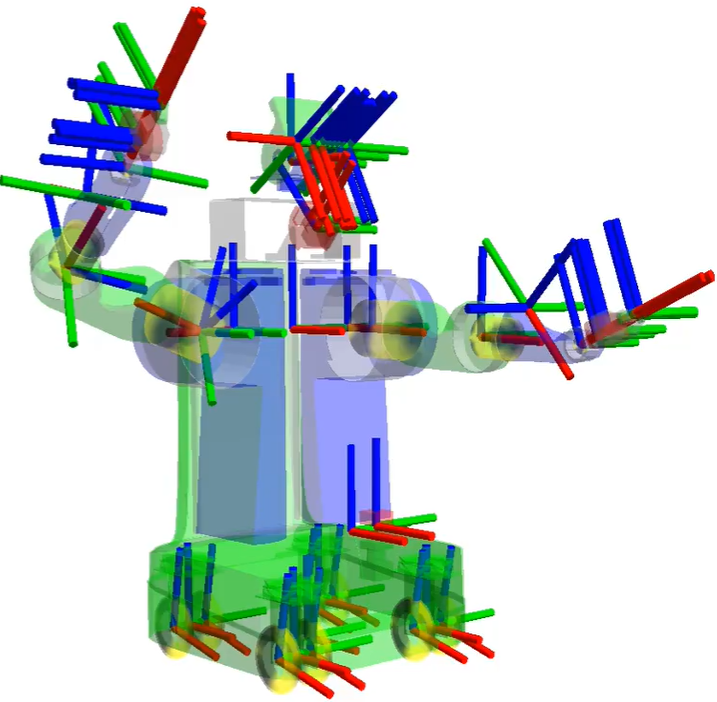
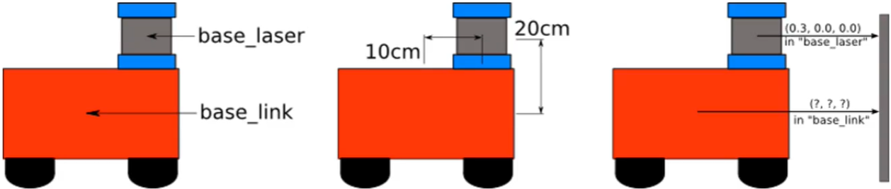
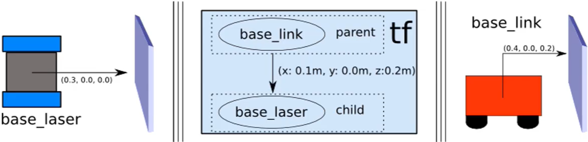
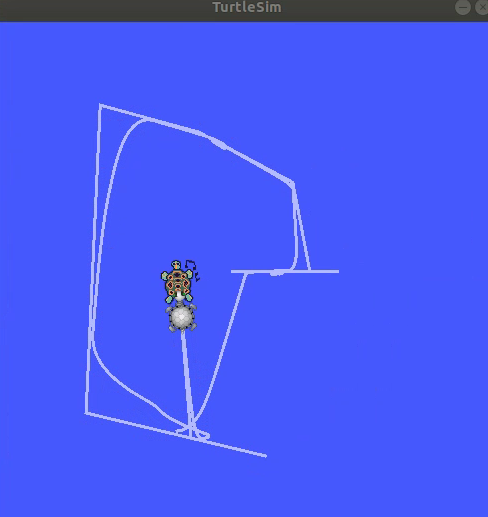
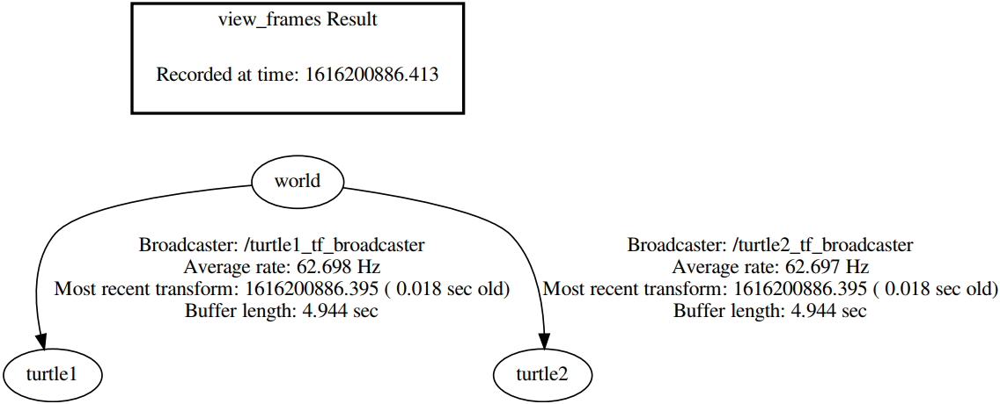

### 机器人中的坐标变换

&emsp;&emsp;`TF`功能包的作用举例如下：<!--more-->

- 五秒钟之前，机器人头部坐标系相对于全局坐标系的关系是什么样的？
- 机器人抓取的物体相对于机器人中心坐标系的位置在哪里？
- 机器人中心坐标系相对于全局坐标系的位置在哪里？

&emsp;&emsp;`TF`坐标变换实现方法如下：

1. 广播`TF`变换。
2. 监听`TF`变换。

&emsp;&emsp;机器人系统中有着繁杂的坐标系：



&emsp;&emsp;下图显示了移动机器人的本体坐标系与雷达坐标系：



&emsp;&emsp;坐标系之间的数据变换如下：



### 坐标变换实验

&emsp;&emsp;在终端上输入如下的命令：

``` bash
$ roslaunch turtle_tf turtle_tf_demo.launch
$ rosrun turtlesim turtle_teleop_key
$ rosrun tf view_frames
```

在终端上使用方向键控制小乌龟，然后另外一只乌龟将会跟踪这个小乌龟：



`rosrun tf view_frames`命令会在当前文件夹下生成`frames.pdf`：



### TF坐标系广播与监听

&emsp;&emsp;创建功能包：

``` bash
$ cd ~/catkin_ws/src
$ catkin_create_pkg learning_tf roscpp rospy tf turtlesim
```

&emsp;&emsp;创建`TF`广播器的流程如下：

1. 定义`TF`广播器(`TransformBroadcaster`)。
2. 创建坐标变换值。
3. 发布坐标变换(`sendTransform`)。

&emsp;&emsp;`turtle_tf_broadcaster.cpp`如下：

``` cpp
/* 该例程产生tf数据，并计算、发布turtle2的速度指令 */
#include <ros/ros.h>
#include <tf/transform_broadcaster.h>
#include <turtlesim/Pose.h>

std::string turtle_name;

void poseCallback ( const turtlesim::PoseConstPtr& msg ) {
    static tf::TransformBroadcaster br; /* 创建tf的广播器 */
    /* 初始化tf数据 */
    tf::Transform transform;
    transform.setOrigin ( tf::Vector3 ( msg->x, msg->y, 0.0 ) );
    tf::Quaternion q;
    q.setRPY ( 0, 0, msg->theta );
    transform.setRotation ( q );
    /* 广播world与海龟坐标系之间的tf数据 */
    br.sendTransform ( tf::StampedTransform ( transform, ros::Time::now(), "world", turtle_name ) );
}

int main ( int argc, char** argv ) {
    ros::init ( argc, argv, "my_tf_broadcaster" ); /* 初始化ROS节点 */

    /* 输入参数作为海龟的名字 */
    if ( argc != 2 ) {
        ROS_ERROR ( "need turtle name as argument" );
        return -1;
    }

    turtle_name = argv[1];
    /* 订阅海龟的位姿话题 */
    ros::NodeHandle node;
    ros::Subscriber sub = node.subscribe ( turtle_name + "/pose", 10, poseCallback );
    ros::spin(); /* 循环等待回调函数 */
    return 0;
}
```

&emsp;&emsp;创建`TF`监听器的流程如下：

1. 定义`TF`监听器(`TransformListener`)。
2. 查找坐标变换(`waitForTransform`、`lookupTransform`)。

&emsp;&emsp;`turtle_tf_listener.cpp`如下：

``` cpp
/* 该例程监听tf数据，并计算、发布turtle2的速度指令 */
#include <ros/ros.h>
#include <tf/transform_listener.h>
#include <geometry_msgs/Twist.h>
#include <turtlesim/Spawn.h>

int main ( int argc, char** argv ) {
    ros::init ( argc, argv, "my_tf_listener" ); /* 初始化ROS节点 */
    ros::NodeHandle node; /* 创建节点句柄 */
    /* 请求产生turtle2 */
    ros::service::waitForService ( "/spawn" );
    ros::ServiceClient add_turtle = node.serviceClient<turtlesim::Spawn> ( "/spawn" );
    turtlesim::Spawn srv;
    add_turtle.call ( srv );
    /* 创建发布turtle2速度控制指令的发布者 */
    ros::Publisher turtle_vel = node.advertise<geometry_msgs::Twist> ( "/turtle2/cmd_vel", 10 );
    /* 创建tf的监听器 */
    tf::TransformListener listener;
    ros::Rate rate ( 10.0 );

    while ( node.ok() ) {
        tf::StampedTransform transform; /* 获取turtle1与turtle2坐标系之间的tf数据 */

        try { /* 查询是否有这两个坐标系，查询当前时间，如果超过3s则报错 */
            listener.waitForTransform ( "/turtle2", "/turtle1", ros::Time ( 0 ), ros::Duration ( 3.0 ) );
            listener.lookupTransform ( "/turtle2", "/turtle1", ros::Time ( 0 ), transform );
        } catch ( tf::TransformException &ex ) {
            ROS_ERROR ( "%s", ex.what() );
            ros::Duration ( 1.0 ).sleep();
            continue;
        }

        /* 根据turtle1与turtle2坐标系之间的位置关系，发布turtle2的速度控制指令 */
        geometry_msgs::Twist vel_msg;
        vel_msg.angular.z = 4.0 * atan2 ( transform.getOrigin().y(),
                                          transform.getOrigin().x() );
        vel_msg.linear.x = 0.5 * sqrt ( pow ( transform.getOrigin().x(), 2 ) +
                                        pow ( transform.getOrigin().y(), 2 ) );
        turtle_vel.publish ( vel_msg );
        rate.sleep();
    }

    return 0;
}
```

&emsp;&emsp;修改`catkin_ws/src/learning_tf`目录下的`CMakeLists.txt`：

``` cmake
add_executable(turtle_tf_broadcaster src/turtle_tf_broadcaster.cpp)
target_link_libraries(turtle_tf_broadcaster ${catkin_LIBRARIES})

add_executable(turtle_tf_listener src/turtle_tf_listener.cpp)
target_link_libraries(turtle_tf_listener ${catkin_LIBRARIES})
```

&emsp;&emsp;编译并运行代码：

``` bash
$ cd ~/catkin_ws
$ catkin_make
$ source devel/setup.bash
$ roscore
$ rosrun turtlesim turtlesim_node
$ rosrun learning_tf turtle_tf_broadcaster __name:=turtle1_tf_broadcaster /turtle1
$ rosrun learning_tf turtle_tf_broadcaster __name:=turtle2_tf_broadcaster /turtle2
$ rosrun learning_tf turtle_tf_listener
$ rosrun turtlesim turtle_teleop_key
```

可以看到两个小乌龟像上面一样追逐。
&emsp;&emsp;以上的代码也可以使用`python`来实现。在`catkin_ws/src/learning_tf/scripts`目录下，创建一个名为`turtle_tf_broadcaster.py`的文件：

``` python
#!/usr/bin/env python
# -*- coding: utf-8 -*-
# 该例程将请求“/show_person”服务，服务数据类型为“learning_service::Person”
import roslib
roslib.load_manifest('learning_tf')
import rospy
import tf
import turtlesim.msg

def handle_turtle_pose(msg, turtlename):
    br = tf.TransformBroadcaster()
    br.sendTransform(
        (msg.x, msg.y, 0),
        tf.transformations.quaternion_from_euler(0, 0, msg.theta),
        rospy.Time.now(),
        turtlename,
        "world")

if __name__ == '__main__':
    rospy.init_node('turtle_tf_broadcaster')
    turtlename = rospy.get_param('~turtle')
    rospy.Subscriber(
        '/%s/pose' % turtlename,
        turtlesim.msg.Pose,
        handle_turtle_pose,
        turtlename)
    rospy.spin()
```

再创建一个名为`turtle_tf_listener.py`的文件：

``` python
#!/usr/bin/env python
# -*- coding: utf-8 -*-
# 该例程将请求“/show_person”服务，服务数据类型为“learning_service::Person”
import roslib
roslib.load_manifest('learning_tf')
import rospy
import math
import tf
import geometry_msgs.msg
import turtlesim.srv

if __name__ == '__main__':
    rospy.init_node('turtle_tf_listener')
    listener = tf.TransformListener()
    rospy.wait_for_service('/spawn')
    spawner = rospy.ServiceProxy('/spawn', turtlesim.srv.Spawn)
    spawner(4, 2, 0, 'turtle2')
    turtle_vel = rospy.Publisher('turtle2/cmd_vel', geometry_msgs.msg.Twist,queue_size=1)
    rate = rospy.Rate(10.0)

    while not rospy.is_shutdown():
        try:
            (trans,rot) = listener.lookupTransform('/turtle2', '/turtle1', rospy.Time(0))
        except (tf.LookupException, tf.ConnectivityException, tf.ExtrapolationException):
            continue

        angular = 4 * math.atan2(trans[1], trans[0])
        linear = 0.5 * math.sqrt(trans[0] ** 2 + trans[1] ** 2)
        cmd = geometry_msgs.msg.Twist()
        cmd.linear.x = linear
        cmd.angular.z = angular
        turtle_vel.publish(cmd)
        rate.sleep()
```

&emsp;&emsp;执行以上的`python`代码可以使用`launch`文件：

``` html
<launch>
    <!-- Turtlesim Node-->
    <node pkg="turtlesim" type="turtlesim_node" name="sim"/>
    <node pkg="turtlesim" type="turtle_teleop_key" name="teleop" output="screen"/>
    <node name="turtle1_tf_broadcaster" pkg="learning_tf" type="turtle_tf_broadcaster.py">
        <param name="turtle" type="string" value="turtle1"/>
    </node>
    <node name="turtle2_tf_broadcaster" pkg="learning_tf" type="turtle_tf_broadcaster.py">
        <param name="turtle" type="string" value="turtle2"/>
    </node>
    <node pkg="learning_tf" type="turtle_tf_listener.py" name="listener"/>
</launch>
```