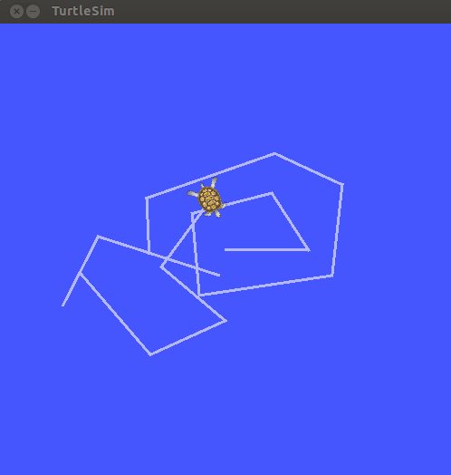

### 简介

&emsp;&emsp;`ROS`是`Robot Operating System`的简写，翻译过来就是`机器人操作系统`。它是一个软件框架，目的是提供开发平台、工具以及生态给开发人员，让开发人员快速地去开发强大的机器人系统。<!--more-->

### 版本

&emsp;&emsp;`ROS`具有不同的版本，并且每一种版本与特定的`Ubuntu`系统相关联。例如`ROS Kinectic`对应`Ubuntu 16.04`版本，`ROS Melodic`对应`Ubuntu 18.04`版本。

### ROS安装

&emsp;&emsp;这里主要讲解`ROS Melodic`在`Ubuntu 18.04`系统上的安装。
&emsp;&emsp;添加`ROS`的镜像源：

``` bash
sudo sh -c 'echo "deb http://packages.ros.org/ros/ubuntu $(lsb_release -sc) main" > /etc/apt/sources.list.d/ros-latest.list'
```

&emsp;&emsp;配置密钥：

``` bash
sudo apt-key adv --keyserver 'hkp://keyserver.ubuntu.com:80' --recv-key C1CF6E31E6BADE8868B172B4F42ED6FBAB17C654
```

&emsp;&emsp;更新`Ubuntu`的源：

``` bash
sudo apt-get update
```

&emsp;&emsp;安装`ROS melodic`：

``` bash
sudo apt install ros-melodic-desktop-full
```

### ROS初始化

&emsp;&emsp;配置全局环境变量：

``` bash
echo "source /opt/ros/melodic/setup.bash" >> ~/.bashrc
source ~/.bashrc
```

&emsp;&emsp;安装打包工具依赖：

``` bash
sudo apt install python-rosdep python-rosinstall python-rosinstall-generator python-wstool build-essential
```

&emsp;&emsp;在使用`ROS`之前，需要初始化`rosdep`：

``` bash
sudo rosdep init
rosdep update
```

### 测试安装

&emsp;&emsp;通过命令启动`Ros Master`：

``` bash
roscore
```

然后会有以下的日志打印：

``` bash
SUMMARY
========

PARAMETERS
 * /rosdistro: melodic
 * /rosversion: 1.14.3

NODES

auto-starting new master
process[master]: started with pid [31620]
ROS_MASTER_URI=http://xq-pc:11311/

setting /run_id to 60c9f200-32b5-11ea-9658-482ae35bedc8
process[rosout-1]: started with pid [31631]
started core service [/rosout]
```

&emsp;&emsp;再新建一个终端，然后输入以下指令：

``` bash
rosrun turtlesim turtlesim_node
```

就会显示如下的画面：


&emsp;&emsp;再新建一个终端，然后输入以下指令，就可以控制小乌龟进行运动了：

``` bash
rosrun turtlesim turtle_teleop_key
```

