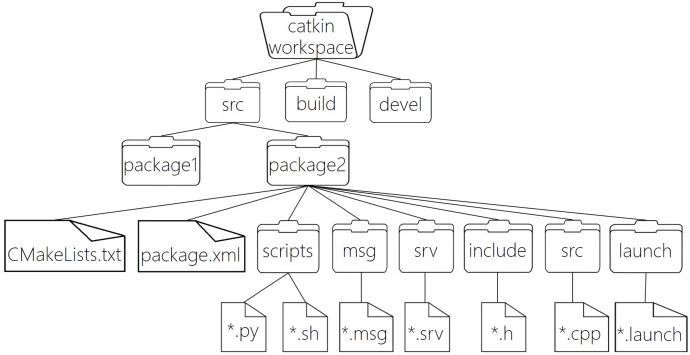
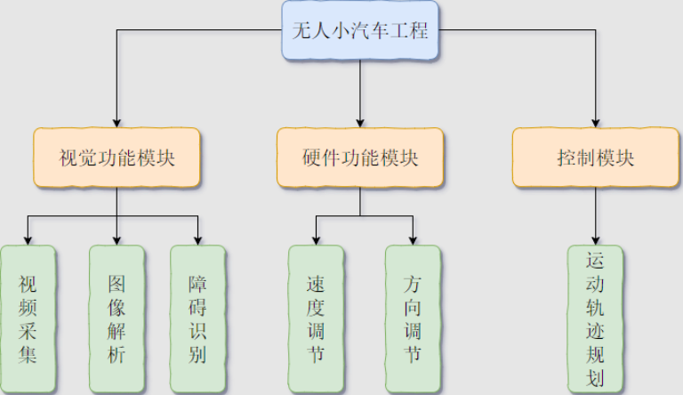

### 工作空间

&emsp;&emsp;`ROS`的工作空间(`workspace`)指的是在硬盘上`ROS`源代码的组织形式，其结构大致可以如下图所示：<!--more-->



``` bash
WorkSpace -- 自定义的工作空间
    |-- build：编译空间，用于存放CMake和catkin的缓存信息、配置信息和其他中间文件
    |-- devel：开发空间，用于存放编译后生成的目标文件，包括头文件、动态或静态链接库、可执行文件等
    |-- src：源码
        |-- package：功能包，这是ROS基本单元
            |-- CMakeLists.txt：配置编译规则，例如源文件、依赖项、目标文件
            |-- package.xml：包信息，例如包名、版本、作者
            |-- scripts：存储python文件
            |-- src：存储C++源文件
            |-- include：头文件
            |-- msg：消息通信格式文件
            |-- srv：服务通信格式文件
            |-- action：动作格式文件
            |-- launch：存储launch文件
            |-- config：配置信息
        |-- CMakeLists.txt：编译的基本配置
```

&emsp;&emsp;通过无人驾驶项目来理解`Workspace`：



&emsp;&emsp;基于`ros`开发一个无人驾驶的小车，代码结构按照`package`划分，可以划分如下：

- `Camera`视觉包。
- `Hardware`硬件包。
- `Motion`控制包。

其中的视觉功能模块就是一个`package`，而该模块下的视频采集功能就是一个`Node`。

### 创建工作空间

&emsp;&emsp;创建一个完整的工作空间需要进行如下的步骤：
&emsp;&emsp;1. 创建工作空间。创建一个名为`catkin_ws`的工作空间，并且在其中创建`src`目录：

``` bash
$ mkdir -p ~/catkin_ws/src
$ cd ~/catkin_ws/src
$ catkin_init_workspace
```

&emsp;&emsp;2. 编译工作空间。

``` bash
$ cd ~/catkin_ws/src
$ catkin_make
```

&emsp;&emsp;3. 设置环境变量。

``` bash
$ source devel/setup.bash
```

&emsp;&emsp;4. 检查环境变量。

``` bash
$ echo $ROS_PACKAGE_PATH
```

&emsp;&emsp;5. 建立`install`空间。

``` bash
$ catkin_make install
```

### 创建功能包

&emsp;&emsp;创建一个完整的功能包需要使用`catkin_create_pkg`，其命令格式如下：

``` bash
catkin_create_pkg <package_name> [depend_1] [depend_2] ... [depend_N]
```

- `<package_name>`：功能包的名字。
- `[depend_N]`：`package`需要的环境依赖。

&emsp;&emsp;创建一个功能包的实例如下：

``` bash
$ cd ~/catkin_ws/src
$ catkin_create_pkg test_pkg roscpp rospy std_msgs
```

- `roscpp`是对`c++`的一种依赖，有了它就可以用`c++`开发`ros`程序。
- `rospy`是对`python`的一种依赖，有了它就可以用`python`开发`ros`程序。
- `std_msgs`是消息传输时常用的依赖。

这样就会在当前路径下新建`test_pkg`软件包，包括如下内容：

``` bash
├── CMakeLists.txt
├── include
│   └── test_pkg
├── package.xml
├── src
└── scripts # 该目录是手动创建，用于放置python脚本
```

&emsp;&emsp;编译功能包：

``` bash
$ cd ~/catkin_ws
$ catkin_make
$ source ~/catkin_ws/devel/setup.bash
```