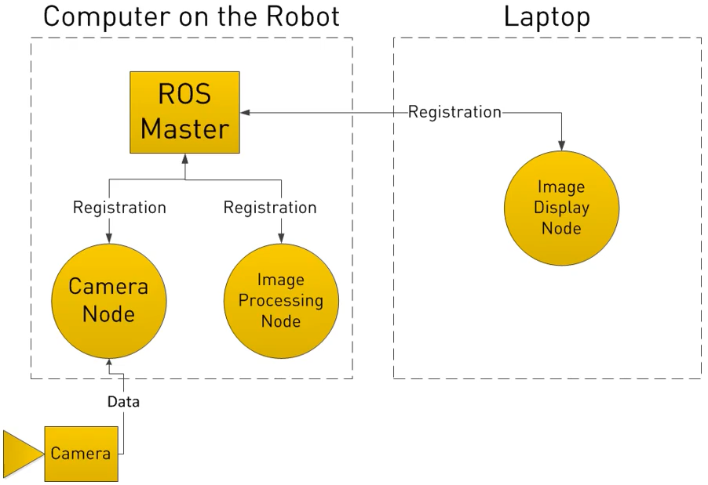
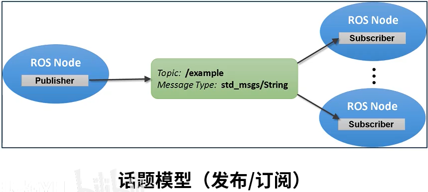
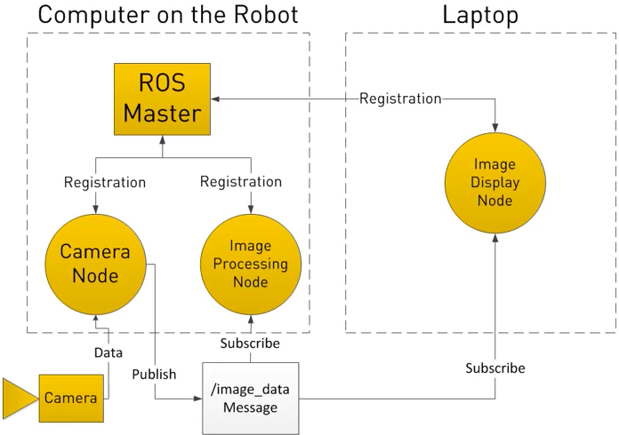
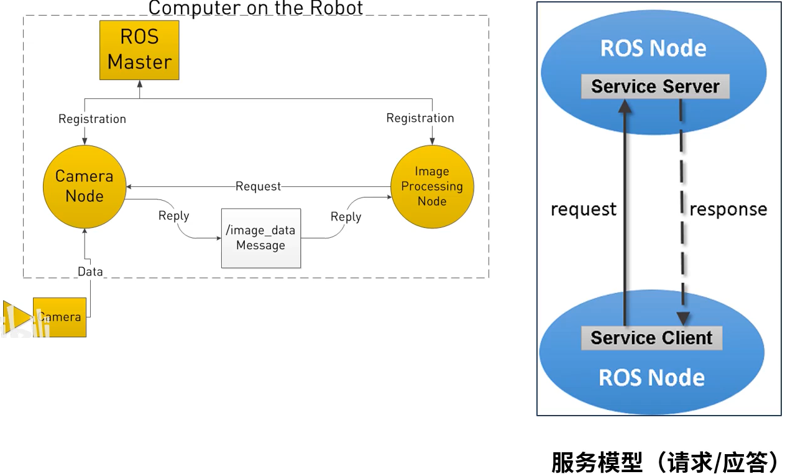
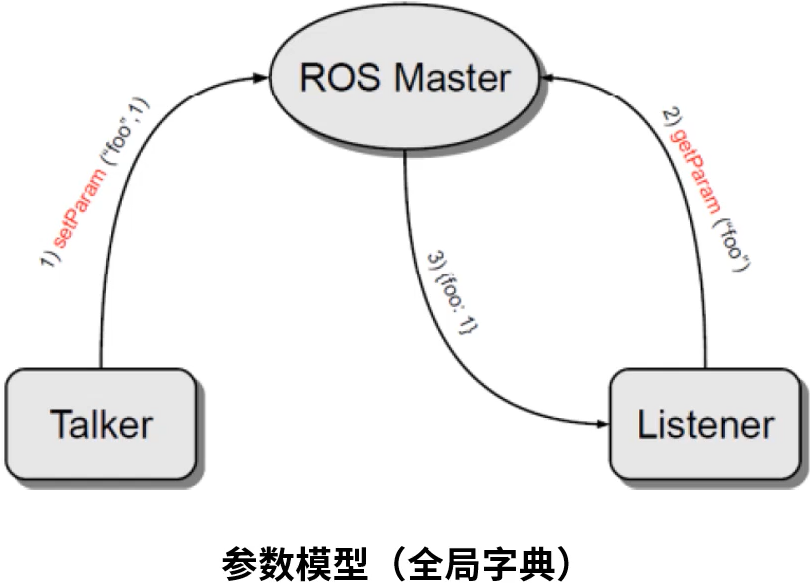

### 节点和节点管理器

&emsp;&emsp;节点(`Node`)是执行单元。<!--more-->

1. 执行具体任务的进程、独立运行的可执行文件。
2. 不同节点可以使用不同的编程语言，可分布式运行在不同的主机。
3. 节点在系统中的名称必须是唯一的。

&emsp;&emsp;节点管理器(`ROS Master`)是控制中心。

1. 为节点提供命名和注册服务。
2. 跟踪和记录`话题/服务`通信，辅助节点相互查找、建立连接。
3. 提供参数服务器，节点使用此服务器存储和检索运行时的参数。

### 话题通信

&emsp;&emsp;话题(`Topic`)是一种异步通信机制。

1. 节点之间用来传输数据的重要总线。
2. 使用`发布/订阅`模型，数据由发布者传输到订阅者。
3. 同一个话题的订阅者或发布者可以不唯一。

&emsp;&emsp;消息(`Message`)是话题数据。

1. 具有一定的类型和数据结构，包括`ROS`提供的标准类型和用户自定义类型。
2. 使用编程语言无关的`.msg`文件定义，编程过程中生成对应的代码文件。

### 服务通信

&emsp;&emsp;服务(`Service`)是同步通信机制。

1. 使用`客户端/服务器`模型，客户端发送请求数据，服务器完成处理后返回应答数据。
2. 使用编程语言无关的`.srv`文件定义请求和应答数据结构，编程过程中生成对应的代码文件。

&emsp;&emsp;话题和服务的区别如下：

对比项目   | 话题                            | 服务
----------|---------------------------------|------
同步性    | 异步                             | 同步
通信模型  | 发布/订阅                         | 服务器/客户端
底层协议  | ROSTCP/ROSUDP                     | ROSTCP/ROSUDP
反馈机制  | 无                                | 有
缓冲区   | 有                                 | 无
实时性   | 弱                                 | 强
节点关系 | 多对多                              | 一对多(一个Server)
使用场景 | 连续高频的数据发布与接收：雷达、里程计 | 偶尔调用或执行某一项特定功能：拍照、语音识别

### 参数

&emsp;&emsp;参数(`Parameter`)是全局共享字典。

1. 可通过网络访问的共享、多变量字典。
2. 节点使用此服务器来存储和检索运行时的参数。
3. 适合存储静态、非二进制的配置参数，不适合存储动态配置的数据。

