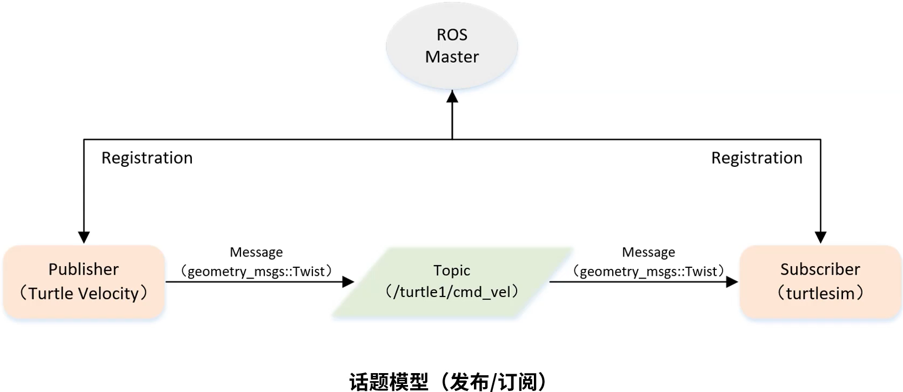

&emsp;&emsp;话题模型如下所示：<!--more-->



&emsp;&emsp;实现一个发布者的步骤如下：

1. 初始化`ROS`节点。
2. 向`ROS Master`注册节点信息，包括发布的话题名和话题中的消息类型。
3. 创建消息数据。
4. 按照一定频率循环发布消息。

&emsp;&emsp;我们仍以小乌龟为例，创建一个发布者。具体步骤如下：

``` bash
$ cd ~/catkin_ws/src
$ catkin_create_pkg learning_topic roscpp rospy std_msgs geometry_msgs turtlesim
```

&emsp;&emsp;在目录`catkin_ws/src/learning_topic/src`下创建一个名为`velocity_publisher.cpp`的文件：

``` cpp
/* 该例程将发布“turtle1/cmd_vel”话题，消息类型为“geometry_msgs::Twist” */
#include <ros/ros.h>
#include <geometry_msgs/Twist.h>

int main ( int argc, char **argv ) {
    /* ROS节点初始化，velocity_publisher是定义的节点名字，注意不能和其他节点重复 */
    ros::init ( argc, argv, "velocity_publisher" );
    ros::NodeHandle n; /* 创建节点句柄，管理节点资源 */
    /* 创建一个Publisher，发布名为“/turtle1/cmd_vel”的topic，消息类型为“geometry_msgs::Twist”，队列长度10 */
    ros::Publisher turtle_vel_pub = n.advertise<geometry_msgs::Twist> ( "/turtle1/cmd_vel", 10 );
    ros::Rate loop_rate ( 10 ); /* 设置循环的频率 */

    while ( ros::ok() ) {
        /* 初始化“geometry_msgs::Twist”类型的消息 */
        geometry_msgs::Twist vel_msg;
        vel_msg.linear.x = 0.5;
        vel_msg.angular.z = 0.2;
        turtle_vel_pub.publish ( vel_msg ); /* 发布消息 */
        /* ROS_INFO相当于输出 */
        ROS_INFO ( "Publsh turtle velocity command[%0.2f m/s, %0.2f rad/s]",
                   vel_msg.linear.x, vel_msg.angular.z );
        loop_rate.sleep(); /* 按照循环频率延时 */
    }

    return 0;
}
```

&emsp;&emsp;修改`catkin_ws/src/learning_topic`目录下的`CMakeLists.txt`：

``` cmake
# 设置需要编译的代码和生成的可执行文件
add_executable(velocity_publisher src/velocity_publisher.cpp)
# 设置链接库
target_link_libraries(velocity_publisher ${catkin_LIBRARIES})
```

&emsp;&emsp;编译并运行代码：

``` bash
$ cd ~/catkin_ws
$ catkin_make
$ source devel/setup.bash
$ roscore
$ rosrun turtlesim turtlesim_node
$ rosrun learning_topic velocity_publisher
```

可以看出小乌龟在不断地转圈，并且终端打印如下内容：

``` bash
[ INFO] [1615607969.649316907]: Publsh turtle velocity command[0.50 m/s, 0.20 rad/s]
[ INFO] [1615607969.749334764]: Publsh turtle velocity command[0.50 m/s, 0.20 rad/s]
[ INFO] [1615607969.849297492]: Publsh turtle velocity command[0.50 m/s, 0.20 rad/s]
...
```

&emsp;&emsp;以上的代码也可以使用`python`来实现。在`catkin_ws/src/learning_topic/scripts`目录下，创建一个名为`hello.py`的文件：

``` python
#!/usr/bin/env python
# -*- coding: utf-8 -*-
# 该例程将发布“turtle1/cmd_vel”话题，消息类型为“geometry_msgs::Twist”
import rospy
from geometry_msgs.msg import Twist

def velocity_publisher():
    # ROS节点初始化
    rospy.init_node('velocity_publisher', anonymous=True)
    # 创建一个Publisher，发布名为“/turtle1/cmd_vel”的topic，消息类型为“geometry_msgs::Twist”，队列长度10
    turtle_vel_pub = rospy.Publisher('/turtle1/cmd_vel', Twist, queue_size=10)
    rate = rospy.Rate(10) # 设置循环的频率

    while not rospy.is_shutdown():
        # 初始化“geometry_msgs::Twist”类型的消息
        vel_msg = Twist()
        vel_msg.linear.x = 0.5
        vel_msg.angular.z = 0.2
        # 发布消息
        turtle_vel_pub.publish(vel_msg)
        rospy.loginfo("Publsh turtle velocity command[%0.2f m/s, %0.2f rad/s]",
                vel_msg.linear.x, vel_msg.angular.z)
        rate.sleep() # 按照循环频率延时

if __name__ == '__main__':
    try:
        velocity_publisher()
    except rospy.ROSInterruptException:
        pass
```

然后使用如下命令来执行：

``` bash
$ chmod 777 hello.py
$ rosrun learning_topic hello.py
```