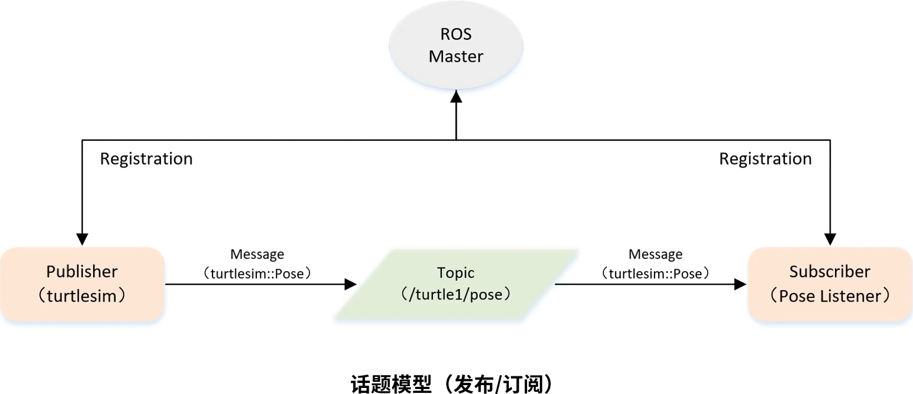

&emsp;&emsp;话题模型如下所示：<!--more-->



&emsp;&emsp;实现一个订阅者的步骤如下：

1. 初始化`ROS`节点。
2. 订阅需要的话题。
3. 循环等待话题消息，接收到消息后进入回调函数。
4. 在回调函数中完成消息处理。

&emsp;&emsp;在目录`catkin/src/learning_topic/src`下创建一个名为`pose_subscriber.cpp`的文件：

``` cpp
/* 该例程将订阅“/turtle1/pose”话题，消息类型为“turtlesim::Pose” */
#include <ros/ros.h>
#include "turtlesim/Pose.h"

/* 接收到订阅的消息后，会进入消息回调函数 */
void poseCallback ( const turtlesim::Pose::ConstPtr& msg ) {
    /* 将接收到的消息打印出来 */
    ROS_INFO ( "Turtle pose: x:%0.6f, y:%0.6f", msg->x, msg->y );
}

int main ( int argc, char **argv ) {
    ros::init ( argc, argv, "pose_subscriber" ); /* 初始化ROS节点 */
    ros::NodeHandle n; /* 创建节点句柄 */
    /* 创建一个Subscriber，订阅名为“/turtle1/pose”的topic，注册回调函数poseCallback */
    ros::Subscriber pose_sub = n.subscribe ( "/turtle1/pose", 10, poseCallback );
    ros::spin(); /* 循环等待回调函数 */
    return 0;
}
```

&emsp;&emsp;修改`catkin_ws/src/learning_topic`目录下的`CMakeLists.txt`：

``` cmake
add_executable(pose_subscriber src/pose_subscriber.cpp)
target_link_libraries(pose_subscriber ${catkin_LIBRARIES})
```

&emsp;&emsp;编译并运行代码：

``` bash
$ cd ~/catkin_ws
$ catkin_make
$ source devel/setup.bash
$ roscore
$ rosrun turtlesim turtlesim_node
$ rosrun turtlesim turtle_teleop_key
$ rosrun learning_topic pose_subscriber
```

&emsp;&emsp;终端会不断地显示小乌龟的位置：

``` bash
[ INFO] [1615619322.517903311]: Turtle pose: x:3.743139, y:2.989746
[ INFO] [1615619322.533684591]: Turtle pose: x:3.734391, y:2.958965
[ INFO] [1615619322.550399200]: Turtle pose: x:3.725643, y:2.928184
...
```

&emsp;&emsp;以上的代码也可以使用`python`来实现。在`catkin_ws/src/learning_topic/scripts`目录下，创建一个名为`hello_1.py`的文件：

``` python
#!/usr/bin/env python
# -*- coding: utf-8 -*-
# 该例程将订阅“/turtle1/pose”话题，消息类型为“turtlesim::Pose”
import rospy
from turtlesim.msg import Pose

def poseCallback(msg):
    rospy.loginfo("Turtle pose: x:%0.6f, y:%0.6f", msg.x, msg.y)

def pose_subscriber():
    rospy.init_node('pose_subscriber', anonymous=True) # ROS节点初始化
    # 创建一个Subscriber，订阅名为“/turtle1/pose”的topic，注册回调函数poseCallback
    rospy.Subscriber("/turtle1/pose", Pose, poseCallback)
    rospy.spin() # 循环等待回调函数

if __name__ == '__main__':
    pose_subscriber()
```

然后使用如下命令来执行：

``` bash
$ chmod 777 hello_1.py
$ rosrun learning_topic hello_1.py
```