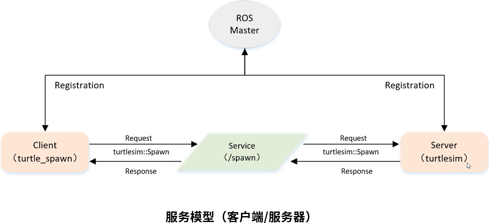

&emsp;&emsp;服务模型如下所示：<!--more-->



&emsp;&emsp;实现一个客户端的步骤如下：

1. 初始化`ROS`节点。
2. 创建一个`Client`实例。
3. 发布服务请求数据。
4. 等待`Server`处理之后的应答结果。

&emsp;&emsp;我们仍以小乌龟为例，创建一个客户端。具体步骤如下：

``` bash
$ cd ~/catkin_ws/src
$ catkin_create_pkg learning_service roscpp rospy std_msgs geometry_msgs turtlesim
```

&emsp;&emsp;在目录`catkin_ws/src/learning_service`下创建一个名为`turtle_spawm.cpp`的文件：

``` cpp
/* 该例程将请求“/spawn”服务，服务数据类型“turtlesim::Spawn” */
#include <ros/ros.h>
#include <turtlesim/Spawn.h>

int main ( int argc, char** argv ) {
    ros::init ( argc, argv, "turtle_spawn" ); /* 初始化ROS节点 */
    ros::NodeHandle node; /* 创建节点句柄 */
    /* 发现“/spawn”服务后，创建一个客户端，连接名为“/spawn”的service */
    ros::service::waitForService ( "/spawn" ); /* 阻塞型函数 */
    ros::ServiceClient add_turtle = node.serviceClient<turtlesim::Spawn> ( "/spawn" );
    /* 初始化“turtlesim::Spawn”的请求数据 */
    turtlesim::Spawn srv;
    srv.request.x = 2.0;
    srv.request.y = 2.0;
    srv.request.name = "turtle2";
    /* 请求服务调用 */
    ROS_INFO ( "Call service to spwan turtle[x:%0.6f, y:%0.6f, name:%s]",
               srv.request.x, srv.request.y, srv.request.name.c_str() );
    add_turtle.call ( srv ); /* 阻塞型函数 */
    /* 显示服务调用结果 */
    ROS_INFO ( "Spwan turtle successfully [name:%s]", srv.response.name.c_str() );
    return 0;
};
```

&emsp;&emsp;修改`catkin_ws/src/learning_service`目录下的`CMakeLists.txt`：

``` cmake
add_executable(turtle_spawn src/turtle_spawm.cpp)
target_link_libraries(turtle_spawn ${catkin_LIBRARIES})
```

&emsp;&emsp;编译并运行代码：

``` bash
$ cd ~/catkin_ws
$ catkin_make
$ source devel/setup.bash
$ roscore
$ rosrun turtlesim turtlesim_node
$ rosrun learning_service turtle_spawm
```

可以看出生成了另一只小乌龟，并且终端打印如下内容：

``` bash
[ INFO] [1615689868.638476511]: Call service to spwan turtle[x:2.000000, y:2.000000, name:turtle2]
[ INFO] [1615689868.644046491]: Spwan turtle successfully [name:turtle2]
```

&emsp;&emsp;以上的代码也可以使用`python`来实现。在`catkin_ws/src/learning_service/scripts`目录下，创建一个名为`spawn.py`的文件：

``` python
#!/usr/bin/env python
# -*- coding: utf-8 -*-
# 该例程将请求“/spawn”服务，服务数据类型“turtlesim::Spawn”
import sys
import rospy
from turtlesim.srv import Spawn

def turtle_spawn():
    rospy.init_node('turtle_spawn') # ROS节点初始化
    # 发现“/spawn”服务后，创建一个客户端，连接名为“/spawn”的service
    rospy.wait_for_service('/spawn')

    try:
        add_turtle = rospy.ServiceProxy('/spawn', Spawn)
        # 请求服务调用，输入请求数据
        response = add_turtle(2.0, 2.0, 0.0, "turtle2")
        return response.name
    except rospy.ServiceException, e:
        print "Service call failed: %s"%e

if __name__ == "__main__":
    # 服务调用并显示调用结果
    print "Spwan turtle successfully [name:%s]" %(turtle_spawn())
```

然后使用如下命令来执行：

``` bash
$ chmod 777 spawn.py
$ rosrun learning_service spawn.py
```