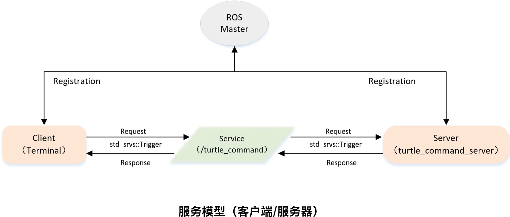

&emsp;&emsp;服务模型如下所示：<!--more-->



&emsp;&emsp;实现一个服务器的步骤如下：

1. 初始化`ROS`节点。
2. 创建`Server`实例。
3. 循环等待服务请求，进入回调函数。
4. 在回调函数中完成服务功能的处理，并反馈应答数据。

&emsp;&emsp;在目录`catkin_ws/src/learning_service`下创建一个名为`turtle_command_server.cpp`的文件：

``` cpp
/* 该例程将执行“/turtle_command”服务，服务数据类型“std_srvs/Trigger” */
#include <ros/ros.h>
#include <geometry_msgs/Twist.h>
#include <std_srvs/Trigger.h>

ros::Publisher turtle_vel_pub;
bool pubCommand = false;

/* service回调函数，输入参数req，输出参数res */
bool commandCallback ( std_srvs::Trigger::Request &req, std_srvs::Trigger::Response &res ) {
    pubCommand = !pubCommand;
    /* 显示请求数据 */
    ROS_INFO ( "Publish turtle velocity command [%s]", pubCommand == true ? "Yes" : "No" );
    /* 设置反馈数据 */
    res.success = true;
    res.message = "Change turtle command state!";
    return true;
}

int main ( int argc, char **argv ) {
    ros::init ( argc, argv, "turtle_command_server" ); /* ROS节点初始化 */
    ros::NodeHandle n; /* 创建节点句柄 */
    /* 创建一个名为“/turtle_command”的server，注册回调函数commandCallback */
    ros::ServiceServer command_service = n.advertiseService ( "/turtle_command", commandCallback );
    /* 创建一个Publisher，发布名为“/turtle1/cmd_vel”的topic，消息类型为“geometry_msgs::Twist”，队列长度10 */
    turtle_vel_pub = n.advertise<geometry_msgs::Twist> ( "/turtle1/cmd_vel", 10 );
    ROS_INFO ( "Ready to receive turtle command." );
    ros::Rate loop_rate ( 10 ); /* 设置循环的频率 */

    while ( ros::ok() ) {
        ros::spinOnce(); /* 查看一次回调函数队列 */

        if ( pubCommand ) { /* 如果标志为true，则发布速度指令 */
            geometry_msgs::Twist vel_msg;
            vel_msg.linear.x = 0.5;
            vel_msg.angular.z = 0.2;
            turtle_vel_pub.publish ( vel_msg );
        }

        loop_rate.sleep(); /* 按照循环频率延时 */
    }

    return 0;
}
```

&emsp;&emsp;修改`catkin_ws/src/learning_service`目录下的`CMakeLists.txt`：

``` cmake
add_executable(turtle_command_server src/turtle_command_server.cpp)
target_link_libraries(turtle_command_server ${catkin_LIBRARIES})
```

&emsp;&emsp;编译并运行代码：

``` bash
$ cd ~/catkin_ws
$ catkin_make
$ source devel/setup.bash
$ roscore
$ rosrun turtlesim turtlesim_node
$ rosrun learning_service turtle_command_server
$ rosservice call /turtle_command "{}"
```

&emsp;&emsp;以上的代码也可以使用`python`来实现。在`catkin_ws/src/learning_service/scripts`目录下，创建一个名为`turtle_command_server.py`的文件。注意，`ROS`在`Python`中没有`spinonce`方法，可通过多线程来实现。

``` python
#!/usr/bin/env python
# -*- coding: utf-8 -*-
# 该例程将执行“/turtle_command”服务，服务数据类型为“std_srvs/Trigger”
import rospy
import thread, time
from geometry_msgs.msg import Twist
from std_srvs.srv import Trigger, TriggerResponse

pubCommand = False
turtle_vel_pub = rospy.Publisher('/turtle1/cmd_vel', Twist, queue_size=10)

def command_thread():
    while True:
        if pubCommand:
            vel_msg = Twist()
            vel_msg.linear.x = 0.5
            vel_msg.angular.z = 0.2
            turtle_vel_pub.publish(vel_msg)
        time.sleep(0.1)

def commandCallback(req):
    global pubCommand
    pubCommand = bool(1-pubCommand)
    # 显示请求数据
    rospy.loginfo("Publish turtle velocity command![%d]", pubCommand)
    # 反馈数据
    return TriggerResponse(1, "Change turtle command state!")

def turtle_command_server():
    rospy.init_node('turtle_command_server') # ROS节点初始化
    # 创建一个名为“/turtle_command”的server，注册回调函数commandCallback
    s = rospy.Service('/turtle_command', Trigger, commandCallback)
    # 循环等待回调函数
    print "Ready to receive turtle command."
    thread.start_new_thread(command_thread, ())
    rospy.spin()

if __name__ == "__main__":
    turtle_command_server()
```

然后使用如下命令来执行：

``` bash
$ chmod 777 turtle_command_server.py
$ rosrun learning_service turtle_command_server.py
```