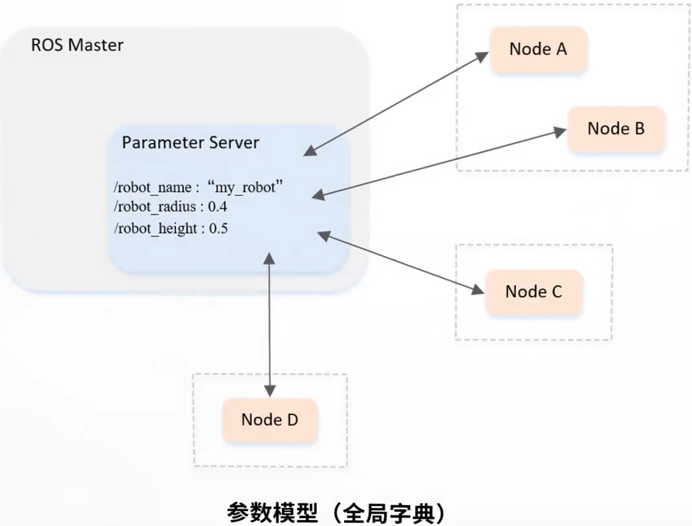

&emsp;&emsp;参数模型如下所示：<!--more-->



&emsp;&emsp;获取和设置参数的步骤如下：

1. 初始化`ROS`节点。
2. `get`函数获取参数。
3. `set`函数设置参数。

&emsp;&emsp;我们仍以小乌龟为例，创建一个`package`。具体步骤如下：

``` bash
$ cd ~/catkin_ws/src
$ catkin_create_pkg learning_paramater roscpp rospy std_srvs
```

&emsp;&emsp;在目录`catkin_ws/src/learning_paramater`下创建一个名为`parameter_config.cpp`的文件：

``` cpp
/* 该例程设置/读取海龟例程中的参数 */
#include <string>
#include <ros/ros.h>
#include <std_srvs/Empty.h>

int main ( int argc, char **argv ) {
    int red, green, blue;
    ros::init ( argc, argv, "parameter_config" ); /* ROS节点初始化 */
    ros::NodeHandle node; /* 创建节点句柄 */
    /* 读取背景颜色参数 */
    ros::param::get ( "/background_r", red );
    ros::param::get ( "/background_g", green );
    ros::param::get ( "/background_b", blue );
    ROS_INFO ( "Get Backgroud Color[%d, %d, %d]", red, green, blue );
    /* 设置背景颜色参数 */
    ros::param::set ( "/background_r", 255 );
    ros::param::set ( "/background_g", 255 );
    ros::param::set ( "/background_b", 255 );
    ROS_INFO ( "Set Backgroud Color[255, 255, 255]" );
    /* 读取背景颜色参数 */
    ros::param::get ( "/background_r", red );
    ros::param::get ( "/background_g", green );
    ros::param::get ( "/background_b", blue );
    ROS_INFO ( "Re-get Backgroud Color[%d, %d, %d]", red, green, blue );
    /* 调用服务，刷新背景颜色 */
    ros::service::waitForService ( "/clear" );
    ros::ServiceClient clear_background = node.serviceClient<std_srvs::Empty> ( "/clear" );
    std_srvs::Empty srv;
    clear_background.call ( srv );
    sleep ( 1 );
    return 0;
}
```

&emsp;&emsp;在`catkin_ws/src/learning_paramater/CMakeLists.txt`中添加如下内容：

``` cmake
add_executable(parameter_config src/parameter_config.cpp)
target_link_libraries(parameter_config ${catkin_LIBRARIES})
```

&emsp;&emsp;编译并运行代码：

``` bash
$ cd ~/catkin_ws
$ catkin_make
$ source devel/setup.bash
$ roscore
$ rosrun learning_paramater parameter_config
```

&emsp;&emsp;以上的代码也可以使用`python`来实现。在`catkin_ws/src/learning_paramater/scripts`目录下，创建一个名为`parameter_config.py`的文件：

``` python
#!/usr/bin/env python
# -*- coding: utf-8 -*-
# 该例程设置/读取海龟例程中的参数
import sys
import rospy
from std_srvs.srv import Empty

def parameter_config():
    rospy.init_node('parameter_config', anonymous=True) # ROS节点初始化
    # 读取背景颜色参数
    red   = rospy.get_param('/background_r')
    green = rospy.get_param('/background_g')
    blue  = rospy.get_param('/background_b')
    rospy.loginfo("Get Backgroud Color[%d, %d, %d]", red, green, blue)
    # 设置背景颜色参数
    rospy.set_param("/background_r", 255)
    rospy.set_param("/background_g", 255)
    rospy.set_param("/background_b", 255)
    rospy.loginfo("Set Backgroud Color[255, 255, 255]")
    # 读取背景颜色参数
    red   = rospy.get_param('/background_r')
    green = rospy.get_param('/background_g')
    blue  = rospy.get_param('/background_b')
    rospy.loginfo("Get Backgroud Color[%d, %d, %d]", red, green, blue)
    # 发现“/spawn”服务后，创建一个服务客户端，连接名为“/spawn”的service
    rospy.wait_for_service('/clear')

    try:
        clear_background = rospy.ServiceProxy('/clear', Empty)
        # 请求服务调用，输入请求数据
        response = clear_background()
        return response
    except rospy.ServiceException, e:
        print "Service call failed: %s" % e

if __name__ == "__main__":
    parameter_config()
```


----

&emsp;&emsp;在`C++`中，实现参数服务器数据的增删改查，可以通过两套`API`实现：

- `ros::NodeHandle`
- `ros::param`

### 参数服务器新增(修改)参数

&emsp;&emsp;`C++`代码如下：

``` cpp
#include "ros/ros.h"

int main ( int argc, char *argv[] ) {
    ros::init ( argc, argv, "set_update_param" );

    std::vector<std::string> stus;
    stus.push_back ( "zhangsan" );
    stus.push_back ( "李四" );
    stus.push_back ( "王五" );
    stus.push_back ( "孙大脑袋" );

    std::map<std::string, std::string> friends;
    friends["guo"] = "huang";
    friends["yuang"] = "xiao";

    /* ---------- NodeHandle ---------- */
    ros::NodeHandle nh;
    nh.setParam ( "nh_int", 10 ); /* 整型 */
    nh.setParam ( "nh_double", 3.14 ); /* 浮点型 */
    nh.setParam ( "nh_bool", true ); /* bool */
    nh.setParam ( "nh_string", "hello NodeHandle" ); /* 字符串 */
    nh.setParam ( "nh_vector", stus ); /* vector */
    nh.setParam ( "nh_map", friends ); /* map */

    nh.setParam ( "nh_int", 10000 ); /* 修改演示(相同的键，不同的值) */

    /* ---------- param ---------- */
    ros::param::set ( "param_int", 20 );
    ros::param::set ( "param_double", 3.14 );
    ros::param::set ( "param_string", "Hello Param" );
    ros::param::set ( "param_bool", false );
    ros::param::set ( "param_vector", stus );
    ros::param::set ( "param_map", friends );

    ros::param::set ( "param_int", 20000 ); /* 修改演示(相同的键，不同的值) */
    return 0;
}
```

&emsp;&emsp;`python`代码如下：

``` python
#!/usr/bin/env python
# -*- coding: utf-8 -*-
import rospy

if __name__ == "__main__":
    rospy.init_node("set_update_paramter_p")
    rospy.set_param("p_int", 10)
    rospy.set_param("p_double", 3.14)
    rospy.set_param("p_bool", True)
    rospy.set_param("p_string", "hello python")
    rospy.set_param("p_list", ["hello", "haha", "xixi"])
    rospy.set_param("p_dict", {"name": "hulu", "age": 8})
    rospy.set_param("p_int", 100)
```

### 参数服务器获取参数

&emsp;&emsp;参数服务器获取参数有如下的`API`：

- `param(键, 默认值)`：如果键存在，则返回对应的值，否则返回默认值。
- `getParam(键, 存储结果的变量)`：若存在，则返回`true`，并且将值赋值给`参数2`；如果键不存在，那么返回值为`false`，并且不为`参数2`赋值。
- `getParamCached(键, 存储结果的变量)`：提高变量获取效率。若存在，则返回`true`，并且将值赋值给`参数2`；如果键不存在，那么返回值为`false`，并且不为`参数2`赋值。
- `getParamNames(std::vector<std::string>)`：获取所有的键，并存储在参数`vector`中。
- `hasParam(键)`：是否包含某个键。如果存在，则返回`true`，否则返回`false`。
- `searchParam(参数1, 参数2)`：搜索键，`参数1`是被搜索的键，`参数2`存储搜索结果的变量。

&emsp;&emsp;代码`1`如下：

``` cpp
#include "ros/ros.h"

int main ( int argc, char *argv[] ) {
    setlocale ( LC_ALL, "" );
    ros::init ( argc, argv, "get_param" );
    /* ---------- param ---------- */
    ROS_INFO ( "++++++++++++++++++++++++++++++++++++++++" );
    int res3 = ros::param::param ( "param_int", 20 ); /* 存在 */
    int res4 = ros::param::param ( "param_int2", 20 ); /* 不存在，则返回默认 */
    ROS_INFO ( "param获取结果：%d，%d", res3, res4 );

    int param_int_value;
    double param_double_value;
    bool param_bool_value;
    std::string param_string_value;
    std::vector<std::string> param_stus;
    std::map<std::string, std::string> param_friends;

    ros::param::get ( "param_int", param_int_value );
    ros::param::get ( "param_double", param_double_value );
    ros::param::get ( "param_bool", param_bool_value );
    ros::param::get ( "param_string", param_string_value );
    ros::param::get ( "param_vector", param_stus );
    ros::param::get ( "param_map", param_friends );

    ROS_INFO ( "getParam获取的结果：%d，%.2f，%s，%d",
               param_int_value,
               param_double_value,
               param_string_value.c_str(),
               param_bool_value
             );

    for ( auto &&stu : param_stus ) {
        ROS_INFO ( "stus元素：%s", stu.c_str() );
    }

    for ( auto &&f : param_friends ) {
        ROS_INFO ( "map元素：%s = %s", f.first.c_str(), f.second.c_str() );
    }

    ros::param::getCached ( "param_int", param_int_value );
    ROS_INFO ( "通过缓存获取数据：%d", param_int_value );

    std::vector<std::string> param_names2;
    ros::param::getParamNames ( param_names2 );

    for ( auto &&name : param_names2 ) {
        ROS_INFO ( "名称解析name = %s", name.c_str() );
    }

    ROS_INFO ( "----------------------------" );
    ROS_INFO ( "存在param_int吗？%d", ros::param::has ( "param_int" ) );
    ROS_INFO ( "存在param_intttt吗？%d", ros::param::has ( "param_intttt" ) );

    std::string key;
    ros::param::search ( "param_int", key );
    ROS_INFO ( "搜索键：%s", key.c_str() );
    return 0;
}
```

&emsp;&emsp;代码`2`如下：

``` cpp
#include "ros/ros.h"

int main ( int argc, char *argv[] ) {
    setlocale ( LC_ALL, "" );
    ros::init ( argc, argv, "get_param" );

    /* ---------- NodeHandle ---------- */
    ros::NodeHandle nh;
    int res1 = nh.param ( "nh_int", 100 );
    int res2 = nh.param ( "nh_int2", 100 );
    ROS_INFO ( "param获取结果：%d，%d", res1, res2 );

    int nh_int_value;
    double nh_double_value;
    bool nh_bool_value;
    std::string nh_string_value;
    std::vector<std::string> stus;
    std::map<std::string, std::string> friends;

    nh.getParam ( "nh_int", nh_int_value );
    nh.getParam ( "nh_double", nh_double_value );
    nh.getParam ( "nh_bool", nh_bool_value );
    nh.getParam ( "nh_string", nh_string_value );
    nh.getParam ( "nh_vector", stus );
    nh.getParam ( "nh_map", friends );

    ROS_INFO ( "getParam获取的结果：%d，%.2f，%s，%d",
               nh_int_value,
               nh_double_value,
               nh_string_value.c_str(),
               nh_bool_value
             );

    for ( auto &&stu : stus ) {
        ROS_INFO ( "stus元素：%s", stu.c_str() );
    }

    for ( auto &&f : friends ) {
        ROS_INFO ( "map元素：%s = %s", f.first.c_str(), f.second.c_str() );
    }

    nh.getParamCached ( "nh_int", nh_int_value );
    ROS_INFO ( "通过缓存获取数据：%d", nh_int_value );

    std::vector<std::string> param_names1;
    nh.getParamNames ( param_names1 );

    for ( auto &&name : param_names1 ) {
        ROS_INFO ( "名称解析name = %s", name.c_str() );
    }

    ROS_INFO ( "----------------------------" );
    ROS_INFO ( "存在nh_int吗？%d", nh.hasParam ( "nh_int" ) );
    ROS_INFO ( "存在nh_intttt吗？%d", nh.hasParam ( "nh_intttt" ) );

    std::string key;
    nh.searchParam ( "nh_int", key );
    ROS_INFO ( "搜索键：%s", key.c_str() );
    return 0;
}
```

&emsp;&emsp;`python`代码如下：

``` python
#!/usr/bin/env python
# -*- coding: utf-8 -*-
import rospy

if __name__ == "__main__":
    rospy.init_node("get_param_p")

    int_value = rospy.get_param("p_int", 10000)
    double_value = rospy.get_param("p_double")
    bool_value = rospy.get_param("p_bool")
    string_value = rospy.get_param("p_string")
    p_list = rospy.get_param("p_list")
    p_dict = rospy.get_param("p_dict")

    rospy.loginfo("获取的数据：%d，%.2f，%d，%s",
                  int_value,
                  double_value,
                  bool_value,
                  string_value)

    for ele in p_list:
        rospy.loginfo("ele = %s", ele)

    rospy.loginfo("name = %s, age = %d", p_dict["name"], p_dict["age"])

    int_cached = rospy.get_param_cached("p_int")
    rospy.loginfo("缓存数据：%d", int_cached)

    names = rospy.get_param_names()
    for name in names:
        rospy.loginfo("name = %s", name)

    rospy.loginfo("-" * 80)

    flag = rospy.has_param("p_int")
    rospy.loginfo("包含p_int吗？%d", flag)

    key = rospy.search_param("p_int")
    rospy.loginfo("搜索的键 = %s", key)
```

### 参数服务器删除参数

&emsp;&emsp;参数服务器删除参数有如下的`API`：

- `deleteParam(键)`：如果删除成功，则返回`true`；如果键不存在，则返回`false`。
- `del(键)`：如果删除成功，则返回`true`；如果键不存在，则返回`false`。

``` cpp
#include "ros/ros.h"

int main ( int argc, char *argv[] ) {
    setlocale ( LC_ALL, "" );
    ros::init ( argc, argv, "delete_param" );

    ros::NodeHandle nh;
    bool r1 = nh.deleteParam ( "nh_int" );
    ROS_INFO ( "nh删除结果：%d", r1 );

    bool r2 = ros::param::del ( "param_int" );
    ROS_INFO ( "param删除结果：%d", r2 );
    return 0;
}
```

&emsp;&emsp;`python`代码如下：

``` python
#!/usr/bin/env python
# -*- coding: utf-8 -*-
import rospy

if __name__ == "__main__":
    rospy.init_node("delete_param_p")
    try:
        rospy.delete_param("p_int")
    except Exception as e:
        rospy.loginfo("删除失败")
```