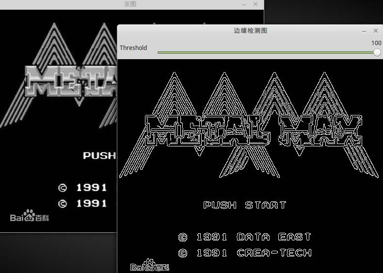
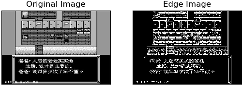

&emsp;&emsp;图像的边缘检测的原理是检测出图像中所有灰度值变化较大的点，而且这些点连接起来就构成了若干线条，这些线条就可以称为`图像的边缘`。`Canny`边缘检测算子是`John F. Canny`于`1986`年开发出来的一个多级边缘检测算法。<!--more-->
&emsp;&emsp;`Canny`基于三个基本目标：

- 低错误率。所有的边缘都应被找到，并且应该没有伪响应。也就是检测到的边缘必须尽可能是真实的边缘。
- 边缘点应被很好地定位。已定位边缘必须尽可能接近真实边缘。也就是由检测器标记为边缘的点和真实边缘的中心之间的距离应该最小。
- 单一的边缘点响应。对于真实的边缘点，检测器仅应返回一个点。也就是真实边缘周围的局部最大数应该是最小的。这意味着在仅存一个单一边缘点的位置，检测器不应指出多个边缘像素。

### cvCanny

&emsp;&emsp;函数功能为采用`Canny`方法对图像进行边缘检测：

``` cpp
void cvCanny (
    const CvArr *image, CvArr *edges, double threshold1,
    double threshold2, int aperture_size = 3 );
```

- `image`：输入图像，必须为单通道灰度图。
- `edges`：输出的边缘图像，为单通道黑白图。
- `threshold1`和`threshold2`：表示阈值，小阈值用来控制边缘连接，大阈值用来控制强边缘的初始分割，即如果一个像素的梯度大于上限值，则被认为是边缘像素；如果小于下限阈值，则被抛弃。如果该点的梯度在两者之间，则当这个点与高于上限值的像素点连接时才保留，否则删除。
- `aperture_size`：`Sobel`算子大小，默认为`3`，即表示一个`3 * 3`的矩阵。`Sobel`算子与高斯拉普拉斯算子都是常用的边缘算子。

### cvCreateTrackbar

&emsp;&emsp;函数功能为创建`trackbar`，并添加到指定窗口：

``` cpp
int cvCreateTrackbar (
    const char *trackbar_name, const char *window_name,
    int *value, int count, CvTrackbarCallback on_change );
```

- `trackbar_name`：该`trackbar`的名称。
- `window_name`：窗口名称，该`trackbar`将显示在这个窗口内。
- `value`：创建时滑块的位置。
- `count`：滑块位置的最大值，最小值固定为`0`。
- `on_change`：回调函数，当滑块位置有变化时，系统会调用该回调函数。注意，被创建的- `trackbar`默认显示在指定窗口的顶端，可以通过函数`cvGetTrackbarPos`来获取- `trackbar`显示的位置信息，以及通过函数`cvSetTrackbarPos`来重新设置`trackbar`的显示位置。

### CvTrackbarCallback

&emsp;&emsp;函数功能为`cvCreateTrackbar`函数所使用的回调函数：

``` cpp
typedef void ( CV_CDECL *CvTrackbarCallback ) ( int pos );
```

当`trackbar`位置被改变的时，系统会调用这个回调函数，并将参数`pos`设置为表示`trackbar`位置的数值。

``` cpp
#include <opencv2/opencv.hpp>

using namespace std;

IplImage *g_pSrcImage, *g_pCannyImg;
const char *pstrWindowsCannyTitle = "边缘检测图";

void on_trackbar ( int threshold ) { /* cvCreateTrackbar的回调函数 */
    cvCanny ( g_pSrcImage, g_pCannyImg, threshold, threshold * 3, 3 );
    cvShowImage ( pstrWindowsCannyTitle, g_pCannyImg );
}

int main() {
    const char *pstrImageName = "zzjb.jpg";
    const char *pstrWindowsSrcTitle = "原图";
    const char *pstrWindowsToolBar = "Threshold";
    /* 从文件中载入图像的灰度图(CV_LOAD_IMAGE_GRAYSCALE) */
    g_pSrcImage = cvLoadImage ( pstrImageName, CV_LOAD_IMAGE_GRAYSCALE );
    g_pCannyImg = cvCreateImage ( cvGetSize ( g_pSrcImage ), IPL_DEPTH_8U, 1 );
    /* 创建窗口 */
    cvNamedWindow ( pstrWindowsSrcTitle, CV_WINDOW_AUTOSIZE );
    cvNamedWindow ( pstrWindowsCannyTitle, CV_WINDOW_AUTOSIZE );
    /* 创建滑动条 */
    int nThresholdEdge = 1;
    cvCreateTrackbar ( pstrWindowsToolBar, pstrWindowsCannyTitle, &nThresholdEdge, 100, on_trackbar );
    /* 在指定窗口中显示图像 */
    cvShowImage ( pstrWindowsSrcTitle, g_pSrcImage );
    on_trackbar ( 1 );
    cvWaitKey(); /* 等待按键事件 */
    cvDestroyWindow ( pstrWindowsSrcTitle );
    cvDestroyWindow ( pstrWindowsCannyTitle );
    cvReleaseImage ( &g_pSrcImage );
    cvReleaseImage ( &g_pCannyImg );
    return 0;
}
```



&emsp;&emsp;`python`代码如下：

``` python
import cv2
from matplotlib import pyplot as plt

img = cv2.imread('timg1.jpg', 0)
edges = cv2.Canny(img, 100, 200)
plt.subplot(121), plt.imshow(img, cmap='gray')
plt.title('Original Image'), plt.xticks([]), plt.yticks([])
plt.subplot(122), plt.imshow(edges, cmap='gray')
plt.title('Edge Image'), plt.xticks([]), plt.yticks([])
plt.show()
```

