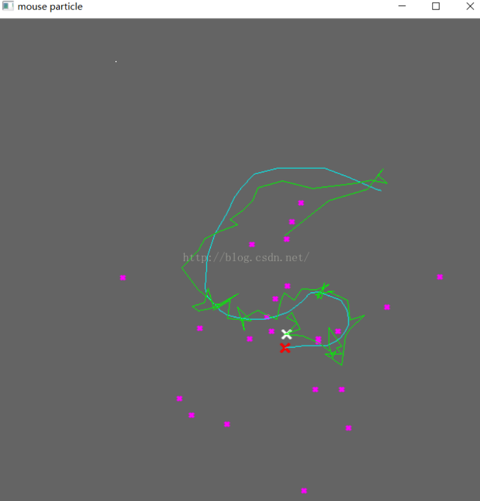

&emsp;&emsp;自`opencv 2.3`以后，`condensation`算法放在`legacy`中了，也就是说要引入下面的头文件：<!--more-->

``` cpp
#include <opencv2/legacy/legacy.hpp>
```

`condensation`算法的函数原型在`OpenCV/sources/modules/legacy/src`中，可以直接搜索`condens.cpp`。
&emsp;&emsp;整个`Condensation`算法只涉及`5`个变量和函数：

- `CvConDensation`
- `cvCreateConDensation`
- `cvConDensInitSampleSet`
- `cvConDensUpdateByTime`
- `cvReleaseConDensation`

`CvConDensation`结构体如下：

``` cpp
typedef struct CvConDensation {
    int MP; /* Dimension of measurement vector 测量向量的维数 */
    int DP; /* Dimension of state vector 状态向量的维数 */
    float *DynamMatr; /* Matrix of the linear Dynamics system 线性动态系统矩阵 */
    float *State; /* Vector of State 状态向量 */
    int SamplesNum; /* Number of the Samples 粒子数 */
    float **flSamples; /* array of the Sample Vectors 粒子向量数组 */
    float **flNewSamples; /* temporary array of the Sample Vectors 粒子向量临时数组 */
    float *flConfidence; /* Confidence for each Sample 每个粒子的置信度(译者注：也就是粒子的权值) */
    float *flCumulative; /* Cumulative confidence 权值的累计 */
    float *Temp; /* Temporary vector 临时向量 */
    float *RandomSample; /* RandomVector to update sample set 用来更新粒子集的随机向量 */
    CvRandState *RandS; /* Array of structures to generate random vectors 产生随机向量的结构数组 */
} CvConDensation;
```

这个是粒子结构体，`ConDens->flConfidence[i]`表示第`i`个粒子的权重，`ConDens->flSamples[i][k]`表示第`i`个粒子的状态向量的第`k`维的值。
&emsp;&emsp;`cvCreateConDensation`用于构造上述滤波器数据结构，输入参数分别是系统状态向量维数、测量向量维数以及粒子个数：

``` cpp
CvConDensation *cvCreateConDensation ( intDP, intMP, intSamplesNum );
```

&emsp;&emsp;`cvReleaseConDensation`用于释放滤波器占用的空间：

``` cpp
void cvReleaseConDensation ( CvConDensation **ConDensation );
```

&emsp;&emsp;`cvConDensInitSampleSet`用于初始化粒子集：

``` cpp
void cvConDensInitSampleSet ( CvConDensation *conDens, CvMat *lowerBound, CvMat *upperBound );
```

&emsp;&emsp;`cvConDensUpdateByTime`用于更新粒子集：

``` cpp
void cvConDensUpdateByTime ( CvConDensation *ConDens );
```

运行完上述函数之后，经重采样后的粒子保存在`flSamples`中，同时上次迭代的加权系统状态保存在`State`中。
&emsp;&emsp;以下代码实现了在窗口上对鼠标进行检测与跟踪：

``` cpp
#include <iostream>
#include <vector>
#include <opencv2/opencv.hpp>
#include <opencv2/highgui/highgui.hpp>
#include <opencv2/video/tracking.hpp>
#include <opencv2/legacy/legacy.hpp>

using namespace cv;
using namespace std;

#define drawCross( center, color, d )                               \
    line( img,  Point( center.x - d, center.y - d ),                \
          Point( center.x + d, center.y + d ), color, 2, CV_AA, 0); \
    line( img,  Point( center.x + d, center.y - d ),                \
          Point( center.x - d, center.y + d ), color, 2, CV_AA, 0 )

struct mouse_info_struct {
    int x, y;
};

struct mouse_info_struct mouse_info = { -1, -1}, last_mouse;

vector< Point> mouseV, particleV;
int counter = -1;

/* Define this to proceed one click at a time. */
#define PLOT_PARTICLES 1

void on_mouse ( int event, int x, int y, int flags, void *param ) {
#ifdef CLICK
    if ( event == CV_EVENT_LBUTTONUP )
#endif
    {
        last_mouse = mouse_info;
        mouse_info.x = x;
        mouse_info.y = y;
        counter = 0;
    }
}

int main ( int argc, char *const argv[] ) {
    Mat img ( 650, 650, CV_8UC3 );
    char code = ( char ) - 1;
    namedWindow ( "mouse particle" );
    setMouseCallback ( "mouse particle", on_mouse, 0 );
    Mat_<float> measurement ( 2, 1 );
    measurement.setTo ( Scalar ( 0 ) );
    int dim = 2;
    int nParticles = 25;
    float xRange = 650.0;
    float yRange = 650.0;
    float minRange[] = { 0, 0 };
    float maxRange[] = { xRange, yRange };
    CvMat LB, UB;
    cvInitMatHeader ( &LB, 2, 1, CV_32FC1, minRange );
    cvInitMatHeader ( &UB, 2, 1, CV_32FC1, maxRange );
    CvConDensation *condens = cvCreateConDensation ( dim, dim, nParticles );
    cvConDensInitSampleSet ( condens, &LB, &UB );
    /* The OpenCV documentation doesn't tell you to initialize this
       transition matrix, but you have to do it. For this 2D example,
       we're just using a 2x2 identity matrix. I'm sure there's a slicker
       way to do this, left as an exercise for the reader. */
    condens->DynamMatr[0] = 1.0;
    condens->DynamMatr[1] = 0.0;
    condens->DynamMatr[2] = 0.0;
    condens->DynamMatr[3] = 1.0;

    for ( ;; ) {
        if ( mouse_info.x < 0 || mouse_info.y < 0 ) {
            imshow ( "mouse particle", img );
            waitKey ( 30 );
            continue;
        }

        mouseV.clear();
        particleV.clear();

        for ( ;; ) {
            code = ( char ) waitKey ( 100 );

            if ( code > 0 ) {
                break;
            }

#ifdef CLICK
            if ( counter++ > 0 ) {
                continue;
            }
#endif
            measurement ( 0 ) = mouse_info.x;
            measurement ( 1 ) = mouse_info.y;
            Point measPt ( measurement ( 0 ), measurement ( 1 ) );
            mouseV.push_back ( measPt );
            /* Clear screen */
            img = Scalar::all ( 100 );

            for ( int i = 0; i < condens->SamplesNum; i++ ) {
                float diffX = ( measurement ( 0 ) - condens->flSamples[i][0] ) / xRange;
                float diffY = ( measurement ( 1 ) - condens->flSamples[i][1] ) / yRange;
                condens->flConfidence[i] = 1.0 / ( sqrt ( diffX * diffX + diffY * diffY ) );
                /* plot particles */
#ifdef PLOT_PARTICLES
                Point partPt ( condens->flSamples[i][0], condens->flSamples[i][1] );
                drawCross ( partPt, Scalar ( 255, 0, 255 ), 2 );
#endif
            }

            cvConDensUpdateByTime ( condens );
            Point statePt ( condens->State[0], condens->State[1] );
            particleV.push_back ( statePt );
            /* plot points */
            drawCross ( statePt, Scalar ( 255, 255, 255 ), 5 );
            drawCross ( measPt, Scalar ( 0, 0, 255 ), 5 );

            for ( int i = 0; i < mouseV.size() - 1; i++ ) {
                line ( img, mouseV[i], mouseV[i + 1], Scalar ( 255, 255, 0 ), 1 );
            }

            for ( int i = 0; i < particleV.size() - 1; i++ ) {
                line ( img, particleV[i], particleV[i + 1], Scalar ( 0, 255, 0 ), 1 );
            }

            imshow ( "mouse particle", img );
        }

        if ( code == 27 || code == 'q' || code == 'Q' ) {
            break;
        }
    }

    return 0;
}
```

