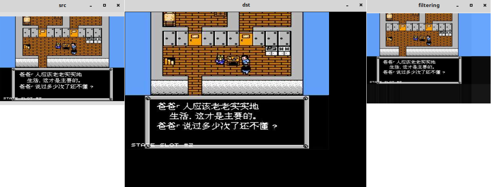
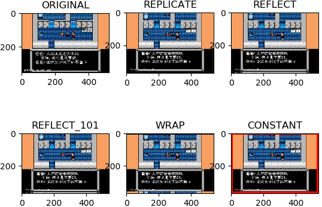

&emsp;&emsp;其作用是复制图像并且制作边界(处理边界卷积)：<!--more-->

``` cpp
void cvCopyMakeBorder (
    const CvArr *src, CvArr *dst, CvPoint offset,
    int bordertype, CvScalar value = cvScalarAll ( 0 ));
```

- `src`：输入图像。
- `dst`：输出图像。
- `offset`：输入图像(或者其`ROI`)欲拷贝到的输出图像长方形的左上角坐标(如果以左下角为原点，那就是左下角坐标)。
- `bordertype`：已拷贝的原图像长方形的边界的类型：

1. `IPL_BORDER_CONSTANT`：填充边界为固定值，值由函数最后一个参数指定。
2. `IPL_BORDER_REPLICATE`：边界用上下行或者左右列来复制填充。

其他两种`IPL`边界类型`IPL_BORDER_REFLECT`和`IPL_BORDER_WRAP`现已不支持。

- `value`：如果边界类型为`IPL_BORDER_CONSTANT`，那么此为边界像素的值。

``` cpp
#include "highgui.h"
#include "cv.h"

int main ( int argc, char **argv ) {
    IplImage *src, *dst;
    src = cvLoadImage ( "timg1.jpg", -1 );
    dst = cvCreateImage ( cvSize ( src->width + 100, src->height + 100 ), IPL_DEPTH_8U, 3 );
    cvNamedWindow ( "src", 0 );
    cvShowImage ( "src", src );
    cvNamedWindow ( "filtering", 0 );
    cvCopyMakeBorder ( src, dst, cvPoint ( 1, 1 ), IPL_BORDER_CONSTANT ); /* 填充边界固定值，黑色 */
    cvShowImage ( "dst", dst );
    cvCopyMakeBorder ( src, dst, cvPoint ( 1, 1 ), IPL_BORDER_REPLICATE ); /* 复制边界 */
    cvShowImage ( "filtering", dst );
    cvWaitKey ( 0 );
    cvReleaseImage ( &src );
    cvReleaseImage ( &dst );
    cvDestroyAllWindows();
    return ( 0 );
}
```



---

### 为图像扩边

&emsp;&emsp;如果你想在图像周围创建一个边，就像相框一样，可以使用`cv2.copyMakeBorder`函数，这经常在卷积运算或`0`填充时被用到。这个函数包括如下参数：`src`是输入图像；`top`、`bottom`、`left`和`right`对应边界的像素数目；`borderType`是要添加那种类型的边界，类型如下：

- `cv2.BORDER_CONSTANT`：添加有颜色的常数值边界，还需要下一个参数(`value`)。
- `cv2.BORDER_REFLECT`：边界元素的镜像，例如`fedcba | abcdefgh | hgfedcb`。
- `cv2.BORDER_REFLECT_101`或`cv2.BORDER_DEFAULT`：和上面一样，但稍作改动，例如`gfedcb | abcdefgh | gfedcba`。
- `cv2.BORDER_REPLICATE`：重复最后一个元素，例如`aaaaaa | abcdefgh | hhhhhhh`。
- `cv2.BORDER_WRAP`：例如`cdefgh | abcdefgh | abcdefg`。

``` python
import cv2
from matplotlib import pyplot as plt

BLUE = [255, 0, 0]
img1 = cv2.imread('timg1.jpg')
replicate = cv2.copyMakeBorder(img1, 10, 10, 10, 10, cv2.BORDER_REPLICATE)
reflect = cv2.copyMakeBorder(img1, 10, 10, 10, 10, cv2.BORDER_REFLECT)
reflect101 = cv2.copyMakeBorder(img1, 10, 10, 10, 10, cv2.BORDER_REFLECT_101)
wrap = cv2.copyMakeBorder(img1, 10, 10, 10, 10, cv2.BORDER_WRAP)
constant = cv2.copyMakeBorder(img1, 10, 10, 10, 10, cv2.BORDER_CONSTANT, value=BLUE)
plt.subplot(231), plt.imshow(img1, 'gray'), plt.title('ORIGINAL')
plt.subplot(232), plt.imshow(replicate, 'gray'), plt.title('REPLICATE')
plt.subplot(233), plt.imshow(reflect, 'gray'), plt.title('REFLECT')
plt.subplot(234), plt.imshow(reflect101, 'gray'), plt.title('REFLECT_101')
plt.subplot(235), plt.imshow(wrap, 'gray'), plt.title('WRAP')
plt.subplot(236), plt.imshow(constant, 'gray'), plt.title('CONSTANT')
plt.show()
```



由于是使用`matplotlib`绘制，所以交换`R`和`B`的位置。`OpenCV`中是按照`BGR`，`matplotlib`中是按照`RGB`排列。