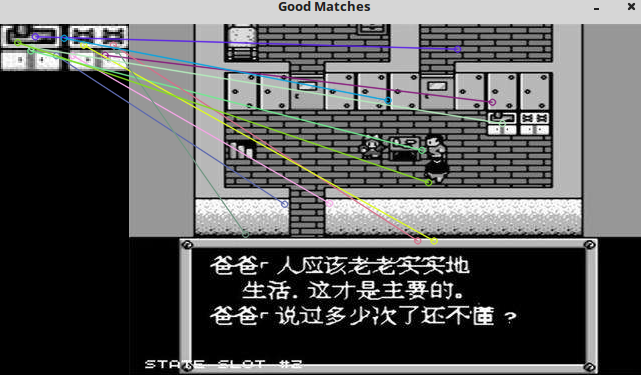
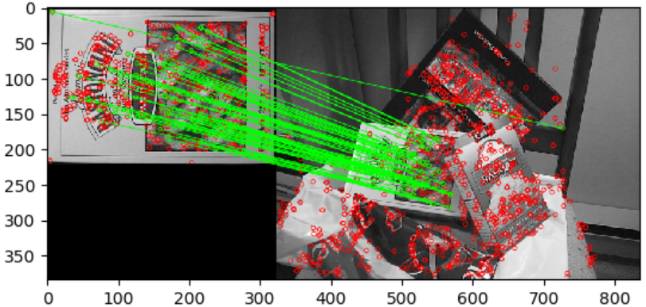

&emsp;&emsp;`FLANN`库全称是`Fast Library for Approximate Nearest Neighbors`，它是目前最完整的最近邻开源库。不但实现了一系列查找算法，还包含了一种自动选取最快算法的机制。<!--more-->

### flann::Index类

&emsp;&emsp;该类模板是最近邻索引类，该类用于抽象不同类型的最近邻搜索的索引。以下是`flann::Index_`类的声明：

``` cpp
template <typename T> class
#ifndef _MSC_VER
    FLANN_DEPRECATED
#endif
    Index_ {
public:
    typedef typename L2<T>::ElementType ElementType;
    typedef typename L2<T>::ResultType DistanceType;

    Index_ ( const Mat &features, const ::cvflann::IndexParams &params );
    ~Index_();

    void knnSearch ( const vector<ElementType> &query, vector<int> &indices, \
        vector<DistanceType> &dists, int knn, const ::cvflann::SearchParams &params );
    void knnSearch ( const Mat &queries, Mat &indices, Mat &dists, int knn, \
        const ::cvflann::SearchParams &params );
    int radiusSearch ( const vector<ElementType> &query, vector<int> &indices, \
        vector<DistanceType> &dists, DistanceType radius, const ::cvflann::SearchParams &params );
    int radiusSearch ( const Mat &query, Mat &indices, Mat &dists, \
        DistanceType radius, const ::cvflann::SearchParams &params );

    void save ( std::string filename ) {
        if ( nnIndex_L1 ) {
            nnIndex_L1->save ( filename );
        }

        if ( nnIndex_L2 ) {
            nnIndex_L2->save ( filename );
        }
    }

    int veclen() const {
        if ( nnIndex_L1 ) {
            return nnIndex_L1->veclen();
        }

        if ( nnIndex_L2 ) {
            return nnIndex_L2->veclen();
        }
    }

    int size() const {
        if ( nnIndex_L1 ) {
            return nnIndex_L1->size();
        }

        if ( nnIndex_L2 ) {
            return nnIndex_L2->size();
        }
    }

    ::cvflann::IndexParams getParameters() {
        if ( nnIndex_L1 ) {
            return nnIndex_L1->getParameters();
        }

        if ( nnIndex_L2 ) {
            return nnIndex_L2->getParameters();
        }
    }

    FLANN_DEPRECATED const ::cvflann::IndexParams *getIndexParameters() {
        if ( nnIndex_L1 ) {
            return nnIndex_L1->getIndexParameters();
        }

        if ( nnIndex_L2 ) {
            return nnIndex_L2->getIndexParameters();
        }
    }

private:
    /* providing backwards compatibility for L2 and L1 distances (most common) */
    ::cvflann::Index< L2<ElementType> > *nnIndex_L2;
    ::cvflann::Index< L1<ElementType> > *nnIndex_L1;
};
```

### 构造函数flann::Index\_::Index\_

&emsp;&emsp;函数原型如下：

``` cpp
flann::Index_<T>::Index_ ( const Mat &features, const IndexParams &params )
/* Parameters:
   features – Matrix of containing the features(points) to index.
              The size of the matrix is num_features x feature_dimensionality and
              the data type of the elements in the matrix must coincide with the type of the index.
   params – Structure containing the index parameters.
            The type of index that will be constructed depends on
            the type of this parameter. */
```

参数`features`是包含用于构建索引的特征的矩阵，参数`params`是包含索引参数的结构。该构造函数所实例的快速搜索结构是根据参数`params`所指定的特定算法来构建的。`params`是由`IndexParams`的派生类的引用。

- `LinearIndexParams`：该结构对应的索引进行线性的、暴力(`brute-force`)的搜索。
- `KDTreeIndexParams`：该方法对应的索引结构由一组随机`kd`树构成(`randomized kd-trees`)，它可以平行地进行搜索。

``` cpp
/* trees: The number of parallel kd-trees to use.
   Good values are in the range */
struct KDTreeIndexParams : public IndexParams {
    KDTreeIndexParams ( int trees = 4 );
};
```

- `KMeansIndexParams`：该方法对应的索引结构是一个层次`k`均值树(`a hierarchical k-means tree`)。

``` cpp
struct KMeansIndexParams : public IndexParams {
    KMeansIndexParams (
        int branching = 32, int iterations = 11,
        flann_centers_init_t centers_init = CENTERS_RANDOM,
        float cb_index = 0.2 );
};
```

- `CompositeIndexParams`：该结构结合随机`kd`树和层次`k`均值树来构建索引。

``` cpp
struct CompositeIndexParams : public IndexParams {
    CompositeIndexParams (
        int trees = 4, int branching = 32, int iterations = 11,
        flann_centers_init_t centers_init = CENTERS_RANDOM,
        float cb_index = 0.2 );
};
```

- `LshIndexParams`：该结构使用`multi-probe LSH`方法创建索引。

``` cpp
struct LshIndexParams : public IndexParams {
    LshIndexParams (
        unsigned int table_number,
        unsigned int key_size,
        unsigned int multi_probe_level );
};
```

- `AutotunedIndexParams`：该结构是根据数据自动选取最优的索引类型来提供最好的性能。

``` cpp
struct AutotunedIndexParams : public IndexParams {
    AutotunedIndexParams (
        float target_precision = 0.9, float build_weight = 0.01,
        float memory_weight = 0, float sample_fraction = 0.1 );
};
```

- `SavedIndexParams`：该结构用于加载存放在硬盘的索引结构。

``` cpp
/* filename:The filename in which the index was saved. */
struct SavedIndexParams : public IndexParams {
    SavedIndexParams ( std::string filename );
};
```

### flann::Index_::knnSearch

&emsp;&emsp;根据给定的查询数据，利用构建的索引来执行`k`近邻搜索。

``` cpp
void flann::Index_<T>::knnSearch (
    const vector<T> &query, vector<int> &indices,
    vector<float> &dists, int knn, const SearchParams &params );

void flann::Index_<T>::knnSearch (
    const Mat &queries, Mat &indices, Mat &dists,
    int knn, const SearchParams &params );
```

### flann::Index_::radiusSearch

&emsp;&emsp;根据给定的查询数据，执行基于半径的最近邻搜索。

``` cpp
int flann::Index_<T>::radiusSearch (
    const vector<T> &query, vector<int> &indices,
    vector<float> &dists, float radius, const SearchParams &params );

int flann::Index_<T>::radiusSearch (
    const Mat &query, Mat &indices, Mat &dists,
    float radius, const SearchParams &params );
```

### flann::Index_::save

&emsp;&emsp;将索引存成文件。

``` cpp
void flann::Index_<T>::save ( std::string filename );
```

### flann::Index_::getIndexParameters

&emsp;&emsp;得到索引参数。

``` cpp
const IndexParams *flann::Index_<T>::getIndexParameters();
```

### 利用FLANN进行特征点匹配

&emsp;&emsp;接下来给出一段官方示例程序，使用`FlannBasedMatcher`接口以及函数`FLANN`实现快速高效匹配。这段代码的主要流程分为以下几部分：

- 使用`SURF`特征提取关键点。
- 计算`SURF`特征描述子。
- 使用`FLANN`匹配器进行描述子向量匹配。

### OpenCV中KeyPoint Matching的方法

&emsp;&emsp;`OpenCV`提供了两种`Matching`方式：

- `Brute-force`：`matcher ( cv::BFMatcher );`，用暴力方法找到点集一中每个`descriptor`在点集二中距离最近的`descriptor`。
- `Flann-based`：`matcher ( cv::FlannBasedMatcher );`，使用快速近似最近邻搜索算法进行寻找。

&emsp;&emsp;为了提高检测速度，你可以调用`matching`函数前，先训练一个`matcher`。训练过程可以首先使用`cv::FlannBasedMatcher`来优化，为`descriptor`建立索引树，这种操作将在匹配大量数据时发挥巨大作用(比如在上百幅图像的数据集中查找匹配图像)。而`Brute-force matcher`在这个过程并不进行操作，它只是将`train descriptors`保存在内存中。

``` cpp
#include <stdio.h>
#include <iostream>
#include "opencv2/core/core.hpp"
#include "opencv2/highgui/highgui.hpp"
#include "opencv2/nonfree/features2d.hpp"

using namespace cv;

int main ( int argc, char **argv ) {
    Mat img_1 = imread ( "desk.jpg", CV_LOAD_IMAGE_GRAYSCALE );
    Mat img_2 = imread ( "timg1.jpg", CV_LOAD_IMAGE_GRAYSCALE );

    if ( !img_1.data || !img_2.data ) {
        std::cout << " --(!) Error reading images " << std::endl;
        return -1;
    }

    /* Step 1: Detect the keypoints using SURF Detector */
    int minHessian = 400;
    SurfFeatureDetector detector ( minHessian );
    std::vector<KeyPoint> keypoints_1, keypoints_2;
    detector.detect ( img_1, keypoints_1 );
    detector.detect ( img_2, keypoints_2 );
    /* Step 2: Calculate descriptors (feature vectors) */
    SurfDescriptorExtractor extractor;
    Mat descriptors_1, descriptors_2;
    extractor.compute ( img_1, keypoints_1, descriptors_1 );
    extractor.compute ( img_2, keypoints_2, descriptors_2 );
    /* Step 3: Matching descriptor vectors using FLANN matcher */
    FlannBasedMatcher matcher;
    std::vector< DMatch > matches;
    matcher.match ( descriptors_1, descriptors_2, matches );
    double max_dist = 0;
    double min_dist = 100;

    /* Quick calculation of max and min distances between keypoints */
    for ( int i = 0; i < descriptors_1.rows; i++ ) {
        double dist = matches[i].distance;

        if ( dist < min_dist ) {
            min_dist = dist;
        }

        if ( dist > max_dist ) {
            max_dist = dist;
        }
    }

    printf ( "-- Max dist : %f \n", max_dist );
    printf ( "-- Min dist : %f \n", min_dist );
    /* Draw only "good" matches (i.e. whose distance is less than 2*min_dist)
       PS. radiusMatch can also be used here. */
    std::vector< DMatch > good_matches;

    for ( int i = 0; i < descriptors_1.rows; i++ ) {
        if ( matches[i].distance < 2 * min_dist ) {
            good_matches.push_back ( matches[i] );
        }
    }

    /* Draw only "good" matches */
    Mat img_matches;
    drawMatches (
        img_1, keypoints_1, img_2, keypoints_2, good_matches, img_matches, Scalar::all ( -1 ),
        Scalar::all ( -1 ), vector<char>(), DrawMatchesFlags::NOT_DRAW_SINGLE_POINTS );
    /* Show detected matches */
    imshow ( "Good Matches", img_matches );

    for ( int i = 0; i < good_matches.size(); i++ ) {
        printf (
            "-- Good Match [%d] Keypoint 1: %d  -- Keypoint 2: %d\n", \
            i, good_matches[i].queryIdx, good_matches[i].trainIdx );
    }

    waitKey ( 0 );
    return 0;
}
```



执行结果：

``` cpp
-- Max dist : 0.416223
-- Min dist : 0.138605
-- Good Match [0] Keypoint 1: 1  -- Keypoint 2: 86
-- Good Match [1] Keypoint 1: 3  -- Keypoint 2: 109
-- Good Match [2] Keypoint 1: 10  -- Keypoint 2: 120
-- Good Match [3] Keypoint 1: 12  -- Keypoint 2: 1357
-- Good Match [4] Keypoint 1: 13  -- Keypoint 2: 550
-- Good Match [5] Keypoint 1: 14  -- Keypoint 2: 960
-- Good Match [6] Keypoint 1: 15  -- Keypoint 2: 932
-- Good Match [7] Keypoint 1: 20  -- Keypoint 2: 336
-- Good Match [8] Keypoint 1: 21  -- Keypoint 2: 558
-- Good Match [9] Keypoint 1: 23  -- Keypoint 2: 574
-- Good Match [10] Keypoint 1: 24  -- Keypoint 2: 1170
```

&emsp;&emsp;`python`代码如下：

``` python
import numpy as np
import cv2
from matplotlib import pyplot as plt

img1 = cv2.imread('box.png', 0)  # queryImage
img2 = cv2.imread('box_in_scene.png', 0)  # trainImage

# Initiate SIFT detector
sift = cv2.xfeatures2d.SIFT_create()

# find the keypoints and descriptors with SIFT
kp1, des1 = sift.detectAndCompute(img1, None)
kp2, des2 = sift.detectAndCompute(img2, None)

# FLANN parameters
FLANN_INDEX_KDTREE = 0
index_params = dict(algorithm=FLANN_INDEX_KDTREE, trees=5)
search_params = dict(checks=50)  # or pass empty dictionary

flann = cv2.FlannBasedMatcher(index_params, search_params)
matches = flann.knnMatch(des1, des2, k=2)
# Need to draw only good matches, so create a mask
matchesMask = [[0, 0] for i in range(len(matches))]

# ratio test as per Lowe's paper
for i, (m, n) in enumerate(matches):
    if m.distance < 0.7 * n.distance:
        matchesMask[i] = [1, 0]

draw_params = dict(matchColor=(0, 255, 0), singlePointColor=(255, 0, 0), \
                   matchesMask=matchesMask, flags=0)

img3 = cv2.drawMatchesKnn(img1, kp1, img2, kp2, matches, None, **draw_params)

plt.imshow(img3, ), plt.show()
```

