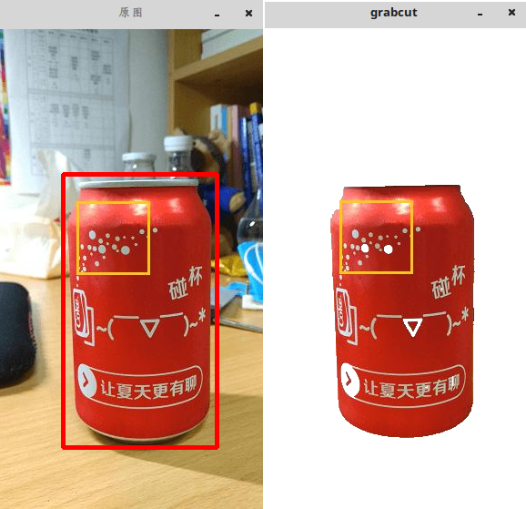

&emsp;&emsp;在`opencv`中，`GrabCut`算法由`grabCut`函数实现：<!--more-->

``` cpp
void grabCut (
    InputArray image, InputOutputArray mask,
    Rect rect, InputOutputArray bgdModel,
    InputOutputArray fgdModel, int iterCount, int mode);
```

- `image`：输入`8`位`3`通道图像。
- `mask`：输入或输出的`8`位单通道`mask`。当`mode`设为`GC_INIT_WITH_RECT`时，由函数初始化；当`mode`设为`GC_INIT_WITH_MASK`，允许用户输入自己标记的掩码。`mask`的取值为以下四种：

Mask        | 说明
------------|-----
`GC_BGD`    | defines an obvious background pixels.
`GC_FGD`    | defines an obvious foreground (object) pixel.
`GC_PR_BGD` | defines a possible background pixel.
`GC_PR_FGD` | defines a possible foreground pixel.

- `rect`：包含前景的矩形。
- `bgdModel`：背景模型。
- `fgdModel`：前景模型。
- `iterCount`：迭代次数。
- `mode`：操作代码，可能为以下值：

1. `GC_INIT_WITH_RECT`：矩形框初始化函数。
2. `GC_INIT_WITH_MASK`：`mask`初始化函数。
3. `GC_EVAL`：执行分割。

``` cpp
#include "highgui.h"
#include "cv.h"

using namespace cv;

Rect selection;
Mat img, img0;
Point prePt ( -1, -1 );

void onMouse ( int event, int x, int y, int flags, void *param ) {
    if ( event == CV_EVENT_LBUTTONDOWN ) {
        prePt = Point ( x, y );
    } else if ( event == CV_EVENT_MOUSEMOVE && ( flags && CV_EVENT_FLAG_LBUTTON ) ) {
        img = img0.clone();
        rectangle ( img, Rect ( prePt.x, prePt.y, abs ( x - prePt.x ), abs ( y - prePt.y ) ), \
                    Scalar ( 0, 0, 255 ), 3 );
        selection = Rect ( prePt.x, prePt.y, abs ( x - prePt.x ), abs ( y - prePt.y ) );
    } else if ( event == CV_EVENT_LBUTTONUP || ! ( flags & CV_EVENT_FLAG_LBUTTON ) ) {
        prePt = Point ( -1, -1 );
    }

    imshow ( "原图", img );
}

int main() {
    img = imread ( "kele.JPG", 1 );
    img0 = img.clone();
    imshow ( "原图", img );
    setMouseCallback ( "原图", onMouse );
    Mat result;
    Mat bgModel, fgModel; /* 背景和前景 */

    for ( ;; ) {
        int c = waitKey ( 10 );

        if ( ( char ) c == 'p' ) {
            grabCut ( img0, result, selection, bgModel, fgModel, 5, GC_INIT_WITH_RECT );
            compare ( result, GC_PR_FGD, result, CMP_EQ ); /* 得到前景mask */
            Mat foreground ( img.size(), CV_8UC3, Scalar::all ( 255 ) );
            img0.copyTo ( foreground, result );
            imshow ( "grabcut", foreground );
        }

        if ( char ( c ) == 'q' ) {
            return 0;
        }
    }

    return 0;
}
```

