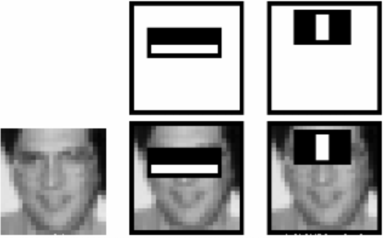

&emsp;&emsp;以`Haar`特征分类器为基础的对象检测技术是一种非常有效的对象检测技术。它是基于机器学习的，通过使用大量的正负样本图像训练得到一个`cascade function`，最后再用它来做对象检测。<!--more-->
&emsp;&emsp;现在我们来学习面部检测。开始时，算法需要大量的正样本图像(面部图像)和负样本图像(不含面部的图像)来训练分类器，我们需要从其中提取特征。下图中的`Haar`特征会被使用，它们就像我们的卷积核。每一个特征是一个值，这个值等于黑色矩形中的像素值之后减去白色矩形中的像素值之和。


&emsp;&emsp;使用所有可能的核来计算足够多的特征(想象一下这需要多少计算量，仅仅是一个`24 * 24`的窗口就有`160000`个特征)。对于每一个特征的计算，我们需要计算白色和黑色矩形内的像素和。为了解决这个问题，作者引入了积分图像，这可以大大地简化求和运算。对于任何一个区域的像素和，只需要对积分图像上的四个像素操作即可。非常漂亮，它可以使运算速度飞快。但是，在我们计算得到的所有的这些特征中，大多数是不相关的，如下图所示。上边一行显示了两个好的特征，第一个特征看上去是对眼部周围区域的描述，因为眼睛总是比鼻子黑一些；第二个特征是描述的是眼睛比鼻梁要黑一些。



&emsp;&emsp;但是如果把这两个窗口放到脸颊的话，就一点都不相关了。那么我们怎样从超过`160000`个特征中选出最好的特征呢？可以使用`Adaboost`算法。
&emsp;&emsp;为了达到这个目的，我们将每一个特征应用于所有的训练图像。对于每一个特征，我们要找到它能够区分出正样本和负样本的最佳阈值。但是很明显，这会产生错误或者错误分类。我们要选取错误率最低的特征，这说明它们是检测面部和非面部图像最好的特征(这个过程其实不像我们说的这么简单，在开始时每一张图像都具有相同的权重，每一次分类之后，被错分的图像的权重会增大。同样的过程会被再做一遍，然后我们又得到新的错误率和新的权重。重复执行这个过程，直到到达要求的准确率(或者错误率)或者找到要求数目的特征。
&emsp;&emsp;最终的分类器是这些弱分类器的加权和。之所以成为弱分类器，是因为只是用这些分类器不足以对图像进行分类，但是与其他的分类器联合起来就是一个很强的分类器了。经过实验，`200`个特征就能够提供`95%`的准确度了。他们最后使用`6000`个特征(从`160000`减到`6000`，效果显著)。
&emsp;&emsp;现在你有一幅图像，对每一个`24 * 24`的窗口使用这`6000`个特征来做检查，看它是不是面部。这是不是很低效、很耗时呢？的确如此，但作者有更好的解决方法。
&emsp;&emsp;在一幅图像中，大多数区域是非面部区域，所以最好有一个简单的方法来证明这个窗口不是面部区域。如果不是，就直接抛弃，不用对它再做处理，而不是集中在研究这个区域是不是面部。按照这种方法，我们可以在可能是面部的区域多花点时间。
&emsp;&emsp;为了达到这个目的，作者提出了级联分类器的概念。不是在一开始就对窗口进行这`6000`个特征测试，而是将这些特征分成不同组，在不同的分类阶段逐个使用。如果一个窗口第一阶段的检测都过不了，就可以直接放弃后面的测试了；如果它通过了，就进入第二阶段的检测。如果一个窗口经过了所有的测试，那么这个窗口就被认为是面部区域。
&emsp;&emsp;作者将`6000`多个特征分为`38`个阶段，前五个阶段的特征数分别为`1`、`10`、`25`、`25`和`50`(上图中的两个特征其实就是从`Adaboost`获得的最好特征)。

### OpenCV中的Haar级联检测

&emsp;&emsp;`OpenCV`自带了训练器和检测器。如果你想自己训练一个分类器来检测汽车、飞机等的话，可以使用`OpenCV`构建。
&emsp;&emsp;现在我们来学习一下如何使用检测器。`OpenCV`已经包含了很多已经训练好的分类器，其中包括面部、眼睛、微笑等。这些`XML`文件保存在`opencv/data/haarcascades/`文件夹中。下面我们将使用`OpenCV`创建一个面部和眼部检测器。
&emsp;&emsp;首先我们要加载需要的`XML`分类器，然后以灰度格式加载输入图像或者是视频。如果检测到面部，它会返回面部所在的矩形区域`Rect(x, y, w, h)`。一旦我们获得这个位置，就可以创建一个`ROI`，并在其中进行眼部检测(谁让眼睛长在脸上呢)：

``` python
import cv2

face_cascade = cv2.CascadeClassifier('haarcascade_frontalface_default.xml')
eye_cascade = cv2.CascadeClassifier('haarcascade_eye.xml')
img = cv2.imread('face.jpg')
gray = cv2.cvtColor(img, cv2.COLOR_BGR2GRAY)

# Detects objects of different sizes in the input image.
# The detected objects are returned as a list of rectangles.
# cv2.CascadeClassifier.detectMultiScale(image, scaleFactor, minNeighbors, flags, minSize, maxSize)
# scaleFactor – Parameter specifying how much the image size is reduced at each image scale.
# minNeighbors – Parameter specifying how many neighbors each candidate rectangle should
# have to retain it.
# minSize – Minimum possible object size. Objects smaller than that are ignored.
# maxSize – Maximum possible object size. Objects larger than that are ignored.
faces = face_cascade.detectMultiScale(gray, 1.3, 5)

for (x, y, w, h) in faces:
    img = cv2.rectangle(img, (x, y), (x + w, y + h), (255, 0, 0), 2)
    roi_gray = gray[y:y + h, x:x + w]
    roi_color = img[y:y + h, x:x + w]
    eyes = eye_cascade.detectMultiScale(roi_gray)

    for (ex, ey, ew, eh) in eyes:
        cv2.rectangle(roi_color, (ex, ey), (ex + ew, ey + eh), (0, 255, 0), 2)

cv2.imshow('img', img)
cv2.waitKey(0)
cv2.destroyAllWindows()
```

