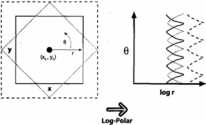
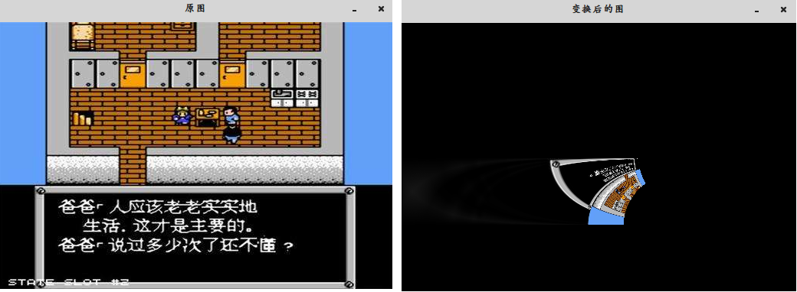

&emsp;&emsp;对于二维图像，`Log-Polar`转换表示从笛卡尔坐标到极坐标的变换。左图三个方框是我们想要识别成`正方形`的形状，对数极坐标变换见右图。观察到在$(x, y)$平面内尺寸的差异被旋换为对数极坐标平面内沿着$log(r)$轴的位移，旋转差异被转换成对数极坐标平面沿$θ$轴的位移。如果我们将对数极坐标平面上每一个变换方形的转换中心，重新移动到一个固定的中心位置，那么所有正方形都是一样的。这就产生了一类二维旋转和尺度的不变性。<!--more-->



&emsp;&emsp;`OpenCV`中关于对数极坐标变换的函数是`cvLogPolar`：

``` cpp
void cvLogPolar (
    const CvArr *src,
    CvArr *dst, /* src和dst是单通道或者是三通道的彩色和灰度图像 */
    CvPoint2D32f center, /* 对数极坐标变换的中心点 */
    double m, /* m是个缩放比例 */
    int flags = CV_INTER_LINEAR | CV_WARP_WARP_OUTLIERS /* 一些图像的插值方法 */
);
```

示例代码如下：

``` cpp
#include "cv.h"
#include "highgui.h"

using namespace std;

int main() {
    IplImage *src = cvLoadImage ( "timg1.jpg", CV_LOAD_IMAGE_UNCHANGED );
    IplImage *dst = cvCreateImage ( cvGetSize ( src ), IPL_DEPTH_8U, 3 );
    CvPoint2D32f center = cvPoint2D32f ( src->width, src->height );
    double m = 50.0;
    cvLogPolar ( src, dst, center, m, CV_INTER_LINEAR + CV_WARP_FILL_OUTLIERS );
    cvNamedWindow ( "原图", CV_WINDOW_AUTOSIZE );
    cvShowImage ( "原图", src );
    cvNamedWindow ( "变换后的图", CV_WINDOW_AUTOSIZE );
    cvShowImage ( "变换后的图", dst );
    cvWaitKey();
    cvReleaseImage ( &src );
    cvReleaseImage ( &dst );
    cvDestroyWindow ( "原图" );
    cvDestroyWindow ( "变换后的图" );
    return 0;
}
```

