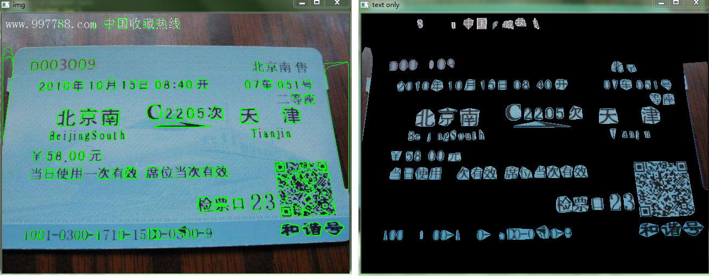

&emsp;&emsp;`MSER`(`Maximally Stable Extrernal Regions`)是区域检测中影响最大的算法。<!--more-->
&emsp;&emsp;`MSER`基于分水岭的概念：对图像进行二值化，二值化阈值取$[0, 255]$，这样二值化图像就经历一个从全黑到全白的过程(就像水位不断上升的俯瞰图)。在这个过程中，有些连通区域面积随阈值上升的变化很小，这种区域就叫`MSER`。公式如下：

$$
v(i) = \frac{|Q_{i + \Delta} - Q_{i - \Delta}|}{|Q_i|}
$$

其中$Q_i$表示第`i`个连通区域的面积，$\Delta$表示微小的阈值变化(注水)，当$v(i)$小于给定阈值时，认为该区域为`MSER`。
&emsp;&emsp;显然，这样检测得到的`MSER`内部灰度值是小于边界的，想象一幅黑色背景白色区域的图片，显然这个区域是检测不到的。因此对原图进行一次`MSER`检测后需要将其反转，再做一次`MSER`检测，两次操作又称`MSER+`和`MSER-`。

``` python
import cv2
import numpy as np

mser = cv2.MSER_create()  # Create MSER object
img = cv2.imread('ticket.jpg')  # Your image path i-e receipt path
gray = cv2.cvtColor(img, cv2.COLOR_BGR2GRAY)  # Convert to gray scale
vis = img.copy()
regions, _ = mser.detectRegions(gray)  # detect regions in gray scale image
hulls = [cv2.convexHull(p.reshape(-1, 1, 2)) for p in regions]
cv2.polylines(vis, hulls, 1, (0, 255, 0))
cv2.imshow('img', vis)

mask = np.zeros((img.shape[0], img.shape[1], 1), dtype=np.uint8)

for contour in hulls:
    cv2.drawContours(mask, [contour], -1, (255, 255, 255), -1)

# this is used to find only text regions, remaining are ignored
text_only = cv2.bitwise_and(img, img, mask=mask)
cv2.imshow("text only", text_only)
cv2.waitKey(0)
```



<!--  -->