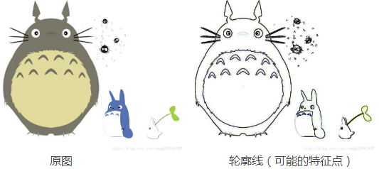
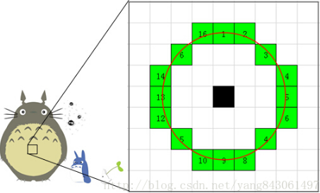
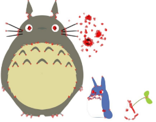
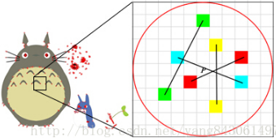
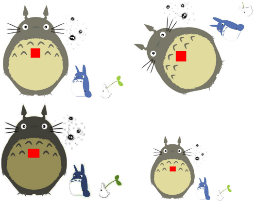
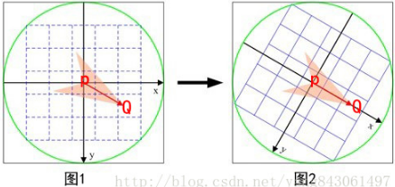
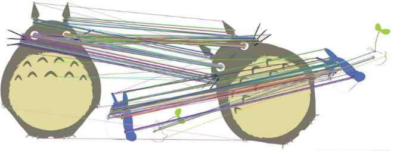

&emsp;&emsp;假如我有`2`张美女图片，我想确认这`2`张图片中美女是否是同一个人。这太简单了，我只需轻轻扫过`2`张图片就可以得出结论。但如果我想让计算机来完成这个功能就困难重重了：再性感的美女在计算机眼中也只是`0`和`1`组成的数据而已。一种可行的方法是找出`2`张图片中的特征点，描述这些特征点的属性，然后比较这`2`幅图片的特征点的属性。如果有足够多的特征点具有相同的属性，那么就可以认为`2`幅图片中的美女是同一个人。下面来看看`ORB`算法如何完成这这个过程。<!--more-->

### 特征点的检测

&emsp;&emsp;图像的特征点可以简单的理解为图像中比较显著显著的点，如轮廓点、较暗区域中的亮点和较亮区域中的暗点等。



`ORB`采用`FAST`(`features from accelerated segment test`)算法来检测特征点。`FAST`核心思想就是找出那些点，即拿一个点跟它周围的点比较，如果它和其中大部分的点都不一样，就可以认为它是一个特征点。



注意，每个小方格代表一个像素，方格内的颜色只是为了便于区分，不代表该像素点的颜色。
&emsp;&emsp;`FAST`具体计算过程如下：

1. 从图片中选取一个像素点`P`，下面我们将判断它是否是一个特征点。我们首先把它的密度(即灰度值)设为`Ip`。
2. 设定一个合适的阙值`t`，当`2`个点的灰度值之差的绝对值大于`t`时，我们认为这`2`个点不相同。
3. 考虑该像素点周围的`16`个像素(见上图)。
4. 现在如果这`16`个点中有连续的`n`个点都和点不同，那么它就是一个角点。 这里`n`设定为`12`。
5. 我们现在提出一个高效的测试，来快速排除一大部分非特征点的点。该测试仅仅检查在位置`1`、`9`、`5`和`13`四个位置的像素。首先检查`1`和`9`，看它们是否和点相同。如果是，再检查`5`和`13`。如果是一个角点，那么上述四个像素点中至少有`3`个应该和点相同。如果都不满足，那么不可能是一个角点。 图中红色的点为使用`FAST`算法找到的特征点。



### 特征点的描述

#### 计算特征描述子

&emsp;&emsp;得到特征点后，我们需要以某种方式`F`描述这些特征点的属性。这些属性的输出我们称之为`该特征点的描述子`(`Feature DescritorS`)。`ORB`采用`BRIEF`算法来计算一个特征点的描述子。`BRIEF`算法的核心思想是在关键点`P`的周围以一定模式选取`N`个点对，把这`N`个点对的比较结果组合起来作为描述子。



具体来讲分为以下几步：

&emsp;&emsp;1. 以关键点`P`为圆心，以`d`为半径做圆`O`。
&emsp;&emsp;2. 在圆`O`内某一模式选取`N`个点对。这里为方便说明，`N`取`4`；在实际应用中，`N`可以取`512`。假设当前选取的`4`个点对如上图所示分别标记为`P1(A, B)`、`P2(A, B)`、`P3(A, B)`和`P4(A, B)`。
&emsp;&emsp;3. 定义操作`T`：

$$
T(P(A, B)) = \left\{\begin{matrix}
1 & I_A >    I_B\\
0 & I_A \leq I_B
\end{matrix}\right.
$$

其中`IA`表示点`A`的灰度。
&emsp;&emsp;4. 分别对已选取的点对进行`T`操作，将得到的结果进行组合。假如：

``` cpp
T(P1(A, B)) = 1
T(P2(A, B)) = 0
T(P3(A, B)) = 1
T(P4(A, B)) = 1
```

则最终的描述子为`1011`。

### 理想特征点描述的属性

&emsp;&emsp;在现实生活中，我们从不同的距离、不同的方向和角度以及不同的光照条件下观察一个物体时，物体的大小、形状、明暗都会有所不同，但我们的大脑依然可以判断它是同一件物体。理想的特征描述子应该具备这些性质，即在大小、方向、明暗不同的图像中，同一特征点应具有足够相似的描述子，称之为`描述子的可复现性`。



&emsp;&emsp;当以某种理想的方式分别计算上图中红色点的描述子时，应该得出同样的结果，即描述子应该对光照(亮度)不敏感，具备尺度一致性(大小)、旋转一致性(角度)等。上面用`BRIEF`算法得到的描述子并不具备以上这些性质，因此我们得想办法对算法进行改进。`ORB`并没有解决尺度一致性问题，在`OpenCV`的`ORB`实现中采用了图像金字塔来改善这方面的性能。`ORB`主要解决`BRIEF`描述子不具备旋转不变性的问题。
&emsp;&emsp;回顾一下`BRIEF`描述子的计算过程：在当前关键点`P`周围以一定模式选取`N`个点对，组合这`N`个点对的`T`操作的结果就为最终的描述子。当我们选取点对的时候，是以当前关键点为原点，以水平方向为`X`轴，以垂直方向为`Y`轴建立坐标系。当图片发生旋转时，坐标系不变，同样的取点模式取出来的点却不一样，计算得到的描述子也不一样，这是不符合我们要求的。因此我们需要重新建立坐标系，使新的坐标系可以跟随图片的旋转而旋转。这样，我们以相同的取点模式取出来的点将具有一致性。
&emsp;&emsp;例如我有一个印章，上面刻着一些直线。用这个印章在一张图片上盖一个章子，图片上分处直线`2`头的点将被取出来。印章不变动的情况下，转动下图片，再盖一个章子，但这次取出来的点对就和之前的不一样。为了使`2`次取出来的点一样，我需要将章子也旋转同一个角度再盖章(取点模式可以认为是章子上直线的分布情况)。
&emsp;&emsp;`ORB`在计算`BRIEF`描述子时建立的坐标系是以关键点为圆心，以关键点和取点区域的形心的连线为`X`轴建立`2`维坐标系。



在图`1`中，`P`为关键点。圆内为取点区域，每个小格子代表一个像素。现在我们把这块圆心区域看做一块木板，木板上每个点的质量等于其对应的像素值。根据积分学的知识，我们可以求出这个密度不均匀木板的质心`Q`。计算公式如下，其中`R`为圆的半径：

$$ M_{00} = \sum_{X = -R}^{R} \sum_{Y = -R}^{R} I(x, y)     $$
$$ M_{01} = \sum_{X = -R}^{R} \sum_{Y = -R}^{R} yI(x, y)    $$
$$ M_{10} = \sum_{X = -R}^{R} \sum_{Y = -R}^{R} xI(x, y)    $$
$$ Q_X = \frac{M_{10}}{M_{00}}, Q_Y = \frac{M_{01}}{M_{00}} $$

我们知道圆心是固定的而且随着物体的旋转而旋转。当我们以`PQ`作为坐标轴时(图`2`)，在不同的旋转角度下，我们以同一取点模式取出来的点是一致的。这就解决了旋转一致性的问题。

### 特征点的匹配

&emsp;&emsp;`ORB`算法最大的特点就是计算速度快，这首先得益于使用`FAST`检测特征点，`FAST`的检测速度正如它的名字一样是出了名的快。另外使用`BRIEF`算法计算描述子，该描述子特有的二进制串的表现形式不仅节约了存储空间，而且大大缩短了匹配的时间。假设特征点`A`、`B`的描述子如下：

- `A`：`10101011`
- `B`：`10101010`

我们设定一个阈值，比如`80%`，当`A`和`B`的描述子的相似度大于`90%`时，我们判断`A`和`B`是相同的特征点，即这`2`个点匹配成功。在这个例子中，`A`和`B`只有最后一位不同，相似度为`87.5%`，大于`80%`，则`A`和`B`是匹配的。我们将`A`和`B`进行`异或`操作就可以轻松计算出`A`和`B`的相似度，而异或操作可以借组硬件完成，具有很高的效率，加快了匹配的速度。

