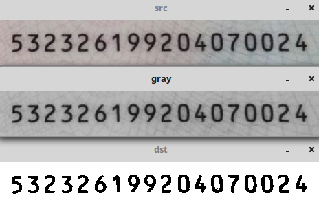

&emsp;&emsp;`OTSU`算法也称最大类间差法，有时也称之为`大津算法`，由大津于`1979`年提出，被认为是图像分割中阈值选取的最佳算法。计算简单，不受图像亮度和对比度的影响，因此在数字图像处理上得到了广泛的应用。它是按图像的灰度特性，将图像分成背景和前景两部分。因方差是灰度分布均匀性的一种度量，背景和前景之间的类间方差越大，说明构成图像的两部分的差别越大。当部分前景错分为背景或部分背景错分为前景，都会导致两部分差别变小。因此，使类间方差最大的分割意味着错分概率最小。<!--more-->
&emsp;&emsp;对于图像$I(x, y)$，前景(即目标)和背景的分割阈值记作$T$，属于前景的像素点数占整幅图像的比例记为$\omega 0$，其平均灰度为$μ0$；背景像素点数占整幅图像的比例为$\omega 1$，其平均灰度为$\mu 1$。图像的总平均灰度记为$\mu$，类间方差记为$g$。<br>
&emsp;&emsp;假设图像的背景较暗，并且图像的大小为$M * N$，图像中像素的灰度值小于阈值$T$的像素个数记作$N0$，像素灰度大于阈值$T$的像素个数记作$N1$，则有：

$$ \omega 0 = N0 / (M * N)                               \tag{1}$$

$$ \omega 1 = N1 / (M * N)                               \tag{2}$$

$$ N0 + N1 = M * N                                       \tag{3}$$

$$ \omega 0 + \omega 1 = 1                               \tag{4}$$

$$ \mu = \omega 0 * \mu 0 + \omega 1 * \mu 1             \tag{5}$$

$$ g = \omega 0(\mu 0 - \mu)^2 + \omega 1(\mu 1 - \mu)^2 \tag{6}$$

将公式`5`代入公式`6`，得到等价公式：

$$
g = \omega 0 * \omega 1(\mu 0 - \mu 1)^2
$$

这就是类间方差。采用遍历的方法得到使类间方差$g$最大的阈值$T$，即为所求。<br>
&emsp;&emsp;`C++`实现代码如下：

``` cpp
#include <iostream>
#include <cv.h>
#include <highgui.h>

using namespace std;
using namespace cv;

int main ( int argc, char *argv[] ) {
    Mat img = imread ( argv[1], -1 );

    if ( img.empty() ) {
        cout << "Error: Could not load image" << endl;
        return 0;
    }

    Mat gray;
    cvtColor ( img, gray, CV_BGR2GRAY );
    Mat dst;
    threshold ( gray, dst, 0, 255, CV_THRESH_OTSU );
    imshow ( "src", img );
    imshow ( "gray", gray );
    imshow ( "dst", dst );
    waitKey ( 0 );
    return 0;
}
```



&emsp;&emsp;`python`实现代码如下：

``` python
import cv2

if __name__ == '__main__':
    img = cv2.imread("logo.jpg", -1)
    gray = cv2.cvtColor(img, cv2.COLOR_BGR2GRAY)
    retval, dst = cv2.threshold(gray, 0, 255, cv2.THRESH_OTSU)
    cv2.imshow("src", img)
    cv2.imshow("gray", gray)
    cv2.imshow("dst", dst)
    cv2.waitKey(0)
    cv2.destroyAllWindows()
```

