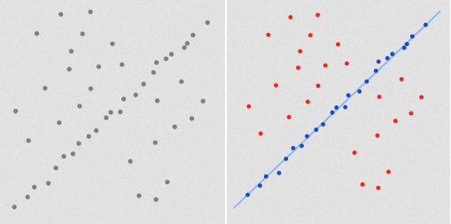
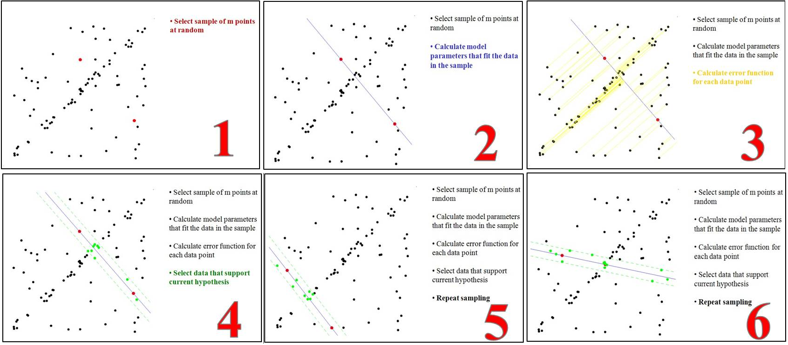
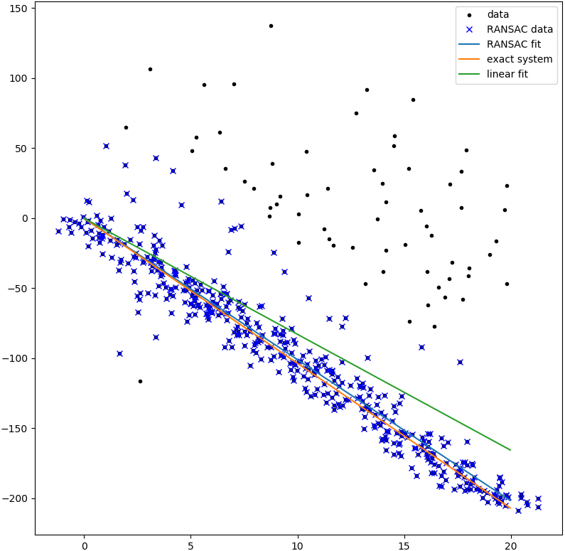

&emsp;&emsp;随机抽样一致算法(`random sample consensus`，`RANSAC`)采用迭代的方式从一组包含离群的被观测数据中估算出数学模型的参数。它是一种不确定的算法，即有一定的概率得出一个合理的结果；为了提高概率必须提高迭代次数。<!--more-->
&emsp;&emsp;`RANSAC`算法的基本假设是样本中包含正确数据(`inliers`，可以被模型描述的数据)，也包含异常数据(`outliers`，偏离正常范围很远、无法适应数学模型的数据)，即数据集中含有噪声。这些异常数据可能是由于错误的测量、错误的假设、错误的计算等产生的。同时`RANSAC`也假设，给定一组正确的数据，存在可以计算出符合这些数据的模型参数的方法。
&emsp;&emsp;一个简单的例子是从一组观测数据中找出合适的`2`维直线。假设观测数据中包含局内点和局外点，其中局内点近似的被直线所通过，而局外点远离于直线。简单的最小二乘法不能找到适应于局内点的直线，原因是最小二乘法尽量去适应包括局外点在内的所有点。相反，`RANSAC`能得出一个仅仅用局内点计算出模型，并且概率还足够高。但是，`RANSAC`并不能保证结果一定正确，为了保证算法有足够高的合理概率，我们必须小心的选择算法的参数。左图是包含很多局外点的数据集，右图是`RANSAC`找到的直线，注意局外点并不影响结果。



&emsp;&emsp;`RANSAC`算法的输入是一组观测数据，一个可以解释或者适应于观测数据的参数化模型，一些可信的参数。`RANSAC`通过反复选择数据中的一组随机子集来达成目标。被选取的子集被假设为局内点，并用下述方法进行验证：

1. 有一个模型适应于假设的局内点，即所有的未知参数都能从假设的局内点计算得出。
2. 用`1`中得到的模型去测试所有的其它数据，如果某个点适用于估计的模型，认为它也是局内点。
3. 如果有足够多的点被归类为假设的局内点，那么估计的模型就足够合理。
4. 然后，用所有假设的局内点去重新估计模型，因为它仅仅被初始的假设局内点估计过。
5. 最后，通过估计局内点与模型的错误率来评估模型。

这个过程被重复执行固定的次数，每次产生的模型要么因为局内点太少而被舍弃，要么因为比现有的模型更好而被选用。该流程如下：



&emsp;&emsp;`wiki`上的伪代码如下：

``` cpp
Given:
    data - a set of observed data points
    model - a model that can be fitted to data points
    n - the minimum number of data values required to fit the model
    k - the maximum number of iterations allowed in the algorithm
    t - a threshold value for determining when a data point fits a model
    d - the number of close data values required to assert that a model fits well to data
Return:
    bestfit - model parameters which best fit the data (or nil if no good model is found)

iterations = 0
bestfit = nil
besterr = something really large

while iterations < k {
    maybeinliers = n randomly selected values from data
    maybemodel = model parameters fitted to maybeinliers
    alsoinliers = empty set

    for every point in data not in maybeinliers {
        if point fits maybemodel with an error smaller than t
            add point to alsoinliers
    }

    if the number of elements in alsoinliers is > d {
        % this implies that we may have found a good model
        % now test how good it is
        bettermodel = model parameters fitted to all points in maybeinliers and alsoinliers
        thiserr = a measure of how well model fits these points

        if thiserr < besterr {
            bestfit = bettermodel
            besterr = thiserr
        }
    }

    increment iterations
}

return bestfit
```

&emsp;&emsp;While the parameter values of `t` and `d` have to be calculated from the individual requirements it can be experimentally determined. The interesting parameter of the `RANSAC` algorithm is `k`. To calculate the parameter `k` given the known probability `w` of a good data value, the probability `z` of seeing only bad data values is used:

``` cpp
z = (1 - w^n)^k
```

which leads to:

``` cpp
k = log(z)/log(1 - w^n)
```

To gain additional confidence, the standard deviation or multiples thereof can be added to `k`. The standard deviation of `k` is defined as:

``` cpp
SD(x) = sqrt(1 - w^n)/w^n
```

A common case is that `w` is not well known beforehand, but some rough value can be given. If `n` data values are given, the probability of success is `w^n`.
&emsp;&emsp;`python`代码实现如下：

``` python
import numpy
import scipy  # use numpy if scipy unavailable
import scipy.linalg  # use numpy if scipy unavailable

def ransac(data, model, n, k, t, d, debug=False, return_all=False):
    iterations = 0
    bestfit = None
    besterr = numpy.inf
    best_inlier_idxs = None

    while iterations < k:
        maybe_idxs, test_idxs = random_partition(n, data.shape[0])
        maybeinliers = data[maybe_idxs, :]
        test_points = data[test_idxs]
        maybemodel = model.fit(maybeinliers)
        test_err = model.get_error(test_points, maybemodel)
        also_idxs = test_idxs[test_err < t]  # select indices of rows with accepted points
        alsoinliers = data[also_idxs, :]

        if debug:
            print('test_err.min()', test_err.min())
            print('test_err.max()', test_err.max())
            print('numpy.mean(test_err)', numpy.mean(test_err))
            print('iteration %d:len(alsoinliers) = %d' % (iterations, len(alsoinliers)))

        if len(alsoinliers) > d:
            betterdata = numpy.concatenate((maybeinliers, alsoinliers))
            bettermodel = model.fit(betterdata)
            better_errs = model.get_error(betterdata, bettermodel)
            thiserr = numpy.mean(better_errs)

            if thiserr < besterr:
                bestfit = bettermodel
                besterr = thiserr
                best_inlier_idxs = numpy.concatenate((maybe_idxs, also_idxs))

        iterations += 1

    if bestfit is None:
        raise ValueError("did not meet fit acceptance criteria")

    if return_all:
        return bestfit, {'inliers': best_inlier_idxs}
    else:
        return bestfit

def random_partition(n, n_data):
    """ return n random rows of data (and also the other len(data) - n rows) """
    all_idxs = numpy.arange(n_data)
    numpy.random.shuffle(all_idxs)
    idxs1 = all_idxs[:n]
    idxs2 = all_idxs[n:]
    return idxs1, idxs2

class LinearLeastSquaresModel:
    """
    linear system solved using linear least squares
    This class serves as an example that fulfills the model interface
    needed by the ransac() function.
    """

    def __init__(self, input_columns, output_columns, debug=False):
        self.input_columns = input_columns
        self.output_columns = output_columns
        self.debug = debug

    def fit(self, data):
        A = numpy.vstack([data[:, i] for i in self.input_columns]).T
        B = numpy.vstack([data[:, i] for i in self.output_columns]).T
        x, resids, rank, s = scipy.linalg.lstsq(A, B)
        return x

    def get_error(self, data, model):
        A = numpy.vstack([data[:, i] for i in self.input_columns]).T
        B = numpy.vstack([data[:, i] for i in self.output_columns]).T
        B_fit = scipy.dot(A, model)
        err_per_point = numpy.sum((B - B_fit) ** 2, axis=1)  # sum squared error per row
        return err_per_point

def test():
    # generate perfect input data
    n_samples = 500
    n_inputs = 1
    n_outputs = 1
    A_exact = 20 * numpy.random.random((n_samples, n_inputs))
    perfect_fit = 60 * numpy.random.normal(size=(n_inputs, n_outputs))  # the model
    B_exact = scipy.dot(A_exact, perfect_fit)
    assert B_exact.shape == (n_samples, n_outputs)

    # add a little gaussian noise (linear least squares alone should handle this well)
    A_noisy = A_exact + numpy.random.normal(size=A_exact.shape)
    B_noisy = B_exact + numpy.random.normal(size=B_exact.shape)

    if 1:
        # add some outliers
        n_outliers = 100
        all_idxs = numpy.arange(A_noisy.shape[0])
        numpy.random.shuffle(all_idxs)
        outlier_idxs = all_idxs[:n_outliers]
        non_outlier_idxs = all_idxs[n_outliers:]
        A_noisy[outlier_idxs] = 20 * numpy.random.random((n_outliers, n_inputs))
        B_noisy[outlier_idxs] = 50 * numpy.random.normal(size=(n_outliers, n_outputs))

    # setup model
    all_data = numpy.hstack((A_noisy, B_noisy))
    input_columns = range(n_inputs)  # the first columns of the array
    output_columns = [n_inputs + i for i in range(n_outputs)]  # the last columns of the array
    debug = True
    model = LinearLeastSquaresModel(input_columns, output_columns, debug=debug)

    linear_fit, resids, rank, s = scipy.linalg.lstsq(all_data[:, input_columns], all_data[:, output_columns])

    # run RANSAC algorithm
    ransac_fit, ransac_data = ransac(all_data, model,
                                     50, 1000, 7e3, 300,  # misc. parameters
                                     debug=debug, return_all=True)

    if 1:
        import pylab

        sort_idxs = numpy.argsort(A_exact[:, 0])
        A_col0_sorted = A_exact[sort_idxs]  # maintain as rank-2 array

        if 1:
            pylab.plot(A_noisy[:, 0], B_noisy[:, 0], 'k.', label='data')
            pylab.plot(A_noisy[ransac_data['inliers'], 0], \
                B_noisy[ransac_data['inliers'], 0], 'bx', label='RANSAC data')
        else:
            pylab.plot(A_noisy[non_outlier_idxs, 0], B_noisy[non_outlier_idxs, 0], 'k.', label='noisy data')
            pylab.plot(A_noisy[outlier_idxs, 0], B_noisy[outlier_idxs, 0], 'r.', label='outlier data')

        pylab.plot(A_col0_sorted[:, 0], numpy.dot(A_col0_sorted, ransac_fit)[:, 0], label='RANSAC fit')
        pylab.plot(A_col0_sorted[:, 0], numpy.dot(A_col0_sorted, perfect_fit)[:, 0], label='exact system')
        pylab.plot(A_col0_sorted[:, 0], numpy.dot(A_col0_sorted, linear_fit)[:, 0], label='linear fit')
        pylab.legend()
        pylab.show()

if __name__ == '__main__':
    test()
```

