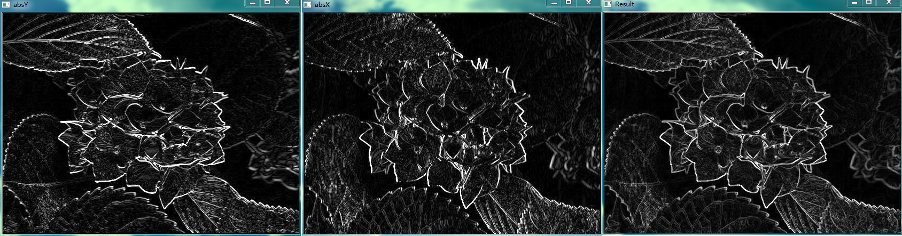

&emsp;&emsp;`Sobel`算子依然是一种过滤器，只是其是带有方向的。在`OpenCV`中，使用`Sobel`算子的函数原型如下：<!--more-->

``` python
dst = cv2.Sobel(src, ddepth, dx, dy [, dst [, ksize [, scale [, delta [, borderType]]]]])
```

- `src`：需要处理的图像；
- `ddepth`是图像的深度，`-1`表示采用的是与原图像相同的深度，目标图像的深度必须大于等于原图像的深度；
- `dx`和`dy`：求导的阶数，`0`表示这个方向上没有求导，一般为`0`、`1`、`2`。
- `ksize`：`Sobel`算子的大小，必须为`1`、`3`、`5`或`7`。
- `scale`：缩放导数的比例常数，默认情况下没有伸缩系数；
- `delta`：一个可选的增量，将会加到`dst`中，默认情况下没有额外的值加到`dst`中。
- `borderType`：图像边界的模式，这个参数默认值为`cv2.BORDER_DEFAULT`。

``` python
import cv2

img = cv2.imread("test.jpg", 0)

x = cv2.Sobel(img, cv2.CV_16S, 1, 0)
y = cv2.Sobel(img, cv2.CV_16S, 0, 1)

absX = cv2.convertScaleAbs(x)
absY = cv2.convertScaleAbs(y)

dst = cv2.addWeighted(absX, 0.5, absY, 0.5, 0)

cv2.imshow("absX", absX)
cv2.imshow("absY", absY)
cv2.imshow("Result", dst)

cv2.waitKey(0)
cv2.destroyAllWindows()
```



&emsp;&emsp;`Sobel`函数的第二个参数使用了`cv2.CV_16S`，因为`OpenCV`文档对`Sobel`算子的介绍中有这么一句：in the case of `8-bit` input images it will result in truncated derivatives，即`Sobel`函数求完导数后会有负值，还有会大于`255`的值。而原图像是`uint8`，所以`Sobel`建立的图像位数不够，会有截断。因此要使用`16`位有符号的数据类型，即`cv2.CV_16S`。
&emsp;&emsp;在经过处理后，不要忘记使用`convertScaleAbs`函数将其转回原来的`uint8`形式，否则将无法显示图像，而只是一个灰色的窗口。`convertScaleAbs`的函数原型如下：

``` python
dst = cv2.convertScaleAbs(src[, dst[, alpha[, beta]]])
```

参数`alpha`是伸缩系数，`beta`是加到结果上的一个值，该函数返回`uint8`类型的图片。由于`Sobel`算子是在两个方向计算的，最后还需要用`cv2.addWeighted`函数将其组合起来：

``` python
dst = cv2.addWeighted(src1, alpha, src2, beta, gamma[, dst[, dtype]])
```

其中`alpha`是第一幅图片中元素的权重，`beta`是第二幅图片中元素的权重，`gamma`是加到最后结果上的一个值。