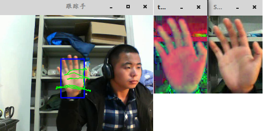
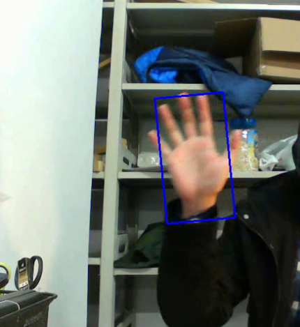

&emsp;&emsp;`CamShift`算法的全称是`Continuously Adaptive Mean-SHIFT`，即连续自适应`MeanShift`算法。其基本思想是对视频序列的所有图像帧都作`MeanShift`运算，并将上一帧的结果(搜索窗口的中心位置和窗口大小)作为下一帧`MeanShift`算法的搜索窗口的初始值，如此迭代下去。简单地说，`meanShift`是针对单张图片寻找最优迭代结果，而`camShift`则是针对视频序列来处理，并对该序列中的每一帧图片都调用`meanShift`来寻找最优迭代结果。正是由于`camShift`针对一个视频序列进行处理，从而保证其可以不断调整窗口的大小，如此一来，当目标的大小发生变化的时候，该算法就可以自适应地调整目标区域继续跟踪。<!--more-->
&emsp;&emsp;在`OpenCV`自带的`camShift`的例子当中，是通过计算目标在`HSV`空间下的`H`分量直方图，然后通过直方图反向投影得到目标像素的概率分布，最后调用`OpenCV`的`CAMSHIFT`算法，自动跟踪并调整目标窗口的中心位置与大小。该算法对于简单背景下的单目标跟踪效果较好，但如果被跟踪目标与背景颜色或周围其它目标颜色比较接近，则跟踪效果较差。另外，由于采用颜色特征，所以它对被跟踪目标的形状变化有一定的抵抗能力。
&emsp;&emsp;`OpenCV`自带例子中的`camShift`算法，可以分为三个部分：
&emsp;&emsp;1. 计算色彩投影图(反向投影)：

- 为了减少光照变化对目标跟踪的影响，首先将图像从`RGB`颜色空间转换到`HSV`颜色空间。
- 对`H`分量进行直方图统计，直方图代表了不同`H`分量取值出现的概率，或者说可以据此查找出`H`分量的大小为`x`时的概率或像素个数，即可得到颜色概率查找表。
- 将图像中每个像素的值用其颜色出现的概率进行替换，由此得到颜色概率分布图。

以上三个步骤称之为反向投影，需要提醒的是，颜色概率分布图是一个灰度图像。

&emsp;&emsp;2. `meanShift`寻找：`meanShift`算法是一种非参数概率密度估计方法，它通过不断迭代计算得到最优搜索窗口的位置和大小。
&emsp;&emsp;3. `camShift`跟踪算法：`camShift`其实就是在视频序列的每一帧当中都运用`meanShift`，并将上一帧的`meanShift`结果作为下一帧的初始值，如此不断循环迭代，就可以实现目标的跟踪了。

``` cpp
#include "opencv2/core/core.hpp"
#include "opencv2/highgui/highgui.hpp"
#include "opencv2/imgproc/imgproc.hpp"
#include "opencv2/video/tracking.hpp"
#include <iostream>

using namespace cv;
using namespace std;

Mat image;
Mat rectImage;
Mat imageCopy; /* 绘制矩形框时，用于拷贝原图的图像 */
bool leftButtonDownFlag = false; /* 左键单击后，视频暂停播放的标志位 */
Point originalPoint; /* 矩形框起点 */
Point processPoint; /* 矩形框终点 */
Mat targetImageHSV;
int histSize = 200;
float histR[] = {0, 255};
const float *histRange = histR;
int channels[] = {0, 1};
Mat dstHist;
Rect rect;
vector<Point> pt; /* 保存目标轨迹 */
void onMouse ( int event, int x, int y, int flags, void *ustc ); /* 鼠标回调函数 */

int main ( int argc, char *argv[] ) {
    VideoCapture video ( argv[1] );
    double fps = video.get ( CV_CAP_PROP_FPS ); /* 获取视频帧率 */
    double pauseTime = 1000 / fps; /* 两幅画面中间间隔 */
    namedWindow ( "跟踪手", 0 );
    setMouseCallback ( "跟踪手", onMouse );

    while ( true ) {
        if ( !leftButtonDownFlag ) { /* 判定鼠标左键没有按下，采取播放视频，否则暂停 */
            video >> image;
        }

        if ( !image.data || waitKey ( pauseTime ) == 27 ) { /* 图像为空或Esc键按下退出播放 */
            break;
        }

        if ( originalPoint != processPoint && !leftButtonDownFlag ) {
            Mat imageHSV;
            Mat calcBackImage;
            cvtColor ( image, imageHSV, CV_RGB2HSV );
            calcBackProject ( &imageHSV, 2, channels, dstHist, calcBackImage, &histRange ); /* 反向投影 */
            TermCriteria criteria ( TermCriteria::MAX_ITER + TermCriteria::EPS, 1000, 0.001 );
            CamShift ( calcBackImage, rect, criteria );
            Mat imageROI = imageHSV ( rect ); /* 更新模板 */
            targetImageHSV = imageHSV ( rect );
            calcHist ( &imageROI, 2, channels, Mat(), dstHist, 1, &histSize, &histRange );
            normalize ( dstHist, dstHist, 0.0, 1.0, NORM_MINMAX ); /* 归一化 */
            rectangle ( image, rect, Scalar ( 255, 0, 0 ), 3 ); /* 目标绘制 */
            pt.push_back ( Point ( rect.x + rect.width / 2, rect.y + rect.height / 2 ) );

            for ( int i = 0; i < pt.size() - 1; i++ ) {
                line ( image, pt[i], pt[i + 1], Scalar ( 0, 255, 0 ), 2.5 );
            }
        }

        imshow ( "跟踪手", image );
        waitKey ( 100 );
    }

    return 0;
}

void onMouse ( int event, int x, int y, int flags, void *ustc ) {
    if ( event == CV_EVENT_LBUTTONDOWN ) {
        leftButtonDownFlag = true; /* 标志位 */
        originalPoint = Point ( x, y ); /* 设置左键按下点的矩形起点 */
        processPoint = originalPoint;
    }

    if ( event == CV_EVENT_MOUSEMOVE && leftButtonDownFlag ) {
        imageCopy = image.clone();
        processPoint = Point ( x, y );

        if ( originalPoint != processPoint ) {
            /* 在复制的图像上绘制矩形 */
            rectangle ( imageCopy, originalPoint, processPoint, Scalar ( 255, 0, 0 ), 2 );
        }

        imshow ( "跟踪手", imageCopy );
    }

    if ( event == CV_EVENT_LBUTTONUP ) {
        leftButtonDownFlag = false;
        rect = Rect ( originalPoint, processPoint );
        rectImage = image ( rect ); /* 子图像显示 */
        imshow ( "Sub Image", rectImage );
        cvtColor ( rectImage, targetImageHSV, CV_RGB2HSV );
        imshow ( "targetImageHSV", targetImageHSV );
        calcHist ( &targetImageHSV, 2, channels, Mat(), dstHist, 1, &histSize, &histRange, true, false );
        normalize ( dstHist, dstHist, 0, 255, CV_MINMAX );
    }
}
```



&emsp;&emsp;`python`代码实现：

``` python
import numpy as np
import cv2

cap = cv2.VideoCapture('output_2.avi')
fourcc = cv2.VideoWriter_fourcc(*'XVID')
out = cv2.VideoWriter('result.avi', fourcc, 20.0, (640, 480))
ret, frame = cap.read()  # take first frame of the video
# setup initial location of window
r, h, c, w = 200, 170, 260, 100  # simply hardcoded the values
track_window = (c, r, w, h)
# set up the ROI for tracking
roi = frame[r:r + h, c:c + w]
hsv_roi = cv2.cvtColor(roi, cv2.COLOR_BGR2HSV)
mask = cv2.inRange(hsv_roi, np.array((0., 60., 32.)), np.array((180., 255., 255.)))
roi_hist = cv2.calcHist([hsv_roi], [0], mask, [180], [0, 180])
cv2.normalize(roi_hist, roi_hist, 0, 255, cv2.NORM_MINMAX)
# Setup the termination criteria, either 10 iteration or move by at least 1 pt
term_crit = (cv2.TERM_CRITERIA_EPS | cv2.TERM_CRITERIA_COUNT, 10, 1)

while (1):
    ret, frame = cap.read()

    if ret == True:
        hsv = cv2.cvtColor(frame, cv2.COLOR_BGR2HSV)
        dst = cv2.calcBackProject([hsv], [0], roi_hist, [0, 180], 1)
        # apply meanshift to get the new location
        ret, track_window = cv2.CamShift(dst, track_window, term_crit)
        # Draw it on image
        pts = cv2.boxPoints(ret)
        pts = np.int0(pts)
        img2 = cv2.polylines(frame, [pts], True, 255, 2)
        cv2.imshow('img2', img2)
        out.write(img2)
        k = cv2.waitKey(60) & 0xff

        if k == 27:
            break
        else:
            cv2.imwrite(chr(k) + ".jpg", img2)
    else:
        break

cv2.destroyAllWindows()
cap.release()
out.release()
```

