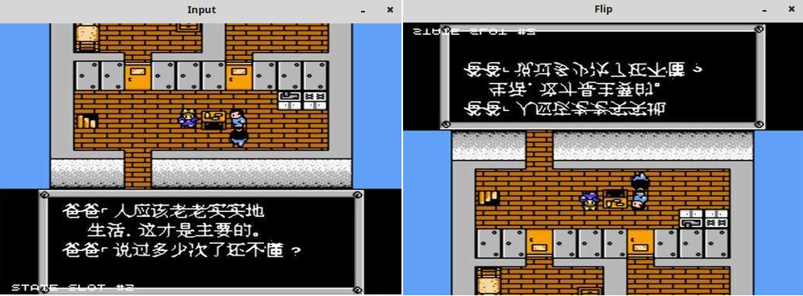
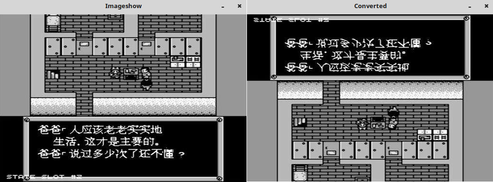

### cvflip

&emsp;&emsp;对图像进行翻转或旋转可以使用`cvflip`函数，可以实现将一个二维矩阵沿`X`轴、`Y`轴或者同时沿`XY`轴翻转。<!--more-->

``` cpp
void flip ( InputArray src, OutputArray dst, int ipCode );
```

参数`src`是输入矩阵，`dst`是输出矩阵，`flipCode`是旋转码，即控制函数对矩阵进行怎样的旋转：

- 当`flipCode = 0`时，将对矩阵沿`X`轴方向翻转。
- 当`flipCode > 0`时，将对矩阵沿`Y`轴方向翻转。
- 当`flipCode < 0`时，将对矩阵沿`XY`轴方向翻转。

``` cpp
#include <iostream>
#include <opencv2/opencv.hpp>

using namespace std;
using namespace cv;

int main() {
    Mat img = imread ( "timg1.jpg", CV_LOAD_IMAGE_ANYCOLOR );
    imshow ( "Input", img );
    cv::flip ( img, img, 0 );
    imshow ( "Flip", img );
    waitKey ( 0 );
    return 0;
}
```



&emsp;&emsp;`Python`中`flip`函数原型如下：

``` python
flip(src, flipCode, dst=None)
```

- `src`：原图像矩阵。
- `flipCode`：翻转方向，`1`是水平翻转，`0`是垂直翻转，`-1`是水平垂直翻转。
- `dst`：默认即可。

``` python
import cv2

image = cv2.imread("girl.jpg")
# Flipped Horizontally(水平翻转)
h_flip = cv2.flip(image, 1)
cv2.imshow("girl-h.jpg", h_flip)
# Flipped Vertically(垂直翻转)
v_flip = cv2.flip(image, 0)
cv2.imshow("girl-v.jpg", v_flip)
# Flipped Horizontally & Vertically(水平垂直翻转)
hv_flip = cv2.flip(image, -1)
cv2.imshow("girl-hv.jpg", hv_flip)
cv2.waitKey(0)
cv2.destroyAllWindows()
```

### cvConvertImage

&emsp;&emsp;函数原型如下：

``` cpp
void cvConvertImage ( const CvArr *src, CvArr *dst, int flags = 0 );
```

- `src`：源图像的`IplImage`指针，源图像可以是单个、`3`个或者`4`个通道；
- `dst`：转换后的图像的`IplImage`指针，目标图像必须是`8`位的单通道或者`3`个通道；
- `flags`：转换的模式，可以取`0`(没有变化)、`1`(垂直翻转，即沿`x`轴翻转)和`2`(交换红蓝信道)。有时摄像机图像格式与图像显示格式会反转，设置这个参数可以在内存中彻底旋转图像。

``` cpp
#include <opencv2/highgui/highgui.hpp>
#include <cv.h>

int main ( void ) {
    IplImage *img;
    IplImage *dst;
    img = cvLoadImage ( "timg1.jpg", 0 );
    dst = cvCreateImage ( cvGetSize ( img ), IPL_DEPTH_8U, 1 );
    cvConvertImage ( img, dst, CV_CVTIMG_FLIP );
    cvNamedWindow ( "Imageshow", 1 );
    cvShowImage ( "Imageshow", img );
    cvNamedWindow ( "Converted", 1 );
    cvShowImage ( "Converted", dst );
    cvWaitKey ( 0 );
}
```

