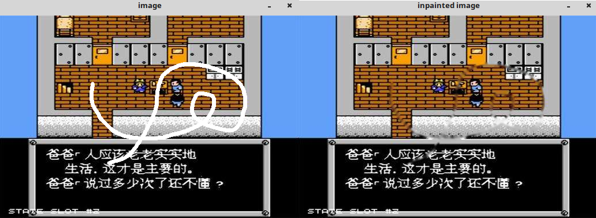

&emsp;&emsp;图像修复技术的原理是什么呢？简而言之，就是利用那些已经被破坏的区域的边缘，即边缘的颜色和结构，根据这些图像留下的信息去推断被破坏的信息区的信息内容，然后对破坏区进行填补，以达到图像修补的目的。<!--more-->
&emsp;&emsp;`OpenCV`中就是利用`inpaint`这个函数来实现修复功能：

``` cpp
void inpaint (
    InputArray src, InputArray inpaintMask,
    OutputArray dst, double inpaintRadius, int flags
);
```

- `src`：输入的单通道或三通道图像。
- `inpaintMask`：修复模板。对于单通道图像，大小跟原图像一致。`inpaintMask`图像上除了需要修复的部分之外，其他部分的像素值全部为`0`。
- `dst`：输出的经过修复的图像。
- `inpaintRadius`：修复算法取的邻域半径，用于计算当前像素点的差值。
- `flags`：修复算法，共有两种，即`INPAINT_NS`和`INPAINT_TELEA`。

``` cpp
#include "opencv2/highgui/highgui.hpp"
#include "opencv2/imgproc/imgproc.hpp"
#include "opencv2/photo/photo.hpp"
#include <iostream>

using namespace cv;
using namespace std;

static void help() {
    cout << "\nCool inpainging demo. Inpainting repairs damage to images by floodfilling the damage \n"
         << "with surrounding image areas.\n"
         "Using OpenCV version %s\n" << CV_VERSION << "\n"
         "Usage:\n"
         "./inpaint [image_name -- Default fruits.jpg]\n" << endl;
    cout << "Hot keys: \n"
         "\tESC - quit the program\n"
         "\tr - restore the original image\n"
         "\ti or SPACE - run inpainting algorithm\n"
         "\t\t(before running it, paint something on the image)\n" << endl;
}

Mat img, inpaintMask;
Point prevPt ( -1, -1 );

static void onMouse ( int event, int x, int y, int flags, void * ) {
    if ( event == CV_EVENT_LBUTTONUP || ! ( flags & CV_EVENT_FLAG_LBUTTON ) ) {
        prevPt = Point ( -1, -1 );
    } else if ( event == CV_EVENT_LBUTTONDOWN ) {
        prevPt = Point ( x, y );
    } else if ( event == CV_EVENT_MOUSEMOVE && ( flags & CV_EVENT_FLAG_LBUTTON ) ) {
        Point pt ( x, y );

        if ( prevPt.x < 0 ) {
            prevPt = pt;
        }

        line ( inpaintMask, prevPt, pt, Scalar::all ( 255 ), 5, 8, 0 ); // mask
        line ( img, prevPt, pt, Scalar::all ( 255 ), 5, 8, 0 );
        prevPt = pt;
        imshow ( "image", img );
    }
}

int main ( int argc, char **argv ) {
    char *filename = argc >= 2 ? argv[1] : ( char * ) "fruits.jpg";
    Mat img0 = imread ( filename, -1 );

    if ( img0.empty() ) {
        cout << "Couldn't open the image " << filename << ". Usage: inpaint <image_name>\n" << endl;
        return 0;
    }

    help();
    namedWindow ( "image", 1 );
    img = img0.clone();
    inpaintMask = Mat::zeros ( img.size(), CV_8U ); //mask
    imshow ( "image", img );
    setMouseCallback ( "image", onMouse, 0 );

    for ( ;; ) {
        char c = ( char ) waitKey();

        if ( c == 27 ) {
            break;
        }

        if ( c == 'r' ) {
            inpaintMask = Scalar::all ( 0 );
            img0.copyTo ( img );
            imshow ( "image", img );
        }

        if ( c == 'i' || c == ' ' ) {
            Mat inpainted;
            inpaint ( img, inpaintMask, inpainted, 3, CV_INPAINT_TELEA );
            imshow ( "inpainted image", inpainted );
        }
    }

    return 0;
}
```

