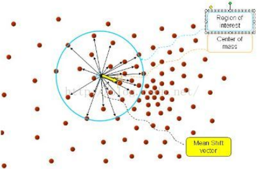
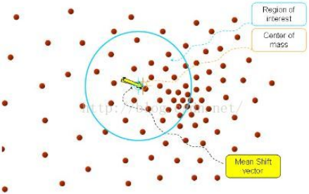
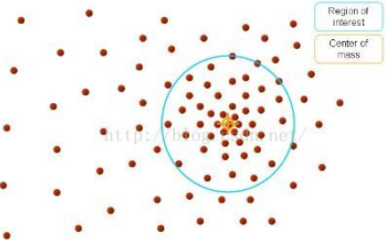
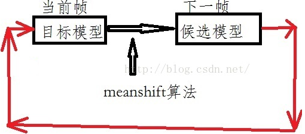
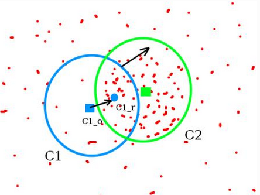
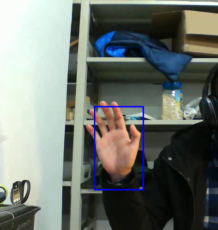

&emsp;&emsp;首先介绍一下`meanshift`算法，它的本质是一个迭代的过程，能够在一组数据的密度分布中寻找到局部极值。它比较稳定，而且是无参密度估计(不需要事先知道样本数据的概率密度分布函数，完全依靠对样本点的计算)，而且在采样充分的情况下，一定会收敛，即可以对服从任意分布的数据进行密度估计。<!--more-->
&emsp;&emsp;这里就不把`meanshift`的数学公式都写出来了，只为了让大家知道`meanshift`的作用是什么；高维的部分也先不考虑，以二维来说明可能更容易理解。下图中的很多的红点就是我们的样本特征点，`meanshift`就是在这些点中的任意一个点为圆心，然后以半径`R`画一个圆(在`OpenCV`中是一个矩形)，然后落在这个圆中的所有点和圆心都会有对应的一个向量，把所有这些向量相加(注意是向量相加)，最终只得到一个向量，就是下图中用黄色箭头表示的向量，这个向量就是`meanshift`向量。



然后再以这个`meanshift`向量的终点为圆心，继续上述过程，又可以得到一个`meanshift`向量：



然后不断地继续这样的过程，可以得到很多连续的`meanshift`向量。将这些向量首尾相连，最终会在一个地方停下来(即`meanshift`算法会收敛)，最后的那个`meanshift`向量的终点就是最终结果(一个点)：



从上述的过程可以看出，`meanshift`算法的最终效果就是：从起点开始，最终会一步一步到达样本特征点最密集的点那里(当然在哪个点是终点就要取决于设定的阈值)。
&emsp;&emsp;到这里可能只知道`meanshift`算法的作用是向数据密集的地方走的一个效果，但是还是不明白它是怎么在运动跟踪中发挥作用的，尤其是不理解它这个样本特征点(就是上图中的红点)到底和我们图像中的什么对应的。
&emsp;&emsp;对于上面这个问题，我们需要先了解一下运动跟踪算法是一个什么样的过程，知道了这个过程之后，就可以知道`meanshift`算法在这个过程中发挥的作用了。运动跟踪说到底就是在一开始告诉程序一个跟踪目标，然后程序就在接下来的视频帧中去寻找这个目标。给定跟踪目标很简单，直接在图像中给一个`ROI`给程序就可以了，那么程序接下来要做的就是在下一帧图像中去找这个`ROI`。但这个`ROI`是移动了的，已经不在之前的那个位置了，那么此时程序要怎么来找到这个`ROI`呢？在计算机视觉中，我们是这么来解决的：首先对跟踪目标进行描述，这个描述是将跟踪目标区域转换为颜色`HSV`空间，然后得到`H`的这个通道的分布直方图，有了这个描述之后，我们就是要在下一个视频帧中找到和这个描述的一样的区域。但是我们知道要找到完全一样的区域很难，所以我们就用了一个相似函数来衡量找到的区域和目标区域的相似度，通过这个相似函数，相似函数值越大说明我们寻找的区域和目标区域越相似，所以目标就是要找这个对应最大相似值的区域。那么怎么来寻找呢？这时`meanshift`就排上用场了，它可以通过不断地迭代得到有最大相似值的区域。`meanshift`的作用可以让我们的搜索窗口不断向两个模型相比颜色变化最大的方向不断移动，直到最后两次移动距离小于阈值，即找到当前帧的位置，并以此作为下一帧的起始搜索窗口中心。重复这个过程，每两帧之间都会产生一个`meanshift`向量，整个过程的`meanshift`向量连起来就是目标的运动路径。
&emsp;&emsp;整个运动跟踪过程就是如下：



---

### Meanshift

&emsp;&emsp;The intuition behind the `meanshift` is simple. Consider you have a set of points. (It can be a pixel distribution like histogram backprojection). You are given a small window (may be a circle) and you have to move that window to the area of maximum pixel density (or maximum number of points). It is illustrated in the simple image given below:



&emsp;&emsp;The initial window is shown in blue circle with the name `C1`. Its original center is marked in blue rectangle, named `C1_o`. But if you find the centroid of the points inside that window, you will get the point `C1_r` (marked in small blue circle) which is the real centroid of window. Surely they don't match. So move your window such that circle of the new window matches with previous centroid. Again find the new centroid. Most probably, it won't match. So move it again, and continue the iterations such that center of window and its centroid falls on the same location (or with a small desired error). So finally what you obtain is a window with maximum pixel distribution. It is marked with green circle, named `C2`. As you can see in image, it has maximum number of points.
&emsp;&emsp;So we normally pass the histogram backprojected image and initial target location. When the object moves, obviously the movement is reflected in histogram backprojected image. As a result, `meanshift` algorithm moves our window to the new location with maximum density.

### Meanshift in OpenCV

&emsp;&emsp;To use `meanshift` in `OpenCV`, first we need to setup the target, find its histogram so that we can backproject the target on each frame for calculation of `meanshift`. We also need to provide initial location of window. For histogram, only `Hue` is considered here. Also, to avoid `false` values due to low light, low light values are discarded using `cv2.inRange()` function.

``` python
import numpy as np
import cv2

cap = cv2.VideoCapture('output_2.avi')
ret, frame = cap.read()  # take first frame of the video
print(frame.shape)

# setup initial location of window
r, h, c, w = 200, 170, 260, 100  # simply hardcoded the values
track_window = (c, r, w, h)

cv2.rectangle(frame, (c, r), (c + w, r + h), 255, 2)
cv2.imshow("frame", frame)
cv2.waitKey(0)

# set up the ROI for tracking
roi = frame[r:r + h, c:c + w]
hsv_roi = cv2.cvtColor(frame, cv2.COLOR_BGR2HSV)
mask = cv2.inRange(hsv_roi, np.array((140., 140., 140.)), np.array((290., 290., 290.)))
roi_hist = cv2.calcHist([hsv_roi], [0], mask, [180], [0, 180])
cv2.normalize(roi_hist, roi_hist, 0, 255, cv2.NORM_MINMAX)

# Setup the termination criteria, either 10 iteration or move by at least 1 pt
term_crit = (cv2.TERM_CRITERIA_EPS | cv2.TERM_CRITERIA_COUNT, 10, 1)

while (True):
    ret, frame = cap.read()

    if ret == True:
        hsv = cv2.cvtColor(frame, cv2.COLOR_BGR2HSV)
        dst = cv2.calcBackProject([hsv], [0], roi_hist, [0, 180], 1)

        # apply meanshift to get the new location
        ret, track_window = cv2.meanShift(dst, track_window, term_crit)

        # Draw it on image
        x, y, w, h = track_window
        img2 = cv2.rectangle(frame, (x, y), (x + w, y + h), 255, 2)
        cv2.imshow('img2', img2)

        k = cv2.waitKey(60) & 0xff

        if k == 27:
            break
        else:
            cv2.imwrite(chr(k) + ".jpg", img2)
    else:
        break

cv2.destroyAllWindows()
cap.release()
```

