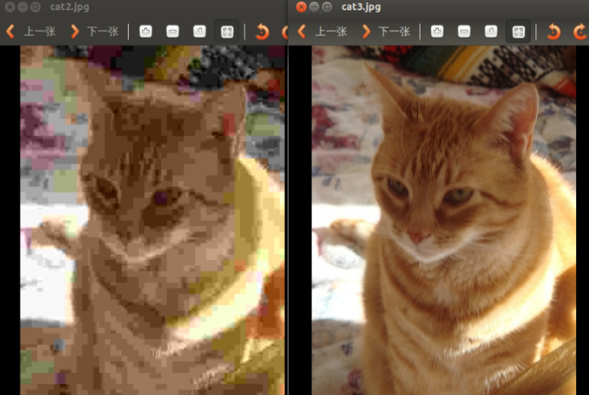
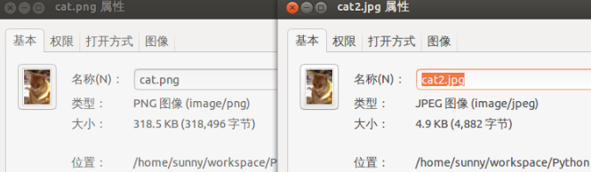
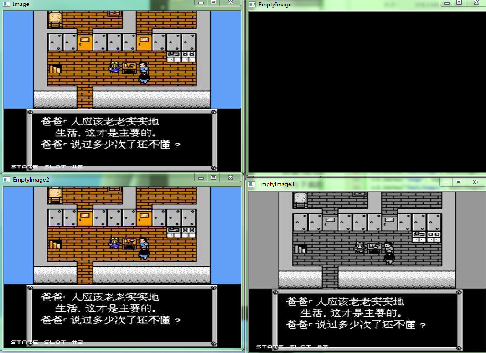
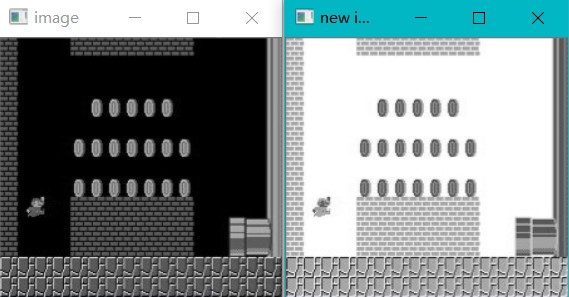
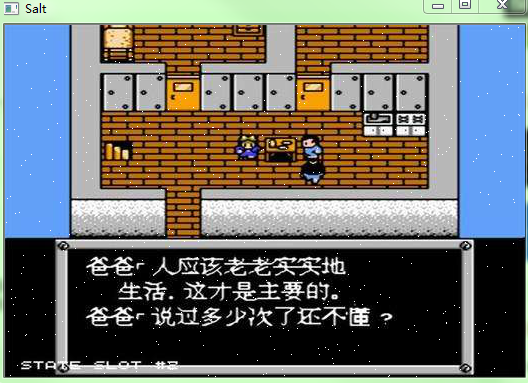
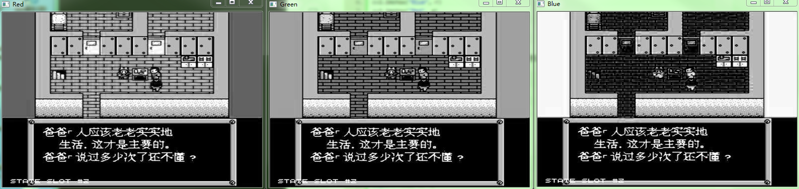

### 图像的载入、显示和保存

&emsp;&emsp;`opencv`使用`pip`的安装方式如下：<!--more-->

``` bash
pip install opencv-python
```

&emsp;&emsp;使用函数`cv2.imread(filepath, flags)`读入一幅图片，参数`filepath`是要读入图片的完整路径，`flags`是读入图片的标志：

- `cv2.IMREAD_COLOR`：默认参数，读入一副彩色图片，忽略`alpha`通道。
- `cv2.IMREAD_GRAYSCALE`：读入灰度图片。
- `cv2.IMREAD_UNCHANGED`：读入完整图片，包括`alpha`通道。

代码如下：

``` python
import cv2
img = cv2.imread('1.jpg', cv2.IMREAD_GRAYSCALE)
```

&emsp;&emsp;使用函数`cv2.imshow(wname, img)`显示图像，第一个参数是显示图像的窗口的名字，第二个参数是要显示的图像(`imread`读入的图像)，窗口大小自动调整为图片大小。

``` python
cv2.imshow('image', img)
cv2.waitKey(0)
cv2.destroyAllWindows()
```

重要函数的解释：

- `cv2.waitKey`：等待键盘输入，单位为毫秒。若在等待时间内按下任意键，则返回按键的`ASCII`码，程序继续运行；若没有按下任何键，超时后返回`-1`。参数为`0`表示无限等待。不调用`waitKey`的话，窗口会一闪而逝，看不到显示的图片。
- `cv2.destroyAllWindow`：销毁所有窗口。

&emsp;&emsp;使用函数`cv2.imwrite(file, img, num)`保存一个图像。参数`file`是要保存的文件名；参数`img`是要保存的图像；参数`num`是可选的，如下所示，它针对特定的格式：对于`jpeg`，其表示的是图像的质量，用`0`至`100`的整数表示，默认为`95`；对于`png`，第三个参数表示的是压缩级别，默认为`3`。

- `cv2.IMWRITE_JPEG_QUALITY`：类型为`long`，必须转换成`int`。
- `cv2.IMWRITE_PNG_COMPRESSION`：从`0`到`9`，压缩级别越高图像越小。

``` python
cv2.imwrite('1.png', img, [int(cv2.IMWRITE_JPEG_QUALITY), 95])
cv2.imwrite('1.png', img, [int(cv2.IMWRITE_PNG_COMPRESSION), 9])
```

左图是以不同质量存储的两幅图，右图是保存的图像尺寸：





&emsp;&emsp;新的`OpenCV`的接口中没有`CreateImage`接口，即没有`cv2.CreateImage`这样的函数。如果要创建图像，需要使用`numpy`的函数：

``` python
emptyImage = np.zeros(img.shape, np.uint8)
```

图像使用`NumPy`数组的属性来表示图像的尺寸和通道信息。如果输入`img.shape`，将得到(`500, 375, 3`)，这里是以`OpenCV`自带的`cat.jpg`为示例，最后的`3`表示这是一个`RGB`图像。
&emsp;&emsp;也可以复制原有的图像来获得一幅新图像：

``` python
emptyImage2 = img.copy()
```

代码示例如下：

``` python
import cv2
import numpy as np

img = cv2.imread("timg1.jpg")
emptyImage = np.zeros(img.shape, np.uint8)

emptyImage2 = img.copy()
emptyImage3 = cv2.cvtColor(img, cv2.COLOR_BGR2GRAY)

cv2.imshow("EmptyImage", emptyImage)
cv2.imshow("Image", img)
cv2.imshow("EmptyImage2", emptyImage2)
cv2.imshow("EmptyImage3", emptyImage3)
cv2.imwrite("./cat2.jpg", img, [int(cv2.IMWRITE_JPEG_QUALITY), 5])
cv2.imwrite("./cat3.jpg", img, [int(cv2.IMWRITE_JPEG_QUALITY), 100])
cv2.imwrite("./cat.png", img, [int(cv2.IMWRITE_PNG_COMPRESSION), 0])
cv2.imwrite("./cat2.png", img, [int(cv2.IMWRITE_PNG_COMPRESSION), 9])
cv2.waitKey(0)
cv2.destroyAllWindows()
```



&emsp;&emsp;灰度图像的黑白翻转代码如下：

``` python
import cv2

img = cv2.imread('mario.jpg', cv2.IMREAD_GRAYSCALE)
cv2.imshow('image', img)
img[:, :] = 255 - img[:, :]
cv2.imshow('new image', img)
cv2.waitKey(0)
cv2.destroyAllWindows()
```



---

### 图像元素的访问、通道分离与合并

&emsp;&emsp;访问像素和访问`numpy`中`ndarray`的方法完全一样。修改灰度图第`i`行第`j`列像素值示例如下：

``` python
img[i, j] = 255
```

修改彩色图像第`i`行第`j`列像素值示例如下(其中的`0`、`1`和`2`表示对应的通道)：

``` python
img[i, j, 0] = 255
img[i, j, 1] = 255
img[i, j, 2] = 255
```

下面的代码对图像添加椒盐噪声：

``` python
import cv2
import numpy as np

def salt(img, n):
    for k in range(n):
        i = int(np.random.random() * img.shape[0])
        j = int(np.random.random() * img.shape[1])

        if img.ndim == 2:
            img[i, j] = 255
        elif img.ndim == 3:
            img[i, j, 0] = 255
            img[i, j, 1] = 255
            img[i, j, 2] = 255
            # 另一种方式“img[i, j] = [255, 255, 255]”
    return img

if __name__ == '__main__':
    img = cv2.imread("girl.jpg")
    saltImage = salt(img, 500)
    cv2.imshow("Salt", saltImage)
    cv2.waitKey(0)
    cv2.destroyAllWindows()
```



&emsp;&emsp;假设一张图片的宽度和高度是`300 * 100`，用`opencv`的`img.shape`返回的是(`100, 300, 3`)，分别是图像的`行数`、`列数`、`色彩通道数`。行数对应于坐标轴上的`y`，表示的是图像高度；列数对应于坐标轴上的`x`，表示的是图像宽度，也就是说`shape`返回的是`(高度, 宽度, 通道数) = (y, x, c)`。因此`img[50, 10]`表示第`50`行第`10`列的那个元素。
&emsp;&emsp;由于`OpenCV Python`和`NumPy`结合得很紧密，所以既可以使用`OpenCV`自带的`split`函数，也可以直接操作`numpy`数组来分离通道。
&emsp;&emsp;`split`方法如下：

``` python
import cv2

img = cv2.imread("timg1.jpg")
b, g, r = cv2.split(img)
cv2.imshow("Blue", b)
cv2.imshow("Red", r)
cv2.imshow("Green", g)
cv2.waitKey(0)
cv2.destroyAllWindows()
```



其中`split`返回`RGB`三个通道，如果只想返回其中一个通道，可以这样：

``` python
b = cv2.split(img)[0]
g = cv2.split(img)[1]
r = cv2.split(img)[2]
```

最后的索引指出所需要的通道。也可以直接操作`NumPy`数组来达到这一目的：

``` python
import cv2
import numpy as np

img = cv2.imread("timg1.jpg")

b = np.zeros((img.shape[0], img.shape[1]), dtype=img.dtype)
g = np.zeros((img.shape[0], img.shape[1]), dtype=img.dtype)
r = np.zeros((img.shape[0], img.shape[1]), dtype=img.dtype)

b[:, :] = img[:, :, 0]
g[:, :] = img[:, :, 1]
r[:, :] = img[:, :, 2]

cv2.imshow("Blue", r)
cv2.imshow("Red", g)
cv2.imshow("Green", b)
cv2.waitKey(0)
cv2.destroyAllWindows()
```

&emsp;&emsp;通道合并也有两种方法，第一种是`OpenCV`自带的`merge`函数：

``` python
merged = cv2.merge([b, g, r])  # b、g、r是前面分离出来的三个通道
```

也可以使用`NumPy`的方法：

``` python
mergedByNp = np.dstack([b, g, r])
```

注意，实际使用时请用`OpenCV`自带的`merge`函数。使用`NumPy`组合的结果不能在`OpenCV`中其他函数使用，因为其组合方式与`OpenCV`的`merge`不一样：

``` python
merged = cv2.merge([b, g, r])
print("Merge by OpenCV")
print(merged.strides)

mergedByNp = np.dstack([b, g, r])
print("Merge by NumPy ")
print(mergedByNp.strides)
```

执行结果：

``` python
Merge by OpenCV
(1125, 3, 1)
Merge by NumPy
(1, 500, 187500)
```

&emsp;&emsp;完整的代码如下：

``` python
import cv2
import numpy as np

img = cv2.imread("timg1.jpg")

b = np.zeros((img.shape[0], img.shape[1]), dtype=img.dtype)
g = np.zeros((img.shape[0], img.shape[1]), dtype=img.dtype)
r = np.zeros((img.shape[0], img.shape[1]), dtype=img.dtype)

b[:, :] = img[:, :, 0]
g[:, :] = img[:, :, 1]
r[:, :] = img[:, :, 2]

merged = cv2.merge([b, g, r])
print("Merge by OpenCV")
print(merged.strides)
print(merged)

mergedByNp = np.dstack([b, g, r])
print("Merge by NumPy")
print(mergedByNp.strides)
print(mergedByNp)

cv2.imshow("Merged", merged)
cv2.imshow("MergedByNp", merged)
cv2.imshow("Blue", b)
cv2.imshow("Red", r)
cv2.imshow("Green", g)
cv2.waitKey(0)
cv2.destroyAllWindows()
```

&emsp;&emsp;**补充说明**：`img.size`返回图像的像素数目；`img.dtype`返回图像的数据类型。