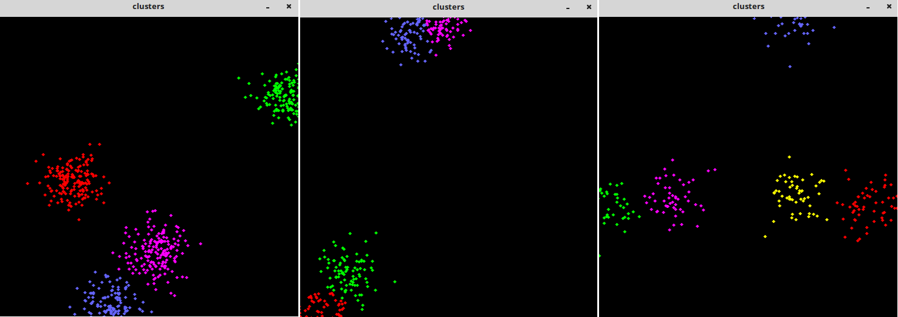

&emsp;&emsp;在使用`k-means`之前，必须先了解`k-means`算法的`2`个缺点：第一是必须人为指定所聚的类的个数`k`；第二是如果使用欧式距离来衡量相似度的话，可能会得到错误的结果，因为没有考虑到属性的重要性和相关性。为了减少这种错误，在使用`k-means`距离时，一定要使样本的每一维数据归一化，不然的话由于样本的属性范围不同，会导致错误的结果。<!--more-->
&emsp;&emsp;本次实验是对随机产生的`sampleCount`个二维样本(共分为`clusterCount`个类别)，每个类别的样本数据都服从高斯分布，该高斯分布的均值是随机的，方差是固定的。然后对这`sampleCount`个样本数据使用`k-means`算法聚类，最后将不同的类用不同的颜色显示出来。
&emsp;&emsp;下面是程序中使用到的几个`OpenCV`函数：

``` cpp
void RNG::fill (
    InputOutputArray mat, int distType, InputArray a,
    InputArray b, bool saturateRange = false);
```

这个函数是对矩阵`mat`填充随机数，随机数的产生方式有参数`distType`来决定。如果参数`distType`的类型为`RNG::UNIFORM`，则表示产生均一分布的随机数；如果为`RNG::NORMAL`，则表示产生高斯分布的随机数。对应的参数`a`和参数`b`为上面两种随机数产生模型的参数。例如如果随机数产生模型为均匀分布，则参数`a`表示均匀分布的下限，参数`b`表示上限。如果随机数产生模型为高斯模型，则参数`a`表示均值，参数`b`表示方程。参数`saturateRange`只有当随机数产生方式为均匀分布时才有效，表示是否产生的数据要布满整个范围。另外，需要注意的是用来保存随机数的矩阵`mat`可以是多维的，也可以是多通道的，目前最多只能支持`4`个通道。

``` cpp
void randShuffle (InputOutputArray dst, double iterFactor = 1., RNG *rng = 0);
```

该函数表示随机打乱`1D`数组`dst`里面的数据，随机打乱的方式由随机数发生器`rng`决定。`iterFactor`为随机打乱数据对数的因子，总共打乱的数据对数为`dst.rows * dst.cols * iterFactor`，因此如果为`0`，表示没有打乱数据。

``` cpp
Class TermCriteria
```

类`TermCriteria`一般表示迭代终止的条件，如果为`CV_TERMCRIT_ITER`，则用最大迭代次数作为终止条件；如果为`CV_TERMCRIT_EPS`，则用精度作为迭代条件；如果为`CV_TERMCRIT_ITER + CV_TERMCRIT_EPS`，则用最大迭代次数或者精度作为迭代条件，看哪个条件先满足。

``` cpp
double kmeans (
    InputArray data, int K, InputOutputArray bestLabels, TermCriteria criteria,
    int attempts, int flags, OutputArray centers = noArray());
```

该函数为`k-means`聚类算法实现函数。参数`data`表示需要被聚类的原始数据集合，一行表示一个数据样本，每一个样本的每一列都是一个属性；参数`k`表示需要被聚类的个数；参数`bestLabels`表示每一个样本的类的标签，是一个从`0`开始的索引整数；参数`criteria`表示的是算法迭代终止条件；参数`attempts`表示运行`k-means`的次数，取结果最好的那次聚类为最终的聚类，要配合参数`flags`来使用；参数`flags`表示的是聚类初始化的条件，其取值有`3`种情况：如果为`KMEANS_RANDOM_CENTERS`，则表示为随机选取初始化中心点；如果为`KMEANS_PP_CENTERS`，则表示使用某一种算法来确定初始聚类的点；如果为`KMEANS_USE_INITIAL_LABELS`，则表示使用用户自定义的初始点，但是如果此时的`attempts`大于`1`，则后面的聚类初始点依旧使用随机的方式；参数`centers`表示的是聚类后的中心点存放矩阵。该函数返回的是聚类结果的紧凑性，其计算公式为：

$$\sum_{i}\left \| samples_{i} - centers_{labels_{i}}\right \|^{2}$$

``` cpp
#include "opencv2/highgui/highgui.hpp"
#include "opencv2/core/core.hpp"
#include <iostream>

using namespace cv;
using namespace std;

int main ( int argc, char **argv ) {
    const int MAX_CLUSTERS = 5;
    Scalar colorTab[] = { /* 因为最多只有5类，所以最多也就给5个颜色 */
        Scalar ( 0, 0, 255 ),
        Scalar ( 0, 255, 0 ),
        Scalar ( 255, 100, 100 ),
        Scalar ( 255, 0, 255 ),
        Scalar ( 0, 255, 255 ) };
    Mat img ( 500, 500, CV_8UC3 );
    RNG rng ( 12345 ); /* 随机数产生器 */

    for ( ;; ) {
        int k, clusterCount = rng.uniform ( 2, MAX_CLUSTERS + 1 );
        int i, sampleCount = rng.uniform ( 1, 1001 );
        /* 产生的样本数，实际上为2通道的列向量，元素类型为Point2f */
        Mat points ( sampleCount, 1, CV_32FC2 ), labels;
        clusterCount = MIN ( clusterCount, sampleCount );
        Mat centers ( clusterCount, 1, points.type() ); /* 用来存储聚类后的中心点 */

        /* generate random sample from multigaussian distribution */
        for ( k = 0; k < clusterCount; k++ ) { /* 产生随机数 */
            Point center;
            center.x = rng.uniform ( 0, img.cols );
            center.y = rng.uniform ( 0, img.rows );
            /* 最后一个类的样本数不一定是平分的，剩下的一份都给最后一类，每一类都是同样的方差，只是均值不同而已 */
            Mat pointChunk = points.rowRange (
                                k * sampleCount / clusterCount,
                                k == clusterCount - 1 ? sampleCount : ( k + 1 ) * sampleCount / clusterCount );
            rng.fill (
                pointChunk, CV_RAND_NORMAL, Scalar ( center.x, center.y ),
                Scalar ( img.cols * 0.05, img.rows * 0.05 ) );
        }

        randShuffle ( points, 1, &rng ); /* 因为要聚类，所以先随机打乱points里面的点，注意points和pointChunk是共用数据的 */
        kmeans ( /* 聚类3次，取结果最好的那次，聚类的初始化采用PP特定的随机算法 */
            points, clusterCount, labels,
            TermCriteria ( CV_TERMCRIT_EPS + CV_TERMCRIT_ITER, 10, 1.0 ),
            3, KMEANS_PP_CENTERS, centers );
        img = Scalar::all ( 0 );

        for ( i = 0; i < sampleCount; i++ ) {
            int clusterIdx = labels.at<int> ( i );
            Point ipt = points.at<Point2f> ( i );
            circle ( img, ipt, 2, colorTab[clusterIdx], CV_FILLED, CV_AA );
        }

        imshow ( "clusters", img );
        char key = ( char ) waitKey ( 0 ); /* 无限等待 */

        if ( key == 27 || key == 'q' || key == 'Q' ) {
            break;
        }
    }

    return 0;
}
```

