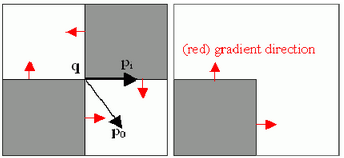
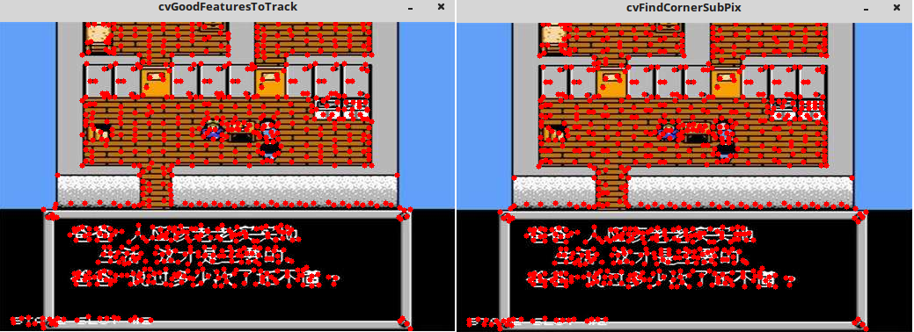

&emsp;&emsp;如果我们进行图像处理的目的不是用于识别特征点而是进行稽核测量，则通常需要更高的精度。而`cvGoodFeatureToTrack`只能提供简单的像素坐标值，但有时候我们会需要实际坐标值而不是整数坐标值，例如想要确定图形中一个尖锐的峰值点的位置，但是峰值点的位置一般都不会位于一个像素点的正中心，这时就可以使用亚像素检测方法。<!--more-->
&emsp;&emsp;亚像素级角点的位置在摄像机标定、跟踪并重建摄像机的轨迹或者重建被跟踪目标的三维结构时就是一个基本的测量值。通过`cvGoodFeaturesToTrack`函数可以求得角点坐标值，接下来就要讨论如何将求得的坐标值精确到亚像素级精度。方法就是向量的点积理论：一个向量和其正交的向量的点积为`0`，角点就是两个边缘的相交，可以满足这样的情况。



&emsp;&emsp;当要求的点`p`位于一个区域的内部时，点`p`边缘是平缓的，它的梯度值为`0`，此时向量`pq`的与`p`的梯度点积为`0`；当点`p`位于区域的边缘的时候，向量`pq`与区域平行，而`p`的梯度值则与边缘垂直，此时向量`pq`的与`p`的梯度点积为`0`。
&emsp;&emsp;这两种情况下，向量`pq`与`p`点的梯度都是正交的。先假设起始角点`q`在实际亚像素级角点`p`附近，则我们可以在要求的`p`点的周围取到很多`p`点的梯度和相关向量`pq`。令其点积为`0`，然后就可以通过求解方程组，方程组的解就是角点`q`的亚像素精度的位置，也就是精确角点的位置。
&emsp;&emsp;`cvFindCornerSubPix`函数原型如下：

``` cpp
void cvFindCornerSubPix (
    const CvArr *image, CvPoint2D32f *corners, int count,
    CvSize win, CvSize zero_zone, CvTermCriteria criteria );
```

- `image`：输入图像。
- `corners`：输入角点的初始坐标，也存储精确的输出坐标。
- `count`：角点数目。
- `win`：搜索窗口的一半尺寸。如果`win = (5, 5)`，那么使用`(5 * 2 + 1) x (5 * 2 + 1) = 11 x 11`大小的搜索窗口。
- `zero_zone`：死区的一半尺寸，死区为不对搜索区的中央位置做求和运算的区域。它是用来避免自相关矩阵出现的某些可能的奇异性。值为`(-1, -1)`表示没有死区。
- `criteria`：求角点的迭代过程的终止条件。即角点位置的确定，要么迭代数大于某个设定值，或者是精确度达到某个设定值。`criteria`可以是最大迭代数目，或者是设定的精确度，也可以是它们的组合。

&emsp;&emsp;函数`cvFindCornerSubPix`通过迭代来发现具有子像素精度的角点位置，或如图所示的放射鞍点(`radial saddle points`)。当找到一个`q`的新位置时，算法会以这个新的角点作为初始点进行迭代知道满足用户定义的迭代终止条件。

``` cpp
#include <stdio.h>
#include <cv.h>
#include <cxcore.h>
#include <highgui.h>

int main ( int argc, char **argv ) {
    FILE *fp = fopen ( "result.txt", "w+" );
    const char *filename = "timg1.jpg";
    IplImage *img = cvLoadImage ( filename, CV_LOAD_IMAGE_COLOR );
    IplImage *img_copy = cvCloneImage ( img );
    IplImage *img_gray = cvCreateImage ( cvGetSize ( img ), IPL_DEPTH_8U, 1 );
    IplImage *eig_image = cvCreateImage ( cvGetSize ( img ), IPL_DEPTH_32F, 1 );
    IplImage *temp_image = cvCloneImage ( eig_image );
    cvCvtColor ( img, img_gray, CV_BGR2GRAY );
    const int MAX_CORNERS = 1000;
    CvPoint2D32f *corners = new CvPoint2D32f[ MAX_CORNERS ];
    int corner_count = MAX_CORNERS;
    double quality_level = 0.1;
    double min_distance = 5;
    cvGoodFeaturesToTrack ( img_gray, eig_image, temp_image, corners, \
                            &corner_count, quality_level, min_distance );

    /* draw corners from cvGoodFeaturesToTrack on "img" */
    for ( int i = 0; i < corner_count; ++i ) {
        cvLine ( img, cvPoint ( corners[i].x, corners[i].y ), \
                      cvPoint ( corners[i].x, corners[i].y ), \
                      CV_RGB ( 255, 0, 0 ), 5 );
        fprintf ( fp, "\t%f\t%f\n", corners[i].x, corners[i].y );
    }

    fprintf ( fp, "\n\n\n\n\n" );
    int half_win_size = 3; /* the window size will be 3+1+3 = 7 */
    int iteration = 20;
    double epislon = 0.1;

    cvFindCornerSubPix (
        img_gray, corners, corner_count,
        cvSize ( half_win_size, half_win_size ),
        cvSize ( -1, -1 ), /* no ignoring the neighbours of the center corner */
        cvTermCriteria ( CV_TERMCRIT_ITER | CV_TERMCRIT_EPS, iteration, epislon )
    );

    /* draw subpix corners on "img_copy" */
    for ( int i = 0; i < corner_count; i++ ) {
        cvLine ( img_copy, cvPoint ( corners[i].x, corners[i].y ), \
                           cvPoint ( corners[i].x, corners[i].y ), \
                           CV_RGB ( 255, 0, 0 ), 5 );
        fprintf ( fp, "\t%f\t%f\n", corners[i].x, corners[i].y );
    }

    cvNamedWindow ( "cvFindCornerSubPix", CV_WINDOW_AUTOSIZE );
    cvShowImage ( "cvFindCornerSubPix", img );
    cvNamedWindow ( "cvGoodFeaturesToTrack", CV_WINDOW_AUTOSIZE );
    cvShowImage ( "cvGoodFeaturesToTrack", img_copy );
    cvWaitKey ( 0 );
    cvReleaseImage ( &img_gray );
    cvReleaseImage ( &img );
    cvReleaseImage ( &img_copy );
    cvDestroyWindow ( "cvGoodFeaturesToTrack" );
    cvDestroyWindow ( "cvFindCornerSubPix" );
    return 0;
}
```



&emsp;&emsp;`CvTermCriteria`是迭代算法的终止准则：

``` cpp
/* 迭代算法的终止条件 */
#define CV_TERMCRIT_ITER   1 /* 在完成最大的迭代次数之后，停止算法 */
#define CV_TERMCRIT_NUMBER CV_TERMCRIT_ITER
#define CV_TERMCRIT_EPS    2 /* 当算法的精确度小于参数“double epsilon”指定的精确度时，停止算法 */

// CV_TERMCRIT_ITER + CV_TERMCRIT_EPS -- 无论是哪一个条件先达到，都停止算法

typedef struct CvTermCriteria {
    /* the type of the termination criteria 迭代算法终止条件的类型 */
    int type;       /* may be combination of CV_TERMCRIT_ITER, CV_TERMCRIT_EPS */
    int max_iter;   /* Maximum number of iterations 最大的迭代次数 */
    double epsilon; /* Required accuracy 所要求的精确度 */
} CvTermCriteria;

/* 下面这个函数的功能类似于构造函数，但实际上它并不是 */
CV_INLINE CvTermCriteria cvTermCriteria ( int type, int max_iter, double epsilon ) {
    CvTermCriteria t;
    t.type = type;
    t.max_iter = max_iter;
    t.epsilon = ( float ) epsilon;
    return t;
}

/* Termination criteria in iterative algorithms 迭代算法中的终止条件 */
class CV_EXPORTS TermCriteria {
public:
    enum {
        COUNT = 1, /* the maximum number of iterations or elements to compute */
        MAX_ITER = COUNT, /* ditto */
        EPS = 2 /* the desired accuracy or change in parameters at which the iterative algorithm stops */
    };

    TermCriteria(); /* default constructor 默认构造函数 */
    TermCriteria ( int type, int maxCount, double epsilon ); /* full constructor 完全构造函数 */
    /* conversion from CvTermCriteria CvTermCriteria结构体和TermCriteria类的转换构造函数 */
    TermCriteria ( const CvTermCriteria &criteria );
    operator CvTermCriteria() const; /* conversion to CvTermCriteria */
    /* TermCriteria类的三个数据成员：终止条件的类型、最大迭代次数、所期望的精度 */
    int type; /* the type of termination criteria: COUNT, EPS or COUNT + EPS */
    int maxCount; /* the maximum number of iterations/elements */
    double epsilon; /* the desired accuracy */
};
```


---

&emsp;&emsp;`OpenCV`为我们提供了函数`cv2.cornerSubPix`，它可以提供亚像素级别的角点检测。首先要找到`Harris`角点，然后将角点的重心传给这个函数进行修正。`Harris`角点用红色像素标出，绿色像素是修正后的像素。在使用这个函数时，我们要定义一个迭代停止条件，当迭代次数达到或者精度条件满足后迭代就会停止。我们同样需要定义进行角点搜索的邻域大小。

``` python
import cv2
import numpy as np

filename = 'timg1.jpg'
img = cv2.imread(filename)
cv2.imshow('img', img)
gray = cv2.cvtColor(img, cv2.COLOR_BGR2GRAY)
# find Harris corners
gray = np.float32(gray)
dst = cv2.cornerHarris(gray, 2, 3, 0.04)
dst = cv2.dilate(dst, None)
ret, dst = cv2.threshold(dst, 0.01 * dst.max(), 255, 0)
dst = np.uint8(dst)
# find centroids
# connectedComponentsWithStats(InputArray image, OutputArray labels, OutputArray stats,
# OutputArray centroids, int connectivity=8, int ltype=CV_32S)
ret, labels, stats, centroids = cv2.connectedComponentsWithStats(dst)
# define the criteria to stop and refine the corners
criteria = (cv2.TERM_CRITERIA_EPS + cv2.TERM_CRITERIA_MAX_ITER, 100, 0.001)
# Python: cv2.cornerSubPix(image, corners, winSize, zeroZone, criteria)
# zeroZone -- Half of the size of the dead region in the middle of the search zone
# over which the summation in the formula below is not done. It is used sometimes
# to avoid possible singularities of the autocorrelation matrix. The value of (-1,-1)
# indicates that there is no such a size.
# 返回值由角点坐标组成的一个数组(而非图像)
corners = cv2.cornerSubPix(gray, np.float32(centroids), (5, 5), (-1, -1), criteria)
# Now draw them
res = np.hstack((centroids, corners))
# np.int0 可以用来省略小数点后面的数字(非四舍五入)
res = np.int0(res)
img[res[:, 1], res[:, 0]] = [0, 0, 255]
img[res[:, 3], res[:, 2]] = [0, 255, 0]
cv2.imshow('target', img)
cv2.waitKey()
cv2.destroyAllWindows()
```

