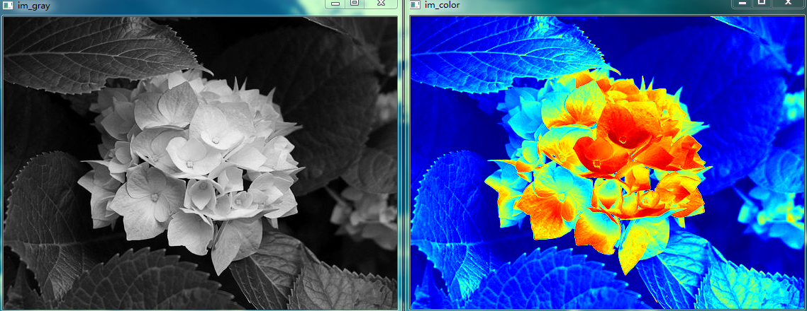
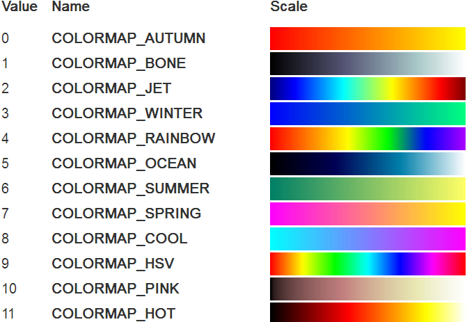

&emsp;&emsp;将彩色图像转换为灰度图像是一个不可逆的过程，灰度图像也不可能变换为原来的彩色图像，而某些场合需要将灰度图像转变为彩色图像。伪彩色处理主要是把黑白的灰度图像或者多波段图像转换为彩色图像的技术，其目的是提高图像内容的可辨识度。其中方法有灰度分成法、灰度变换法。<!--more-->
&emsp;&emsp;伪彩色图像的含义是，每个像素的颜色不是由每个基色分量的数值直接决定，而是把像素值当作彩色查找表(`color look-up table`，`CLUT`)的表项入口地址，去查找一个显示图像时使用的`R`、`G`、`B`强度值，用查找出的`R`、`G`、`B`强度值产生的彩色称为`伪彩色`。
&emsp;&emsp;彩色查找表`CLUT`是一个事先做好的表，表项入口地址也称为`索引号`。例如`16`种颜色的查找表，`0`号索引对应黑色，`15`号索引对应白色等。彩色图像本身的像素数值和彩色查找表的索引号有一个变换关系，这个关系可以使用`Windows 95/98`定义的变换关系，也可以使用你自己定义的变换关系。使用查找得到的数值显示的彩色是真的，但不是图像本身真正的颜色，它没有完全反映原图的彩色。
&emsp;&emsp;假设我们想在地图上显示美国不同地区的温度。我们可以把美国地图上的温度数据叠加为灰度图像：较暗的区域代表较冷的温度，更明亮的区域代表较热的区域。这样的表现不仅令人难以置信，而且代表了两个重要的原因。首先，人类视觉系统没有被优化来测量灰度强度的微小变化。我们能更好地感知颜色的变化。第二，我们用不同的颜色代表不同的意思。用蓝色和较温暖的温度用红色表示较冷的温度更有意义。
&emsp;&emsp;温度数据只是一个例子，但还有其他几个数据是单值(灰度)的情况，但将其转换为彩色数据以实现可视化是有意义的。用伪彩色更好地显示数据的其他例子是高度、压力、密度、湿度等。
&emsp;&emsp;`OpenCV`定义了`12`种`colormap`(色度图)，可以应用于灰度图像，使用函数`applycolormap`产生伪彩色图像。

``` python
import cv2

im_gray = cv2.imread("test.jpg", cv2.IMREAD_GRAYSCALE)
im_color = cv2.applyColorMap(im_gray, cv2.COLORMAP_JET)
cv2.imshow("im_gray", im_gray)
cv2.imshow("im_color", im_color)
cv2.waitKey()
cv2.destroyAllWindows()
```



&emsp;&emsp;下图显示了一个关于`colormap`的视觉表示和`COLORMAP_*`的数值，左边的颜色模式表示较低的灰度值，右边的则表示较高的灰度值：

