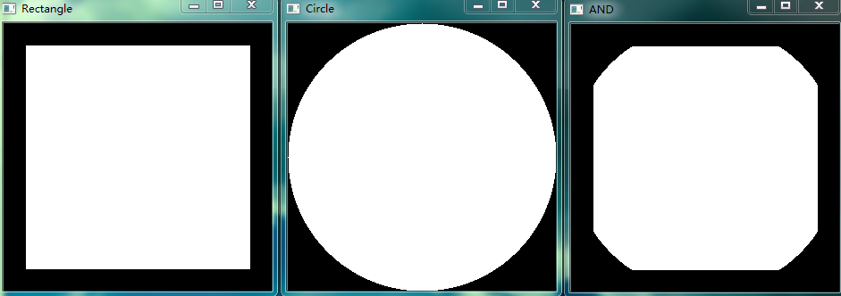
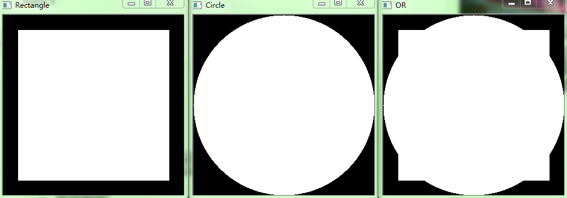
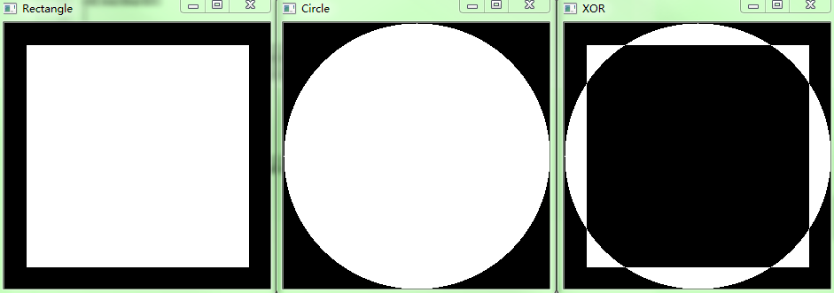
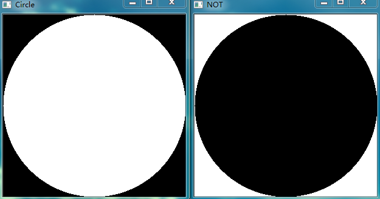
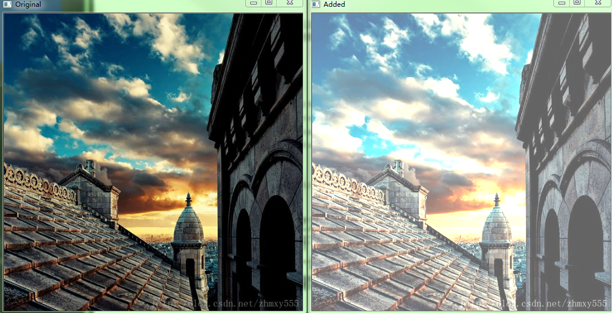
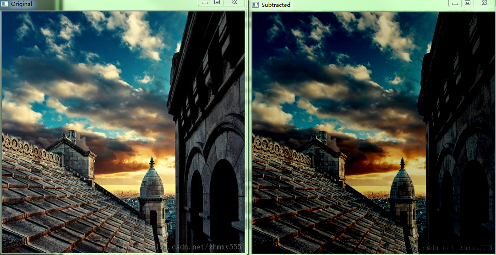

&emsp;&emsp;`OpenCV`提供了`4`种位操作：`AND`、`OR`、`NOT`和`XOR`。函数为相关的操作加上`cv2.bitwise_`前缀，例如`cv2.bitwise_not`。对于`2`元操作而言，至少两个参数(`src1`和`src2`)。参数`dst`用于返回结果，它是可选的；`msk`参数也是可选的，指定`msk`区域进行相关操作。<!--more-->

``` python
bitwise_and(src1, src2 [, dst [, mask]]) -> dst
```

因此可以使用参数返回结果，也可以使用赋值操作返回结果。

``` python
import numpy as np
import cv2

# 画矩形
Rectangle = np.zeros((300, 300), dtype="uint8")
cv2.rectangle(Rectangle, (25, 25), (275, 275), 255, -1)
cv2.imshow("Rectangle", Rectangle)
# 画圆形
Circle = np.zeros((300, 300), dtype="uint8")
cv2.circle(Circle, (150, 150), 150, 255, -1)
cv2.imshow("Circle", Circle)
# 图像的交操作
bitwiseAnd = cv2.bitwise_and(Rectangle, Circle)
cv2.imshow("AND", bitwiseAnd)
cv2.waitKey(0)
cv2.destroyAllWindows()
```



&emsp;&emsp;代码如下：

``` python
import numpy as np
import cv2

# 画矩形
Rectangle = np.zeros((300, 300), dtype="uint8")
cv2.rectangle(Rectangle, (25, 25), (275, 275), 255, -1)
cv2.imshow("Rectangle", Rectangle)
# 画圆形
Circle = np.zeros((300, 300), dtype="uint8")
cv2.circle(Circle, (150, 150), 150, 255, -1)
cv2.imshow("Circle", Circle)
# 图像的或操作
bitwiseOr = cv2.bitwise_or(Rectangle, Circle)
cv2.imshow("OR", bitwiseOr)
cv2.waitKey(0)
cv2.destroyAllWindows()
```



&emsp;&emsp;代码如下：

``` python
import numpy as np
import cv2

# 画矩形
Rectangle = np.zeros((300, 300), dtype="uint8")
cv2.rectangle(Rectangle, (25, 25), (275, 275), 255, -1)
cv2.imshow("Rectangle", Rectangle)
# 画圆形
Circle = np.zeros((300, 300), dtype="uint8")
cv2.circle(Circle, (150, 150), 150, 255, -1)
cv2.imshow("Circle", Circle)
# 图像的异或操作
bitwiseXor = cv2.bitwise_xor(Rectangle, Circle)
cv2.imshow("XOR", bitwiseXor)
cv2.waitKey(0)
cv2.destroyAllWindows()
```



&emsp;&emsp;代码如下：

``` python
import numpy as np
import cv2

# 画圆形
Circle = np.zeros((300, 300), dtype="uint8")
cv2.circle(Circle, (150, 150), 150, 255, -1)
cv2.imshow("Circle", Circle)
# 圆形的非运算操作
bitwiseNot = cv2.bitwise_not(Circle)
cv2.imshow("NOT", bitwiseNot)
cv2.waitKey(0)
cv2.destroyAllWindows()
```



### add函数

&emsp;&emsp;该函数用于图像矩阵相加：

``` python
add(src1, src2, dst=None, mask=None, dtype=None)
```

参数`src1`是图像矩阵`1`，`src2`是图像矩阵`2`，`dst`、`mask`和`dtype`一般采用默认选项。

``` python
import cv2
import numpy as np

image = cv2.imread("timg.jpg")
cv2.imshow("Original", image)
# 图像image各像素加100
M = np.ones(image.shape, dtype="uint8") * 100  # 与image大小一样的全100矩阵
added = cv2.add(image, M)  # 将图像image与M相加
cv2.imshow("Added", added)
cv2.waitKey(0)
cv2.destroyAllWindows()
```



### subtract函数

&emsp;&emsp;该函数用于图像矩阵相减：

``` python
subtract(src1, src2, dst=None, mask=None, dtype=None)
```

参数`src1`是图像矩阵`1`，`src2`是图像矩阵`2`，`dst`、`mask`和`dtype`一般采用默认选项。

``` python
import cv2
import numpy as np

image = cv2.imread("timg.jpg")
cv2.imshow("Original", image)
# 图像image各像素减去50
M = np.ones(image.shape, dtype="uint8") * 50  # 与image大小一样的全50矩阵
subtracted = cv2.subtract(image, M)  # 将图像image与M相减
cv2.imshow("Subtracted", subtracted)
cv2.waitKey(0)
cv2.destroyAllWindows()
```

