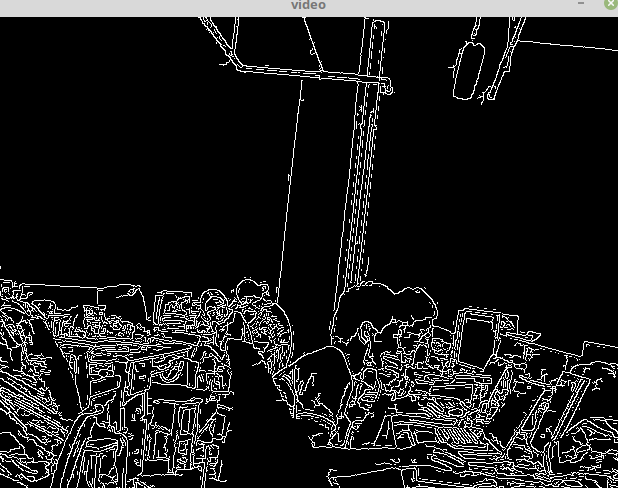

&emsp;&emsp;摄像头的使用在`OpenCV`中十分简单，仅仅调用一个函数，就能从摄像头中读取一帧帧的画面。准备工作极为简单，找一个普通的摄像头，然后插到`USB`口中，在使用该摄像头前，需要对其进行测试，看它是否可以正常工作。核心代码为：<!--more-->

``` cpp
CvCapture *capture = cvCreateCameraCapture ( 0 );
IplImage *frame = cvQueryFrame ( capture );
```

第一行创建一个来自摄像头的`capture`，注意其参数为`0`，表示随机取一个摄像头(为`-1`也是可以的)。当电脑上只有一个摄像头时，就填`0`；如果有多个时，还需要指定设备`id`。第二行是从该`capture`中读取下一帧画面，不断地调用该代码，就能不断地得到新的画面。
&emsp;&emsp;获取摄像头并且创建窗口显示的代码如下：

``` cpp
#include <cv.h>
#include <cxcore.h>
#include <highgui.h>

int main ( int argc, char **argv ) {
    IplImage *pFrame = NULL; /* 声明IplImage指针 */
    CvCapture *pCapture = cvCreateCameraCapture ( -1 ); /* 获取摄像头 */
    cvNamedWindow ( "video", 1 ); /* 创建窗口 */

    while ( 1 ) { /* 显示视频 */
        pFrame = cvQueryFrame ( pCapture );

        if ( !pFrame ) {
            break;
        }

        cvShowImage ( "video", pFrame );
        char c = cvWaitKey ( 33 );

        if ( c == 27 ) {
            break;
        }
    }

    cvReleaseCapture ( &pCapture );
    cvDestroyWindow ( "video" );
}
```


上述代码是以图片方式读取摄像头数据，我们可以在其显示到窗口前，对图片进行操作。下面的代码在每帧图片显示在窗口前，对它进行`cvCanny`的操作：

``` cpp
#include "cv.h"
#include "highgui.h"

int main ( int argc, char **argv ) {
    cvNamedWindow ( "video" );
    CvCapture *capture = cvCreateCameraCapture ( 0 );
    IplImage *frame = cvQueryFrame ( capture );

    while ( 1 ) {
        frame = cvQueryFrame ( capture );

        if ( !frame ) {
            break;
        }

        IplImage *out = cvCreateImage ( cvGetSize ( frame ), frame->depth, 1 );
        cvCanny ( frame, out, 10, 100, 3 );
        cvShowImage ( "video", out );
        cvReleaseImage ( &out );
        char c = cvWaitKey ( 50 );

        if ( c == 27 ) {
            break;
        }
    }

    cvReleaseCapture ( &capture );
    cvDestroyWindow ( "video" );
    return 0;
}
```



&emsp;&emsp;`ubuntu`下安装摄像头驱动使用如下命令：

``` cpp
sudo apt-get install cheese
sudo apt-get install camorama
```

然后打开应用`cheese`，对摄像头进行测试。

---

&emsp;&emsp;`python`示例代码如下：

``` python
import cv2

cap = cv2.VideoCapture(0)

while (True):
    ret, frame = cap.read()  # Capture frame-by-frame
    # Our operations on the frame come here
    gray = cv2.cvtColor(frame, cv2.COLOR_BGR2GRAY)
    cv2.imshow('frame', gray)  # Display the resulting frame

    if cv2.waitKey(1) & 0xFF == ord('q'):
        break

# When everything done, release the capture
cap.release()
cv2.destroyAllWindows()
```


&emsp;&emsp;对视频进行保存：

``` python
import cv2

cap = cv2.VideoCapture(0)

# Define the codec and create VideoWriter object
fourcc = cv2.VideoWriter_fourcc(*'XVID')
out = cv2.VideoWriter('output.avi', fourcc, 20.0, (640, 480))

while (cap.isOpened()):
    ret, frame = cap.read()

    if ret == True:
        out.write(frame)  # write the frame
        cv2.imshow('frame', frame)

        if cv2.waitKey(1) & 0xFF == ord('q'):
            break
    else:
        break

# Release everything if job is finished
cap.release()
out.release()

cv2.destroyAllWindows()
```

读取视频并保存为另一种格式：

``` python
import cv2

# 如果要调用摄像头，则VideoCapture的参数为0；如果读取本地视频，则要用视频地址
video_path = "a07_s01_e01_rgb.avi"
cap = cv2.VideoCapture(video_path)
fps = cap.get(cv2.CAP_PROP_FPS)  # 获取视频的帧率
# 获取视频的大小
size = (int(cap.get(cv2.CAP_PROP_FRAME_WIDTH)), int(cap.get(cv2.CAP_PROP_FRAME_HEIGHT)))
fourcc = cv2.VideoWriter_fourcc('m', 'p', '4', 'v')  # 要保存的视频格式
output_viedo = cv2.VideoWriter()  # 把处理过的视频保存下来
video_save_path = 'HJH_dealt.mp4'  # 保存的视频地址
output_viedo.open(video_save_path, fourcc, fps, size, True)

while True:
    ret, image_np = cap.read()

    if ret:
        # 此处省略对image_np的处理，此为一帧图片
        cv2.imshow('object detection', cv2.resize(image_np, (800, 600)))
        output_viedo.write(image_np)  # 把帧写入到视频中

        if cv2.waitKey(25) & 0xFF == ord('q'):
            cv2.destroyAllWindows()
            break
    else:
        break

output_viedo.release()  # 释放
cap.release()  # 释放
```