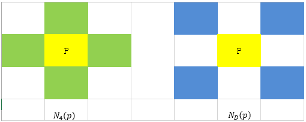
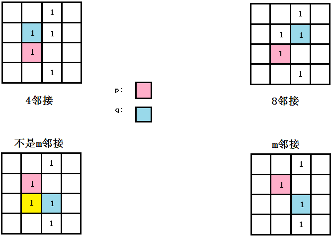
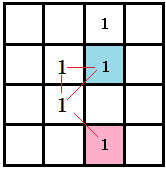
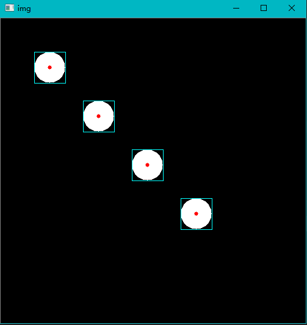

### 图像的像素的意义

&emsp;&emsp;一幅图像经过取样和量化之后就可以得到数字图像。数字图像在存储时，都是由单一的像素保存在存储设备中。像素保存顺序是与像素在数字图片中原本所处在的物理位置相关，那么就要了解像素之间的一些基本关系。<!--more-->
&emsp;&emsp;在数字图像处理领域，存在着空间域和变换域的概念。数字图像处理的基本操作，有些需要在空间域中进行，而另外的一些则需要在变换域中进行。

- 空间域：就是指图像的本身，由所采集到的一个个像素组成。对目标像素进行常用的处理方法，例如灰度变换和空间滤波两大类。
- 变换域：通过特定的变换函数，将图像的像素变化到目标域中，在变换域中完成相应的操作运算后，再利用反变换后返回到空间域。

由上可知，无论在空间域还是在变换域，像素都是根本。在大多数的数字图像处理中，像素之间在运算时都是要发生关系的，这是因为多个像素构成了图像中的一个对象。图像是由像素的形式来保存的，所以我们以$f(x, y)$来表示图像，对于特定像素，分别用$p$和$q$来表示。

### 相邻像素

&emsp;&emsp;在这节中主要讨论一个像素$p$的所有的相邻像素，所有的相邻像素与像素$p$的距离均不超过$\sqrt{2}$。位于坐标$(x, y)$处的像素$p$，在水平和垂直方向分别有两个像素与其相邻，对应坐标为$(x+1, y)$、$(x-1, y)$、$(x, y+1)$、$(x, y-1)$。这一组像素称为像素$p$的`4`邻域，用$N_4(p)$来表示。对于同样的像素$p$，在其对角方向有`4`个像素与其相邻，对应坐标为$(x-1, y-1)$、$(x-1, y+1)$、$(x+1, y-1)$和$(x+1, y+1)$，这一组像素用$N_D(p)$来表示。上面的`8`个坐标点，构成了像素$p$的`8`邻域，用$N_8(p)$来表示。<br>
&emsp;&emsp;在讨论像素点的时候，会遇到这样的情况：像素$p$位于图像的边界，这样无论是$N_4(p)$和$N_D(p)$都有一些点是不存在的，目前讨论这些像素点是没有任何意义。在做特定像素运算的时候，再根据运算的性质来确定如何来处理边界像素的相邻像素。下图为相邻像素的示意图：



即$N_8(p) = N_4(p) + N_D(p)$。

### 邻接性、连通性

&emsp;&emsp;在灰度图像中，假如灰度位数为`8 bit`，那么所有的可能灰度取值范围为$[0, 255]$。为了方便讨论和分析，现只考虑二值图像，即灰度值只有`0`和`1`两种情况。定义$V$为所要讨论的像素的邻接性灰度值集合，则在二值图像中$V = \{1\}$。分析三种类型的邻接：

- `4`邻接：如果像素$q$在集合$N_4(p)$中，则具有$V$中灰度值的两个像素$q$和$p$是`4`邻接的。
- `8`邻接：如果像素$q$在集合$N_8(p)$中，则具有$V$中灰度值的两个像素$q$和$p$是`8`邻接的。
- `m`邻接：如果$q$在集合$N_4(p)$中，或者像素$q$在集合$N_D(p)$中，且集合$N_4(p) \cap N_4(p)$没有来自$V$中灰度值的像素，则具有$V$中数值的两个像素$p$和$q$是`m`邻接的。

&emsp;&emsp;下图分别给出了`4`邻接、`8`邻接和`m`邻接的示意图：



&emsp;&emsp;接下来需要考虑一个问题，在有`8`邻接后，为什么要引入`m`邻接的定义呢？在`数字图像处理`的`2.5.2`节中，作者给出的原因是：`m`邻接主要是为了消除`8`邻接的二义性。那么二义性怎么体现呢？首先来解释什么是像素的通路。

### 像素的通路

&emsp;&emsp;从坐标$(x, y)$的像素$p$到坐标为$(s, t)$的像素$q$的通路，是由一系列的特定像素组成的序列，其坐标为：

$$
(x_0, y_0), (x_1, y_1), ..., (x_n, y_n)
$$

其中$(x_0, y_0) = (x, y)$，$(x_n, y_n) = (s, t)$，并且像素$(x_i, y_i)$和$(x_{i-1}, y_{i-1})$对于$1 ≤ i ≤ n$是邻接的(`4`邻接、`8`邻接或者`m`邻接)。在这种情况下，`n`是通路的长度，从像素$p$到像素$q$就形成了一个像素通路。<br>
&emsp;&emsp;当按照特定的邻接性来确认像素的通路时，必须保证通路的唯一性，在下图的例子中，如果选择`8`邻接，则通路并不是唯一的，所以具有二义性。当考虑`m`邻接的时候，则通路就是唯一的，这就是`m`邻接可以消除`8`邻接的二义性体现。



&emsp;&emsp;由上图可以看出，在从像素$p$到像素$q$的通路中，如果考虑`8`邻接，那么通路就不具有唯一性。
&emsp;&emsp;令$S$是图像中的一个像素子集，如果`S`的全部像素之间存在一个通路，则可以说两个像素$p$和$q$在$S$中是连通的。对于$S$中的任何像素$p$，$S$中连通到该像素的像素集成为$S$的连通分量。如果$S$仅有一个连通分量，则集合$S$成为连通集。概括来说，$S$中的所有的像素，每两个相邻的像素之间是相邻接的(`4`、`8`或`m`)，并且只有一个通路，那么$S$为连通集。<br>
&emsp;&emsp;令$R$是图像中的一个像素子集。如果$R$是连通集，则$R$被称作为一个区域。两个区域$R_i$和$R_j$如果能形成一个连通集，那么称这两个区域为邻接区域。不过在讨论是否为邻接区域的时候，只能考虑区域边界的像素是否构成`4`邻接和`8`邻接，而不考虑`m`邻接。在定义区域邻接的时候，必须指定邻接类型。
&emsp;&emsp;注意，在`数字图像处理第三版`的`2.5.2`节中，`不邻接的区域称为不连接区域`应该是错误，修改成`不邻接的区域称为不邻接区域`。

---

### connectedComponentsWithStats和connectedComponents

&emsp;&emsp;`connectedComponentsWithStats`函数用于统计二值图的连通区域的性质，而`connectedComponents`是前者的简化版本。`connectedComponentsWithStats`的函数原型如下：

``` cpp
int cv::connectedComponentsWithStats (
    InputArray image, OutputArray labels, OutputArray stats,
    OutputArray centroids, int connectivity = 8, int ltype = CV_32S);
```

- `image`：输入图，`8UC1`类型的图。
- `labels`：标记后的图像，针对不同的连通区域给予不同的标签。
- `stats`：对各个连通区域的统计信息。
- `centroids`：每个连通区域的中心，也包括背景的中心，数据类型是`CV_64F`。
- `connectivity`：连通区域的类型，`8`连通或者`4`连通。
- `ltype`：`label`的数据类型，`CV_32S`或者`CV_16U`。

&emsp;&emsp;`connectedComponents`的函数原型如下：

``` cpp
int connectedComponents (
    InputArray image, OutputArray labels,
    int connectivity = 8, int ltype = CV_32S);
```

- `image`：需要被标记的图像。
- `labels`：标记后的目标图像。
- `connectivity`：采用`4`邻域还是`8`邻域检测。
- `ltype`：支持的`Mat`图像的类型。

&emsp;&emsp;`connectedComponentsWithStats`代码示例如下：

``` python
import cv2
import numpy as np

img = np.zeros((500, 500, 3), dtype=np.uint8)

for i in range(1, 5):
    img = cv2.circle(img, (i * 80, i * 80), 25, (255, 255, 255), -1)

gray = cv2.cvtColor(img, cv2.COLOR_BGR2GRAY)

labelnum, labelimg, contours, GoCs = cv2.connectedComponentsWithStats(gray)

for label in range(1, labelnum):
    x, y = GoCs[label]
    img = cv2.circle(img, (int(x), int(y)), 3, (0, 0, 255), -1)
    x, y, w, h, size = contours[label]
    img = cv2.rectangle(img, (x, y), (x + w, y + h), (255, 255, 0), 1)

print("label num:", labelnum)
print("contours:\n", contours)
print("Gravity of Centers:\n", GoCs)

cv2.imshow("img", img)
cv2.waitKey(0)
cv2.destroyAllWindows()
```

执行结果：

``` python
label num: 5
contours:
 [[     0      0    500    500 242156]
  [    55     55     51     51   1961]
  [   135    135     51     51   1961]
  [   215    215     51     51   1961]
  [   295    295     51     51   1961]]
Gravity of Centers:
 [[251.10342094 251.10342094]
  [ 80.          80.        ]
  [160.         160.        ]
  [240.         240.        ]
  [320.         320.        ]]
```

