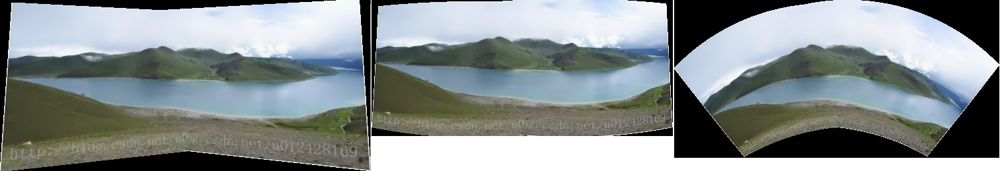

&emsp;&emsp;官方代码如下：<!--more-->

``` cpp
#include <iostream>
#include <fstream>
#include "opencv2/highgui/highgui.hpp"
#include "opencv2/stitching/stitcher.hpp"

using namespace std;
using namespace cv;

bool try_use_gpu = false;
vector<Mat> imgs;
string result_name = "result.jpg";

void printUsage();
int parseCmdArgs ( int argc, char **argv );

int main ( int argc, char *argv[] ) {
    int retval = parseCmdArgs ( argc, argv );

    if ( retval ) {
        return -1;
    }

    Mat pano;
    Stitcher stitcher = Stitcher::createDefault ( try_use_gpu );
    Stitcher::Status status = stitcher.stitch ( imgs, pano );

    if ( status != Stitcher::OK ) {
        cout << "Can't stitch images, error code = " << int ( status ) << endl;
        return -1;
    }

    imwrite ( result_name, pano );
    return 0;
}

void printUsage() {
    cout << "Rotation model images stitcher.\n\n"
            "stitching img1 img2 [...imgN]\n\n"
            "Flags:\n"
            "  --try_use_gpu (yes|no)\n"
            "      Try to use GPU. The default value is 'no'. All default values\n"
            "      are for CPU mode.\n"
            "  --output <result_img>\n"
            "      The default is 'result.jpg'.\n";
}

int parseCmdArgs ( int argc, char **argv ) {
    if ( argc == 1 ) {
        printUsage();
        return -1;
    }

    for ( int i = 1; i < argc; ++i ) {
        if ( string ( argv[i] ) == "--help" || string ( argv[i] ) == "/?" ) {
            printUsage();
            return -1;
        } else if ( string ( argv[i] ) == "--try_use_gpu" ) {
            if ( string ( argv[i + 1] ) == "no" ) {
                try_use_gpu = false;
            } else if ( string ( argv[i + 1] ) == "yes" ) {
                try_use_gpu = true;
            } else {
                cout << "Bad --try_use_gpu flag value\n";
                return -1;
            }

            i++;
        } else if ( string ( argv[i] ) == "--output" ) {
            result_name = argv[i + 1];
            i++;
        } else {
            Mat img = imread ( argv[i] );

            if ( img.empty() ) {
                cout << "Can't read image '" << argv[i] << "'\n";
                return -1;
            }

            imgs.push_back ( img );
        }
    }

    return 0;
}
```


&emsp;&emsp;基于不同模式的全景拼接如下：

``` cpp
#include <iostream>
#include <fstream>
#include "opencv2/highgui/highgui.hpp"
#include "opencv2/stitching/stitcher.hpp"

using namespace std;
using namespace cv;

bool try_use_gpu = false;
vector<Mat> imgs;
string result_name = "result.jpg";

int parseCmdArgs(int argc, char **argv) {
    /* 输入的图片全部填充到容器imgs中，并将输入的图片显示出来 */
    for (int i = 1; i < argc - 1; ++i) {
        Mat img = imread(argv[i]);

        if (img.empty()) {
            cout << "Can't read image '" << argv[i] << "'\n";
            return -1;
        }

        imgs.push_back(img);
        imshow(argv[i], img);
    }

    return 0;
}

int main(int argc, char *argv[]) {
    int retval = parseCmdArgs(argc, argv);

    if (retval) {
        return -1;
    }

    Mat pano;
    /* 创建一个stitcher对象 */
    Stitcher stitcher = Stitcher::createDefault(try_use_gpu);

    if (argv[3][0] == '1') { /* 1是平面拼接 */
        PlaneWarper *cw = new PlaneWarper();
        stitcher.setWarper(cw);
    } else if (argv[3][0] == '2') { /* 2是柱面拼接 */
        SphericalWarper *cw = new SphericalWarper();
        stitcher.setWarper(cw);
    } else if (argv[3][0] == '3') { /* 3是立体画面拼接 */
        StereographicWarper *cw = new cv::StereographicWarper();
        stitcher.setWarper(cw);
    }

    /* 使用Surf算法来寻找特征点，支持Surf和Orb两种方式 */
    detail::SurfFeaturesFinder *featureFinder = new detail::SurfFeaturesFinder();
    stitcher.setFeaturesFinder(featureFinder);

    /* 匹配给定的图像和估计相机的旋转 */
    Stitcher::Status status = stitcher.estimateTransform(imgs);

    if (status != Stitcher::OK) {
        cout << "Can't stitch images, error code = " << int(status) << endl;
        return -1;
    }

    status = stitcher.composePanorama(pano); /* 生成全景图像 */

    if (status != Stitcher::OK) {
        cout << "Can't stitch images, error code = " << int(status) << endl;
        return -1;
    }

    imwrite(result_name, pano);
    imshow("show", pano);
    cv::waitKey(0);
    return 0;
}
```



---

### 基于OpenCV全景拼接

&emsp;&emsp;基于`OpenCV`的图片拼接和全景图构建，用于`缝合`两张有重叠区域的图来创建一张全景图。构建全景图利用到的计算机视觉和图像处理技术有：关键点检测、局部不变特征、关键点匹配、`RANSAC`和透视变形。因为处理关键点检测和局部不变性在`OpenCV 2.4.X`和`OpenCV 3.X`中有很大的不同，比如`SIFT`和`SURF`，这里将给出兼容两个版本的代码。
&emsp;&emsp;全景拼接算法由四部分组成：

- `Step 1`: Detect keypoints (`DoG`, `Harris` etc) and extract local invariant descriptors (`SIFT`, `SURF` etc) from the two input images.
- `Step 2`: Match the descriptors between the two images.
- `Step 3`: Use the `RANSAC` algorithm to estimate a homography matrix using our matched feature vectors.
- `Step 4`: Apply a warping transformation using the homography matrix obtained from `Step 3`.

将所有的步骤都封装在`panorama.py`，定义一个`Stitcher`类来构建全图。
&emsp;&emsp;`panorama.py`如下：

``` python
import numpy as np
import imutils
import cv2

class Stitcher:
    def __init__(self):
        self.isv3 = imutils.is_cv3()  # determine if we are using OpenCV v3.X

    def stitch(self, images, ratio=0.75, reprojThresh=4.0, showMatches=False):
        # unpack the images, then detect keypoints and extract local invariant descriptors from them
        (imageB, imageA) = images
        (kpsA, featuresA) = self.detectAndDescribe(imageA)
        (kpsB, featuresB) = self.detectAndDescribe(imageB)
        # match features between the two images
        M = self.matchKeypoints(kpsA, kpsB, featuresA, featuresB, ratio, reprojThresh)

        if M is None:  # if the match is None, then there aren't enough matched keypoints to create a panorama
            return None

        (matches, H, status) = M  # otherwise, apply a perspective warp to stitch the images together
        result = cv2.warpPerspective(imageA, H, (imageA.shape[1] + imageB.shape[1], imageA.shape[0]))
        result[0:imageB.shape[0], 0:imageB.shape[1]] = imageB

        if showMatches:  # check to see if the keypoint matches should be visualized
            vis = self.drawMatches(imageA, imageB, kpsA, kpsB, matches, status)
            return (result, vis)  # return a tuple of the stitched image and the visualization

        return result  # return the stitched image

    def detectAndDescribe(self, image):
        gray = cv2.cvtColor(image, cv2.COLOR_BGR2GRAY)  # convert the image to grayscale

        if self.isv3:  # check to see if we are using OpenCV 3.X
            descriptor = cv2.xfeatures2d.SIFT_create()  # detect and extract features from the image
            (kps, features) = descriptor.detectAndCompute(image, None)
        else:  # otherwise, we are using OpenCV 2.4.X
            detector = cv2.FeatureDetector_create("SIFT")  # detect keypoints in the image
            kps = detector.detect(gray)
            extractor = cv2.DescriptorExtractor_create("SIFT")  # extract features from the image
            (kps, features) = extractor.compute(gray, kps)

        kps = np.float32([kp.pt for kp in kps])  # convert the keypoints from KeyPoint objects to NumPy arrays
        return (kps, features)  # return a tuple of keypoints and features

    def matchKeypoints(self, kpsA, kpsB, featuresA, featuresB, ratio, reprojThresh):
        # compute the raw matches and initialize the list of actual matches
        matcher = cv2.DescriptorMatcher_create("BruteForce")
        rawMatches = matcher.knnMatch(featuresA, featuresB, 2)
        matches = []

        for m in rawMatches:  # loop over the raw matches
            # ensure the distance is within a certain ratio of each other (i.e. Lowe's ratio test)
            if len(m) == 2 and m[0].distance < m[1].distance * ratio:
                matches.append((m[0].trainIdx, m[0].queryIdx))

        if len(matches) > 4:  # computing a homography requires at least 4 matches
            # construct the two sets of points
            ptsA = np.float32([kpsA[i] for (_, i) in matches])
            ptsB = np.float32([kpsB[i] for (i, _) in matches])
            # compute the homography between the two sets of points
            (H, status) = cv2.findHomography(ptsA, ptsB, cv2.RANSAC, reprojThresh)
            # return the matches along with the homograpy matrix and status of each matched point
            return (matches, H, status)

        return None  # otherwise, no homograpy could be computed

    def drawMatches(self, imageA, imageB, kpsA, kpsB, matches, status):
        # initialize the output visualization image
        (hA, wA) = imageA.shape[:2]
        (hB, wB) = imageB.shape[:2]
        vis = np.zeros((max(hA, hB), wA + wB, 3), dtype="uint8")
        vis[0:hA, 0:wA] = imageA
        vis[0:hB, wA:] = imageB

        for ((trainIdx, queryIdx), s) in zip(matches, status):  # loop over the matches
            if s == 1:  # only process the match if the keypoint was successfully matched
                # draw the match
                ptA = (int(kpsA[queryIdx][0]), int(kpsA[queryIdx][1]))
                ptB = (int(kpsB[trainIdx][0]) + wA, int(kpsB[trainIdx][1]))
                cv2.line(vis, ptA, ptB, (0, 255, 0), 1)

        return vis  # return the visualization
```

&emsp;&emsp;Let's go ahead and get started by reviewing `panorama.py`:

``` python
import numpy as np
import imutils
import cv2

class Stitcher:
    def __init__(self):
        self.isv3 = imutils.is_cv3()  # determine if we are using OpenCV v3.X
```

&emsp;&emsp;We start off on `Lines 1-3` by importing our necessary packages. We'll be using `NumPy` for `matrix/array` operations, `imutils` for a set of `OpenCV` convenience methods, and finally `cv2` for our `OpenCV` bindings.
&emsp;&emsp;From there, we define the `Stitcher` class on `Line 5`. The constructor to `Stitcher` simply checks which version of `OpenCV` we are using by making a call to the `is_cv3` method. Since there are major differences in how `OpenCV 2.4` and `OpenCV 3` handle keypoint detection and local invariant descriptors, it's important that we determine the version of `OpenCV` that we are using.
&emsp;&emsp;Next up, let's start working on the `stitch` method:

``` python
def stitch(self, images, ratio=0.75, reprojThresh=4.0, showMatches=False):
    # unpack the images, then detect keypoints and extract local invariant descriptors from them
    (imageB, imageA) = images
    (kpsA, featuresA) = self.detectAndDescribe(imageA)
    (kpsB, featuresB) = self.detectAndDescribe(imageB)
    # match features between the two images
    M = self.matchKeypoints(kpsA, kpsB, featuresA, featuresB, ratio, reprojThresh)

    if M is None:  # if the match is None, then there aren't enough matched keypoints to create a panorama
        return None
```

&emsp;&emsp;The `stitch` method requires only a single parameter, `images`, which is the list of (two) images that we are going to `stitch` together to form the panorama.
&emsp;&emsp;We can also optionally supply `ratio`, used for `David Lowe's` ratio test when matching features, `reprojThresh` which is the maximum pixel `wiggle room` allowed by the `RANSAC` algorithm, and finally `showMatches`, a `boolean` used to indicate if the keypoint matches should be visualized or not.
&emsp;&emsp;`Line 3` unpacks the `images` list (which again, we presume to contain only two images). The ordering to the `images` list is important: we expect `images` to be supplied in `left-to-right` order. If `images` are not supplied in this order, then our code will still run, but our output panorama will only contain one image, not both.
&emsp;&emsp;Once we have unpacked the `images` list, we make a call to the `detectAndDescribe` method on `Lines 4` and `5`. This method simply detects keypoints and extracts local invariant descriptors (i.e. `SIFT`) from the two images.
&emsp;&emsp;Given the keypoints and features, we use `matchKeypoints` (Lines `7`) to match the features in the two images. We'll define this method later in the lesson.
&emsp;&emsp;If the returned matches `M` are `None`, then not enough keypoints were matched to create a panorama, so we simply return to the calling function.
&emsp;&emsp;Otherwise, we are now ready to apply the perspective transform:

``` python
(matches, H, status) = M  # otherwise, apply a perspective warp to stitch the images together
result = cv2.warpPerspective(imageA, H, (imageA.shape[1] + imageB.shape[1], imageA.shape[0]))
result[0:imageB.shape[0], 0:imageB.shape[1]] = imageB

if showMatches:  # check to see if the keypoint matches should be visualized
    vis = self.drawMatches(imageA, imageB, kpsA, kpsB, matches, status)
    return (result, vis)  # return a tuple of the stitched image and the visualization

return result  # return the stitched image
```

&emsp;&emsp;Provided that `M` is not `None`, we unpack the tuple on `Line 1`, giving us a list of keypoint matches, the homography matrix `H` derived from the `RANSAC` algorithm, and finally status, a list of indexes to indicate which keypoints in matches were successfully spatially verified using `RANSAC`.
&emsp;&emsp;Given our homography matrix `H`, we are now ready to stitch the two images together. First, we make a call to `cv2.warpPerspective` which requires three arguments: the image we want to warp (in this case, the right image), the `3 x 3` transformation matrix (`H`), and finally the shape out of the output image. We derive the shape out of the output image by taking the sum of the widths of both images and then using the height of the second image.
&emsp;&emsp;`Line 5` makes a check to see if we should visualize the keypoint matches, and if so, we make a call to `drawMatches` and return a tuple of both the panorama and visualization to the calling method. Otherwise, we simply returned the stitched image.
&emsp;&emsp;Now that the stitch method has been defined, let's look into some of the helper methods that it calls. We'll start with `detectAndDescribe`:

``` python
def detectAndDescribe(self, image):
    gray = cv2.cvtColor(image, cv2.COLOR_BGR2GRAY)  # convert the image to grayscale

    if self.isv3:  # check to see if we are using OpenCV 3.X
        descriptor = cv2.xfeatures2d.SIFT_create()  # detect and extract features from the image
        (kps, features) = descriptor.detectAndCompute(image, None)
    else:  # otherwise, we are using OpenCV 2.4.X
        detector = cv2.FeatureDetector_create("SIFT")  # detect keypoints in the image
        kps = detector.detect(gray)
        extractor = cv2.DescriptorExtractor_create("SIFT")  # extract features from the image
        (kps, features) = extractor.compute(gray, kps)

    # convert the keypoints from KeyPoint objects to NumPy arrays
    kps = np.float32([kp.pt for kp in kps])
    return (kps, features)  # return a tuple of keypoints and features
```

&emsp;&emsp;As the name suggests, the `detectAndDescribe` method accepts an image, then detects keypoints and extracts local invariant descriptors. In our implementation we use the `Difference of Gaussian` (`DoG`) keypoint detector and the `SIFT` feature extractor.
&emsp;&emsp;On `Line 3` we check to see if we are using `OpenCV 3.X`. If we are, then we use the `cv2.xfeatures2d.SIFT_create` function to instantiate both our `DoG` keypoint detector and `SIFT` feature extractor. A call to `detectAndCompute` handles extracting the keypoints and features.
&emsp;&emsp;`Lines 7-10` handle if we are using `OpenCV 2.4`. The `cv2.FeatureDetector_create` function instantiates our keypoint detector (`DoG`). A call to detect returns our set of keypoints.
&emsp;&emsp;From there, we need to initialize `cv2.DescriptorExtractor_create` using the `SIFT` keyword to setup our `SIFT` feature extractor. Calling the compute method of the extractor returns a set of feature vectors which quantify the region surrounding each of the detected keypoints in the image.
&emsp;&emsp;Finally, our keypoints are converted from `KeyPoint` objects to a `NumPy` array and returned to the calling method.
&emsp;&emsp;Next up, let's look at the `matchKeypoints` method:

``` python
def matchKeypoints(self, kpsA, kpsB, featuresA, featuresB, ratio, reprojThresh):
    # compute the raw matches and initialize the list of actual matches
    matcher = cv2.DescriptorMatcher_create("BruteForce")
    rawMatches = matcher.knnMatch(featuresA, featuresB, 2)
    matches = []

    for m in rawMatches:  # loop over the raw matches
        # ensure the distance is within a certain ratio of each other (i.e. Lowe's ratio test)
        if len(m) == 2 and m[0].distance < m[1].distance * ratio:
            matches.append((m[0].trainIdx, m[0].queryIdx))
```

&emsp;&emsp;The `matchKeypoints` function requires four arguments: the keypoints and feature vectors associated with the first image, followed by the keypoints and feature vectors associated with the second image. `David Lowe's` ratio test variable and `RANSAC` `re-projection` threshold are also be supplied.
&emsp;&emsp;Matching features together is actually a fairly straightforward process. We simply loop over the descriptors from both images, compute the distances, and find the smallest distance for each pair of descriptors. Since this is a very common practice in computer vision, `OpenCV` has a `built-in` function called `cv2.DescriptorMatcher_create` that constructs the feature matcher for us. The `BruteForce` value indicates that we are going to exhaustively compute the `Euclidean` distance between all feature vectors from both images and find the pairs of descriptors that have the smallest distance.
&emsp;&emsp;A call to `knnMatch` on `Line 4` performs `k-NN` matching between the two feature vector sets using `k=2` (indicating the top two matches for each feature vector are returned).
&emsp;&emsp;The reason we want the top two matches rather than just the top one match is because we need to apply `David Lowe's` ratio test for `false-positive` match pruning.
&emsp;&emsp;Again, `Line 4` computes the `rawMatches` for each pair of descriptors, but there is a chance that some of these pairs are `false` positives, meaning that the image patches are not actually true matches. In an attempt to prune these `false-positive` matches, we can loop over each of the `rawMatches` individually and apply `Lowe's` ratio test, which is used to determine `high-quality` feature matches. Typical values for `Lowe's` ratio are normally in the range `[0.7, 0.8]`.
&emsp;&emsp;Once we have obtained the matches using `Lowe's` ratio test, we can compute the homography between the two sets of keypoints:

``` python
if len(matches) > 4:  # computing a homography requires at least 4 matches
    # construct the two sets of points
    ptsA = np.float32([kpsA[i] for (_, i) in matches])
    ptsB = np.float32([kpsB[i] for (i, _) in matches])
    # compute the homography between the two sets of points
    (H, status) = cv2.findHomography(ptsA, ptsB, cv2.RANSAC, reprojThresh)
    # return the matches along with the homograpy matrix and status of each matched point
    return (matches, H, status)

return None # otherwise, no homograpy could be computed
```

&emsp;&emsp;Computing a homography between two sets of points requires at a bare minimum an initial set of four matches. For a more reliable homography estimation, we should have substantially more than just four matched points.
&emsp;&emsp;Finally, the last method in our `Stitcher` method, `drawMatches` is used to visualize keypoint correspondences between two images:

``` python
def drawMatches(self, imageA, imageB, kpsA, kpsB, matches, status):
    # initialize the output visualization image
    (hA, wA) = imageA.shape[:2]
    (hB, wB) = imageB.shape[:2]
    vis = np.zeros((max(hA, hB), wA + wB, 3), dtype="uint8")
    vis[0:hA, 0:wA] = imageA
    vis[0:hB, wA:] = imageB

    for ((trainIdx, queryIdx), s) in zip(matches, status):  # loop over the matches
        if s == 1:  # only process the match if the keypoint was successfully matched
            # draw the match
            ptA = (int(kpsA[queryIdx][0]), int(kpsA[queryIdx][1]))
            ptB = (int(kpsB[trainIdx][0]) + wA, int(kpsB[trainIdx][1]))
            cv2.line(vis, ptA, ptB, (0, 255, 0), 1)

    return vis  # return the visualization
```

&emsp;&emsp;This method requires that we pass in the two original images, the set of keypoints associated with each image, the initial matches after applying `Lowe's` ratio test, and finally the status list provided by the homography calculation. Using these variables, we can visualize the `inlier` keypoints by drawing a straight line from keypoint `N` in the first image to keypoint `M` in the second image.
&emsp;&emsp;示例代码如下：

``` python
import cv2
import imutils
from panorama import Stitcher

imageA = cv2.imread("Panorama-1.png")
imageB = cv2.imread("Panorama-2.png")

print("former size is:")
print(imageA.shape)
print(imageB.shape)
# 使图片的高度相等
height, width = imageA.shape[:2]
imageB = imutils.resize(imageB, height=height)
print("after size is:")
print(imageA.shape)
print(imageB.shape)

# stitch the images together to create a panorama
stitcher = Stitcher()
(result, vis) = stitcher.stitch([imageA, imageB], showMatches=True)

# show the images
cv2.imshow("Image A", imageA)
cv2.imshow("Image B", imageB)
cv2.imshow("Keypoint Matches", vis)
cv2.imshow("Result", result)
cv2.waitKey(0)
```


